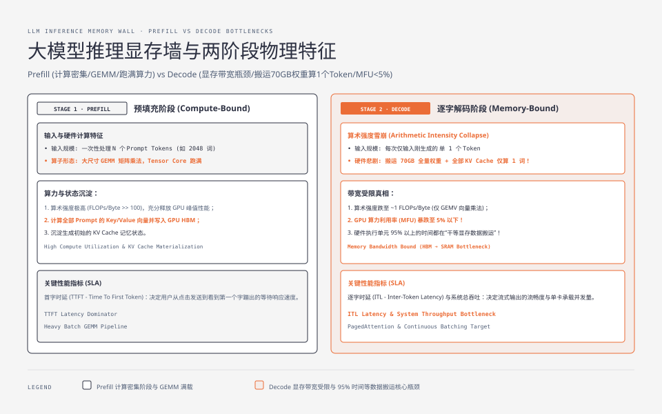
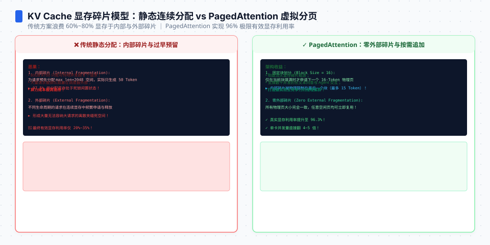
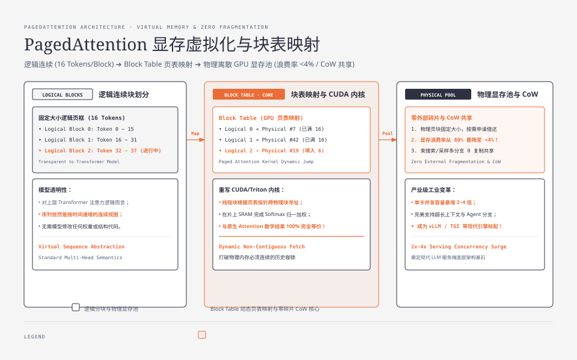

**TL;DR：** 大模型自回归推理具有显著的物理两阶段不对称性：**Prefill（预填充）阶段是计算密集型（Compute-bound）**，跑满 GPU 矩阵乘算力；而**Decode（解码）阶段是极度显存带宽受限型（Memory-bound）**，每生成单个 Token 都必须将全量模型权重与全部历史 KV Cache 从 GPU HBM 显存搬运至 SRAM 芯片寄存器，导致 GPU 算力利用率（MFU）暴跌至 5% 以下。传统推理框架采用连续线性显存预分配，导致高达 60%~80% 的内部与外部显存碎片。伯克利团队开发的 **PagedAttention（vLLM 核心）** 首次将操作系统**虚拟内存分页思想（Virtual Memory Paging & Block Table）**引入 GPU 显存管理，将逻辑上连续的 KV Cache 离散映射到物理显存页块中，将显存浪费率压缩至 4% 以下，直接让单卡系统并发吞吐翻了 2~4 倍。

---

## 一、 自回归推理的两阶段物理特征与算力陷阱

Transformer 自回归大语言模型（如 LLaMA-3、Qwen、DeepSeek）在处理用户请求时，内部执行路径被严格划分为两个阶段：



### 1.1 阶段一：预填充（Prefill / Prompt Phase）── 计算密集型（Compute-Bound）

- **输入特征**：一次性输入包含 $N$ 个 Token 的用户 Prompt（如 2048 个词）；
- **硬件行为**：GPU 将 $N \times d$ 的嵌入矩阵与权重矩阵进行大尺寸 GEMM（通用矩阵乘法）运算，充分填满 Tensor Core 的并行流水线；
- **状态沉淀**：计算出 Prompt 中所有 Token 的 Key 和 Value 向量，将其以 FP16/BF16 格式写入 GPU 高带宽显存（HBM），形成初始的 **KV Cache**；
- **关键性能指标**：**首字时延（TTFT - Time To First Token）**。

### 1.2 阶段二：逐字解码（Decode Phase）── 显存带宽受限型（Memory-Bound）

- **输入特征**：每一步自回归仅输入上一步刚生成的**单 1 个 Token**；
- **硬件悲剧（The Arithmetic Intensity Collapse）**：
  - 为了计算这 1 个 Token 的输出概率分布，GPU 必须在几十微秒内，将整整 **70GB 的全量模型权重（以 70B 模型为例）** 以及该请求之前累积的所有历史 KV Cache，完整地从 HBM 显存通过总线搬运进片上缓存（SRAM）；
  - **算术强度（FLOPs / Byte）暴跌**：计算量极小（仅 1 个向量的矩阵向量乘 GEMV），但数据搬运量巨大，硬件执行单元 95% 以上的时间都在“干等显存数据传输”！
- **关键性能指标**：**逐字时延（ITL - Inter-Token Latency）** 与 **系统总吞吐（Tokens/sec）**。

---

## 二、 KV Cache 显存容量精确数学推导

为什么大模型不能无限制扩大并发？因为 **KV Cache 会随并发数与上下文长度呈平方级爆炸膨胀**。

### 2.1 精确容量计算公式

对于一个标准 Transformer Decoder 模型：
- 设模型层数为 $L$（`n_layers`）；
- 隐藏层维度为 $d$（`hidden_size`）；
- 注意力头数为 $H_Q$（`n_heads`），Key/Value 头数为 $H_{KV}$（在 MHA 架构中 $H_{KV} = H_Q$；在 GQA 架构中如 LLaMA-3 70B，$H_{KV} = 8$）；
- 单个注意力头的维度为 $d_h = d / H_Q$；
- 存储数据类型为 16 位浮点数（FP16/BF16，占用 2 字节）。

则**单个 Token** 在单次推理中产生的 KV Cache 显存占用量为：

$$\text{Memory}_{\text{per-token}} = 2 \times 2 \times L \times H_{KV} \times d_h \quad (\text{Bytes})$$

其中第一个因子 $2$ 代表同时存储 Key 向量与 Value 向量；第二个因子 $2$ 代表 FP16 占用的 2 个字节。

### 2.2 生产级模型实测开销对比表 (以 $8,192$ Token 序列长度为例)

| 模型架构 | 注意力机制 | 层数 ($L$) | $H_{KV}$ 组数 | 头维度 ($d_h$) | 单 Token 显存开销 | 单请求 8K 上下文 KV 显存 | 32 并发 8K 窗口 KV 显存总计 |
| :--- | :--- | :--- | :--- | :--- | :--- | :--- | :--- |
| **LLaMA-2 7B** | MHA | 32 | 32 | 128 | $512\text{ KiB}$ ($524,288\text{ B}$) | **$4.0\text{ GiB}$** ($4.29\text{ GB}$) | **$128.0\text{ GiB}$** ($137.4\text{ GB}$)（远超单卡 A100 80GB 容量） |
| **LLaMA-3 8B** | GQA (4:1) | 32 | 8 | 128 | $128\text{ KiB}$ ($131,072\text{ B}$) | **$1.0\text{ GiB}$** ($1.07\text{ GB}$) | **$32.0\text{ GiB}$** ($34.4\text{ GB}$) |
| **LLaMA-3 70B**| GQA (8:1) | 80 | 8 | 128 | $320\text{ KiB}$ ($327,680\text{ B}$) | **$2.5\text{ GiB}$** ($2.68\text{ GB}$) | **$80.0\text{ GiB}$** ($85.9\text{ GB}$)（仅 Cache 即占满整张 80GB 卡） |

> **物理真相：** 在长文本（如 32K/128K 上下文）与高并发场景下，**KV Cache 占用的显存空间会迅速超越静态模型权重本身**，成为击穿 GPU 显存导致服务崩溃的头号杀手！Grouped-Query Attention (GQA) 通过共享 Key/Value 头将 KV Cache 压缩为原来的 $1/4 \sim 1/8$，但依然无法消除显存碎片。

<div class="interactive-sandbox" data-sandbox="llm-calculator"></div>

---

## 三、 传统静态显存分配的三大碎片灾难

在 vLLM 问世之前，主流推理系统（如 HuggingFace Accelerate、早期 FasterTransformer）采用与操作系统 1960 年代类似的**静态连续内存预分配**策略：

```
+-----------------------------------------------------------------------+
|                 传统静态显存预分配碎片示意图 (以 max_len=2048 为例)       |
|                                                                       |
| [已用 50 Tokens] [          内部碎片 (未使用的 1998 Tokens 显存被锁死)       ] |
| ───────────────────────────────────────────────────────────────────── |
| [ 预留过量显存池 ] [ 无法被其他短请求借用 ] ──► 系统并发上限被死死卡在个位数  |
+-----------------------------------------------------------------------+
```

1. **内部碎片（Internal Fragmentation）**：为了防止生成过程中 OOM，系统不得不为每个请求预分配对应 `max_context_length`（如 8192）的连续物理显存；如果用户只生成了 100 个词，剩余 8092 个词的显存被白白锁死，任何人都无法使用；
2. **外部碎片（External Fragmentation）**：请求在不同时刻完成并释放显存，导致物理显存空间被切得支离破碎；当新来一个需要连续 4GB 显存的长请求时，即便总剩余显存有 10GB，也会因为找不到连续物理块而报错 OOM；
3. **无法共享显存（Reservation Waste）**：当进行并行采样（如 Temperature 采样生成 4 个候选分支）或束搜索（Beam Search）时，Prompt 部分的 KV Cache 在 4 个分支中被机械地物理复制了 4 份，造成巨大的空间冗余。

---




## 四、 PagedAttention 架构：GPU 显存的分页虚拟化

2023 年，UC Berkeley 团队发表论文 *《Efficient Memory Management for Large Language Model Serving with PagedAttention》*，直接将操作系统**分页虚拟内存（Paging Virtual Memory）**的经典理论复刻至 GPU 显存管理。



### 4.1 逻辑块与物理块表（Logical Blocks & Block Table）

PagedAttention 将每个序列的 KV Cache 划分为固定大小的**逻辑块（Logical Blocks，默认包含 16 个 Token）**：
- **逻辑地址空间**：对于 Transformer 计算核心而言，KV Cache 看起来依然是连续平铺的；
- **物理显存池（Physical Blocks）**：在 GPU HBM 中预先开辟大量固定大小的物理页块（Physical Blocks）；
- **块表（Block Table）**：维护逻辑块编号到物理显存页框编号的映射表，记录每个块当前填充的 Token 数与引用计数（Reference Count）。

### 4.2 核心数据流与注意力内核重写

当模型执行 Self-Attention 计算时，标准的 FlashAttention 内核要求 Key/Value 在显存中物理连续；
PagedAttention 重新编写了 CUDA/Triton 内核：
- 线程块（Thread Block）根据 Block Table 中的指针，**动态跳转到非连续的物理 GPU 显存块中拉取 Key 和 Value 向量**；
- 在片上 SRAM 中完成 Softmax 归一化与加权求和，计算精度与原生连续 Attention **100% 数学等价**！

#### vLLM 块表分配与写时复制（CoW）伪代码解析

```python
# vLLM 物理显存块管理器核心逻辑 (简化版)
class PhysicalBlock:
    def __init__(self, block_number: int, block_size: int = 16):
        self.block_number = block_number
        self.block_size = block_size
        self.ref_count = 0  # 引用计数 (用于共享与 CoW)

class BlockManager:
    def __init__(self, num_gpu_blocks: int, block_size: int = 16):
        self.free_blocks = [PhysicalBlock(i, block_size) for i in range(num_gpu_blocks)]
        self.block_tables = {} # seq_id -> List[PhysicalBlock]

    def append_token_to_seq(self, seq_id: int):
        table = self.block_tables[seq_id]
        last_block = table[-1]

        # 检查当前物理块是否已填满 (16 Tokens)
        if self._is_block_full(last_block, seq_id):
            # 动态向空闲池申请一个全新的物理页框，无需连续！
            new_block = self.free_blocks.pop()
            new_block.ref_count = 1
            table.append(new_block)
            print(f"Seq {seq_id}: Allocated new physical block #{new_block.block_number}")

    def fork_sequence_cow(self, parent_seq_id: int, child_seq_id: int):
        """并行采样时的写时复制 (Copy-on-Write)"""
        # 子序列直接复用父序列的所有物理块指针，仅递增引用计数
        self.block_tables[child_seq_id] = list(self.block_tables[parent_seq_id])
        for block in self.block_tables[child_seq_id]:
            block.ref_count += 1
        print(f"Forked {child_seq_id} from {parent_seq_id}: Zero memory copy!")
```

### 4.3 写时复制（Copy-on-Write, CoW）在并行生成中的威力

当业务发起“一问多答”（如生成 5 篇不同润色风格的文章）时：
- Prompt 阶段处理完毕后，5 个子请求**同时指向同一批物理 Prompt Blocks（引用计数设为 5）**；
- 在生成第 1 个 Token 时，物理显存**完全不复制**；
- 只有当某一个分支开始生成自己独特的个性化 Token 时，才单独为其申请新的物理块写入；
- 显存利用效率直接提升数倍，支持极致密集的束搜索与 Agent 分支探索！

---

## 五、 性能收益与工业选型对照

| 维度 | 传统连续分配 (HuggingFace / Accelerate) | PagedAttention (vLLM / TGI) |
| :--- | :--- | :--- |
| **显存浪费率** | 60% ~ 80%（内部碎片 + 预分配） | **$< 4\%$**（仅最后一个未填满的 Block 存在微量碎片） |
| **并发容量** | 单卡 8~16 并发即报 OOM | 单卡轻松支撑 **64 ~ 128 活跃并发** |
| **显存碎片整理** | 无法在线重排，需重启进程 | **0 外部碎片**，页块大小固定，按需随时借还 |
| **Prompt 缓存** | 每次重复请求全量重算 | **Prefix Caching（前缀缓存）**：系统级自动命中公共 Prompt 块，0 算力秒开 |

显存管理不仅是操作系统的核心底盘，更是大模型时代高并发推理工程的胜负手。在下一篇中，我们将深入推理调度的最前线：**大模型吞吐翻倍引擎：从静态批处理到连续批处理（Continuous Batching）调度状态机**。
