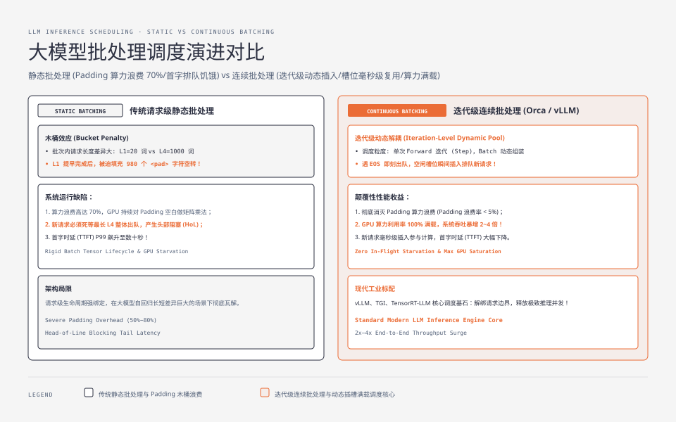
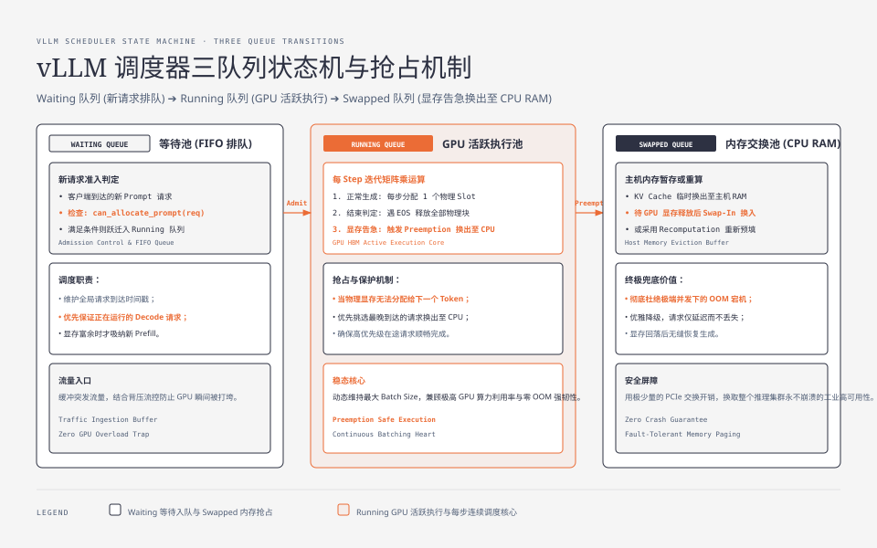
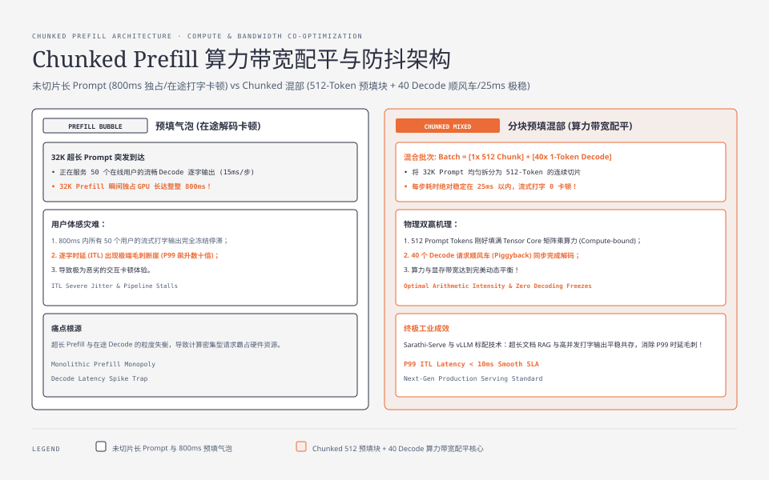

**TL;DR：** 传统深度学习服务采用**请求级静态批处理（Static Batching）**，但在大模型自回归场景下，请求生成长度极其离散（从 10 个词到 2000 个词不等），导致短请求早早完成后被迫填充 Padding 字符空转等待最长请求，产生严重的“木桶木屑效应”并造成高达 70% 的 GPU 算力浪费。由 OSDI '22 提出的 **Orca 连续批处理（Continuous Batching / Iteration-level Scheduling）** 彻底打破了请求边界：**以单个 Forward 迭代（Iteration）为最小调度粒度**，遇到 EOS 立即移出并向空闲槽位动态插入新请求；结合 **Chunked Prefill（分块预填充）** 混部技术，将超长 Prompt 切块与在途 Decode 并行矩阵计算，一举消除首字排队毛刺，实现 GPU 算力利用率 100% 满载。

---

## 一、 传统静态批处理在自回归时代的崩溃

在传统的图像分类（ResNet）或文本匹配（BERT）服务中，每个样本的模型前向传播耗时完全固定（单次推理即出结果），静态批处理（将 $B$ 个请求打包为一个 Tensor 执行 `forward()`）能够完美提升 GPU 吞吐。

然而大语言模型的生成具有**不可预测的变长自回归物理特性**：



### 1.1 静态批处理的两大致命缺陷

1. **木桶填充浪费（Padding Overhead）**：
   - 设 Batch Size 为 4，四个请求的实际生成长度分别为：$L_1=20$, $L_2=50$, $L_3=100$, $L_4=1000$；
   - 静态批处理必须以最长的 $L_4=1000$ 为基准，强行将前三个请求填充 980、950、900 个 `<pad>` 空字符；
   - **算力浪费**：在第 21 到第 1000 轮迭代中，GPU 依然在对已经完成的 $L_1$ 进行毫无意义的矩阵乘法与注意力运算，算力白白空转；
2. **新请求排队饥饿（Head-of-Line Blocking）**：
   - 外部新来的请求必须死等当前这一批 Batch 的 $L_4$ 完全生成完毕，才能进入下一轮 Batch；
   - 导致系统的**首字时延（TTFT）出现极端长尾毛刺（P99 飙升至数十秒）**！

---

## 二、 迭代级连续批处理（Iteration-level Scheduling）

为了解决这一困境，Orca 论文提出了**迭代级连续批处理（Continuous Batching / In-flight Batching）**。

### 2.1 核心调度原则

1. **解绑请求生命周期**：Batch 不再是一个固定生命周期的物理张量，而是一个**动态进出的请求指针池**；
2. **每轮 Iteration 独立决策**：在每次 GPU 执行 Step 之前，调度器重新组装当前活跃请求的输入张量（Batch Size 动态浮动）；
3. **即时释放与即时插入**：一旦某个请求生成了 `[EOS]` 终止符或达到 `max_tokens`，立即从当前活跃批次中剔除并释放其 KV Cache，**下一个毫秒瞬间将排队中的新请求填充进该槽位**！

---

## 三、 vLLM 调度器核心状态机：三队列流转机制

在生产级推理引擎（如 vLLM）中，连续批处理调度器通过三个双向队列管理请求的全生命周期：



### 3.1 三队列定义

- **Waiting 队列（等待池）**：存放客户端刚到达的新请求，按到达时间戳 FIFO 排队；
- **Running 队列（GPU 执行池）**：当前正在 GPU 上参与每个 Iteration 前向计算的请求集合；
- **Swapped 队列（主机内存交换池）**：当 GPU 物理显存耗尽时，被临时抢占并将 KV Cache 换出至 CPU 主机内存（RAM）的请求集合。

### 3.2 单步调度决策算法（Go / Python 伪代码模型）

```python
class Scheduler:
    def __init__(self, block_manager, max_batch_size=128):
        self.waiting_queue = []
        self.running_queue = []
        self.swapped_queue = []
        self.block_manager = block_manager
        self.max_batch_size = max_batch_size

    def schedule_iteration(self):
        """每个 Forward 步骤执行前的毫秒级调度决策"""
        scheduled_running = []
        
        # 1. 优先维护正在运行的请求 (Decode Phase)
        for req in self.running_queue:
            if req.is_finished():
                # 生成结束，释放其占用的全部物理 GPU 显存页框
                self.block_manager.free_blocks(req)
                continue
                
            # 检查是否有显存为下一个 Token 分配新 Block
            if self.block_manager.can_append_slot(req):
                self.block_manager.append_slot(req)
                scheduled_running.append(req)
            else:
                # 显存告急！触发抢占机制 (Preemption)
                victim = self._select_victim_to_preempt()
                self._swap_out_to_cpu(victim)
                print(f"Preempted Req {victim.id} to CPU RAM!")

        # 2. 检查空闲显存，吸纳 Waiting 队列中的新请求 (Prefill Phase)
        while self.waiting_queue and len(scheduled_running) < self.max_batch_size:
            new_req = self.waiting_queue[0]
            if self.block_manager.can_allocate_prompt(new_req):
                self.waiting_queue.pop(0)
                self.block_manager.allocate_prompt(new_req)
                scheduled_running.append(new_req)
            else:
                # 显存不足以容纳新 Prompt，停止本轮吸纳
                break

        self.running_queue = scheduled_running
        return self._build_model_input(scheduled_running)
```

---

## 四、 算力配平终极杀手锏：Chunked Prefill（分块预填充）

即使有了连续批处理，系统依然面临一个严重的**微架构瓶颈：Prefill 阶段与 Decode 阶段的算力冲突（The Prefill Bubble）**。

### 4.1 为什么长 Prompt 会打崩正在流式输出的用户？

- 假设集群正在平稳服务 50 个用户的 Decode 逐字输出（每步耗时仅 $15\text{ms}$，用户体验极其流畅）；
- 此时突然来了一个 **32K 超长文档 RAG 总结请求**；
- 如果直接对 32K Prompt 执行 Prefill，该计算将独占 GPU **长达 800ms**！
- **后果**：在这 800ms 内，所有 50 个在线用户的打字机输出全部停滞冻结，**逐字时延（ITL）瞬间出现严重卡顿断崖**！

### 4.2 分块预填充（Chunked Prefill）解决方案



Sarathi-Serve 与 vLLM 引入了 **Chunked Prefill**：
1. 将 32K 超长 Prompt 拆分为例如 512 个 Token 的小块（Chunk）；
2. 调度器在每一个 Iteration 中，组装一个混合批次（Mixed Batch）：

$$\text{Batch} = [\text{1 个 512-Token 的 Prefill 块}] + [\text{40 个在途的 1-Token Decode 请求}]$$

3. **物理收益**：
   - 512 个 Prompt Token 刚好将 GPU 的 Tensor Core 矩阵乘单元填满（吃满计算算力）；
   - 40 个 Decode 请求顺风车（Piggyback）搭便车读取权重，一并完成解码（算力与带宽完美配平）；
   - **单步耗时稳定控制在 25ms 以内**，超长文档的加入对在途用户的流式打字**完全零感知、零卡顿**！

---

## 五、 调度策略对比矩阵

| 调度策略 | 调度粒度 | Padding 浪费率 | 首字延迟 (TTFT) | 逐字抖动 (ITL Jitter) |
| :--- | :--- | :--- | :--- | :--- |
| **传统静态批处理** | 请求级 (Request-level) | 50% ~ 80% | 极高（需排队整批完成） | 低（批内固定） |
| **基础连续批处理** | 迭代级 (Iteration-level) | **$< 5\%$** | 显著下降 | 高（遇长 Prompt 时卡顿） |
| **连续批处理 + Chunked Prefill** | 迭代分块级 (Chunked) | **$\approx 0\%$** | **极低且稳定** | **极低且平滑（P99 波动 $< 10\text{ms}$）** |

连续批处理与 Chunked Prefill 将现代大模型后端的吞吐能力推向了极限。在下一篇中，我们将深入探索打破自回归串行枷锁的数学奇迹：**投机采样（Speculative Decoding）物理本质：草稿模型推测与大模型并行验证**。
