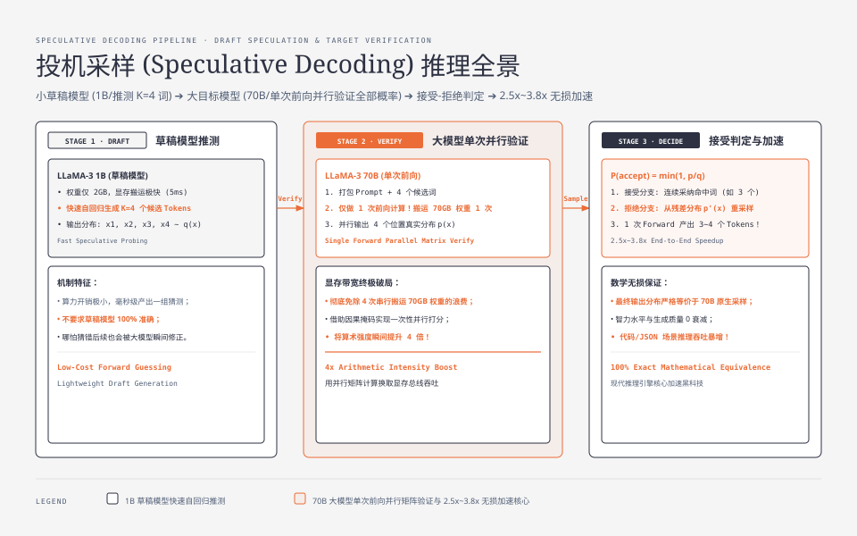
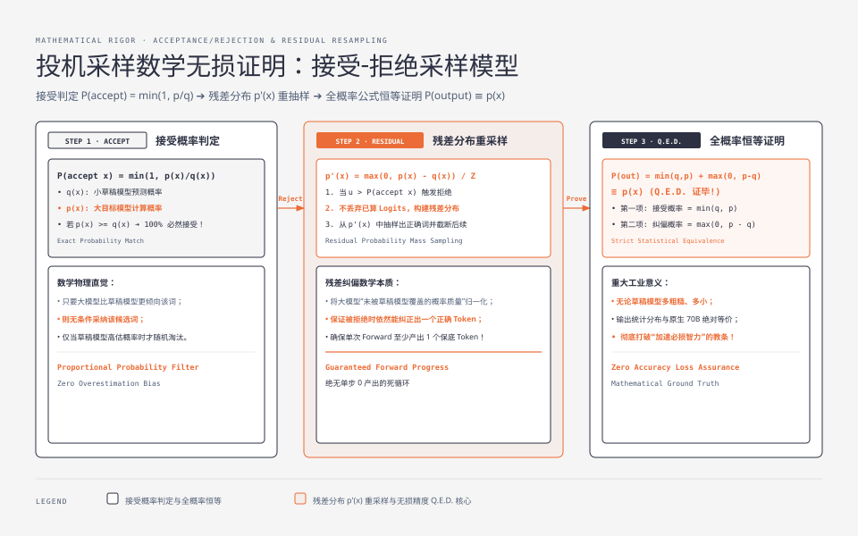

**TL;DR：** 在自回归生成中，大模型每生成一个 Token 都受限于显存带宽搬运，导致算力严重浪费。**投机采样（Speculative Decoding）** 的物理突破在于：**利用一个体积极小、生成极快的草稿模型（Draft Model，如 1B）自回归推测生成 $K$ 个候选 Tokens，随后让 70B 大目标模型（Target Model）仅通过单次前向传播（Forward Pass）并行验证全部 $K$ 个词的概率分布**。借助巧妙的**接受-拒绝采样算法（Acceptance/Rejection Sampling）**，数学上严格证明了最终输出概率分布与大模型原生推理 **100% 完全等价（无损精度）**，在代码生成与结构化 JSON 等模式确定场景下，单卡推理速度可直接暴涨 **2.5x ~ 3.8x**。

---

## 一、 自回归解码的显存带宽之痛与投机破局

在传统的自回归解码中，为了输出一段长度为 100 的代码，70B 参数的大模型必须执行 **整整 100 次串行前向传播**。
- 每次前向传播必须把 70GB 的权重从 GPU HBM 显存读入片上 SRAM；
- 生成 100 个 Token 意味着在显存总线上来回搬运了 $70\text{GB} \times 100 = 7.0\text{ TB}$ 的海量数据；
- 物理时间全部花在了总线搬运上，计算核心大部分时间在饥饿等待。

**计算机体系结构的经典破局点：分支预测与投机执行（Speculative Execution）。**



---

## 二、 投机采样的两阶段协作链路

投机采样引入了一大一小两个模型协同工作：

### 2.1 阶段一：小草稿模型快速自回归推测（Draft Generation）

- 选用一个小模型（如 LLaMA-3 1B 作为草稿模型，LLaMA-3 70B 作为目标模型）；
- 草稿模型体积小（权重仅约 2GB），显存搬运极快；
- 在极短时间内（例如 5ms），草稿模型连续自回归生成 $K$ 个候选 Token（如 $K=4$）：

$$\hat{x}_1, \hat{x}_2, \hat{x}_3, \hat{x}_4 \sim q(x)$$

### 2.2 阶段二：大目标模型单次前向并行验证（Target Parallel Verification）

- 目标模型将用户 Prompt 与这 4 个候选 Token 打包，通过**因果注意力掩码（Causal Mask）**构建输入序列；
- **核心物理奇迹：目标模型仅做 1 次前向计算！**
- 借由矩阵并行乘法，目标模型在一个 Forward 内同时计算出全部位置的真实条件概率分布：

$$p(x_1 \mid \text{Prompt}),\; p(x_2 \mid \text{Prompt}, \hat{x}_1),\; p(x_3 \mid \text{Prompt}, \hat{x}_1, \hat{x}_2),\; p(x_4 \mid \text{Prompt}, \hat{x}_1, \hat{x}_2, \hat{x}_3)$$

- 目标模型根据接受-拒绝准则依次判定这 4 个词是否合法。一旦某个词被拒绝，截断后续词，并由大模型重采样纠正出一个正确的 Token。

---

## 三、 接受-拒绝采样算法与无损精度数学证明

为什么投机采样不会导致模型智力下降或输出胡言乱语？因为其采样算法在数学上保证了**边缘分布的不变性**。



### 3.1 接受概率判定规则

设在某个位置，草稿模型预测的概率分布为 $q(x)$，抽取的候选 Token 为 $x$；大目标模型计算出的真实目标概率分布为 $p(x)$。
- 系统以如下概率**接受（Accept）**该候选 Token：

$$P(\text{accept } x) = \min\left(1,\; \frac{p(x)}{q(x)}\right)$$

- 若均匀分布随机数 $u \sim \mathcal{U}(0, 1) \le P(\text{accept } x)$，则采纳 $x$；
- 若 $u > P(\text{accept } x)$，则**拒绝（Reject）** $x$。

### 3.2 拒绝时的残差重采样分布（Residual Resampling）

一旦候选 Token $x$ 被拒绝，算法**并不丢弃已算的概率矩阵**，而是从修正后的残差分布 $p'(x)$ 中重新抽取一个替代词：

$$p'(x) = \frac{\max\left(0,\; p(x) - q(x)\right)}{\sum_{x'} \max\left(0,\; p(x') - q(x')\right)}$$

### 3.3 严格数学无损等价性证明

我们要证明：**经过投机采样（接受或拒绝重采样）最终输出 Token $x$ 的全概率，恒等于目标大模型的原生分布 $p(x)$。**

根据全概率公式展开：

$$P(\text{output } x) = P(\text{Draft 提出 } x \text{ 且 被接受}) + P(\text{某个 Draft 词被拒绝 且 重新采样为 } x)$$

代入两项概率表达式：

1. 第一项（直接接受概率）：
   $$q(x) \times \min\left(1, \frac{p(x)}{q(x)}\right) = \min(q(x), p(x))$$

2. 第二项（发生拒绝的总概率 $\times$ 从残差分布抽到 $x$ 的概率）：
   总拒绝概率为：
   $$\sum_{x'} q(x') \left(1 - \min\left(1, \frac{p(x')}{q(x')}\right)\right) = \sum_{x'} \max(0, q(x') - p(x')) = \sum_{x'} \max(0, p(x') - q(x'))$$
   将其乘以残差采样概率 $p'(x)$，分母与总拒绝概率完全相消，第二项化简为：
   $$\max(0, p(x) - q(x))$$

3. 将两项相加合并：
   $$P(\text{output } x) = \min(q(x), p(x)) + \max(0, p(x) - q(x)) \equiv p(x)$$

$$\mathbf{Q.E.D.\quad 证毕！}$$

无论草稿模型有多笨拙、预测有多偏，**最终输出序列的统计概率分布与纯 70B 大模型原生采样 100% 绝对一致**！

---

## 四、 理论加速比与工程场景收益上限

设草稿模型的平均命中接受率为 $\alpha \in [0, 1]$，单次推测步数为 $K$。
单次验证迭代的**期望产出 Token 数**为等比数列求和：

$$\mathbb{E}[\text{Tokens}] = \sum_{i=0}^{K} \alpha^i = \frac{1 - \alpha^{K+1}}{1 - \alpha}$$

设单次草稿推测耗时为 $t_d$，大模型单次前向验证耗时为 $t_t$。投机采样的端到端实际加速比为：

$$\text{Speedup} = \frac{\mathbb{E}[\text{Tokens}] \times t_t}{K \cdot t_d + t_t}$$

#### Python 投机采样模拟验证器

```python
import numpy as np

def speculative_step(target_logits, draft_logits, K=4):
    """
    单步投机采样模拟算法 (Softmax 概率接受-拒绝)
    """
    # 计算目标模型与草稿模型的 softmax 分布
    p = np.exp(target_logits) / np.sum(np.exp(target_logits), axis=-1, keepdims=True)
    q = np.exp(draft_logits) / np.sum(np.exp(draft_logits), axis=-1, keepdims=True)
    
    accepted_tokens = []
    # 模拟草稿模型生成的 K 个候选词
    draft_tokens = [np.random.choice(len(q[i]), p=q[i]) for i in range(K)]
    
    for i in range(K):
        token = draft_tokens[i]
        p_prob = p[i, token]
        q_prob = q[i, token]
        
        # 接受概率判定
        acceptance_prob = min(1.0, p_prob / (q_prob + 1e-10))
        if np.random.rand() < acceptance_prob:
            accepted_tokens.append(token)
        else:
            # 触发拒绝，从残差分布重采样纠正
            residual = np.maximum(0, p[i] - q[i])
            residual = residual / np.sum(residual)
            corrected_token = np.random.choice(len(residual), p=residual)
            accepted_tokens.append(corrected_token)
            break # 截断后续预测
            
    return accepted_tokens
```

---

## 五、 现代衍生演进：无独立草稿模型的架构

维护两套不同模型在显存与运维上依然存在复杂度，工业界进一步演化出了免独立草稿模型的先进架构：

1. **Medusa（美杜莎多头架构）**：在目标大模型顶部增加多个轻量级预测头（Medusa Heads），利用隐藏层特征同时推测未来多个位置；
2. **EAGLE（自回归特征外推）**：将底层 Transformer 块的隐藏状态向量输入轻量回归头，命中率突破 80%；
3. **Prompt Lookup Decoding**：在 RAG 或文档摘要场景中，直接从用户原始 Prompt 中使用 N-gram 贪婪匹配作为候选词推测，**零额外模型开销**获得 2 倍以上加速！

在下一篇中，我们将从单机推理引擎跃升至分布式服务网关：**大模型长连接网关工程：SSE 流式代理、HTTP 分块传输与反压熔断**。
