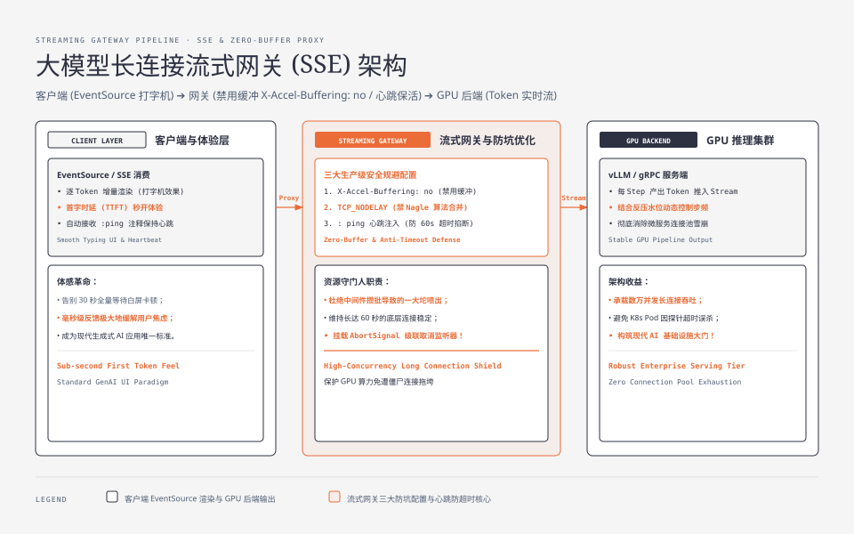
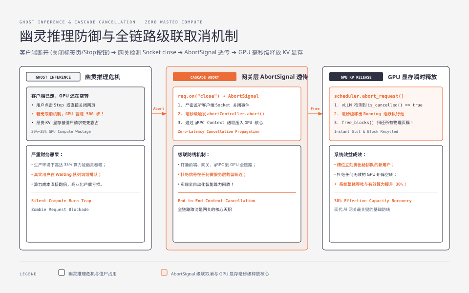

**TL;DR：** 传统微服务网关是为 **50ms~200ms 的短连接 RPC 响应**量身定制的；而大模型自回归生成单次响应长达 **10s ~ 60s**，若沿用传统同步等待模式，微服务连接池将在数秒内被完全打满并引发级联雪崩。生产级大模型网关必须全面转型为 **Server-Sent Events（SSE）与 HTTP/2 流式分块代理架构**。网关的核心职责不仅是转发 Token，更是**显存资源的守门人**：必须在网关层禁用 Nginx 缓冲区（`X-Accel-Buffering: no`）、注入心跳保活包，并在检测到客户端主动断开连接时，通过 **`AbortSignal` / gRPC `CancelContext` 将取消信号毫秒级透传至底层 GPU 推理调度器**，瞬间释放昂贵的 KV Cache 显存，彻底杜绝“幽灵推理”对算力资源的无效空耗。

---

## 一、 为什么大模型服务打崩了传统微服务网关？

在经典 Web 2.0 / 微服务架构中：
- 客户端发送 HTTP POST $\to$ 网关 $\to$ 订单服务 $\to$ 返回 JSON 结果（耗时 $50\text{ms}$）；
- 单个 Worker 线程每秒可周转 20 个请求，单机 1000 连接池可轻松支撑 20000 QPS。



### 1.1 大模型长连接引发的三大物理灾难

1. **连接池耗尽雪崩（Connection Starvation）**：
   - 当大模型生成 1000 个 Token 时，物理耗时通常在 $15\text{s} \sim 30\text{s}$；
   - 在这 30 秒内，从客户端 $\to$ SLB 负载均衡 $\to$ API 网关 $\to$ 后端 GPU 推理服务，整条链路上的 **Socket 连接与线程句柄被全程死死霸占**；
   - 仅仅需要几百个并发用户，整个集群的 HTTP 连接池就会瞬间枯竭，导致健康检查探针超时，K8s 触发大规模 Pod 误杀重启！
2. **中间件超时切断（Middlebox Silent Dropping）**：
   - 公网上的 NAT 网关、AWS ALB、Cloudflare 边缘代理默认设有空闲超时时间（Idle Timeout，通常为 60s）；
   - 若模型在复杂 RAG 或思考（Deep Thinking）阶段几十秒未输出字符，中间件会直接发送 TCP RST 强行掐断连接；
3. **首字长尾体验灾难**：
   - 若网关等待模型完全生成才一次性返回全量 JSON，用户将在白屏前死等 30 秒，产品跳出率飙升至 90% 以上。

---

## 二、 SSE（Server-Sent Events）流式分块协议原理

为了实现类似打字机的实时渐进式渲染，工业界统一采用 **SSE（Server-Sent Events）** 规范。

### 2.1 物理协议格式

SSE 基于标准的 HTTP 长连接，服务端响应特定的响应头：

```http
HTTP/1.1 200 OK
Content-Type: text/event-stream; charset=utf-8
Cache-Control: no-cache, no-transform
Connection: keep-alive
X-Accel-Buffering: no
Transfer-Encoding: chunked

data: {"id":"chatcmpl-01","choices":[{"delta":{"content":"你好"}}]}

data: {"id":"chatcmpl-01","choices":[{"delta":{"content":"！我是"}}]}

: ping

data: {"id":"chatcmpl-01","choices":[{"delta":{"content":"大模型。"}}]}

data: [DONE]
```

### 2.2 网关层必须规避的三大坑

1. **Nginx 反向代理缓冲陷阱**：
   - Nginx 默认开启了 `proxy_buffering on`，会试图积攒满 4KB/8KB 的缓冲区才一次性冲刷给客户端；
   - **后果**：流式输出退化为“卡顿 10 秒后突然喷出一大坨字”；
   - **解法**：在网关响应头显式注入 `X-Accel-Buffering: no`，或在 Nginx 配置中针对大模型路由设置 `proxy_buffering off; proxy_cache off;`。
2. **TCP Nagle 算法合并延迟**：
   - Linux 内核默认开启 Nagle 算法，会等待小包填满 MSS 才发送；
   - **解法**：网关 Socket 必须显式开启 `TCP_NODELAY`，确保每个生成的单个 Token 立即打包发出。
3. **心跳保活（Heartbeat Ping）**：
   - 每隔 15 秒主动向连接中注入以冒号开头的 SSE 注释包（如 `: ping\n\n`）；
   - 客户端标准 EventSource 解析器会自动忽略注释行，同时重置底层 TCP 链路与 NAT 网关的活跃计时器，防止连接断裂。

---

## 三、 幽灵推理与全链路级联取消（Cancellation Propagation）

在大模型后端工程中，最昂贵、最隐蔽的算力浪费来自于 **“幽灵推理（Ghost Inference）”**。



### 3.1 什么是幽灵推理？

- 用户在聊天界面点击了“停止生成（Stop Generating）”，或者直接关闭了浏览器标签页；
- 前端向网关发出了 TCP FIN/RST 包，客户端连接瞬间销毁；
- **若网关没有实现取消传导**：底层 vLLM GPU 推理引擎对此完全无知，后台依然在全力以赴地为这个已死去的请求跑完后续 500 轮 Forward 矩阵计算！
- **财务代价**：根据大厂实测数据，在未部署全链路取消时，**高达 20%~35% 的 GPU 算力完全浪费在无人消费的幽灵推理上**！

### 3.2 全链路级联取消工程实现（Node.js / Go 完整实现）

#### Node.js / TypeScript 网关层取消透传实现

```typescript
import http from "node:http";
import { Readable } from "node:stream";

const server = http.createServer(async (req, res) => {
  if (req.url === "/v1/chat/completions" && req.method === "POST") {
    // 1. 创建该请求专属的 AbortController
    const abortController = new AbortController();
    const { signal } = abortController;

    // 2. 严格监听客户端 Socket 断开事件 (核心安全防御!)
    req.on("close", () => {
      if (!res.writableEnded) {
        console.warn("[Gateway] Client disconnected! Triggering cascade abort...");
        abortController.abort(); // 触发下游级联取消
      }
    });

    // 3. 设置流式响应头
    res.writeHead(200, {
      "Content-Type": "text/event-stream",
      "Cache-Control": "no-cache",
      "Connection": "keep-alive",
      "X-Accel-Buffering": "no", // 禁用 Nginx 缓冲
    });

    try {
      // 4. 调用 vLLM 推理引擎 (透传 signal)
      const vllmStream = await callVllmInferenceEngine(req, signal);
      
      for await (const chunk of vllmStream) {
        if (signal.aborted) break;
        res.write(`data: ${JSON.stringify(chunk)}\n\n`);
      }
      res.write("data: [DONE]\n\n");
    } catch (err: any) {
      if (err.name === "AbortError") {
        console.log("[Gateway] Inference aborted successfully on GPU backend.");
      } else {
        console.error("[Gateway] Error in streaming:", err);
      }
    } finally {
      res.end();
    }
  }
});
```

#### vLLM / gRPC 后端感知取消并释放显存

在 Python / gRPC 服务端，调度器通过监听 RPC 上下文状态：

```python
async def generate_stream(request, context):
    seq_id = scheduler.add_request(request)
    try:
        while not scheduler.is_finished(seq_id):
            # 检查客户端是否已断开 (gRPC context)
            if context.is_cancelled():
                print(f"[vLLM] Cancelled by client! Immediate freeing GPU blocks for seq {seq_id}")
                scheduler.abort_request(seq_id) # 毫秒级移出 Running 队列并释放 Block
                break
                
            token_output = await scheduler.step(seq_id)
            yield token_output
    finally:
        scheduler.cleanup(seq_id)
```

---

## 四、 慢消费者与 TCP 零窗口反压机制（Backpressure）

如果用户的客户端网络劣化（如进入电梯，网络带宽骤降至 1KB/s），但 GPU 推理引擎依然以每秒 50 个 Token 的极速吐词：
- 网关向客户端发送的数据无法被及时确认，网关 Socket 发送缓冲区迅速填满；
- 客户端向网关发送 **TCP Zero Window（零窗口通知）**，网关暂停向客户端 Socket 写入；
- **反压传递（Backpressure Propagation）**：网关暂停从 gRPC 流中读取新 Token，gRPC 缓冲区填满，最终反压 vLLM 调度器；
- vLLM 调度器识别到该请求消费过慢，**自动将其降级或暂停其单步 Forward**，防止网关内存发生 OOM 崩溃！

---

## 五、 网关架构选型与指标监控红线

| 维度 | 传统 HTTP/1.1 同步网关 | 现代 SSE 流式网关 + 取消链路 |
| :--- | :--- | :--- |
| **连接占用模型** | 短时阻塞（$50\text{ms}$） | 长期流式持有（$10\text{s} \sim 60\text{s}$） |
| **取消响应** | 不感知客户端断开 | **毫秒级感知并向 GPU 释放显存** |
| **心跳管理** | 依赖 TCP Keepalive | **应用层 SSE `: ping` 显式保活** |
| **内存开销** | 极低（小 JSON 缓冲） | 必须依赖流式管道直通，杜绝任何全量 Buffer |

在大模型后端体系中，网关不再是简单的反向代理，而是**连接客户端体验与底层 GPU 显存生命周期的中枢神经**。在下一篇中，我们将进入大模型降本增效的终极大招：**大模型语义缓存与检索防抖：Embedding 相似度边界与 RAG 链路保护**。
