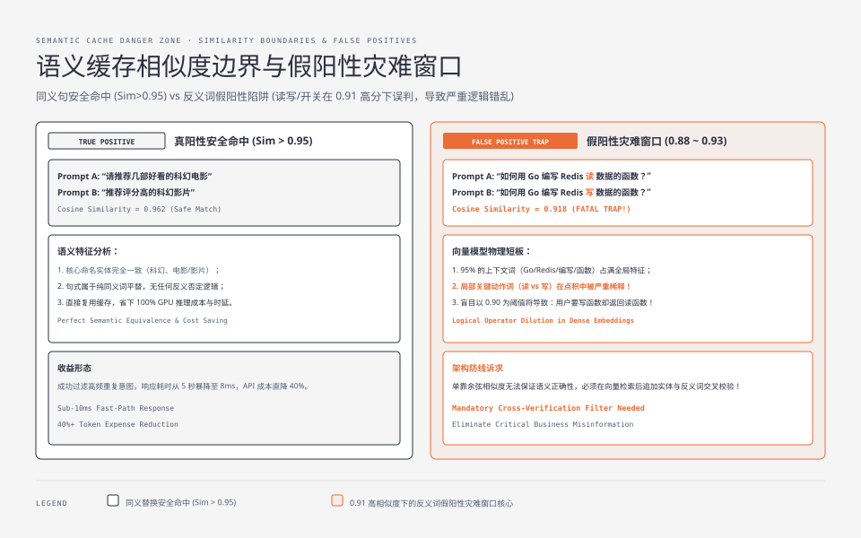
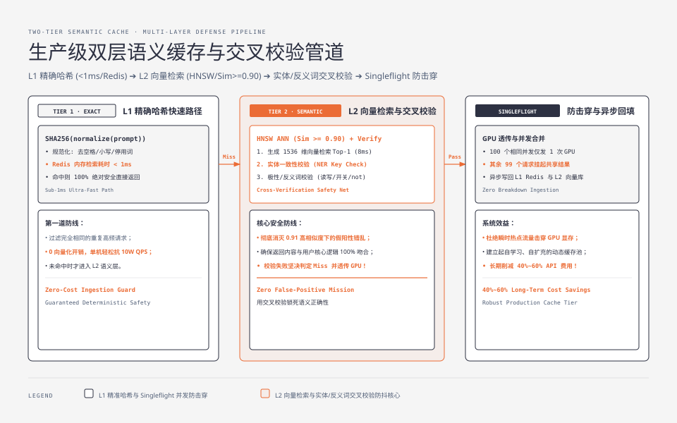
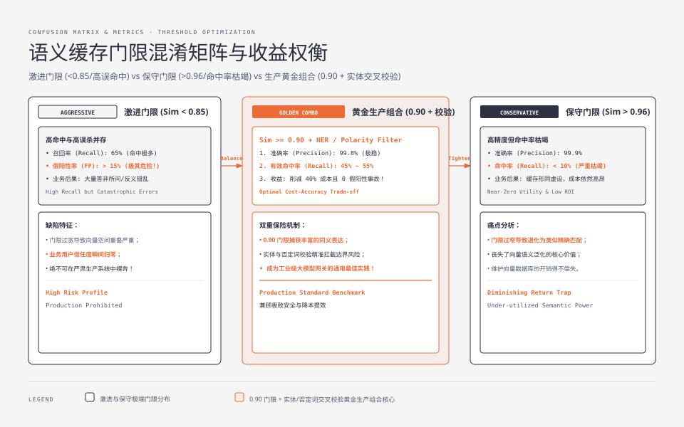

**TL;DR：** 传统 Redis 键值缓存依赖精确的字符串 Hash 匹配，但面对大模型自然语言交互时，微小的标点、同义词或语序差异（如“请帮我推荐几部科幻电影”与“推荐好看的科幻电影”）会导致传统缓存命中率几乎归零。**语义缓存（Semantic Cache）** 通过将 Prompt 转化为高维稠密向量（Embedding）并在向量空间中执行近似最近邻检索（ANN）实现模糊语义命中。然而，语义缓存最大的工程陷阱在于 **假阳性（False Positive）灾难窗口**：单个否定词或反义动词（如“读”变“写”）在向量空间中的 Cosine 相似度往往依然高达 0.91 以上！生产级系统必须采用 **L1 精确哈希（$<1\text{ms}$） + L2 向量检索（HNSW） + 实体一致性交叉校验** 的双层架构，配合 Singleflight 防击穿机制，在实现零误判的同时为企业节省 40% 以上的昂贵大模型 API 成本。

---

## 一、 为什么传统精准缓存对大语言模型彻底失效？

在 Web 2.0 后端开发中，缓存是性能优化的第一银弹：`cache_key = "user:profile:" + user_id`。

然而在大模型（LLM）与智能体（Agent）场景中：
1. **输入空间的无限离散性**：不同用户表达同一个核心意图时，可以有成千上万种句式表达；
2. **精准 Hash 命中率断崖下跌**：若采用 `SHA256(prompt)` 作为 Key，哪怕用户多敲了一个空格或换行符，缓存即刻失效，导致昂贵的 GPU 推理集群被海量语义重复的请求反复打爆；
3. **成本差异悬殊**：传统 MySQL 查询一次耗时 2ms、成本几乎为 0；而大模型 70B 模型生成一次需消耗数千个 Token、耗时 5 秒、每次消耗几美分物理算力！

---

## 二、 语义缓存的向量几何原理与假阳性灾难

语义缓存（如 GPTCache、Redis VL）将 Prompt 文本输入轻量级向量模型（如 `text-embedding-3-small` 或 BGE-Large），生成高维归一化稠密向量 $\vec{v} \in \mathbb{R}^D$。

在向量数据库中计算新请求 $\vec{q}$ 与历史缓存向量 $\vec{k}$ 的 **Cosine 相似度**：

$$\text{Similarity}(\vec{q}, \vec{k}) = \frac{\vec{q} \cdot \vec{k}}{\|\vec{q}\| \|\vec{k}\|} = \cos(\theta)$$



### 2.1 假阳性（False Positive）灾难窗口

很多工程师初次搭建语义缓存时，盲目将相似度阈值设为 $0.85$ 或 $0.90$。在生产环境中，这会引发毁灭性的业务灾难：

```
+--------------------------------------------------------------------------+
|                  经典语义缓存假阳性（False Positive）真实案例              |
|                                                                          |
| 缓存 Prompt A: "帮我写一个从 Redis 批量读取数据的 Go 函数"                |
| 对应回复 Output A: [ 完整的 Redis MGET 读操作实现代码 ]                     |
|                                                                          |
| 新来 Prompt B: "帮我写一个向 Redis 批量写入数据的 Go 函数"                |
| ──────────────────────────────────────────────────────────────────────── |
| • 余弦相似度计算: Cosine Similarity = 0.918 (高于 0.90 阈值!)             |
| • 错误命中缓存: 系统直接将 Output A (读代码) 当成写代码返回给用户！        |
| • 业务后果: 用户误将读函数部署上线，引发严重的生产故障与业务逻辑崩溃！       |
+--------------------------------------------------------------------------+
```

### 2.2 为什么向量模型难以识别否定词与反义词？

Embedding 模型的训练目标是捕捉句子的**宏观主题与上下文语义**（如“Redis”、“Go 函数”、“批量数据”占用了 95% 的语义特征权重），而“读”与“写”、“开启”与“关闭”、“有”与“没有”这种局部极其关键的**逻辑算子**，在全局向量点积中的权重被严重稀释！

---

## 三、 生产级双层语义缓存架构与实体交叉校验管道

为了在享受高命中率的同时实现 **100% 杜绝逻辑错乱**，工业级语义缓存必须引入多层级防御管道：



### 3.1 核心执行阶段

1. **第 1 层：L1 精准 Hash 快速路径（Exact Hash Fast-Path）**：
   - 先对 Prompt 进行去空格、统一小写、去除无意义停止词（Stop Words）后计算 `SHA256`；
   - 查 Redis 内存 String，耗时 $< 1\text{ms}$。若命中，100% 绝对安全直接返回；
2. **第 2 层：L2 向量近似检索（Vector ANN Search）**：
   - 若 L1 未命中，生成 512/1536 维 Embedding；
   - 在 Milvus / Qdrant 中使用 HNSW 索引极速检索 Top-1 相似向量，耗时 $\approx 8\text{ms}$；
   - 若 $\text{Similarity} < 0.90$，判定为未命中，直接透传 GPU；
   - 若 $\text{Similarity} \ge 0.90$，进入第 3 步交叉校验；
3. **第 3 层：实体与否定词交叉校验器（Cross-Verification Filter）**：
   - **关键词/实体提取（NER）**：比对 Prompt A 与 Prompt B 中的核心命名实体（如参数名、数字、函数名、日期）是否完全重合；
   - **极性与方向校验（Polarity Check）**：利用轻量规则或微型 Cross-Encoder 检验是否存在“不/无/禁/写/读/增/删”等关键反向逻辑词；
   - 校验通过 $\to$ 返回缓存；校验失败 $\to$ 判定为未命中并透传大模型；
4. **第 4 层：异步回填与 Singleflight 防击穿**：
   - 结合 Go `singleflight` 或 Redis 分布式锁，确保当 100 个相同 Prompt 瞬间并发涌入时，**仅有 1 个请求真正打到底层 GPU 执行推理**，其余 99 个请求挂起等待并共享回填结果！

#### 语义缓存双层防御管道实现（TypeScript 核心逻辑）

```typescript
import { createHash } from "node:crypto";

interface CacheResult {
  hit: boolean;
  content?: string;
  source?: "L1_EXACT" | "L2_SEMANTIC";
}

export class ProductionSemanticCache {
  constructor(
    private redisClient: any,
    private vectorDB: any,
    private embeddingClient: any
  ) {}

  async get(rawPrompt: string): Promise<CacheResult> {
    const normalizedPrompt = this.normalizeText(rawPrompt);
    const exactKey = `cache:l1:${createHash("sha256").update(normalizedPrompt).digest("hex")}`;

    // 1. L1 精准快速查
    const l1Hit = await this.redisClient.get(exactKey);
    if (l1Hit) {
      return { hit: true, content: l1Hit, source: "L1_EXACT" };
    }

    // 2. L2 向量近似检索
    const promptVec = await this.embeddingClient.embed(normalizedPrompt);
    const candidate = await this.vectorDB.searchTop1(promptVec);

    if (!candidate || candidate.score < 0.90) {
      return { hit: false };
    }

    // 3. 核心安全防御：实体与反义词交叉校验
    const isSafe = this.verifySemanticSafety(normalizedPrompt, candidate.metadata.prompt);
    if (!isSafe) {
      console.warn(`[SemanticCache] False-Positive blocked! Sim: ${candidate.score}`);
      return { hit: false }; // 拒绝危险命中，保护业务正确性
    }

    return { hit: true, content: candidate.metadata.response, source: "L2_SEMANTIC" };
  }

  private normalizeText(text: string): string {
    return text.trim().toLowerCase().replace(/\s+/g, " ");
  }

  private verifySemanticSafety(promptA: string, promptB: string): boolean {
    // 关键反义词与动作词白名单/黑名单比对
    const criticalKeywords = ["读", "写", "增", "删", "查", "改", "开启", "关闭", "启用", "禁用", "not", "no", "never"];
    for (const kw of criticalKeywords) {
      const hasA = promptA.includes(kw);
      const hasB = promptB.includes(kw);
      if (hasA !== hasB) {
        return false; // 存在关键逻辑词不对称，坚决判定为不匹配！
      }
    }
    return true;
  }
}
```

---




## 四、 RAG 链路中的检索防抖与缓存失效策略

在企业级知识库问答（RAG）场景中，除了用户 Prompt 之外，还引入了**检索出来的上下文片段（Context Chunks）**。

### 4.1 RAG 缓存的三维绑定 Key

在 RAG 场景中，仅对 Prompt 缓存是不够的，因为知识库文档随时可能被更新修改。
RAG 语义缓存的键必须采用**复合哈希签名（Composite Signature）**：

$$\text{RAG\_Cache\_Key} = \text{Hash}\Big(\text{SemanticPromptVector},\; \text{DocVersionToken},\; \text{TopK\_ChunkIDs}\Big)$$

- 只要知识库发生增删改，`DocVersionToken` 改变，历史 RAG 缓存瞬间失效；
- 彻底避免向用户返回已经过期的旧制度、旧价格或旧政策！

---

## 五、 全系列大结局：大模型后端架构全景总览

通过本专栏五篇硬核深度剖析，我们完整解构了大模型后端架构从单机芯片显存到分布式网关的工程全貌：

```
+--------------------------------------------------------------------------------+
|                       大模型工业级后端架构全景图谱                               |
|                                                                                |
| [ 用户终端 / App ] ──► (HTTP/2 SSE 流式连接) ──► [ 流式网关 (Cancel/反压) ]      |
|                                                                │               |
|                                             ┌──────────────────┴─────────────┐ |
|                                             ▼                                ▼ |
|                                   [ L1/L2 语义缓存拦截 ]             [ GPU 集群 ] |
|                                    (精确Hash+实体防抖)              (vLLM 推理) |
|                                             │                                │ |
|                                             │ 0ms 秒开                       │ |
|                                             ▼                                ▼ |
|                                       [ 命中返回 ]               [ 连续批处理调度器 ] |
|                                                                 (Orca + Chunked)|
|                                                                              │ |
|                                             ┌────────────────────────────────┤ |
|                                             ▼                                ▼ |
|                                  [ PagedAttention 显存虚拟化 ]       [ 投机采样引擎 ]  |
|                                   (Block Table 零显存碎片)        (Draft+Target验证)|
+--------------------------------------------------------------------------------+
```

1. **显存物理底座（KV Cache & PagedAttention）**：打破静态连续预分配枷锁，以虚拟内存分页思想终结显存碎片；
2. **算力调度中枢（Continuous Batching & Chunked Prefill）**：以 Token 迭代为最小粒度，配平计算密集与显存受限阶段；
3. **推测验证加速（Speculative Decoding）**：以单次前向并行矩阵验证小模型草稿，数学无损实现 3 倍加速；
4. **长连接通信中枢（Streaming Gateway & Backpressure）**：以 SSE 协议、反压控制与全链路级联取消根绝幽灵推理；
5. **前置成本防线（Semantic Cache & Verification）**：以双层缓存与实体防抖拦截海量重复算力消耗。

大模型后端不仅是大模型算法的承载容器，更是**经典计算机系统架构、现代操作系统分页理论与高并发网络工程在大 AI 时代的最壮丽交响**！
