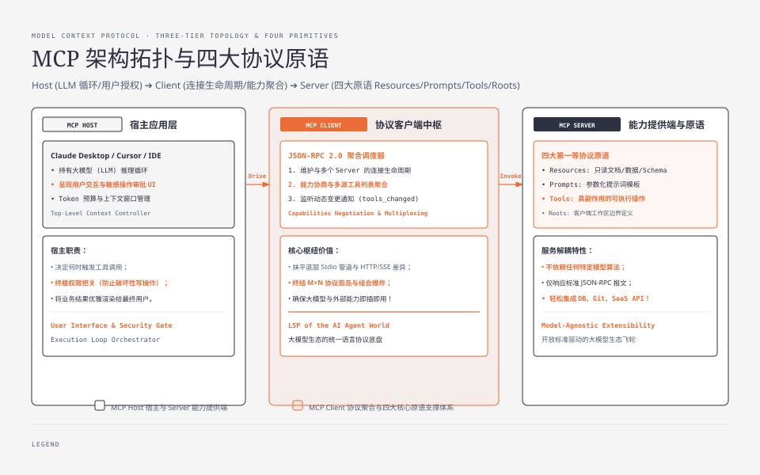
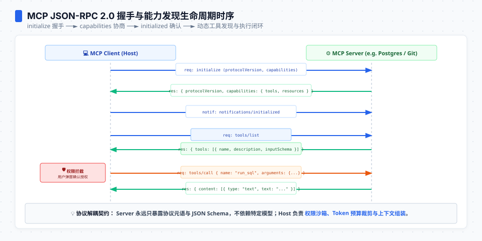
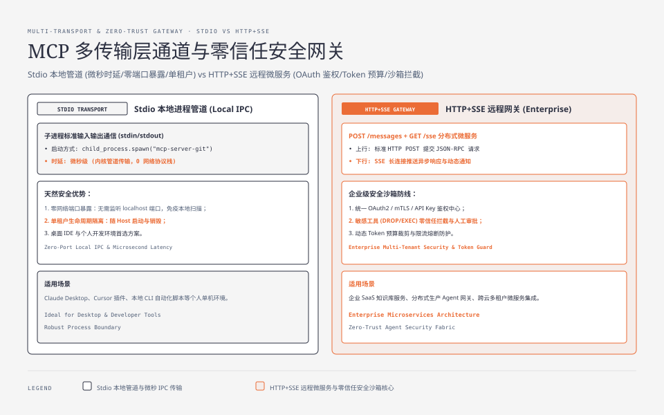

**TL;DR：** 传统的 LLM Agent 工具调用面临严重的“$M \times N$ 协议孤岛”问题——每个模型厂商、IDE 或 Agent 框架都在重复定义私有的 Tool Schema，导致外部系统（数据库、Git、SaaS API）必须为每个平台编写专用适配插件。Anthropic 主导的 **Model Context Protocol (MCP)** 正在成为连接大模型与外部世界的开放协议标准：
1. **三层解耦拓扑**：Host（持有 LLM 循环与用户授权）$\leftrightarrow$ Client（连接生命周期与协议聚合）$\leftrightarrow$ Server（能力提供端），将模型逻辑与系统集成彻底解耦；
2. **双传输层通道**：**Stdio（基于标准输入输出的本地子进程管道）** 实现微秒级低延迟单租户 IPC；**HTTP + SSE（Server-Sent Events）** 支撑企业级分布式远程微服务；
3. **四大协议原语**：`Resources`（只读上下文数据）、`Prompts`（受控参数化提示词模板）、`Tools`（强类型副作用操作）、`Roots`（客户端工作区边界定义）；
4. **确定性状态机**：基于 JSON-RPC 2.0 实现 `initialize` 协商、Capabilities 能力对齐、`notifications/initialized` 确认与动态变更推送；
5. **生产网关挑战**：多 Server 聚合路由、Token 预算裁剪、敏感操作沙箱拦截与企业级鉴权。

---



---

## 一、 为什么行业需要 MCP：终结 $M \times N$ 协议割裂

在 MCP 诞生之前，大模型生态的工具集成处于极度割裂的状态：
- OpenAI 的 `tools: [{type: "function", ...}]`；
- LangChain / LlamaIndex 的私有 Python 工具包装类；
- Cursor、Claude Desktop、VS Code Copilot 各自独立的插件规范。

如果一个团队想要为自己的 PostgreSQL 数据库编写一个查询工具，必须分别针对 Claude Desktop、Cursor、自定义 Agent 框架开发 3~5 套不同的集成插件。这就是经典的 **$M$ 个宿主环境 $\times N$ 个外部数据源** 的组合爆炸问题。

MCP 借鉴了微软在 IDE 领域统一语言服务器的 **LSP（Language Server Protocol）** 成功经验，将大模型与外部上下文交互划定为统一的开放协议：任何实现了 MCP Server 的数据源，都可以即插即用接入任何支持 MCP Client 的 Host 宿主（Cursor、Claude、Zed、自家 Agent 网关）。

---

## 二、 核心架构：Host、Client 与 Server 的职责边界

MCP 的系统架构由清晰的三层实体构成：

### 2.1 MCP Host（宿主环境）
Host 是与最终用户直接交互的顶层应用程序（如 Claude Desktop、Cursor、企业内部 Agent 桌面端）。Host 拥有：
- 大模型（LLM）的主循环控制权；
- 用户的终极权限审批界面（如“是否允许执行 `DROP TABLE`”）；
- 全局上下文窗口（Context Window）的 Token 预算管理。

### 2.2 MCP Client（协议客户端）
Client 通常作为 Host 内部的一个核心模块运行，负责处理底层的网络与协议细节：
- 维护与一个或多个 MCP Server 的长连接生命周期；
- 发起能力协商（Capabilities Negotiation）并缓存 Server 暴露的 Tools/Resources 元数据；
- 聚合多个 Server 的工具列表，将其转化为底层 LLM 所需的 Payload 格式；
- 监听 Server 的动态变更通知（如表结构变更、文件变更）。

### 2.3 MCP Server（能力提供端）
Server 是轻量级的独立程序或微服务，专注暴露特定领域的外部能力：
- 不依赖特定的模型（不知道、也不关心接入的是 GPT-4o、Claude 3.5 还是 DeepSeek）；
- 严格声明自身支持的 Capabilities，并响应 JSON-RPC 2.0 请求。

---

## 三、 双传输通道：Stdio 本地管道 vs HTTP+SSE 远程服务

MCP 在传输层设计上保持了高度灵活性，规范定义了两种主要的通信通道：

### 3.1 通道 1：Stdio 进程间通信（Local IPC）
Host 直接通过操作系统 API（如 Node.js `child_process.spawn` 或 Go `os/exec`）启动 MCP Server 二进制程序，双方通过进程的标准输入输出进行全双工通信：

```
Client ──► [Server Stdin (fd 0)] ──► JSON-RPC 请求
Client ◄── [Server Stdout (fd 1)] ◄── JSON-RPC 响应
           [Server Stderr (fd 2)] ──► 仅用于调试日志（不走协议帧）
```

#### Stdio 的工程优势与约束：
- **微秒级低延迟**：直接通过内核管道（Pipe Buffer）传递数据，零 TCP/IP 网络协议栈开销；
- **零网络端口暴露**：无需监听 `localhost` 端口，彻底避免端口冲突与本地未授权网络扫描风险；
- **天然单租户隔离**：进程随 Host 启动而启动、随 Host 关闭而销毁，生命周期绑定。

### 3.2 通道 2：HTTP + SSE（Remote Microservices）
对于企业级统一部署或 SaaS 服务，MCP 提供了基于 HTTP 的传输规范：
- **客户端 $\to$ 服务端**：通过标准 HTTP `POST /messages` 发送 JSON-RPC 2.0 请求报文；
- **服务端 $\to$ 客户端**：通过长连接 HTTP `GET /sse`（`text/event-stream`）推送异步响应帧与通知。

---



---




## 四、 四大协议原语：Resources、Prompts、Tools 与 Roots

MCP 协议将大模型与外部交互的操作收敛为四大第一等原语（First-Class Primitives）：

| 协议原语 | 访问特征 | 典型 URI / 标识 | 物理语义与服务端行为 |
| :--- | :--- | :--- | :--- |
| **Resources** | **只读上下文** | `file:///project/README.md`<br/>`postgres://db/schema` | 类似 REST GET。用于向 LLM 注入静态文档、数据库 Schema、系统日志，支持动态订阅（`resources/subscribe`）。 |
| **Prompts** | **动态工作流模板** | `git-commit-review`<br/>`debug-trace` | 由 Server 预定义的结构化提示词模板，可接收用户输入参数，引导大模型按标准流程工作。 |
| **Tools** | **可执行写操作** | `run_sql_query`<br/>`create_github_issue` | 具有副作用（Side Effects）的计算与操作。必须提供严格的 JSON Schema，通常需要用户审批。 |
| **Roots** | **客户端边界定义** | `file:///Users/dev/workspace` | **由 Client 反向向 Server 声明**。定义 Server 可以访问的文件系统边界与工作区根目录。 |

### 4.1 Resources JSON-RPC 报文抓包

客户端请求读取指定资源：
```json
{
  "jsonrpc": "2.0",
  "id": 1,
  "method": "resources/read",
  "params": {
    "uri": "postgres://prod-db/public/users/schema"
  }
}
```

服务端回包：
```json
{
  "jsonrpc": "2.0",
  "id": 1,
  "result": {
    "contents": [
      {
        "uri": "postgres://prod-db/public/users/schema",
        "mimeType": "application/json",
        "text": "{\"columns\": [{\"name\": \"id\", \"type\": \"uuid\"}, {\"name\": \"email\", \"type\": \"varchar\"}]}"
      }
    ]
  }
}
```

### 4.2 Tools 定义与调用报文抓包

客户端列举工具（`tools/list`）：
```json
{
  "jsonrpc": "2.0",
  "id": 2,
  "method": "tools/list"
}
```

服务端响应工具列表与 JSON Schema：
```json
{
  "jsonrpc": "2.0",
  "id": 2,
  "result": {
    "tools": [
      {
        "name": "execute_query",
        "description": "在生产数据库上执行只读 SQL 查询",
        "inputSchema": {
          "type": "object",
          "properties": {
            "query": { "type": "string", "description": "SQL 查询语句" },
            "timeout_ms": { "type": "integer", "default": 5000 }
          },
          "required": ["query"]
        }
      }
    ]
  }
}
```

---

## 五、 JSON-RPC 2.0 握手与能力协商状态机

MCP 严禁客户端在未协商能力的情况下盲目发送指令。每次连接建立必须经历标准的三步握手状态机：

```
Client                                                   Server
  │                                                         │
  │─────── 1. req: initialize (capabilities, clientInfo) ──►│
  │                                                         │
  │◄────── 2. res: { protocolVersion, capabilities } ───────│
  │                                                         │
  │─────── 3. notif: notifications/initialized ────────────►│
  │                                                         │
  │  ================ 握手完成，进入就绪状态 ================  │
  │                                                         │
  │─────── 4. req: tools/list 或 resources/read ───────────►│
```

1. **Step 1 (`initialize`)**：Client 告知 Server 自己的协议版本与支持的客户端能力（例如是否支持 roots 变更通知）；
2. **Step 2 (Response)**：Server 返回自身协议版本与支持的服务端原语集合（`tools`、`resources`、`prompts`、`logging`）；
3. **Step 3 (`notifications/initialized`)**：Client 发送确认通知，标志着握手阶段彻底完成，后续常规业务请求方可被处理。

---

## 六、 生产级 MCP 网关落地挑战与架构设计

在企业级将 MCP 投入生产化 Agent 网关时，必须解决三大物理约束：

### 6.1 Token 预算爆炸与动态上下文修剪
一个拥有 20 个 MCP Server 的复杂系统可能暴露出超过 100 个 Tools 和数千个 Resources。如果将全量 Schema 无脑塞入每次 LLM 请求的 System Prompt 中，每次请求将直接消耗 15K~30K Tokens！

**生产解法（两阶段检索路由）**：
- 网关引入**轻量语义向量索引（Tool Vector Index）**；
- 收到用户 Query 时，先在本地通过向量余弦相似度检索出 Top-5 最相关的 Tools；
- 仅将命中 Top-5 工具的 JSON Schema 动态装配进 LLM 上下文，节约 80% 以上 Token 成本。

### 6.2 权限拦截沙箱（Security Sandbox & Blast Radius）
大模型具有天然的不可预测性，MCP Server 绝不能赋予无限制的系统访问权限。

**生产级红线与防护策略**：
1. **只读/写分离**：严格将只读查询（Resources）与状态修改（Tools）解耦；
2. **人机协同确认（Human-in-the-loop）**：对于高危操作（如删除文件、修改数据库、发起转账），网关拦截 JSON-RPC 请求并向用户界面弹出交互式确认弹窗；
3. **Roots 路径沙箱**：MCP Server 内部必须严格校验路径，严禁使用 `../` 跳出 Client 声明的 `roots` 根目录。

---

## 七、 总结

Model Context Protocol (MCP) 代表了大模型系统工程从“碎片化脚本拼装”走向“工业级标准化通信”的关键里程碑：
- **对应用开发者**：屏蔽了底层数据源的私有 API 差异，一次编写即可接入整个 AI 客户端生态；
- **对工具提供者**：无需针对数十个 AI 产品分别开发插件，专注维护单一标准的 MCP Server；
- **对系统架构师**：提供了清晰的进程隔离、安全沙箱与能力协商边界，为构建高可用的企业级 Agent 基础设施奠定了标准基石。
