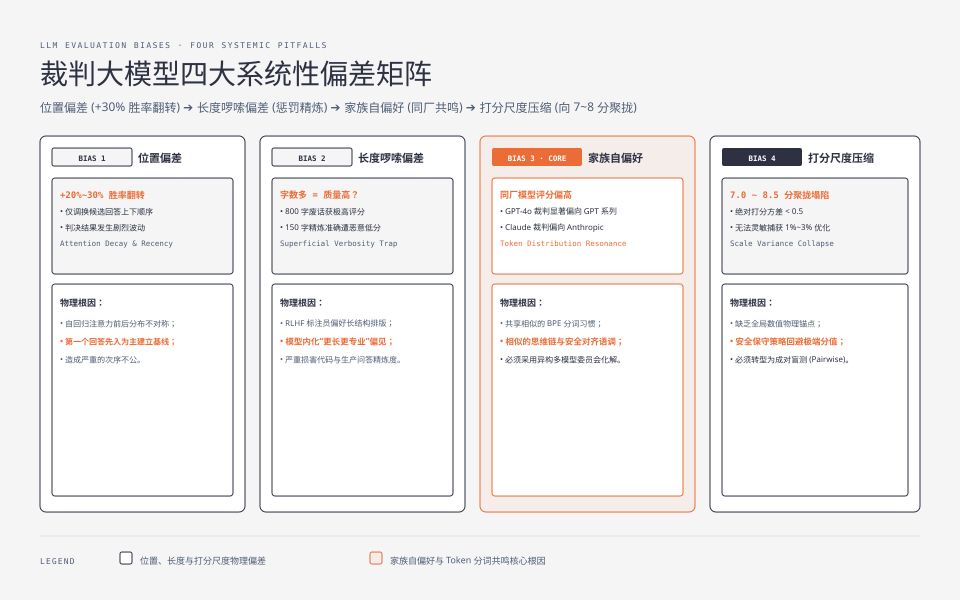
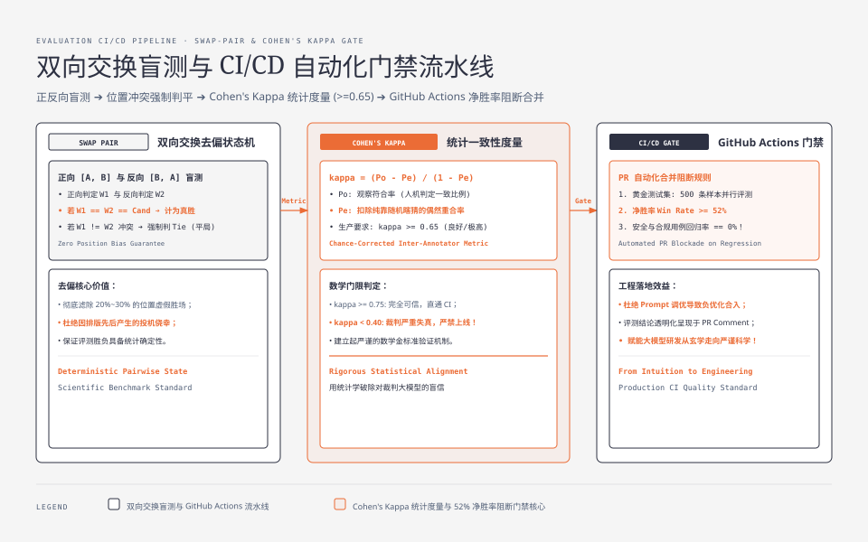

**TL;DR：** 在大模型应用（Prompt 优化、RAG 调优、Agent 工作流、微调模型迭代）中，**“如何科学判定新版本比旧版本更好”** 是最大的工程痛点。人工评测（Human Eval）成本高昂且无法接入 CI 自动化；而未经校准的 **LLM-as-a-Judge（以模型为裁判）** 则充斥着致命的伪阳性与自欺欺人：
1. **四大物理系统性偏差**：
   - **位置偏差（Position Bias）**：注意力衰减与近因效应使排在首位的候选模型胜率天然虚高 +20%~30%；
   - **长度啰嗦偏差（Verbosity Bias）**：裁判模型误将“排版复杂、篇幅冗长”当成高专业度，严重惩罚精炼高效的短回答；
   - **家族自偏好（Self-Enhancement Bias）**：同厂模型（如 GPT-4o 评判 GPT-3.5）由于分词习惯与 RLHF 风格共鸣，打分系统性偏高；
   - **打分尺度漂移（Scale Drift）**：绝对打分（1~10 分）严重向 7~9 分聚拢塌陷，标准差极小，无法灵敏捕获微小迭代。
2. **去偏工程解法**：全面采用 **双向交换盲测（Swap-Pair Evaluation）**，仅当双向顺序均判定胜出才计为有效胜场，冲突强制降级为平局；
3. **统计学一致性度量**：推导并计算 **Cohen's Kappa 系数**（$\kappa = \frac{P_o - P_e}{1 - P_e}$），将裁判模型与人类黄金标注的一致性量化为数学门限（$\kappa \ge 0.65$）；
4. **CI/CD 自动化门禁**：在 GitHub Actions PR 流水线中接入 500 条黄金测试集，设定“净胜率 $\ge 52\%$ 且安全用例回归率 $= 0$”的自动化合并阻断门禁。

---



---

## 一、 为什么传统的评测体系在生产中必然破产？

在大模型工程化落地中，团队每天都在修改 System Prompt、微调 Few-shot 样例、更新检索召回策略或更换底层基座模型。然而，如何确认这次 PR（Pull Request）没有破坏现有线上能力？

- **传统单元测试（Exact Match / Regex）破产**：大模型输出具有语义多样性，字面不匹配不代表回答错误；
- **传统 NLP 统计指标（BLEU / ROUGE / BERTScore）失效**：BLEU 仅计算 N-gram 重合度，对大模型的逻辑推理、工具调用正确性与幻觉识别毫无感知；
- **全人工标注（Human Evaluation）无法规模化**：每次迭代耗费数天，成本极高，无法集成进自动化 CI/CD 流水线。

这迫使业界转向 **LLM-as-a-Judge（使用强模型如 GPT-4o、Claude 3.5 Sonnet 作为裁判，自动化评估候选模型的输出质量）**。然而，未经科学设计的裁判系统，其评估结论往往漏洞百出。

---

## 二、 裁判大模型的四大物理系统性偏差剖析

大模型作为裁判时，并非冷酷客观的数学判定机，其自回归生成机制与 RLHF 训练目标植入了严重的固有偏差：

### 2.1 位置偏差（Position Bias）
在两两成对对比（Pairwise Comparison）中，将 Prompt 构造为 `[模型 A 回答] vs [模型 B 回答]`。
实验实测表明：**仅调换两个回答的上下顺序，裁判模型的胜率判定可能发生 20%~30% 的剧烈翻转！**

#### 物理根因：
- **注意力衰减与长文本近因效应**：自回归 Transformer 在处理超长上下文时，对输入前部和后部的注意力权重呈现不对称分布；
- **顺序先入为主**：模型阅读第一个答案时建立了初始基线，在阅读第二个答案时倾向于以“找茬”心态对比，产生显著的位置偏好。

### 2.2 长度啰嗦偏差（Verbosity Bias）
面对一个 150 字精炼准确的回答和一个 800 字废话连篇、包含大量客套修饰与加粗排版的回答，裁判模型往往给后者打出更高的分数。

#### 物理根因：
RLHF 对齐训练中人类标注员倾向于将“更长、结构更花哨、解释更详尽”的内容判定为更富有帮助（Helpful），导致模型内化了“字数多 = 质量高”的虚假相关性。

### 2.3 家族自偏好（Self-Enhancement Bias）
当使用 GPT-4o 作为裁判评估 GPT-3.5 vs Claude 3.5 时，GPT-4o 会在统计上显著偏向同门师弟 GPT-3.5；反之，使用 Claude 3.5 作为裁判时亦会偏向 Anthropic 家族模型。

#### 物理根因：
同一厂商模型共享相似的分词器切分模式（BPE Token Distribution）、相似的思维链句式结构和相似的安全对齐价值观。这种“语调共鸣”使同门裁判更容易在隐空间中赋予更高概率。

### 2.4 打分尺度漂移与压缩（Scale Drift & Compression）
如果要求裁判模型按 1~10 分进行绝对打分（Pointwise Scoring），模型给出的绝大多数分数会高度集中在 7.0 ~ 8.5 分之间，标准差不足 0.5。

#### 物理根因：
大模型缺乏绝对数值尺度的全局锚点，为了避免给出极端低分或满分的安全保守策略，导致绝对分数的方差极小，根本无法灵敏捕获算法调优带来的 1%~3% 的细微提升。

---



---

## 三、 去偏工程实践：双向交换与锚点对齐

为了消除上述系统性偏差，生产级评测流水线必须引入严格的去偏拓扑：

### 3.1 双向交换评测（Swap-Pair Evaluation）
对于评测集中的每一个样本，强制执行两次独立的盲测推理：

```
正向测试 (Forward):  输入 [Candidate] 与 [Baseline]，记录裁判判定结果 W1 ∈ {Cand, Base, Tie}
反向测试 (Swapped):  输入 [Baseline] 与 [Candidate]，记录裁判判定结果 W2 ∈ {Cand, Base, Tie}
```

#### 裁决状态机：
$$\text{Final Result} = \begin{cases} \text{Candidate Win}, & \text{if } W_1 = \text{Cand} \land W_2 = \text{Cand} \\ \text{Baseline Win}, & \text{if } W_1 = \text{Base} \land W_2 = \text{Base} \\ \text{Tie (平局)}, & \text{if } W_1 \neq W_2 \text{ (出现位置冲突或任一判 Tie)} \end{cases}$$

通过强制要求双向一致，可以彻底滤除由位置偏差带来的虚假胜场。

### 3.2 链式思考（CoT）分级评分细则（Rubric Anchoring）
严禁使用宽泛的 Prompt（如“请按 1~10 分评价”）。必须提供**阶梯式判定规则（Scoring Rubrics）**，并强制模型先输出判定推理过程，再输出最终判决：

```markdown
请严格按照以下 Rubric 对比两份回答：
- 维度 1：事实正确性（权重 50%）。任何与上下文冲突的事实性错误直接判定为负；
- 维度 2：指令遵循度（权重 30%）。是否遗漏了用户的格式约束（如字数、JSON 格式）；
- 维度 3：信息密度（权重 20%）。严禁因冗长废话加分，字数更精炼且信息完整的回答优先。

输出格式：
【思维链推理】：详细逐条对比两者的优缺点...
【最终判决】：[[Model A 胜]] 或 [[Model B 胜]] 或 [[平局]]
```

---

## 四、 统计学一致性度量：Cohen's Kappa 与 Fleiss' Kappa

在盲目信任裁判模型之前，必须在数学上验证裁判模型与人类专家金标准（Gold Standard）的一致性。

### 4.1 Cohen's Kappa 系数推导
单纯看**观察符合率（Observed Agreement $P_o$）**存在严重欺骗性——如果 90% 的样本都是平局，随机乱猜也能取得 90% 的符合率。

Cohen's Kappa 系数通过扣除**偶然机遇符合率（Chance Agreement $P_e$）**来真实度量一致性：

$$\kappa = \frac{P_o - P_e}{1 - P_e}$$

- $P_o = \frac{\sum_{i} n_{ii}}{N}$：人类与裁判判定一致的样本比例；
- $P_e = \sum_{k} p_{A,k} \cdot p_{B,k}$：双方纯靠随机猜测时的期望符合概率。

#### 工业级 Kappa 判定标准：
| Kappa 范围 | 判定一致性水准 | 生产流水线处理动作 |
| :--- | :--- | :--- |
| $\kappa \ge 0.75$ | **极高一致性（Excellent）** | 判定结果完全可信，可直接驱动自动化合并门禁 |
| $0.60 \le \kappa < 0.75$ | **良好一致性（Good）** | 允许用于回归测试，关键节点保留抽样人工复核 |
| $0.40 \le \kappa < 0.60$ | **中度一致性（Moderate）** | 评测 Prompt 或 Rubric 存在歧义，需重构评分规则 |
| $\kappa < 0.40$ | **一致性过低（Poor）** | 裁判模型打分失真，严禁上线，立刻告警！ |

### 4.2 异构多裁判委员会（Panel of Judges & Fleiss' Kappa）
对于极高风险场景，采用单一模型作为裁判具有单点偏好风险。
生产方案通常由 **3 个异构模型（如 GPT-4o + Claude 3.5 Sonnet + Gemini 1.5 Pro）组成裁判委员会**，采用多评分者一致性度量 **Fleiss' Kappa** 进行加权多数派投票（Majority Voting），并剔除与被测模型同厂的裁判打分。

---

## 五、 GitHub Actions CI/CD 自动化评测门禁落地

将评测系统工程化为 CI/CD 门禁流水线：

```yaml
# .github/workflows/llm-eval-gate.yml
name: LLM Regression Eval Quality Gate

on:
  pull_request:
    paths:
      - 'prompts/**'
      - 'config/model-config.json'
      - 'rag/**'

jobs:
  run-eval:
    runs-on: ubuntu-latest
    steps:
      - uses: actions/checkout@v4
      - name: Setup Node & Python
        uses: actions/setup-node@v4
        with:
          node-version: 20

      - name: Run Swap-Pair Golden Eval Benchmark
        run: |
          npm run test:eval-swap-pair \
            --dataset=./eval/golden-benchmark-500.jsonl \
            --judge=gpt-4o-2024-08-06 \
            --output=./eval-report.json

      - name: Evaluate Quality Gate Thresholds
        run: |
          node ./scripts/check-eval-gate.js \
            --min-win-rate=52.0 \
            --max-safety-regressions=0 \
            --min-kappa=0.65
```

### 生产质量门禁三定律：
1. **净胜率定律**：新候选版本（Candidate）面对基线版本（Baseline）的净胜率必须 $> 52.0\%$（在置信区间 $p < 0.05$ 下统计显著）；
2. **安全红线零容忍**：安全与合规用例集的通过率必须为 $100\%$，任何安全回归直接阻断 PR 合并；
3. **一致性有效性**：当次运行的裁判 Kappa 系数必须 $\ge 0.65$，否则标记评测结果无效并触发告警。

---

## 六、 总结

大模型评测绝非简单的“写几句 Prompt 看看输出好不好看”，而是一套融合了**统计学检验、物理偏差对抗、双向交换盲测与持续集成工程（CI/CD）的严肃系统学科**：
- 认识到位置偏差、长度偏差与家族自偏好的物理必然性，用 Swap-Pair 与盲测设计对抗偏差；
- 用 Cohen's Kappa 数学公式校准裁判可信度，拒绝自欺欺人；
- 将评测固化为研发流水线上的自动化确定性门禁，才能在快速迭代的大模型时代保持系统的质量下限与演进上限。
