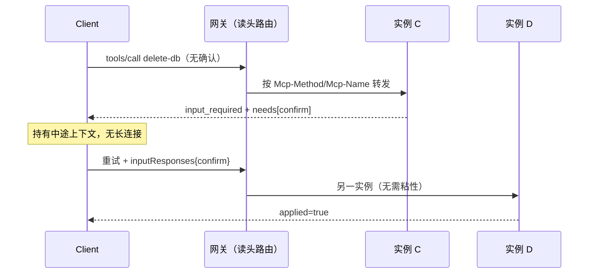

**TL;DR：** [MCP 2026-07-28](https://blog.modelcontextprotocol.io/posts/2026-07-28/)（2026-09-13 核对）把协议级会话删了：不再有 `initialize`/`initialized` 握手和 `Mcp-Session-Id`，每个请求自带协议版本、客户端身份与能力，任何实例都能处理，普通 round-robin 负载均衡即可。应用状态没有消失，而是显式化了——短多轮走 MRTR（服务端回 `input_required`，客户端带答案重试），长任务走 `io.modelcontextprotocol/tasks` 扩展轮询。迁移时必改三处：依赖 session 的网关粘性、服务端主动下发的 elicitation/sampling、匹配 `-32002` 的错误处理。下面 7 个本地断言全部通过，但它们只证明教学原型的控制流，不证明真实 SDK 与生产网关。

本文是 [MCP 架构剖析](/writing/llm-07-model-context-protocol-mcp) 的续篇。前文第五节的三步握手状态机和第六节的网关是旧版合同；本文只回答一个新问题：**删掉握手和 session 之后，重试、多轮和网关路由的语义由谁承担？**

## 一、先看完整路径：一个请求在新版里走完什么

```text
client 自描述请求（版本头 + 方法头 + _meta 身份）
  → 网关只读 Mcp-Method / Mcp-Name 头路由（不解析 body）
  → 任一实例处理（无 session 存储可查）
  → 需要用户输入？回 input_required + needs 清单
  → client 带 inputResponses 重试（可落在另一实例）
  → 长任务？转 tasks 扩展轮询 tasks/get
  → tools/list 带 ttlMs，client 缓存复用
```

和旧版的唯一差别在前两步：旧版请求必须先 `initialize` 拿到 `Mcp-Session-Id`，之后每个请求都要落到“认识这个 session”的实例上；新版这两步不存在了。`server/discover` 仍然可以按需查询能力，但它是可选项，不是前置条件。

## 二、新版合同：保证什么、不保证什么、调用者还欠什么

| 维度 | 保证 | 不保证 | 调用者仍负责 |
| --- | --- | --- | --- |
| 路由 | 任意实例可处理任意请求，无需共享 session 存储 | 请求自动落到“有上下文”的实例（已没有这种实例） | 网关按 `Mcp-Method`/`Mcp-Name` 填路由表，旧粘性规则下线 |
| 能力发现 | `server/discover` 可选查询；list 结果顺序确定、可缓存 | client 永远拿到最新全量（缓存期内是快照） | 按 `ttlMs`/`cacheScope` 实现缓存与失效 |
| 多轮输入 | MRTR：服务端以 `input_required` 声明需要什么 | 服务端主动向 client 提问（旧 elicitation/sampling 流已改道） | client 保存中途上下文并发起重试 |
| 长任务 | Tasks 扩展提供 `tasks/get` 轮询与 `tasks/update` | 任务跨实例自动续跑（状态仍需服务端自己持久化） | 任务状态存储与超时/取消语义 |
| 鉴权 | issuer 校验（RFC 9207）、凭证与颁发者绑定、主推 CIMD | 老 DCR 客户端永远可用（已正式 deprecate，至少 12 个月窗口） | 升级授权服务与客户端注册方式 |
| 应用状态 | 不再藏进传输层 | 无状态的 server 自动有业务连续性 | 需要跨调用状态时，自己发显式 handle 让模型回传 |

关键的一句官方建议值得单独记住：如果 server 需要跨调用带状态，应该从 tool 里 mint 一个显式 handle，让模型把它当参数传回来——**模型看得见的 handle，比藏在传输层看不见的 session 更可靠。**

## 三、旧版为什么一定要粘性：一个失败断言

旧版实例各持一张 session 表。client 在实例 A 上 `initialize` 拿到 `sid-1`，当负载均衡把下一个 `tools/call`（带 `sid-1`）送到实例 B 时，B 不认识这个 session，只能回 `-32002`。对照组证明协议本身没坏：同一个请求发回 A 就成功。

```text
PASS A1 旧版跨实例无粘性被拒绝 | code=-32002 sid=sid-1
PASS A2 旧版同实例调用成功 | {"content":[{"type":"text","text":"ok"}]}
```

这就是旧版网关必须做 sticky session 或共享 session 存储的根因：**状态放在传输层，路由就被状态绑架。**

## 四、新版验证：轮询、头路由、缓存、跨实例重试

原型是两个新版实例 C、D，内存里没有任何会话表（源码见 `experiments/mcp-stateless/demo.mjs`，`node experiments/mcp-stateless/demo.mjs` 可重跑，原始输出见 `evidence/mcp-stateless-core/2026-09-13-local/run.out`）。

```text
PASS B1 新版任意实例可处理 | C=C D=D
PASS B2 头路由无需解析 body
PASS B3 list 可缓存且顺序确定 | tools=delete-db,search ttlMs=60000 fetches=1
PASS B4 MRTR 跨实例重试完成 | first=input_required retry={"handledBy":"D","applied":true}
PASS B5 未知方法返回标准 -32602 | code=-32602
```

逐个解释：

1. **B1**：同一个自描述请求分别打到 C 和 D，都成功且 `handledBy` 不同。网关从此可以是普通 HTTP 负载均衡，这是 Cloudflare、AWS、Google 在发布评论里共同强调的一点：MCP server 变成了“一等 HTTP 工作负载”。
2. **B2**：网关路由函数只读请求头里的 `Mcp-Method`/`Mcp-Name`（如 `tools/call` + `delete-db` 进 danger-queue），限流与 WAF 同理，不必解析 JSON body。
3. **B3**：`tools/list` 返回确定性顺序的工具表和缓存提示，client 第二次命中本地缓存，零请求。注意 `ttlMs=60000` 是本原型的教学参数，规范只规定携带 `ttlMs`/`cacheScope`，具体值由 server 定。确定性顺序的真正受益者是上游 prompt cache：工具目录不再因重连抖动导致 KV cache 失效。
4. **B4**：敏感工具 `delete-db` 首次调用不带确认，C 直接返回 `resultType: "input_required"` 并声明需要 `confirm`，全程没有保持任何长连接；client 带 `inputResponses: {confirm: "yes"}` 重试，**落在另一个实例 D 上依然成功**。中途上下文由 client 持有，这是 MRTR 与旧版“服务端 hold 住流等答案”的本质区别。
5. **B5**：未知方法返回标准 JSON-RPC `-32602`。旧 `-32002` 不再是协议错误——凡是按 `-32002` 做 `match` 的网关与重试代码，升级后会静默误判，这是迁移清单第一项。



## 五、迁移清单：三处必改，两处可缓

**必改：**

1. **错误码匹配**：`-32002` → `-32602`。搜全仓的 `-32002`，包括网关、重试中间件和可观测性告警规则。
2. **服务端主动请求**：`elicitation/create`、`sampling/createMessage`、`roots/list` 改走 MRTR 模式——服务端返回需要什么，client 重试时带上。Supabase 在发布评论里确认的正是这个场景：以前无状态 server 做不了“删库前向用户确认”，MRTR 之后可以了。
3. **网关粘性**：下线按 `Mcp-Session-Id` 的 sticky 规则与共享 session 存储，换成按 `Mcp-Method`/`Mcp-Name` 的头路由。传输无状态不等于业务无状态：仍需多轮上下文的，自己发显式 handle。

**可缓（12 个月 deprecation 窗口内）：** Roots、Sampling、Logging 照常工作但不建议新实现采用；旧 HTTP+SSE 传输同样进入一年 offramp；DCR 继续兼容，但新客户端应走 CIMD。

## 六、证据卡与边界

| 字段 | 内容 |
| --- | --- |
| 问题 | 无状态核心是否真能去掉网关粘性，且多轮不丢语义？ |
| 环境 | Darwin arm64，Node v24.19.0，零依赖（`node:http`），见 `evidence/mcp-stateless-core/2026-09-13-local/environment.txt` |
| 输入 | 双实例旧版/新版各一对，7 个断言，单次运行（确定性逻辑，无随机） |
| 控制变量 | 同一调用分别走同实例/跨实例、旧协议/新协议，只有“状态放在哪”一个变量 |
| 原始输出 | `evidence/mcp-stateless-core/2026-09-13-local/run.out`（7 PASS） |
| 支持结论 | 传输会话是粘性的唯一根因；自描述请求 + 头路由 + MRTR 重试在控制流层面成立 |
| 不支持结论 | 真实 Tier-1 SDK（TS/Python/Go/C#）的迁移成本、多机部署、TLS/鉴权网关、百万级工具目录的缓存收益、供应商兼容性 |

版本事实核对日期均为 2026-09-13，来自一手来源（见参考资料）。`ttlMs` 取值、确认文案与实例名均为原型教学参数，不是规范 mandated 值。

## 七、结论：传输无状态，状态显式化

回到开头的问题：删掉握手和 session 之后，多轮请求去哪了？答案是**回到了看得见的地方**——短多轮由 client 持有上下文并发起 MRTR 重试，长任务由 Tasks 扩展显式轮询，业务连续性由 tool 颁发的 handle 显式传递。网关第一次可以把 MCP 当成普通 HTTP 对待：按头路由、按头限流、缓存 list。

行动清单只有三行：搜 `-32002`，搜 `Mcp-Session-Id`，搜服务端主动下发（elicitation/sampling）。这三处清零，升级就完成了大半；剩下的 DCR→CIMD 与旧传输下线，可以在 12 个月窗口里从容处理。

## 参考资料

- Model Context Protocol 官方博客：The 2026-07-28 Specification，<https://blog.modelcontextprotocol.io/posts/2026-07-28/>（2026-07-28 发布，2026-09-13 核对）
- MCP 2026-07-28 完整 changelog，<https://modelcontextprotocol.io/specification/2026-07-28/changelog>（2026-09-13 核对；SEP-2575/2567 删握手、SEP-2322 MRTR、SEP-2243 头路由、SEP-2549 list 缓存、SEP-2663 Tasks、SEP-2577 deprecations）
- MCP 2026-07-28 规范正文，<https://modelcontextprotocol.io/specification/2026-07-28>
- 前篇：Model Context Protocol (MCP) 深度剖析，`/writing/llm-07-model-context-protocol-mcp`（旧版三步握手与网关上下文）
- 协议选型上下文：AI Agent 协议栈，`/writing/ai-agent-protocol-stack`
