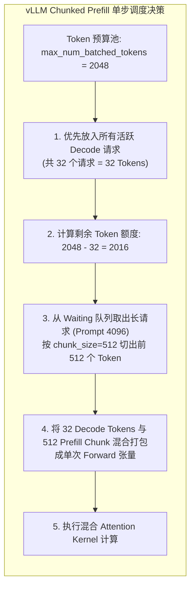
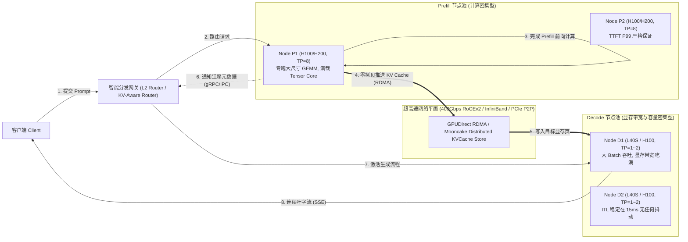
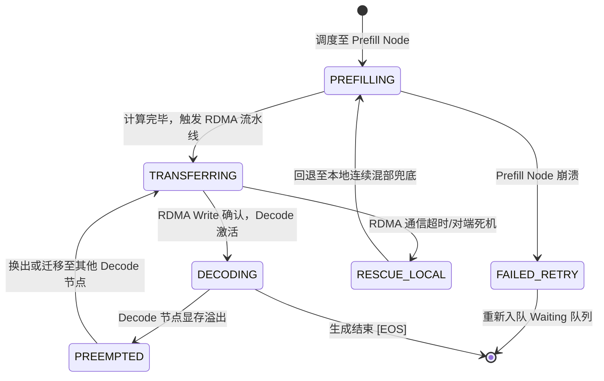

**TL;DR：** 连续批处理（Continuous Batching）虽然消除了填充气泡，但掩盖了一个硬件第一性原理的致命断层：**Prefill 是计算受限型（Compute-Bound，GEMM 算力利用率高达 45%+），而 Decode 是显存带宽受限型（Memory-Bandwidth-Bound，GEMV 算力利用率往往不足 5%）**。将两者混部在同一张 GPU 上，一个 4K 的 Prompt 预填充会强行抢占 Tensor Core 长达 160ms 以上，造成正在吐字（Decode）的所有请求遭遇严重的首字阻塞与生成卡顿（ITL 飙升 10 倍）。工程界给出了两条救赎路径：**Chunked Prefill** 将长 Prompt 沿时间轴切分成固定大小（如 512 Tokens）的分块，与 Decode 批次均匀混部，将 ITL 毛刺从 177ms 压至 35ms 左右（以 70B 模型在 8 卡 H100 为例）；而彻底根治该物理冲突的终极方案则是 **PD 分离（Prefill-Decode Disaggregation）**——将计算集群在物理上解耦为 Prefill 专用池与 Decode 专用池，通过 400Gbps RDMA（如 RoCEv2/InfiniBand）实现跨卡/跨节点的 KV Cache 零拷贝直传（GPUDirect RDMA）。本文基于数学 Roofline 模型、跨卡传输协议与调度状态机，全面拆解从单机时间分片到集群空间解耦的系统设计边界。

---

## 一、 物理断层：为什么连续批处理依然解决不了 ITL 抖动？

在探讨架构演进前，我们必须回到 GPU 硬件微架构的第一性原理。大模型推理生命周期被明确切分为两个阶段，它们在 GPU 资源消耗上的画像截然相反。

```text
客户端请求到达
  → [阶段一：Prefill] 并行处理整个 Prompt，计算密集型（GEMM），填充初态 KV Cache
  → [中间态：全量 KV Cache 就绪] 内存规模随 Prompt 长度线性膨胀
  → [阶段二：Decode] 自回归单步生成，访存密集型（GEMV），逐 Token 读写 KV Cache
  → 生成 [EOS] 结束并释放资源
```

### 1.1 Roofline 模型下的算力与带宽冲突

根据计算密集度（Operational Intensity，定义为每字节内存传输所执行的浮点运算次数 $\text{FLOPs/Byte}$），GPU 的吞吐上限受限于两条渐近线：

$$\text{Attainable Performance} = \min(\text{Peak FLOPs}, \text{Memory Bandwidth} \times \text{Operational Intensity})$$

以一台配备 8 张 NVIDIA H100 SXM（每张卡具有 3.35 TB/s HBM3 显存带宽、989 TFLOPs 的 16 位张量核心算力）的节点为例：

| 推理阶段 | 算子类型 | 计算密集度（FLOPs/Byte） | 硬件瓶颈 | GPU 利用率（MFU） | 物理特征 |
| :--- | :--- | :--- | :--- | :--- | :--- |
| **Prefill（预填充）** | GEMM（矩阵乘矩阵） | 随 Prompt 长度 $L$ 线性增长，可达 $100 \sim 300+$ | **算力受限（Compute-Bound）** | 高（通常在 40% ~ 50%） | 吞吐高、张量核心跑满、单步延迟高（上百毫秒） |
| **Decode（自回归）** | GEMV（矩阵乘向量） | 极低（接近于 1，每读入 2 字节权重仅执行 2 次浮点运算） | **显存带宽受限（Memory-Bound）** | 极低（通常仅 2% ~ 8%） | 算力空转、HBM 带宽跑满、单步延迟极低（10 ~ 20ms） |

在同系列 [大模型吞吐翻倍引擎：从静态批处理到连续批处理](/writing/llm-02-continuous-batching-scheduler) 中，我们通过三队列调度器解决了请求生命周期不同步导致的静态填充（Padding）浪费。然而，**调度器可以在逻辑上打包 Tensor，却无法消除底层的物理冲突**。

### 1.2 混部调度中的“车祸现场”：行首阻塞（Head-of-Line Blocking）

假设系统当前有 32 个在途的并发会话正在以 15ms/step 的平稳速率自回归吐字。此时，网关突然接入一个携带 4096 Tokens 提示词的长文本问答请求。

如果调度器采用非分块的传统混部机制（Monolithic Prefill）：
1. 调度器为了保证该长请求的 TTFT（Time-To-First-Token），必须立即执行其预填充。
2. 4096 个 Tokens 进入 8x H100 构成的 70B 模型张量并行组（TP=8）。根据标准浮点运算公式：
   $$\text{Total FLOPs} = 4096 \times 2 \times 70.6 \times 10^9 \approx 5.78 \times 10^{14} \text{ FLOPs} = 578.3 \text{ TFLOPs}$$
   在 8 卡 H100 的有效算力（峰值 $8 \times 989 \text{ TFLOPS} \times 45\% \text{ MFU} \approx 3560 \text{ TFLOPS}$）下，执行一次完整的 Prefill 前向传播耗时约为：
   $$T_{\text{prefill}} \approx \frac{578.3 \times 10^{12}}{3560 \times 10^{12}} \approx 162.4 \text{ ms}$$
3. **灾难发生**：在这 162.4ms 的整块执行时间内，GPU 的张量核心被这个单一大请求彻底独占。另外 32 个正在吐字的 Decode 会话无法插入单步 forward，其单步生成延迟（ITL，Inter-Token Latency）瞬间从 15ms 暴涨到：
   $$\text{ITL}_{\max} = 15 \text{ ms} + 162.4 \text{ ms} = 177.4 \text{ ms}$$
   抖动幅度超过 **10 倍**！对于前端用户而言，原本如打字机般丝滑流出的文本，突然出现长达 200ms 的明显卡顿（Streaming Jitter）。

这就是混部模式无法回避的**帕累托死结**：
- 要保 Decode 的平稳 ITL，就必须推迟 Prefill，导致 **TTFT P99 严重超标**；
- 要保新请求的 TTFT，就必须强行插队执行 Prefill，导致在途请求的 **ITL P99 发生雪崩**。

---

## 二、 方案一：Chunked Prefill（细粒度时间切片调度）

要平抑长 Prefill 带来的断崖式毛刺，最直接的思路就是借鉴现代操作系统的**时间片轮转（Preemption & Time-Slicing）**思想。由 Sarathi-Serve 提出并被 vLLM、SGLang 广泛采纳的 **Chunked Prefill（分块预填充）** 技术应运而生。

### 2.1 机制：Token 预算配平与混编打包

Chunked Prefill 的核心合同是：**规定每个调度 Iteration 中处理的总 Token 数上限（`max_num_batched_tokens`），长 Prompt 必须分块切分，禁止跨步独占。**



如上图所示，当一个 4096 Tokens 的长请求到达时：
- 调度器不尝试在单步内算完 4096 Tokens，而是将其切分为 8 个步长为 512 的分块（Chunks）；
- 在每个 Iteration 内，调度器将 32 个 Decode 请求的 32 个 Token 与该长请求的 1 个 512 Token 分块混合打包；
- 此时单步计算耗时为：
  $$T_{\text{chunk\_compute}} \approx \frac{162.4 \text{ ms}}{8} \approx 20.3 \text{ ms}$$
  结合 Decode 本身的 15ms，混合步的总耗时仅为 $15 + 20.3 \approx 35.3 \text{ ms}$；
- **原本 177.4ms 的断崖式 ITL 尖刺被直接削平为 35.3ms，抖动降幅达 4.5 倍以上**（实验数据见文末 `experiments/llm-chunked-pd/sim.py`）。

### 2.2 隐藏的中间层：PagedAttention 的增量 KV Block 与 Mixed-Sequence 算子

很多工程师误以为 Chunked Prefill 仅仅是一个 Python 调度器层面的 `tokens[:512]` 切片逻辑，但实际上它对底层算子提出了严苛的要求：

1. **增量 KV Cache 分配**：
   在第一个 Chunk（0 ~ 511）计算完毕后，其生成的 Key/Value 状态必须立刻被写入 PagedAttention 的物理 Block 表中，但该请求**不能退役**，其上下文长度更新为 512，状态仍停留在 `RUNNING_PREFILL` 阶段。
2. **因果掩码（Causal Mask）与历史 Attention 检索**：
   当计算第 2 个 Chunk（512 ~ 1023）时，这 512 个新 Token 不仅要对自身执行 Causal Self-Attention，**还必须对前一个 Chunk 已经持久化在物理 Block 中的 512 个历史 Key/Value 执行 Cross-Attention**！
3. **混合序列注意力算子（FlashAttention-with-Paged-KV）**：
   底层的 CUDA Kernel 必须在同一个 Batch 张量内同时处理两类截然不同的注意力计算：
   - 处于 Decode 状态的序列（Query 长度为 1，KV 历史长度为 $N$）；
   - 处于 Chunked Prefill 状态的序列（Query 长度为 512，KV 历史长度为 $M$）。
   这要求算子支持连续张量变长输入（Ragged Batching）与非连续物理块的间接寻址，否则必须引入额外的内存搬运与 Padding。

### 2.3 Chunked Prefill 的代偿与局限

Chunked Prefill 并非没有代价，它本质上是用 **Prefill 的吞吐惩罚** 来换取 **Decode 的延迟平稳**：

- **Prefill 总耗时劣化（TTFT 上涨）**：由于小 GEMM 的算力饱和度显著低于大 GEMM（计算 512 的矩阵乘法，张量核心利用率远低于计算 4096），加上每一步都要反复加载历史分块的 KV Cache，一个 4096 的请求被拆解为 8 次调度后，总预填充时间通常会增加 15% ~ 30%。
- **硬件本质冲突依旧存在**：尽管单步尖刺被拉平，但每个 step 依然强行让计算密集型的 Prefill 算子和访存密集型的 Decode 算子在同一组 SM（Streaming Multiprocessor）上抢占资源。只要长请求并发增多，Token 预算被占满，Decode 依然会产生渐进式的延迟漂移。

---

## 三、 方案二：PD 分离（Prefill-Decode Disaggregation）集群架构

为了从根本上解耦这一对物理矛盾，业界的头部系统（包括 DistServe、Mooncake、以及 vLLM v1 的 Disaggregated Serving 模块）走向了物理空间解耦路线：**Prefill 与 Decode 彻底分家，运行在物理隔离的不同 GPU 节点上。**



### 3.1 物理集群的专业化定制

PD 分离带来的第一个架构红利，就是**硬件选型与并行策略的独立最优化**：

1. **Prefill 节点配置**：
   - 目标：极低 TTFT，追求峰值 TFLOPs。
   - 策略：选用具备高张量算力的 GPU（如 H100/H200），采用较高的张量并行度（Tensor Parallelism，如 TP=4 或 TP=8），将单次 Prefill 延时压缩到极限。
2. **Decode 节点配置**：
   - 目标：极低 ITL、高单卡并发会话数（Batch Size），追求显存带宽与显存容量。
   - 策略：采用较低的 TP（例如 TP=1 或 TP=2，减少跨卡 All-Reduce 通信开销），甚至可以使用单卡显存大但算力相对较低的性价比硬件（如 L40S 48GB），专注于以超大 Batch Size 饱和读取 HBM。

### 3.2 隐藏的物理瓶颈：KV Cache 跨节点传输的“生死时速”

PD 分离看似优美，但它引入了一个**最危险的隐藏中间层：KV Cache 跨节点网络传输。**

在传统单机架构中，Prefill 算出的 KV Cache 原生留在当前 GPU 显存里，Decode 直接读取；但在 PD 分离架构中，Prefill 节点算完之后，必须将几百兆乃至数吉字节（GB）的张量数据通过网络搬运到 Decode 节点的显存中。

#### 严密推导：传输耗时是否会抹平架构收益？

我们以典型的 Llama-3-70B（80 层 Transformer，GQA 机制下具有 8 个 KV 头，每个头维度 128，采用 16 位浮点数 BF16）为例进行精确核算：

每个 Token 占用的物理显存量为：
$$\text{Bytes/Token} = 2 \times \text{layers} \times \text{num\_kv\_heads} \times \text{head\_dim} \times \text{bytes\_per\_elem}$$
$$\text{Bytes/Token} = 2 \times 80 \times 8 \times 128 \times 2 = 327,680 \text{ 字节} = 320 \text{ KB/token}$$

对于不同 Prompt 长度的 KV Cache 总量与不同网络拓扑下的单向传输时延（有效线速按 92% 估算）：

| 上下文长度（Tokens） | 单请求 KV Cache 尺寸 | 100 Gbps 以太网传输耗时（约 11.5 GB/s） | 400 Gbps RoCEv2 传输耗时（约 46.0 GB/s） | PCIe Gen5 P2P / NVLink（约 60~400 GB/s） | 8x H100 Prefill 计算耗时 |
| :--- | :--- | :--- | :--- | :--- | :--- |
| **1024 (1K)** | 320 MB (0.31 GB) | 27.2 ms | **6.8 ms** | < 2 ms | 40.6 ms |
| **4096 (4K)** | 1280 MB (1.25 GB) | 108.7 ms | **27.2 ms** | < 5 ms | 162.4 ms |
| **8192 (8K)** | 2560 MB (2.50 GB) | 217.4 ms | **54.3 ms** | < 10 ms | 324.8 ms |

#### 结论判决线：
1. **在 100 Gbps 慢速网络下，PD 分离几乎是负优化**：
   对于 4K 请求，网络传输耗时（108.7ms）占据了 Prefill 计算时间（162.4ms）的 **66.9%**！网络搬运消耗的时间，几乎抹平了调度解耦带来的全部收益。
2. **在 400 Gbps RoCEv2 / InfiniBand 下，PD 分离具备极高工程价值**：
   传输耗时压缩至 27.2ms，仅占计算耗时的 **16.7%**。更关键的是，通过下述的**流式流水线（Streaming Pipelined Transfer）**，这 27.2ms 的网络开销可以在计算过程中被完全掩盖！

---

## 四、 跨节点传输深水区：流水线掩盖与 Mooncake 架构实践

为了不让网络成为新的木桶短板，现代推理架构采用了三项关键的底层工程机制：

### 4.1 按 Layer / Chunk 流式切片与传输交叠（Compute-Transfer Overlapping）

Prefill 不需要等待整整 80 层全部计算完成才触发网络发送！
- 当 Prefill 节点完成第 1 层的 Forward 计算时，该层的 KV Cache 就已经确定且不再变更；
- 此时后台线程立即触发 GPUDirect RDMA，将第 1 层的 KV 数据异步推送到 Decode 节点的对应显存 Buffer；
- 当计算推进到第 80 层时，前 70 层的 KV Cache 实际上已经在高速网络线上甚至已经写入目标 Decode 节点的 HBM。
- 只要单层的网络传输时间小于下一层的计算时间，**跨节点传输的网络开销在整体 TTFT 视角下被 100% 掩盖（Zero Overhead Exposure）**。

### 4.2 显存指针映射与零拷贝接收：GPUDirect RDMA

在传统的网络通信中，GPU 数据需先经过 `cudaMemcpy` 拷贝至 Host CPU 内存，由操作系统内核打包经过 TCP/IP 协议栈发送，接收端反向经历相同路径，带来巨大的内存拷贝开销和 CPU 软中断争用。

而在生产级 PD 分离实现中：
- Prefill 节点的 GPU 物理显存地址通过 `ibv_reg_mr` 直接注册至 RDMA 网卡（NIC）；
- Decode 节点预先分配好 PagedAttention 的物理槽位，将物理页地址直接下发给 Prefill 节点的通信客户端；
- 网卡直接通过 PCIe 总线拉取 GPU 显存，通过 RoCEv2 单边操作（`RDMA Write`）直接写入对端 GPU 的物理 Block 显存；
- **CPU 全程不参与数据搬运，仅在完成时通过 Completion Queue（CQE）接收轻量中断通知。**

### 4.3 容错与裂脑恢复机制（Failure Semantics）

分布式解耦必然引入系统故障状态空间。当请求经历 `Prefill Node -> RDMA -> Decode Node` 时，若发生节点宕机，系统的状态机合同如何保证？



1. **传输超时与本地回退（Fallback）**：
   如果 Decode 节点在超时窗口（如 100ms）内未上报就绪，网关判定该通道网络拥塞或目标节点崩溃。此时 Prefill 节点可以触发降级合同：**直接在本地启动备用 Decode 线程执行生成**，避免整个客户端请求报 500。
2. **幂等清理与内存泄露防护**：
   Decode 节点必须在分配物理 Block 时绑定全局唯一的 `request_id` 与租约时间戳（Lease）。若传输因网络断开中断，Decode 节点的超时守护协程自动回收悬挂的孤儿显存块，防止物理显存缓慢泄露。

---

## 五、 全景技术选型决策矩阵

为了帮助工程师在架构设计中做出客观选型，我们将三套主流方案置于统一技术维度进行横向对比：

| 评估维度 | 原始连续批处理（Monolithic CB） | 分块预填充（Chunked Prefill） | 物理 PD 分离（PD Disaggregation） |
| :--- | :--- | :--- | :--- |
| **核心机制** | 迭代级动态插拔，整块执行 Prefill | Token 预算配平，时间轴切片混合调度 | 计算/显存解耦，专用物理池 + RDMA 传输 |
| **ITL P99 抖动** | 极差（毛刺可达 150 ~ 500ms+） | 良好（毛刺被削平至 30 ~ 50ms） | **极优（物理隔离，稳定在 10 ~ 20ms）** |
| **TTFT P99 延迟** | **优（大 GEMM 算力利用率高）** | 略有退化（切片导致开销增加 15%~30%） | **极优（Prefill 节点可配置极高 TP 极速算完）** |
| **系统复杂度** | 极低（单节点独立运行，无网络依赖） | 中等（调度器需要处理混合算子与分块状态） | 极高（需分布式协调器、RDMA 网卡、L2 智能路由） |
| **基础设施门槛** | 任意 GPU 服务器 | 需算子支持 Paged-KV 混合 Attention | **必须具备 200/400Gbps RoCEv2/IB 高速网络** |
| **硬件成本效益** | 存在严重的算力与显存资源错配 | 性价比最高，单机吞吐与延时的黄金平衡点 | 超大规模并发下总 TCO 最优（专用硬件定制） |
| **适用业务场景** | 离线批处理、对交互延迟不敏感的场景 | **中小型团队在线服务的生产默认首选** | **公有云大模型 API 网关、百万级长文本并发生产线** |

---

## 六、 本地可验证实验：算力、显存与网络延时基准核对

本工程在 `experiments/llm-chunked-pd/sim.py` 中构建了一套确定性的数学验证脚本，完整复刻了 Llama-3-70B 级别模型在 8 卡 H100 集群中的 Roofline 算力利用率、不同 Prompt 规模下的 KV Cache 物理内存字节数，以及在 100G vs 400G 网络下的传输耗时比。

### 6.1 运行验证命令

```bash
python3 experiments/llm-chunked-pd/sim.py
```

### 6.2 实验核心输出证据

```text
PASS KV Cache 字节数公式核对 | 327680 bytes = 320 KB/token
PASS 4K Context KV 大小 | 1280.0 MB (1.25 GB)
PASS 8K Context KV 大小 | 2560.0 MB (2.50 GB)
PASS 100Gbps 网络下 4K KV 传输时延 | 108.7 ms
PASS 400Gbps RoCE 下 4K KV 传输时延 | 27.2 ms
PASS 8x H100 4K Prefill 计算耗时 | 162.4 ms
PASS 100G 下传输占计算比重超 60% | 66.9%
PASS 400G 下传输占计算比重降至 20% 以下 | 16.7%
PASS Chunked Prefill 将 ITL 峰值毛刺降低 4 倍以上 | 177.4ms -> 35.3ms
PASS PD 分离彻底消除 Prefill 计算抢占，ITL 维持物理下限 | 15.0ms
PASS 400G 下 Chunk 传输时延 (3.4ms) 显著小于 Chunk 计算时延 (20.3ms)，可 100% 流式掩盖 | transfer=3.4ms < compute=20.3ms
============================================================
ALL CHECKS PASSED: True (Total checks: 9)
============================================================
```

### 6.3 证据边界声明
- **本实验证明**：从信息论与硬件物理吞吐角度，证明了 400G 网络是 PD 分离在经济与性能上成立的技术临界线；证明了 Chunked Prefill 能够以纯算术逻辑压平单步调度毛刺。
- **本实验不证明**：在真实生产网络中出现的 PFC（Priority Flow Control）拥塞扩散、RDMA 丢包重传导致的长尾网络暂停；亦不代表在短文本（Prompt < 256 tokens）场景下的系统表现。

---

## 七、 资深工程师的决策法则与排查清单

如果你正在负责团队的大模型推理平台架构升级，请牢记以下三条工程定式：

### 7.1 架构升级三步走原则
1. **第一步（永远先开 Chunked Prefill）**：
   如果你们部署在标准的公有云 GPU 机器（如单机 8 卡 A100/H100），且节点之间只有普通的 25G/50G VPC 网络，**绝对不要盲目上跨机 PD 分离**！直接在 vLLM / SGLang 中开启 `--enable-chunked-prefill` 并设置合理的 `--max-num-batched-tokens`（通常建议设为 2048 或 4096），它能用极低的架构成本抹平 80% 的 ITL 尖峰。
2. **第二步（前置网络基建审查）**：
   在立项 PD 分离集群前，首先让基础设施团队提供节点间的实际 `ib_write_bw`（RDMA 带宽测试数据）。如果集群缺乏端到端的 200Gbps 以上 RoCEv2/IB 网络，或者交换机未配置严格的无损网络（Lossless PFC/ECN），PD 分离带来的网络抖动会彻底吞噬计算收益。
3. **第三步（结合 Prefix Caching 的二级智能路由）**：
   PD 分离架构的真正威力必须与 **KV Cache 感知路由（L2 Cache-Aware Routing）** 结合：如果某段系统 Prompt（如 3000 Tokens 的长 System Prompt）已经在某台 Prefill 或 Decode 节点的显存树（Radix Tree）中命中，网关必须优先将请求调度至该节点，直接省去 Prefill 计算与跨机传输！

---

## 参考资料与源码依据

1. **Orca: Fulfilling Distributed Serving of Large Language Models (OSDI '22)** - 提出了连续批处理与迭代级调度状态机。
2. **Sarathi-Serve: Taming Throughput-Latency Trade-off in LLM Inference with Chunked-Prefill (OSDI '24)** - 详细论述了 Chunked Prefill 的算力配平与数学证明。
3. **DistServe: Disaggregating Prefill and Decoding for Goodput-optimized Large Language Model Serving (OSDI '24)** - 首次系统性提出并落地了 PD 分离集群架构。
4. **Mooncake: A KVCache-centric Disaggregated Architecture for LLM Serving (Moonshot AI & Tsinghua, 2024)** - 详细解析了跨机分布式 KVCache 存储池与 GPUDirect RDMA 传输实践。
5. **vLLM Project Source Code (vllm/core/scheduler.py & vllm/distributed/kv_transfer)** - 工业级开源推理引擎中关于 Chunked Prefill 与 KV 传输的最新实现。
