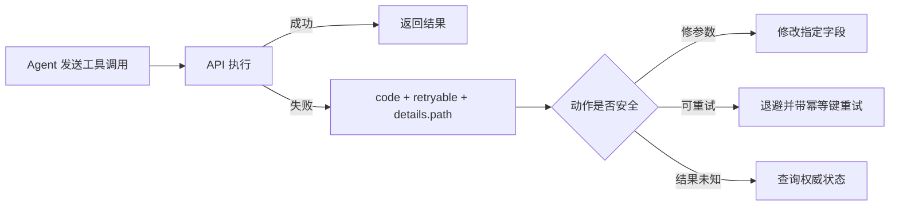

**TL;DR：** Agent 调用 API 时，错误响应会成为下一轮决策的输入，但它不会自动把错误变成可恢复动作。仓库里的确定性启发式模拟只在一个合成库存场景中比较三种 body：裸错误 5 轮仍失败（0/100）、只有 `code` 时 4 轮成功（100/100）、带 `details.path` 时 2 轮成功（100/100）；对应平均成本是 3000、2400、1200 token。**这些百分比是模拟器控制流的结果，不是真实模型成功率。** 可迁移的结论是：错误合同必须同时表达可重试性、可修正字段、幂等要求和未知结果；状态码或自然语言单独都不够。

## 一、 Agent 没有"人类直觉"：错误响应就是它唯一的信息源

人类调 API 失败时会看状态码、翻日志、猜字段名。Agent 的工具循环通常只能看到工具返回值和它被允许使用的上下文；如果服务端没有把下一步所需的信息放进合同，模型就只能猜。错误的形状决定了它的下一轮动作空间，但“能看懂”不等于“可以安全重试”：

- **只有状态码**：不管是 500 还是 422，对模型来说都是"失败"。它不知道这错误是重试能解决的（网络抖动）还是重试永远解决不了的（参数非法）。
- **有 code 和 retryable 合同**：能把暂时性失败、参数错误、业务冲突和权限问题分开；不能把 5xx/4xx 粗暴地当成永远重试/永远修正。`429` 往往需要等待，`409` 可能需要重新读取状态，`500` 还可能发生在副作用已经提交之后。
- **有 details.path**：连错在哪个字段都知道，直接改对字段，不需要试探。

先把 HTTP 状态和动作分开，错误码只负责稳定分类，`retryable`/`retry_after`/`idempotency_required` 才负责告诉调用方下一步能不能做：

| 失败形状 | 可能的动作 | 还缺什么才可自动化 |
| --- | --- | --- |
| `429` + `retry_after` | 延迟后重试 | 重试预算、幂等键、服务端限流范围 |
| `503` + `retryable: true` | 退避重试 | 请求是否已有副作用、最大退避时间 |
| `422` + `details.path` | 修正参数后重试 | 字段可接受范围、是否仍需用户确认 |
| `409` + 当前版本/资源状态 | 重新读取再决策 | 冲突解决策略，而不是盲目重放 |
| `500` 或连接断开 | 结果未知 | 查询接口、幂等键或人工介入路径 |

这张表的重点是：**错误体描述的是下一步合同，不是服务端的情绪。**



## 二、 模拟：同一次失败，三种形状，行为差距

用确定性模拟器复现（`experiments/llm-tool-calling-contract/simulate.mjs`，本机 2026-08-16）：同一个合成“下单”工具从 `qty=1` 开始，模拟器把 `qty >= 3` 定义为成功；每轮固定 500 输入 + 100 输出 token，最多 5 轮：

| 错误形状 | 决策能力 | 成功率 | 平均轮数 | 平均 token |
| --- | --- | --- | --- | --- |
| 裸错误（422+空 body） | 只能盲重试，永远用同一参数 | 0% | 5.0 | 3000 |
| `{code, message}` | 知道是修正型，换参数试探 | 100% | 4.0 | 2400 |
| `{code, message, details[path]}` | 定位到 qty 字段，直接修对 | 100% | 2.0 | 1200 |

模拟的机制设计是**可解释的启发式，不是模型替身**：结构化形状的成功来自脚本直接读取 `details.path` 并把 `qty` 改成 3；半结构化路径则按候选值试探。它不能证明真实模型会按同样方式读取字段，也不能证明自然语言 message 一定无用。它只证明：当调用方已经按照合同实现决策器时，更多结构可以减少猜测；真实模型、提示词、工具编排和安全策略必须另测。

两个数字值得细看：

1. **本模拟的成功率差异来自决策器，不是 code 的魔法**。半结构化路径能成功，是因为脚本把 `INVALID_QTY` 与 `STOCK_NOT_ENOUGH` 映射到候选动作；如果真实模型不理解这些 code，结果不会自动复现。稳定 code 仍然值得保留，因为它比自由文本更容易被程序、评测和模型共同消费。
2. **details.path 省掉的是本模拟中的试探轮次**。半结构化要 4 轮：试参数→失败→再试→再失败→成功；结构化 2 轮：读细节→直接修。这个 4→2 不是生产预算承诺，生产 token 还会受到上下文、工具 schema、历史消息和模型输出长度影响。

## 三、 设计原则：三种错误各就各位

从模拟反推的契约设计原则，正好对应服务系列落库的订单契约（`experiments/service/src/orders.ts`）：

```
{ error: { code, message, details?: [{ path, code, message }] } }
```

- **code 用枚举不用自由文本**：`ORDER_NOT_FOUND` / `INVALID_QTY`，全局唯一。模型对枚举的分流能力远强于对自然语言的分流（可预测、可判等）。
- **details.path 指向字段，不指向"用户操作"**：Agent 能修的是参数不是用户，所以错误必须定位到 `["qty"]` 这种它可控的位置。`details: [{path: ["qty"], code: "EXCEEDS_STOCK", message: "库存仅 2 件"}]` 让模型知道：把 qty 改小。
- **把动作写进合同，不把语义藏在状态码里**：`retryable`、`retry_after`、`details.path`、`conflict_version` 和 `idempotency_required` 比“5xx 都重试、4xx 都修正”更可执行。状态码是协议分类，不是副作用安全性的证明。
- **错误也是 token 成本**：details 写太长会吃掉输入预算（首篇 token 经济学算过账）。目标是"够模型做决策"——path+code+一行 message，不是把整个字段校验失败列表全塞进去。

还要为失败后的副作用留一条路：网络断开、网关超时和服务端 500 都可能发生在写入提交之后。此时让 Agent 直接重试会把“未知结果”变成重复订单。安全合同通常是：请求带幂等键；服务端保存 request fingerprint 和最终结果；查询接口能用幂等键取回状态。错误响应再丰富，也不能代替这个持久化事实。

## 四、 错误契约要和副作用边界一起设计

| 问题 | 只补 body 能解决吗 | 需要的系统合同 |
| --- | --- | --- |
| 参数错在哪里 | 大多可以 | `details.path`、稳定字段 code、可展示 message |
| 暂时失败何时重试 | 不够 | retryable、退避、`Retry-After`、预算 |
| 请求是否已经成功 | 不够 | 幂等键、结果查询、持久化状态 |
| 资源版本冲突 | 不够 | 版本号、冲突详情、读取后合并/覆盖策略 |

错误 body 是 Agent 的输入，但结果存储、权限和副作用才是系统的裁判。把这两层混在一起，模型即使“猜对”一次，也没有可证明的安全边界。

## 五、 结论：错误合同要能指导下一步动作

- 给模型调用的 API，错误形状决定它能否获得下一步所需信息；本文的 0%/100%/token 数只属于确定性模拟，不能当真实模型指标。
- 契约落库优于口头规范：`{error: {code, message, details[]}}` 写成 zod schema + 全局错误码枚举，新工具天然继承。
- 别把错误契约当"给人看的文案"设计：code、动作提示、幂等要求和未知结果查询路径要一起进入 schema；message 负责解释，不负责承担全部控制流。

下一步：把现有工具按“参数可修正 / 可退避重试 / 结果未知 / 需要人工确认”四类重画一遍，再给每类补一个 contract test。测试应断言副作用次数、幂等键处理和最终状态，而不只断言 Agent 是否“多试了几轮”。

---

## 参考资料

1. RFC 9457：Problem Details for HTTP APIs（错误对象的通用结构）：https://www.rfc-editor.org/rfc/rfc9457
2. RFC 9110：HTTP Semantics（4xx/5xx 状态码的语义边界）：https://www.rfc-editor.org/rfc/rfc9110
3. 错误形状模拟：`experiments/llm-tool-calling-contract/simulate.mjs`；本机 raw 与环境：`evidence/llm-tool-calling-contract/2026-08-16-local/`。
4. 订单服务错误合同：`experiments/service/src/orders.ts`；模拟为确定性启发式，不冒充真实模型行为。
