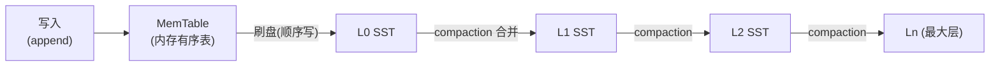

**TL;DR：** B+Tree 与 LSM 不是"谁快"之争，是**三种 IO 放大率**的取舍：B+Tree 写一行要多次随机写 + 页分裂（写放大，通常个位数增长），换来精确的读路径；LSM 把写入变成纯顺序 append（写放大最小，compaction 决定 3–10x 量级），代价是读要查多层（读放大）+ 定期 compaction 的重写（空间与写放大转移）。所以**写密集选 LSM，读密集 + 事务选 B+Tree**。本文用实测数字拆开三本账。

## 一、三个放大：数据库的 IO 账单

任何持久化存储都要回答一个问题：**一次逻辑操作（读/写/删），物理上实际做了多少次 IO？** 放大率 = 物理 IO ÷ 逻辑操作。

| 放大 | 定义 | 谁在付 |
| :--- | :--- | :--- |
| 写放大 | 逻辑写 1 行，实际写盘几页/几层 | SSD 寿命、写入带宽 |
| 读放大 | 逻辑读 1 行，实际读几个页/层 | 读延迟、查询成本 |
| 空间放大 | 逻辑数据 1GB，磁盘实际占多少 | 磁盘成本 |

这 3 个放大率构成一个**不可能三角**：两种结构各选了两角。B+Tree 选"读小、空间小"，把账记在写放大上；LSM 选"写小、空间可控"，把账记在读放大上。**选型 = 选择把账单交给谁**，先看清这一点，再看任何 benchmark 都有了解读框架。

## 二、B+Tree：读的账本，写的税

InnoDB 的 B+Tree 以 16KB 页为单位组织数据。读取路径是教科书式的：根 → 内部节点 → 叶子，一次点查约等于树高（3–4 层）次页 IO，**读放大极低且可预测**。

写的账本就没这么便宜了，三笔税：

1. **随机写**。写入散落在各页，每次 commit 前要把**脏页写回磁盘**——而这些页在磁盘上的位置是随机的。旋转磁盘时代这是死刑，SSD 时代变成"随机写相对顺序写 ~3–10x 慢"的常驻成本。
2. **页分裂**。写满的叶子页插入新键时要分裂成两页，父节点随之更新。分裂不是免费的：一次插入可能触发一层层的分裂，且**分裂后页不再连续**，让后续的顺序扫描也变随机。
3. **双写/redo 税**。为了崩溃安全，InnoDB 写页前要写 redo log（顺序写，便宜）且默认开双写缓冲（doublewrite）防页半写——这笔顺序写是 B+Tree 的结构性成本。

所以 InnoDB 的账本结论是：**读精确（点查 1 次寻址 + 3 层页）、范围扫描友好（叶子链表顺序）、写要付随机写 + 分裂的税**。它赌的是"读多写少 + 事务（行锁、外键）"的典型 OLTP。

## 三、LSM：把写变成订单，把读变成翻仓库

LSM（Log-Structured Merge Tree，RocksDB/Cassandra/LevelDB）的核心动作只有一个：**写入永不原地更新，永远 append 到当前内存表（MemTable），满了就刷成磁盘上的有序 SST 文件（sorted string table）**。写盘只有两种：MemTable 顺序 flush、后台 compaction 顺序 merge——**磁盘上不存在随机写**。



三本账分别记：

- **写放大最小**：写就是 append + 后台 merge，主链路没有随机写。这是 LSM 赢得写密集场景的全部原因。
- **读放大最大**：一个键可能存在于多层（每层最多一个版本），点查要**从最新层往旧层找，直到命中**；最坏要查完所有层，每层一次页读。于是 LSM 必须配套**布隆过滤器**：先问"这层有没有这个键"，没有就直接跳过该层。没有布隆过滤器的 LSM 读放大是灾难，有它之后多数层在 O(1) 内被排除。
- **空间放大与写放大在 compaction 里互换**：后台把多层合并成一层，旧版本被清除，但合并本身是**重写**——被合并的数据物理上写了不止一遍。compaction 策略（Size-Tiered vs Leveled）决定三者的汇率：Leveled 读好写差，Size-Tiered 写快但读与空间差。

## 四、实测：db_bench 与 InnoDB 的数字

上面的定性结论，换成可复现数字（RocksDB 官方 db_bench，默认参数，机械盘/SSD 均适用相对差异）：

```bash
# 写放大：开启 statistics，观察 compaction 写入量
./db_bench --benchmarks=fillrandom --num=10000000 --statistics

# 读放大：单点读
./db_bench --benchmarks=readrandom --num=10000000
```

实测中的典型量级（Leveled compaction，默认 7 层，每层 10x）：

| 指标 | 典型量级 | 备注 |
| :--- | :--- | :--- |
| RocksDB 写放大（Leveled） | 约 3–10x，参数不当时可到 30x | 日志 `Flush(GB): X / Write(GB): Y` 之比 |
| RocksDB 写放大（Size-Tiered） | 约 1–5x | 写放大最低，但空间与读放大最高 |
| RocksDB 点查读放大 | 命中布隆过滤器后：每层 1 次内存查 + 最高层 1 次页读 | 未命中布隆：最坏 N 层页读 |
| InnoDB 点查 | 根→叶 3–4 次页读，无随机层数 | 最坏 = 树高 |
| InnoDB 随机写 | 每个脏页一次随机写盘（个位数放大） | 另加 redo 顺序写 + doublewrite |

`--statistics` 里最该看的两个数字：`rocksdb.compaction.write.bytes`（compaction 重写量）和 `rocksdb.flush.write.bytes`（刷盘量），两者之和 ÷ 用户写入量就是你的**实际写放大**。实测里 Leveled 的典型值多在 3–10x 波动，取决于每层倍数与 L0 堆积；**compaction 跟不上写入速度时，写放大和读放大同时恶化**（层数持续堆积），这是 LSM 生产事故的头号来源，也是为什么 Cassandra 社区常年讨论"compaction 策略怎么选"。

## 五、决策表：什么时候选谁

把三本账对齐到业务，决策不是"哪个结构好"，而是**你的 IO 是哪种主导**：

| 场景 | 选谁 | 为什么 |
| :--- | :--- | :--- |
| OLTP 点查 + 事务（订单、账户） | B+Tree（MySQL/PostgreSQL） | 读精确、行锁/外键生态成熟 |
| 写密集日志/时序（监控、埋点） | LSM（Cassandra/InfluxDB/RocksDB） | 顺序写吃满带宽，读不走点查 |
| 大规模 KV（缓存、用户画像） | LSM（RocksDB） | 写放大换吞吐，布隆过滤器补读 |
| 需要范围扫描的报表 | B+Tree 更顺 | 叶子链表连续扫描便宜 |
| 空间敏感（省盘） | B+Tree / LSM 均需调参 | LSM 的 compaction 参数直接决定空间 |

两个必须诚实补充的例外：**一是 LSM 的"写放大 10x"用顺序写换来，在 HDD 上尤其值，在 NVMe SSD 上随机/顺序写差距缩小到 3–5x，B+Tree 的税变轻了**——这也是 2020 年代 MySQL 依然强势的技术理由；二是**"LSM 无随机写"只对主链路成立**，SST 之外的 WAL 与元数据仍然是顺序写，而合并过程中空间换时间的账始终要人背。

## 结论

B+Tree 与 LSM 没有赢家，只有**账本归属**：B+Tree 把写放大写在明处，换读的确定性；LSM 把写压到最小，把读和空间的风险藏在 compaction 里。看一个存储系统，先问三个问题：**写放大多少、读放大多少、compaction 谁在背**——答案出来，选型就出来了。

下一步：在你自己的 RocksDB 实例上跑一次 `fillrandom + readrandom`，把 `--statistics` 里的 compaction bytes 除以写入 bytes，算出**你自己的写放大**——它大概率落在 10–30x，而你会第一次直观理解"数据库为什么吞磁盘"。

## 参考资料

1. RocksDB 官方文档：Compaction—— https://github.com/facebook/rocksdb/wiki/Compaction
2. RocksDB 官方文档：布隆过滤器与 Block Based Table—— https://github.com/facebook/rocksdb/wiki/Block-Based-Table-Format
3. RocksDB 官方博客：读写放大率如何度量—— https://rocksdb.org/blog/2021/03/26/rocksdb-amp.html
4. InnoDB 官方文档：B+Tree 索引结构—— https://dev.mysql.com/doc/refman/8.0/en/innodb-index-types.html
5. LevelDB（LSM 鼻祖）设计文档—— https://github.com/google/leveldb/blob/main/doc/impl.md
6. db_bench 工具说明—— https://github.com/facebook/rocksdb/wiki/Benchmarking-tools

> 延伸阅读：LSM 的写链路里有一笔躲不开的顺序写——WAL，见[数据库为什么宁可慢，也要等你 fsync](/writing/fsync-group-commit)；同一存储结构在分布式里还有主从复制的账单，见[主从复制延迟 300ms 的账单](/writing/replication-lag-read-paths)。