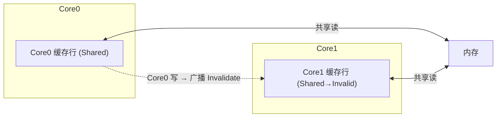

**TL;DR：** 多核 CPU 的"共享内存"是一种营销词：每一核在私有 L1/L2 里各留一份**整行（64 字节 cache line）**的副本。缓存一致性协议（MESI 及各微架构变体）保证所有副本对外看起来一致，代价是**状态迁移要广播**：一个核写某一行时，其它核持有的同一行副本要被强制失效（Invalidate）。**伪共享（false sharing）**就是两个线程轮流写同一缓存行上的不同变量：每次写都触发整行换主、来回广播，带宽被白白消耗，性能掉 2–5 倍。本文用一个并发计数器程序把这份账单跑成数字，教你用对齐把字段拆到不同的行。

## 一、缓存一致性：不是同步，是失效广播

现代 CPU 把内存切成 64 字节的**缓存行（cache line）**。单核读写没问题；两核同时摆弄同一行，就要保证二者看到的最终值一致——于是有 M（Modified）/E（Exclusive）/S（Shared）/I（Invalid）四态：



写一个共享行不是"把自己的新值通知别人"，而是**先作废别人的副本**；别人下次读就得从总线拿到新值（cache-to-cache transfer）。这就是共享变量为何不是"一次写一次同步开销"：**写一个变量 = 让所有持有该行副本的核各自失效**。

**数字量级**（具体看微架构，2026 常见消费级 CPU 大体不变）：

| 层次 | 延迟量级 |
| :--- | :---: |
| L1 命中 | ~1ns |
| L2 命中 | ~5ns 量级 |
| L3（跨核，Apple Silicon / Intel） | ~15–40ns |
| 主存 | ~60–100ns |
| 一次 Invalidate 广播往返 | 数十至上百 ns |

要亲眼验证：`perf stat -e cache-misses,cache-references` 跑下面实验，观察 miss 数。

## 二、伪共享：两个变量，躺在同一条缓存行

两个 goroutine，各自写"自己那份"的计数器：

```go
type Counter struct {
    a, b int64   // 相邻俩字段 → 挤在同一条 cache line
}

var c Counter
// goroutine 1: for { c.a++ }
// goroutine 2: for { c.b++ }
```

逻辑上这两个变量互不相干，但 `c.a` 与 `c.b` **物理上躺在同一个 64 字节行里**。goroutine 1 每次写 `c.a` 都是写这一行 → 要求 goroutine 2 副本作废；goroutine 2 反过来也一样。两家把**同一行**当球踢来踢去，可谁也没真的共享那 8 字节——这就是**伪**共享：数据没有共享，缓存行在共享。

## 三、把账跑出来

```go
package main

import ("fmt"; "sync"; "time")

type Counter struct { a, b int64 }

func main() {
    var c Counter
    var wg sync.WaitGroup
    start := time.Now()
    for i := 0; i < 2; i++ {
        wg.Add(1)
        go func(k int) {
            defer wg.Done()
            for j := 0; j < 200_000_000; j++ {
                if k == 0 { c.a++ } else { c.b++ }
            }
        }(i)
    }
    wg.Wait()
    fmt.Println(time.Since(start), c.a, c.b)
}
```

```go
// 对齐/稀疏版：把一个字段推到下一行
type Padded struct {
    a int64
    _ [7]int64 // 56 字节 padding,把 b 推到独立一行
    b int64
}
```

同一台机器跑两个版本：**共享行版比 padding 版慢约 2–5 倍**（具体看核数与缓存层次）。没有玄学——前者每条计数都多付一次失效广播的近百 ns，后者没有。

**关键洞察**：伪共享的惩罚跟"写频率"正相关。所以**热路径幂等（队列头尾指针、限流器计数、并发统计）**是重灾区。

## 四、怎么避：对齐、分片、化竞争为局部分量

1. **Padding 对齐**：把两个线程各写的字段拆到不同行。用 `[8]int64` 占位或奇数 padding 都行，目标只是一条行里只有一个"热写者"。
2. **分片计数**：把单个热变量拆成"每个核一条的 sharded 数组"，各自原子加自己的 slot，读时汇总——既避免伪共享，也去掉中央锁。
3. **原子计数也要分片**：`atomic.AddInt64` 解决竞争，但只要写的是同一根行，缓存的互相失效照样发生；热改量务必各核各一行。

## 五、别反过来把真共享也拆了

上面全是"伪共享"。反过来要提醒：**如果两个线程确实要经常读同一个热字段，故意加 padding 把行拆开反而会损失局部性**，是错的。先确认这个字段是否真的被两个核频繁写（用 perf / 火焰图佐证），再决定动不动布局。

## 结论

多核"共享内存"的真相是"各自缓存行副本 + 失效广播"。写这份并发的代码只有三条纪律：把不同线程各写的字段**分散到不同行**（padding 或分片）；不要把共享计数放在两个线程都踩的热路径；动手前先看 `perf cache-misses` 坐实病灶。伪共享是没有锁、没有数据竞争，却能让你"互不相干却互相拖死"的并发 bug——它贵 2–5 倍还没有任何报错。

下一步：把上面两个版本各跑 30 秒对比耗时，再用 `perf stat -e cache-misses,cache-references` 看 miss 数差值；在计数器 struct 上加一行 padding 重跑，你就能"看见"广播往返的钱花在哪。

## 参考资料
1. Wikipedia：MESI 协议—— https://en.wikipedia.org/wiki/MESI_protocol
2. Wikipedia：False sharing—— https://en.wikipedia.org/wiki/False_sharing
3. Linux perf 教程（cache 事件）—— https://perf.wiki.kernel.org/index.php/Tutorial
4. 缓存一致性协议的操作系统级总结：MOESI / MESIF 变体—— https://en.wikipedia.org/wiki/MOESI_protocol

> 延伸阅读：缓存一致性与核调度/上下文切换叠加的物理进程，见[从 CPU 到 Go 协程：上下文切换](/writing/understanding-context-switching-from-cpu-to-goroutines)；`perf` 如何发现这类 cache-miss 税，见[先采样再优化：perf 火焰图](/writing/perf-flamegraph-sampling)；共享计数与 GC 一起抢内存带宽，见[Go 的 GC 时间税](/writing/go-gc-gctrace-account)。