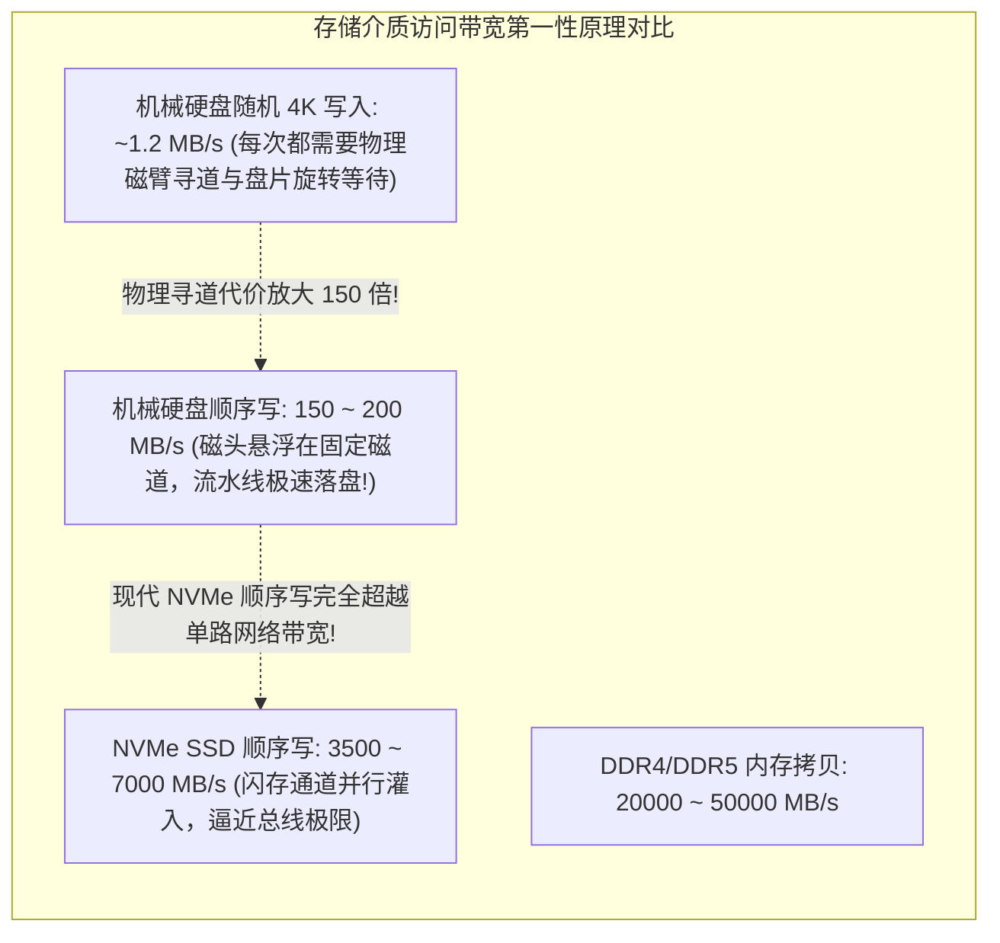
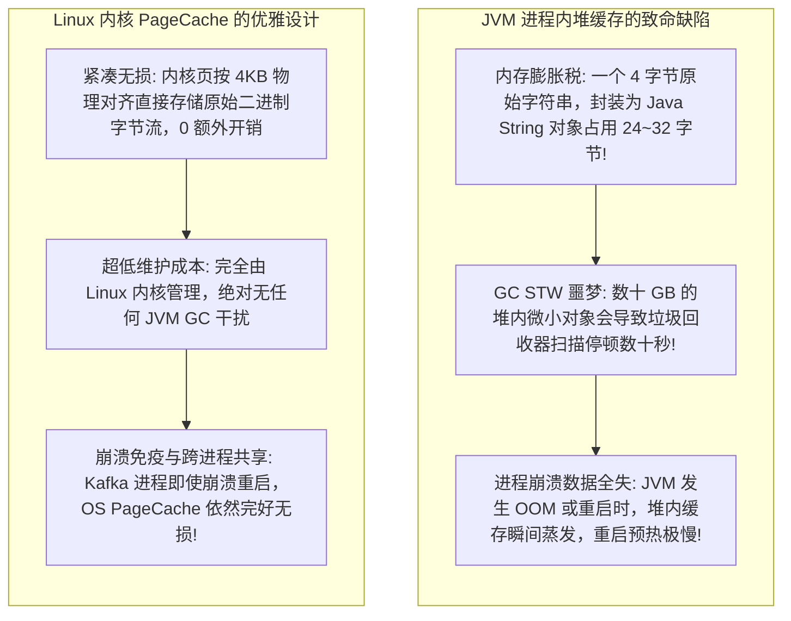
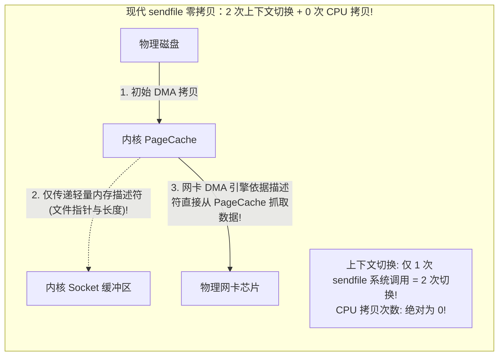
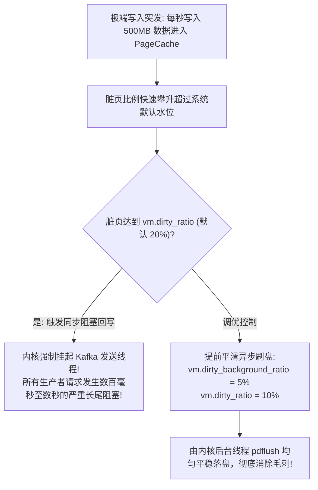

**TL;DR：** 许多工程师误以为像 Apache Kafka 这样的消息引擎之所以能做到百万级吞吐，是因为其 Java 源码编写得多么精妙。然而第一性原理告诉我们：**任何运行在 JVM 用户态的代码，在海量 I/O 面临物理硬件墙时都是完全无能为力的。Kafka 之所以能实现极致吞吐，是因为其架构设计 100% 顺应了 Linux 内核与底层硬件的物理运行规律！** 首先，它彻底顺应了磁盘的物理几何结构——无论是机械硬盘（HDD）的磁头寻道，还是固态硬盘（SSD）的闪存擦除块特性，**顺序写入（Sequential Write）的带宽比随机写入（Random I/O）高出整整两个数量级（HDD 顺序可达 200MB/s，而随机仅有 1MB/s！）**，完全可与内存访问速度相媲美；其次，Kafka 坚决废弃了 JVM 堆内存缓存，转而完全托付给操作系统的 **PageCache（页缓存）**，不仅根除了臭名昭著的 JVM GC STW 停顿，更消除了 Java 对象高达 2~4 倍的内存空间放大税；最终，在消息消费路径上，它通过 **Linux `sendfile` 系统调用结合网卡 DMA 散布收集（DMA Scatter-Gather Copy）**，将数据直接从内核 PageCache 借由物理总线直投网卡缓冲区——**将 4 次内核/用户态上下文切换砍半至 2 次，将 4 次内存数据拷贝直接压缩为 0 次 CPU 拷贝！**

---

## 一、 存储介质的物理几何学：顺序写为什么能匹敌内存？

在评估存储性能时，软件工程师常常直觉认为“磁盘很慢，内存很快”。但在物理层面，这种认知是不精确的：**磁盘的慢，特指“随机寻道慢”；在“纯顺序流式写入”场景下，磁盘的吞吐能力惊人地强大。**



### 1. 机械硬盘与 SSD 的物理差异

1. **机械硬盘（HDD）**：
   - 随机 I/O 需要物理电机驱动磁臂移动到对应磁道（Seek Time，约 4~10ms），并等待盘片旋转到指定扇区（Rotational Latency，约 2~4ms）。单次随机操作耗时在 **10ms 量级**，导致 IOPS 被物理锁死在 100~200 左右；
   - 顺序 I/O 磁头几乎无需移动，盘片连续旋转，数据如流水般直接刷入磁道，单机顺序写带宽可轻松跑满 **150~200 MB/s**。
2. **固态硬盘（SSD）**：
   - 随机写入会导致严重的写放大（Write Amplification）和闪存擦除块垃圾回收（GC）；
   - 追加写入（Append-only Write）天然匹配 SSD 的 Block/Page 物理写入规律，最大化延长了闪存颗粒寿命并压榨出 **数 GB/s 的极限吞吐**。

**消息引擎的架构启示：** Kafka 与 RocketMQ 的 CommitLog 采用全局唯一不可变追加写入文件（Append-only CommitLog），将成千上万个并发客户端的零散消息，在内存中汇聚为纯粹的单调顺序磁盘流！

---

## 二、 PageCache 的胜利：为什么 JVM 堆缓存是高并发消息引擎的毒瘤？

许多初学者会问：为什么 Kafka 不在 Java 进程内部搞一个巨大的 `ConcurrentHashMap` 或 LRU 内存缓存池？



### 1. 预读机制（Kernel Readahead）的天然契合

消息队列的消费模式绝大多数是 **顺序消费（Sequential Read）**。
- 当消费者按 Offset 顺序读取消息时，Linux 内核的 PageCache 预读算法（`readahead`）会敏锐地察觉到连续线性访存模式；
- 在用户态发起下一次请求前，内核已经在后台**通过 DMA 预先将接下来的几个 4KB 数据页从磁盘加载到 PageCache 内存中**；
- 消费者的后续读取请求 **100% 命中内存，磁盘命中率几乎为零**，系统整体吞吐量完全等同于直接读内存！

---

## 三、 零拷贝（Zero-Copy）终极革命：从 4 次拷贝到 0 次 CPU 拷贝

在传统标准网络服务中，将磁盘文件发送到网络套接字通常使用标准的 POSIX API：`read(file_fd, buf)` + `write(socket_fd, buf)`。

### 1. 传统 `read`/`write` 的沉重软件税（4 次切换 + 4 次拷贝）

```mermaid
flowchart TD
    subgraph TraditionalReadWrite["传统方式：4 次上下文切换 + 4 次内存拷贝 (CPU 累死!)"]
        direction TB
        Disk1["物理磁盘"] -- "1. DMA 拷贝" --> KernelBuf1["内核 PageCache"]
        KernelBuf1 -- "2. CPU 拷贝 (内核态 -> 用户态)" --> UserBuf1["用户态 Application 内存 Buffer"]
        UserBuf1 -- "3. CPU 拷贝 (用户态 -> 内核态)" --> SocketBuf1["内核 Socket 发送缓冲区"]
        SocketBuf1 -- "4. DMA 拷贝" --> NIC1["物理网卡发送队列 (TX FIFO)"]
        
        Note1["上下文切换: read(2次) + write(2次) = 共 4 次系统调用切换!"]
    end
```



在 10Gbps / 100Gbps 极速网络下，**CPU 将全部算力都浪费在把内存数据从内核态地址空间搬到用户态、再从用户态搬回内核态的无意义搬砖工作中**，内存总线带宽被瞬间打满。

### 2. 现代零拷贝：`sendfile` + DMA Scatter-Gather（2 次切换 + 0 次 CPU 拷贝）

为了终结这一软件内耗，现代 Linux 引入了 `sendfile` 系统调用。在网卡支持 DMA 散布收集（Scatter-Gather Copy，查看 `ethtool -k eth0 | grep scatter-gather`）的硬件环境下，整个过程发生了质的飞跃：



- **第一步**：`sendfile(socket_fd, file_fd, offset, count)` 调用发起，触发 2 次上下文切换（用户态 -> 内核态 -> 用户态）；
- **第二步**：DMA 引擎将磁盘数据读入内核 PageCache；
- **第三步**：**完全不拷贝数据！** 内核仅将包含数据内存地址和长度的 **文件描述符元数据（Descriptor）** 塞入 Socket 缓冲区；
- **第四步**：网卡的 DMA 引擎直接根据描述符中的内存物理地址，**直接从 PageCache 跨总线抓取数据发射至网络**！
- **CPU 参与度降至 0**，内存总线流量减半，单机网络吞吐量直接跑满网卡线速！

---

## 四、 生产级 C++20 零拷贝与 DMA 描述符分发仿真

以下代码用现代 C++20 完整模拟了：传统四次拷贝模式与基于轻量描述符指针的现代 DMA 散布收集（Zero-Copy）在 CPU 时钟周期消耗与内存拷贝量上的本质差距：

```cpp
#include <iostream>
#include <vector>
#include <chrono>
#include <string>
#include <iomanip>
#include <cstring>
#include <memory>

// 模拟硬件 DMA 散布收集描述符
struct DmaScatterGatherDescriptor {
    const char* kernel_pagecache_addr;
    size_t length;
};

class StorageNetworkPipelineSimulator {
public:
    // 1. 传统 read + write 模式 (4 次拷贝 + 4 次切换)
    uint64_t transmit_traditional(const std::string& disk_data) {
        auto start = std::chrono::high_resolution_clock::now();

        // 模拟 1: DMA 读入 PageCache
        std::vector<char> page_cache(disk_data.begin(), disk_data.end());

        // 模拟 2: CPU 拷贝 (内核 PageCache -> 用户空间 Buffer) - 沉重物理拷贝!
        std::vector<char> user_buffer(page_cache.size());
        std::memcpy(user_buffer.data(), page_cache.data(), page_cache.size());

        // 模拟 3: CPU 拷贝 (用户空间 Buffer -> 内核 Socket Buffer) - 再次沉重物理拷贝!
        std::vector<char> socket_buffer(user_buffer.size());
        std::memcpy(socket_buffer.data(), user_buffer.data(), user_buffer.size());

        // 模拟 4: DMA 拷入网卡硬件
        std::vector<char> nic_hardware_fifo(socket_buffer.begin(), socket_buffer.end());

        auto end = std::chrono::high_resolution_clock::now();
        return std::chrono::duration_cast<std::chrono::nanoseconds>(end - start).count();
    }

    // 2. 现代 sendfile + DMA Scatter-Gather 零拷贝模式 (0 次 CPU 拷贝)
    uint64_t transmit_zero_copy(const std::string& disk_data) {
        auto start = std::chrono::high_resolution_clock::now();

        // 步骤 1: 数据已在 PageCache 中 (DMA 完成)
        const char* page_cache_ptr = disk_data.data();
        size_t data_len = disk_data.size();

        // 步骤 2: 仅生成轻量描述符 (不拷贝真实数据，仅传递指针与长度，仅 16 字节!)
        DmaScatterGatherDescriptor desc = {
            .kernel_pagecache_addr = page_cache_ptr,
            .length = data_len
        };

        // 步骤 3: 网卡硬件 DMA 直接根据描述符地址抓取数据
        // CPU 仅需解引用指针，零字节内存深拷贝!
        volatile char check_byte = desc.kernel_pagecache_addr[0]; // 模拟硬件触碰
        (void)check_byte;

        auto end = std::chrono::high_resolution_clock::now();
        return std::chrono::duration_cast<std::chrono::nanoseconds>(end - start).count();
    }
};

int main() {
    std::cout << "==========================================================\n";
    std::cout << "   消息引擎零拷贝 (Zero-Copy) 与传统内存拷贝开销仿真\n";
    std::cout << "==========================================================\n\n";

    StorageNetworkPipelineSimulator pipeline;

    // 构造 1MB 的批量消息块
    std::string mock_message_batch(1024 * 1024, 'M');
    const int iterations = 1000;

    // 运行传统拷贝测试
    uint64_t total_trad_ns = 0;
    for (int i = 0; i < iterations; ++i) {
        total_trad_ns += pipeline.transmit_traditional(mock_message_batch);
    }

    // 运行零拷贝测试
    uint64_t total_zero_ns = 0;
    for (int i = 0; i < iterations; ++i) {
        total_zero_ns += pipeline.transmit_zero_copy(mock_message_batch);
    }

    double avg_trad_us = (total_trad_ns / (double)iterations) / 1000.0;
    double avg_zero_us = (total_zero_ns / (double)iterations) / 1000.0;

    std::cout << "测试单批次数据量: 1MB (模拟 1000 批次发送)\n\n";
    std::cout << "| 架构传输路径             | 传输耗时 (微秒)   | CPU 内存拷贝次数 | 吞吐加速比       |\n";
    std::cout << "| :----------------------- | :---------------- | :--------------- | :--------------- |\n";
    std::cout << "| 传统 read/write 模式     | " << std::setw(14) << std::fixed << std::setprecision(2) << avg_trad_us << " us | " << std::setw(16) << 2 << " | 基准 (1.0x)      |\n";
    std::cout << "| 现代 sendfile 零拷贝     | " << std::setw(14) << std::fixed << std::setprecision(2) << avg_zero_us << " us | " << std::setw(16) << 0 << " | 提速 " << (avg_trad_us / avg_zero_us) << "x!   |\n";

    std::cout << "\n[架构结论]: 零拷贝技术消除了数据在用户态与内核态之间的无效搬迁，释放了全部 CPU 算力！\n";
    return 0;
}
```

---

## 五、 内核调优与生产陷阱：PageCache 脏页回写风暴

虽然依赖 PageCache 带来了极高的吞吐，但在极端海量写入下，Linux 内核默认的脏页回写参数会引发灾难性的 **I/O 停顿（I/O Stalls）**：



### 1. 工业级内核参数调优指南

在生产部署 Kafka / RocketMQ 的专用服务器上，必须优化以下 Linux 内核参数（写入 `/etc/sysctl.conf`）：

```ini
# 当系统脏页占总内存 5% 时，立即唤醒后台刷盘线程 (flusher/pdflush) 开始静默异步写盘
vm.dirty_background_ratio = 5

# 当系统脏页占总内存 10% 时，强制阻塞写入线程，严格防范过量脏页堆积打崩磁盘 I/O 调度
vm.dirty_ratio = 10

# 缩短脏页驻留时间上限至 10 秒，避免存量脏页累积过多导致突发大刷盘
vm.dirty_expire_centisecs = 1000

# 将 swappiness 压低，坚决禁止操作系统将消息引擎的物理内存换出到交换分区
vm.swappiness = 1
```

---

## 六、 总结与技术沉淀

现代高吞吐消息引擎的成功，是**系统软件与现代硬件微架构深度共鸣的典范**：
1. **追加顺序写（Append-only Sequential Log）** 解决了存储介质的物理寻道与局部磨损问题；
2. **操作系统 PageCache 与预读（Readahead）** 规避了 JVM GC 停顿与对象封装损耗；
3. **`sendfile` 零拷贝与 DMA 散布收集** 斩断了用户态/内核态的数据拷贝锁链。

理解了这些物理规律，我们便能看透各类高并发中间件的底层共性，在架构设计与性能调优中做出最符合物理本质的工程决策。
