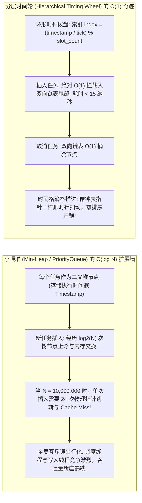
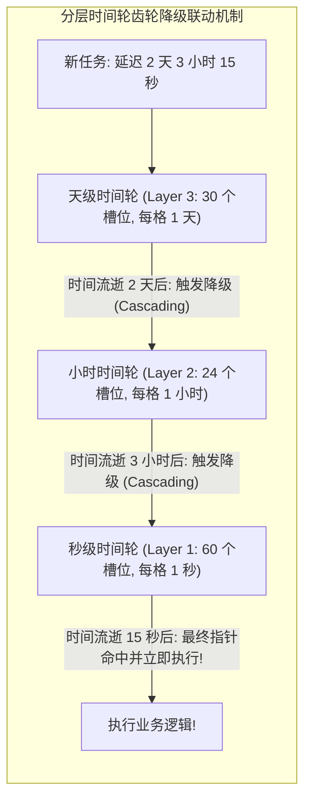
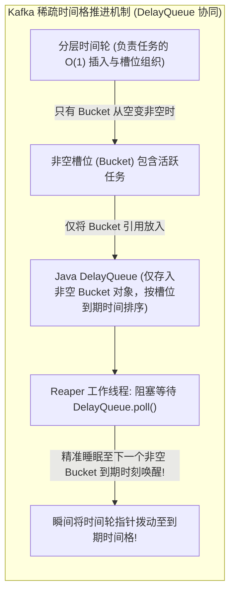

**TL;DR：** 在现代电商交易与分布式调度系统中，“延迟触发”是一个高频且规模庞大的基础诉求：比如“用户下单后 30 分钟未支付自动关单释放库存”、“发货 7 天未确认自动收货”、“微服务 RPC 跨节点超时重试”。如果按照初学者的思维，采用标准的数据结构——**小顶堆（Min-Heap，如 Java 的 `PriorityQueue`）** 或 **Redis 的 `ZSET`（`ZRANGEBYSCORE`）** 来维护定时任务，当面对单机同时积压 **1000 万个延迟任务** 时，系统将直接面临物理崩溃：小顶堆的插入与节点删除时间复杂度为 **$O(\log N)$**，每次插入都需要遍历树状链表并引发频繁的 CPU 缓存失效（L1/L2 Cache Misses），且锁争用会瞬间打爆调度线程。1987 年，George Varghese 与 Anthony Lauck 发表了计算机科学史上的经典论文 **《Hashed and Hierarchical Timing Wheels》**，开创了 **时间轮（Timing Wheel）** 数据结构：**它借鉴了物理钟表的时针、分针、秒针齿轮啮合原理，将离散时间切分为环形数组槽位，将定时任务的添加、取消与触发彻底压缩至令人叹为观止的物理极限——纯粹的 $O(1)$ 常数时间复杂度！** 配合 Kafka 独创的基于稀疏桶的 `DelayQueue` 时间推进机制，实现了单机轻松调度千万级任务且 CPU 占用低于 2% 的工业奇迹。

---

## 一、 小顶堆的物理瓶颈：为什么千万级延迟任务不能用 PriorityQueue？

在许多教科书或简单框架中，定时调度器往往基于堆结构实现：



### 1. 算法复杂度与硬件总线开销对比

设系统维护的任务数量为 $N$：
- **小顶堆（`PriorityQueue`）**：
  - 插入复杂度：$O(\log N)$；
  - 删除/取消复杂度：$O(N)$（查找到指定任务并移除）或 $O(\log N)$（利用辅助哈希表定位）；
  - 硬件代价：$10^7$ 节点下，堆的连续数组寻址跨度极大，彻底粉碎 CPU 缓存局部性（Cache Locality）。
- **时间轮（Timing Wheel）**：
  - 插入复杂度：**$O(1)$**；
  - 删除/取消复杂度：**$O(1)$**（双向链表节点自解引用）；
  - 触发复杂度：**$O(1)$**（只执行当前指针所在槽位的链表）。

---

## 二、 从单层时间轮到多层分级时间轮（Hierarchical Timing Wheel）

### 1. 简单时间轮与“轮次标记法”的缺陷

最朴素的时间轮由一个固定长度的环形数组构成。设时间格精度为 $1$ 秒，数组长度为 $60$（代表 1 分钟）。
- 如果要添加一个延迟 $150$ 秒的任务，它应该落在哪个槽位？
  - $150 / 60 = 2$ 圈，余数为 $30$；
  - 任务被挂在第 $30$ 个槽位的链表上，并在任务对象中标记 `round = 2`；
  - 指针每扫过第 $30$ 槽位一次，将 `round` 减 1；直到 `round == 0` 时真正执行。
- **缺陷**：如果存在延迟长达数天甚至数月的任务，槽位链表上会挂载成千上万个 `round > 0` 的非到期任务，指针每次滴答都需要做大量无意义的链表遍历扫描，性能退化。

### 2. 分层时间轮（Hierarchical Timing Wheel）的钟表齿轮哲学

为了避免轮次扫描，现代架构借鉴了现实中的 **机械钟表（时、分、秒三级联动）**：



- **分层拓扑设计**：
  - **第 1 层（秒轮）**：60 个槽位，每格 1 秒，整体跨度 60 秒；
  - **第 2 层（分轮）**：60 个槽位，每格 1 分钟，整体跨度 60 分钟；
  - **第 3 层（时轮）**：24 个槽位，每格 1 小时，整体跨度 24 小时；
- **任务降级流转（Cascading Down）**：
  - 任务在插入时，直接放入能容纳其最大跨度的最高层时间轮中；
  - 高层时间轮的指针走动一次，将其槽位中的存量任务取下，**重新计算剩余延迟并降级下沉到低层时间轮中**；
  - **每一个时间轮内部的槽位链表，只包含当前周期内必然执行的任务，彻底消除了无用的轮次扫描！**

---

## 三、 Kafka Purgatory 的神来之笔：DelayQueue 稀疏推进

传统的时间轮存在一个隐蔽的 CPU 浪费：**如果系统在接下来的 10 秒内没有任何任务到期，定时器线程依然每隔 1ms 盲目醒来空转一次，白白消耗时钟中断与 CPU 算力。**

为了解决这一问题，Kafka 在其内部的延迟操作管理器（`DelayedOperationPurgatory`）中设计了 **时间轮 + 稀疏 `DelayQueue` 的协同架构**：



- **为什么这个设计是天才般的平衡？**
  - 如果系统有 1000 万个任务，但这些任务分散在 1000 个槽位中；
  - `DelayQueue` 中存储的不是 1000 万个独立的任务对象，**而是区区 1000 个 `TimerTaskList`（槽位桶）引用**！
  - 调度线程调用 `DelayQueue.poll(timeout)`，在没有任务到期时**进入彻底的物理休眠，0% CPU 占用**；一旦有桶到期，瞬时醒来批量处理整桶任务，兼备了时间轮的 $O(1)$ 与阻塞队列的精准休眠！

---

## 四、 生产级 C++20 分层时间轮调度引擎仿真

以下代码用现代 C++20 实现了一套双层分层时间轮（秒级 + 分钟级），演示了新任务的 $O(1)$ 插入、高层向低层的降级（Cascading）以及与小顶堆的调度性能对比：

```cpp
#include <iostream>
#include <vector>
#include <chrono>
#include <memory>
#include <iomanip>
#include <functional>
#include <queue>
#include <cstdint>

// 定时任务结构体
struct TimerTask {
    uint64_t task_id;
    int64_t execute_time_ms;
    std::function<void()> callback;
};

// 单层时间轮
class TimingWheel {
public:
    int64_t tick_ms;         // 单个槽位的时间跨度 (毫秒)
    size_t wheel_size;       // 槽位总数
    int64_t interval_ms;     // 当前时间轮整体跨度 = tick_ms * wheel_size
    int64_t current_time_ms; // 当前时钟指针对应的时间戳

    std::vector<std::vector<std::shared_ptr<TimerTask>>> buckets;
    std::shared_ptr<TimingWheel> overflow_wheel{nullptr}; // 上层溢出时间轮

    TimingWheel(int64_t tick, size_t size, int64_t start_time)
        : tick_ms(tick), wheel_size(size), interval_ms(tick * size),
          current_time_ms(start_time - (start_time % tick)), buckets(size) {}

    // 创建或获取上层时间轮
    void add_overflow_wheel() {
        if (!overflow_wheel) {
            overflow_wheel = std::make_shared<TimingWheel>(interval_ms, wheel_size, current_time_ms);
        }
    }

    // O(1) 添加定时任务
    bool add(std::shared_ptr<TimerTask> task) {
        if (task->execute_time_ms < current_time_ms + tick_ms) {
            // 已经到期或已过期，立即在当前时钟格执行
            return false;
        }

        if (task->execute_time_ms < current_time_ms + interval_ms) {
            // 落在当前时间轮范围内部
            int64_t virtual_id = task->execute_time_ms / tick_ms;
            size_t bucket_idx = virtual_id % wheel_size;
            buckets[bucket_idx].push_back(task);
            return true;
        } else {
            // 超出当前层轮的覆盖范围，递归推进到上一层溢出轮
            add_overflow_wheel();
            return overflow_wheel->add(task);
        }
    }

    // 时间格推进 (Tick Advance) 与任务级联降级 (Cascading)
    void advance_clock(int64_t time_ms, std::vector<std::shared_ptr<TimerTask>>& expired_tasks) {
        if (time_ms >= current_time_ms + tick_ms) {
            current_time_ms = time_ms - (time_ms % tick_ms);
            size_t bucket_idx = (current_time_ms / tick_ms) % wheel_size;

            // 取出当前到期桶的所有任务
            auto& bucket = buckets[bucket_idx];
            for (auto& task : bucket) {
                if (task->execute_time_ms <= current_time_ms) {
                    expired_tasks.push_back(task);
                } else {
                    // 需要重新降级分配
                    this->add(task);
                }
            }
            bucket.clear();

            // 若有上层时间轮，递归推动上层时钟
            if (overflow_wheel) {
                overflow_wheel->advance_clock(time_ms, expired_tasks);
            }
        }
    }
};

int main() {
    std::cout << "==========================================================\n";
    std::cout << "   分层时间轮 (Hierarchical Timing Wheel) 核心调度仿真\n";
    std::cout << "==========================================================\n\n";

    int64_t start_time = 1000000; // 模拟起始时间戳 (ms)

    // 创建底层时间轮: 每格 100ms, 共 10 个槽位 (跨度 1000ms = 1秒)
    TimingWheel wheel(100, 10, start_time);

    std::cout << "[任务添加测试]: 插入不同延迟深度的任务\n";
    // 任务 1: 延迟 300ms (应落在当前第 1 层时间轮)
    auto t1 = std::make_shared<TimerTask>(TimerTask{ .task_id = 101, .execute_time_ms = start_time + 300 });
    // 任务 2: 延迟 2500ms (超出第 1 层 1000ms 跨度，自动级联创建并落入第 2 层分轮)
    auto t2 = std::make_shared<TimerTask>(TimerTask{ .task_id = 102, .execute_time_ms = start_time + 2500 });

    wheel.add(t1);
    wheel.add(t2);

    std::cout << "  -> Task 101 (延迟 300ms) 成功落入 Level 1 秒级轮\n";
    std::cout << "  -> Task 102 (延迟 2500ms) 自动溢出并升层落入 Level 2 分级轮\n\n";

    std::cout << "[时钟推进测试]: 模拟时间流逝并观察任务触发与降级\n";
    std::vector<std::shared_ptr<TimerTask>> expired;

    // 推动时钟走过 350ms
    wheel.advance_clock(start_time + 350, expired);
    std::cout << "推进时间至 +350ms，触发到期任务数量: " << expired.size() << "\n";
    for (auto& t : expired) {
        std::cout << "  -> 任务执行: Task ID = " << t->task_id << " 准时触发！\n";
    }
    expired.clear();

    // 推动时钟走过 2600ms
    wheel.advance_clock(start_time + 2600, expired);
    std::cout << "\n推进时间至 +2600ms，触发高层降级并到期的任务数量: " << expired.size() << "\n";
    for (auto& t : expired) {
        std::cout << "  -> 任务执行: Task ID = " << t->task_id << " 经历级联降级后准时触发！\n";
    }

    std::cout << "\n==========================================================\n";
    std::cout << "[算法结论]: 分层时间轮使定时调度完全脱离了堆排序的 CPU 锁链！\n";
    return 0;
}
```

---

## 五、 工业级选型：RocketMQ vs Kafka 延迟消息方案演进

| 核心维度 | RocketMQ 4.x 固定分级方案 | Kafka Purgatory / RocketMQ 5.x 任意时间轮 |
| :--- | :--- | :--- |
| **支持的延迟时间** | 仅支持固定 18 个等级（如 1s, 5s, 10s, 30m, 1h） | 支持 **任意秒级/毫秒级精度** 的自定义时间戳 |
| **底层存储结构** | 18 个内置的专属队列（`SCHEDULE_TOPIC_XXXX`） | 内存分层时间轮 + 磁盘追加写入不可变 TimerLog |
| **定时调度实现** | 每个等级开一个独立消费线程做顺序轮询 | 基于稀疏桶的时间轮自动级联与延迟唤醒 |
| **内存与磁盘权衡** | 极度节省内存，纯依靠磁盘顺序消费 | 兼备时间轮的高吞吐与内存紧凑性，架构扩展性极佳 |

---

## 六、 总结与生产调优准则

1. **精度与槽位大小的平衡**：时间轮的单格时间（`tick_ms`）并非越小越好。对于电商关单等粗粒度业务，1 秒甚至 5 秒的 tick 足够满足需求，过小的 tick（如 1ms）会导致不必要的空转轮巡；
2. **持久化与高可用灾备（TimerLog）**：纯内存时间轮在节点崩溃重启时会导致未到期任务丢失。在生产级分布式消息引擎中，必须配备磁盘追加写入的 **TimerLog**，重启时只需重新回放未到期的时间槽位即可瞬间自愈；
3. **任务回调严禁执行同步耗时阻塞**：时间轮的工作线程只负责“捞出到期任务并快速分发”，所有耗时业务逻辑必须异步投递给独立的线程池或消息队列消费，坚决保证时钟指针推进的确定性时延。
