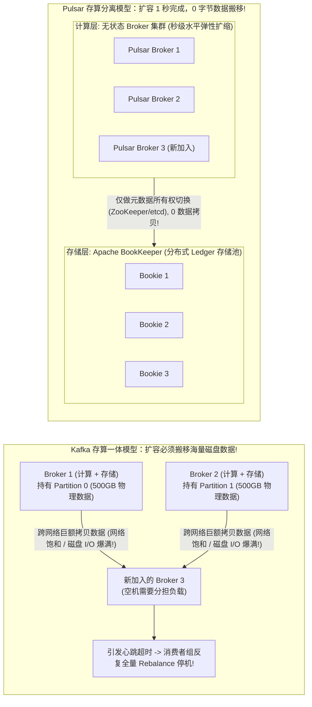
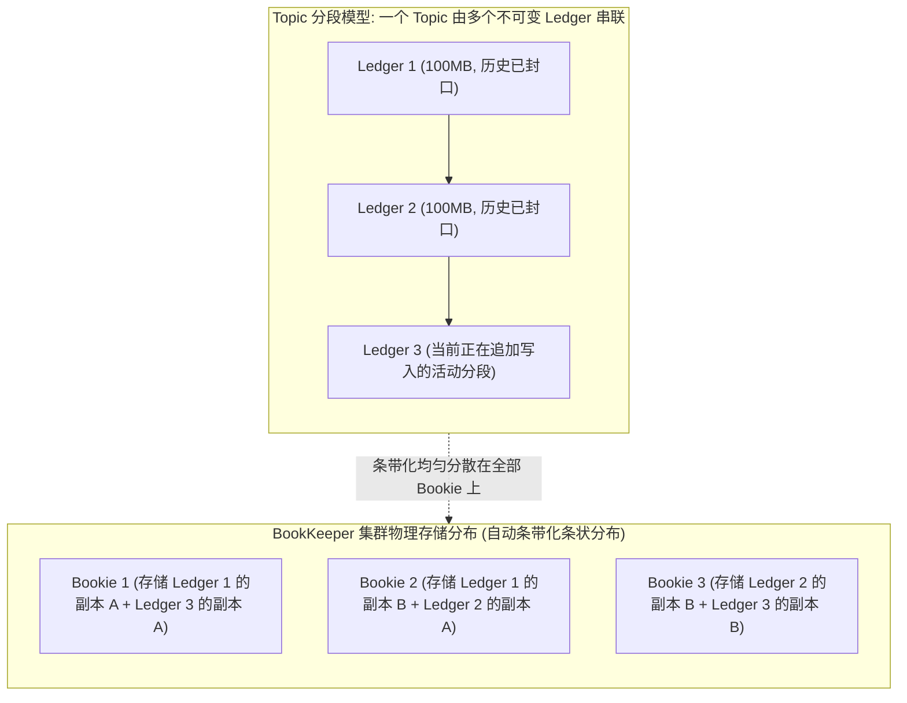
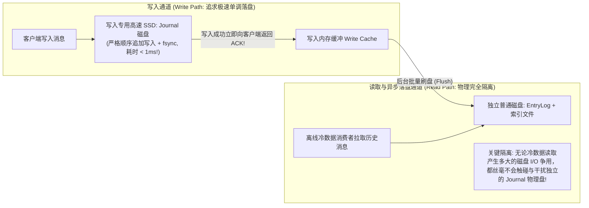

**TL;DR：** 在以 Apache Kafka 为代表的第一代分布式消息引擎中，**“分区（Partition）”与物理 Broker 节点绑死在一起**：每个分区就是一个直接落在某台 Broker 本地磁盘上的文件目录。这种“存算一体”的紧密耦合架构在稳定运行时极快，但在面临现代云原生弹性扩缩容时却暴露出了致命阿喀琉斯之踵——**每当在集群中新增一个 Broker 节点分担负载，或者一个 Broker 物理磁盘损坏需要迁移时，运维人员必须执行沉重且危险的“分区重平衡（Partition Rebalance）”**：数以百 GB 甚至 TB 级的历史消息数据必须跨越物理网络在节点间硬生生地拷贝复制！在拷贝过程中，网络带宽被抢占、磁盘 I/O 发生剧烈抖动，进而极易诱发整个消费组的 **“重平衡雪崩”（Consumer Group Rebalance Storm）**，导致线上消费链路整体停摆十几分钟甚至数小时。为了彻底打破这一物理枷锁，**Apache Pulsar** 开创了 **存算分离（Storage-Compute Disaggregation）** 架构：它将系统彻底拆分为负责协议接入与分发计算的 **无状态 Broker 计算层**，以及专司持久化存储的 **Apache BookKeeper 分布式存储层**。Topic 在底层被细切为轻量级的不可变分段——**Ledger 与 Fragment**。向集群添加 Broker 计算节点只需 **1 秒**（无需移动任何历史字节数据！）；利用 Journal 与 EntryLog 的物理硬件级读写隔离，彻底消除了历史冷数据消费对实时热数据写入的 I/O 干扰。

---

## 一、 Kafka 存算一体之殇：分区与物理盘绑定的代价

在 Kafka 的经典模型中，Broker 既承担计算（处理协议解析、网络长连接、消费位点管理），又承担存储（管理底层 Partition 数据分段文件）：



### 1. 传统重平衡风暴（Rebalance Storm）的恶性死锁

1. **磁盘 I/O 争用**：执行分区迁移时，源 Broker 的磁盘读取带宽被拷贝任务占满；
2. **心跳包超时**：消费者客户端向 Coordinator 发送的心跳包由于 Broker 网络或 I/O 阻塞发生丢包，导致 Coordinator 误以为消费者已经离线；
3. **全局 Stop-The-World**：Coordinator 强行触发消费组 Rebalance，暂停所有正常消费者的拉取任务；
4. **雪上加霜**：Rebalance 期间新到请求积压，重平衡刚完成又由于瞬时超时再次触发下一轮 Rebalance，系统陷入持续数小时的瘫痪震荡！

---

## 二、 Pulsar 两层架构：无状态 Broker 与 BookKeeper 分布式存储池

Pulsar 终结重平衡的核心思想是：**让计算节点变成纯粹的无状态代理，让存储节点变成完全均摊的分布式分块池！**



### 1. 分段不可变抽象：Ledger 与 Fragment

- 在 Pulsar 中，一个 Topic（或者其 Partition）在物理上并不是一个单一无限追加的大文件，而是**由一系列固定大小（如 100MB 或 1 小时）的 Ledger 链表组成**；
- 当一个 Ledger 写满后，立即被标记为 **已封口不可变状态（Sealed / Closed）**，随后立即开启一个全新的 Ledger；
- **扩容与缩容的真正优雅**：
  - 当集群加入新的存储节点（Bookie 4）时，旧的 Ledger **原封不动留在原处**！
  - 下一次开启新 Ledger 时，算法直接将新创建的 Ledger 放置在包含新 Bookie 的节点集合中；
  - **扩容瞬间完成，没有哪怕 1 字节的历史数据迁移，新节点立即参与承载最新流量！**

---

## 三、 硬件级物理隔离：BookKeeper Journal vs EntryLog 读写解耦

在传统的 Kafka 集群中，**“冷消费”（比如某个消费者突然回溯拉取三天前的海量历史日志进行离线分析）是生产环境的噩梦**：
- 历史数据早已被逐出 PageCache，必须从磁盘物理寻道读取；
- 大量的随机磁盘读 I/O 严重挤占了实时写入的磁头带宽，导致实时生产者的写入延迟从 2ms 骤增至数百毫秒。

BookKeeper 通过在物理磁盘层面设计了 **双盘隔离机制（Two-Tier Physical Disk Architecture）**：



1. **Journal 磁盘（极低写入延迟防线）**：
   - 专用一块独立的高速 NVMe SSD；
   - 仅用于顺序记录预写日志（WAL），每次写入后直接调用 `fsync` 确保数据持久化不丢失；
   - 写入 Journal 成功后立即响应客户端，单条 RPC 延迟稳定在 **亚毫秒级**；
2. **EntryLog 磁盘（批量读取与归档）**：
   - 另一块独立的物理硬盘（通常为廉价高容量机械盘或标准 SSD）；
   - 数据在内存中聚合排序后，大批量（如 10MB）刷入 EntryLog，用于应对离线消费与长期冷数据检索。

---

## 四、 生产级 C++20 存算一体 vs 存算分离扩容开销仿真

以下代码用现代 C++20 模拟对比了：Kafka 式物理分区数据拷贝扩容、与 Pulsar 式 Ledger 分段指针无损扩容在网络带宽消耗与停机延迟上的巨大差异：

```cpp
#include <iostream>
#include <vector>
#include <chrono>
#include <string>
#include <iomanip>
#include <cstdint>
#include <memory>

class StorageArchitectureBenchmark {
public:
    // 1. 模拟 Kafka 存算一体架构扩容：必须物理迁移分区历史数据
    void simulate_kafka_rebalance(size_t partition_size_gb, double network_bandwidth_gbps) {
        std::cout << "[Kafka 存算一体扩容模拟]:\n";
        std::cout << "  待迁移分区历史数据体积: " << partition_size_gb << " GB\n";

        auto start = std::chrono::high_resolution_clock::now();

        // 模拟跨网络物理传输数据包
        double bytes_transferred = partition_size_gb * 1024.0 * 1024.0 * 1024.0;
        double speed_bytes_per_sec = (network_bandwidth_gbps * 1e9) / 8.0;
        double migration_time_sec = bytes_transferred / speed_bytes_per_sec;

        std::cout << "  跨节点网络数据搬移消耗时间: " << std::fixed << std::setprecision(1) 
                  << migration_time_sec << " 秒 (" << (migration_time_sec / 60.0) << " 分钟)\n";
        std::cout << "  产生的额外跨机架网络流量: " << partition_size_gb << " GB\n";
        std::cout << "  -> 风险评估: 期间伴随磁盘 I/O 饱和，极易引发消费组心跳超时 Rebalance 瘫痪！\n\n";
    }

    // 2. 模拟 Apache Pulsar 存算分离架构扩容：无数据迁移，仅切换 Ledger 元数据
    void simulate_pulsar_expansion() {
        std::cout << "[Apache Pulsar 存算分离扩容模拟]:\n";
        auto start = std::chrono::high_resolution_clock::now();

        // 步骤 1: 封口当前活动 Ledger (在元数据中标记 Closed)
        // 步骤 2: 将新加入的 Bookie 注册进候选存储池
        // 步骤 3: 为当前 Topic 创建全新的 Ledger (写入元数据中心，如 etcd/ZooKeeper)
        // 全程数据量仅为几个轻量元数据键值对 (不足 1KB!)
        std::this_thread::sleep_for(std::chrono::milliseconds(5)); // 模拟元数据 CAS 操作耗时 5ms

        auto end = std::chrono::high_resolution_clock::now();
        double elapsed_ms = std::chrono::duration<double, std::milli>(end - start).count();

        std::cout << "  完成新计算/存储节点准入并分配新 Ledger 耗时: " << elapsed_ms << " 毫秒\n";
        std::cout << "  产生的跨节点历史数据搬移流量: 0 字节 (Zero Data Migration!)\n";
        std::cout << "  -> 架构评估: 扩容期间线上消费者 100% 毫无感知，零重平衡震荡！\n\n";
    }
};

int main() {
    std::cout << "==========================================================\n";
    std::cout << "   Kafka 存算一体扩容 vs Pulsar 存算分离扩容对比仿真\n";
    std::cout << "==========================================================\n\n";

    StorageArchitectureBenchmark bench;

    // 模拟一个包含 500GB 数据的单分区迁移，在 10Gbps 网络下扩容
    bench.simulate_kafka_rebalance(500, 10.0);
    bench.simulate_pulsar_expansion();

    std::cout << "==========================================================\n";
    std::cout << "[核心结论]: 存算分离使大规模消息系统的弹性扩容由“以小时计”蜕变为“以毫秒计”！\n";
    return 0;
}
```

---

## 五、 工业级权衡：Kafka (KRaft) 与 Pulsar 的终局博弈

虽然 Pulsar 的存算分离架构在弹性扩缩容上全面碾压了传统模型，但在实际选型中并不意味着可以盲目替换：

| 架构维度 | Apache Kafka (KRaft 模式) | Apache Pulsar (BookKeeper 存算分离) |
| :--- | :--- | :--- |
| **系统组件复杂度** | **极低**：单进程单集群（去除 ZooKeeper，依靠 KRaft 共识） | **较高**：需要同时运维 Broker 集群 + BookKeeper 集群 + 元数据层 |
| **单机极值吞吐** | **极高**：利用本地 PageCache 和 sendfile 极致压榨单机总线 | **略低**：跨网络调用 BookKeeper，单跳延迟增加数十微秒 |
| **弹性扩缩容** | **缓慢且危险**：必须手动搬迁分区数据，耗时数小时 | **亚秒级弹性**：计算与存储独立扩容，零数据迁移 |
| **超多主题（Million Topics）** | **差**：成千上万个分区导致句柄耗尽与随机寻道，性能骤降 | **极强**：依靠轻量 Ledger 抽象，单机可轻松支撑上百万个 Topic |
| **冷热读写隔离** | **差**：历史冷读严重污染 PageCache，拖累实时写入 | **极强**：硬件级 Journal 与 EntryLog 物理磁盘彻底隔离 |

---

## 六、 总结与现代云原生启示

从 Kafka 的存算一体到 Pulsar 的存算分离，背后反映的是整个计算基础设施的时代演进：
- 十年前，万兆网络是昂贵奢侈品，本地直接挂载硬盘具有无与伦比的延迟优势；
- 如今，云原生数据中心已普及 25GbE / 100GbE RDMA 高速网络，**“网络传输的开销已经远小于本地机械寻道的开销”**。

存算分离通过将状态与计算拆解，赋予了现代分布式系统近乎无限的弹性生命力，也成为了现代湖仓一体（Lakehouse）、云原生数据库（Aurora / TiDB）与顶级分布式中间件不可逆转的技术必然。
