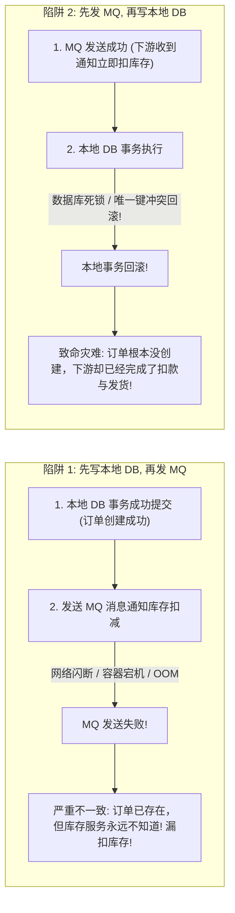
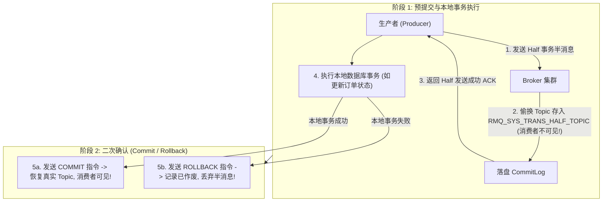
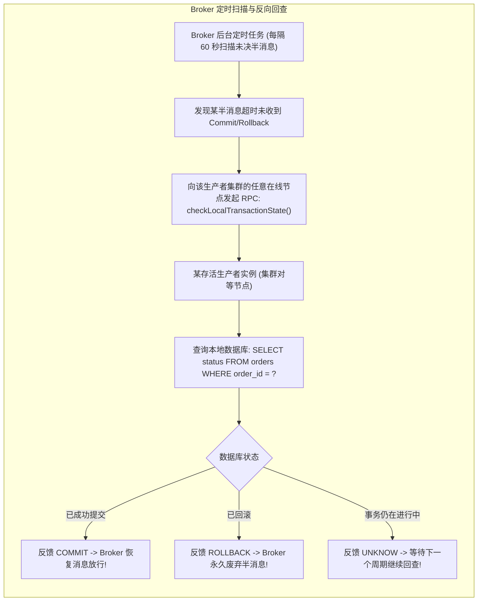

**TL;DR：** 在微服务架构中，“本地数据库事务”与“跨网络发送消息”之间的 **双写一致性困境（Dual-Write Dilemma）** 是每个后端架构师的梦魇：如果先写数据库再发 MQ，一旦在发消息瞬间物理网络发生闪断或进程 OOM 崩溃，**下游消费者将永远收不到通知，产生严重的数据断层（丢失更新）**；反之，如果先发 MQ 再写数据库，一旦本地事务在提交时遭遇唯一键冲突或死锁回滚，**下游消费者却早已将该消息消费并执行了扣款或发货，造成不可逆的巨额资损（幽灵消息）**！而传统的强一致性方案（XA / 2PC）由于性能极差、跨网络持锁时间长，在高并发场景下形同自杀。为了破局，**Apache RocketMQ** 开创了殿堂级的 **半消息机制（Half Message Protocol）**：生产者先向 Broker 发送一个对消费者物理不可见的“半消息”（Broker 在底层将消息的目标 Topic 偷换为内部私有的 `RMQ_SYS_TRANS_HALF_TOPIC`）；待半消息持久化成功后，生产者才执行本地数据库事务；本地事务成功则发送 Commit，由 Broker 将消息恢复为真实 Topic 放行给下游消费。若在 Commit 阶段发生网络断连，**Broker 在 60 秒后会主动向生产者的同组实例发起“反向事务状态回查”（Reverse Status Check）**——不仅彻底消除了分布式事务的阻塞开销，更以优雅的最终一致性保障了资金级的核心安全。

---

## 一、 双写困境的第一性原理：为什么常规方案必将产生脏数据？

在没有事务消息支持的系统中，尝试在一个业务方法内同时操作本地数据库和消息队列，必然面临以下两难绝境：



无论哪种顺序，**只要本地存储与远程网络不是同一个原子上下文，单点崩溃就必然导致分布式状态撕裂！**

---

## 二、 RocketMQ 半消息协议的两阶段交互流程

RocketMQ 事务消息的核心架构分为两个阶段：



### 1. 内部 Topic 偷换机制的底层细节

当 Broker 收到一条标记为事务消息的数据时：
- Broker 在将数据写入 `CommitLog` 前，先将消息原本的 `Topic`（例如 `Order_Paid_Topic`）和 `QueueId` 存入消息的扩展属性属性表（`UserProperties`）中；
- 强行将该消息的真实路由篡改为内部隐藏的 **`RMQ_SYS_TRANS_HALF_TOPIC`**；
- 正常的消费者只监听业务 Topic，完全不知道 `HALF_TOPIC` 的存在，**在物理上实现了消息虽然已持久化防丢、但下游绝对不可见的完美隔离！**

---

## 三、 反向状态回查机制（Reverse Transaction Status Check）

如果生产者在执行完本地事务、向 Broker 发送 `COMMIT` 指令的过程中，**网络突然中断，或者生产者宿主机直接断电宕机**，这笔交易的状态会悬挂死锁吗？

**绝不会！RocketMQ 拥有独步业界的反向回查机制：**



### 1. 回查上限与死信队列（DLQ）

- Broker 不会无休止地回查同一个半消息；
- 默认回查上限为 **15 次**（`transactionCheckMax = 15`）；
- 若经过 15 次回查后生产者依然返回 `UNKNOW` 或无法联通，Broker 会将该半消息强行归档移入 **死信队列（Dead-Letter Queue, DLQ）** 并触发 P0 级严重报警，留待人工运维介入平账。

---

## 四、 生产级 C++20 分布式事务消息状态机与回查仿真

以下代码用现代 C++20 完整实现了 RocketMQ 事务消息两阶段协议：包括内部 Half Topic 隐藏、断网导致的 Commit 丢失、以及 Broker 定时反向回查最终实现一致性的完整状态机闭环：

```cpp
#include <iostream>
#include <vector>
#include <string>
#include <unordered_map>
#include <chrono>
#include <memory>
#include <iomanip>
#include <cstdint>

enum class LocalTxState {
    SUCCESS,
    FAILED,
    IN_PROGRESS
};

enum class MessageStatus {
    HALF_PENDING,
    COMMITTED,
    ROLLBACK
};

struct TransactionalMessage {
    uint64_t msg_id;
    std::string original_topic;
    std::string current_topic;
    std::string payload;
    MessageStatus status;
    int check_count{0};
};

class MockDatabase {
public:
    std::unordered_map<uint64_t, LocalTxState> order_records;

    void insert_order(uint64_t order_id, LocalTxState state) {
        order_records[order_id] = state;
    }

    LocalTxState query_order_status(uint64_t order_id) {
        auto it = order_records.find(order_id);
        if (it != order_records.end()) {
            return it->second;
        }
        return LocalTxState::FAILED;
    }
};

class RocketMqBroker {
private:
    std::unordered_map<uint64_t, TransactionalMessage> half_message_store;
    std::vector<TransactionalMessage> visible_consumer_queue;

public:
    // 阶段 1: 接收半消息并偷换 Topic
    uint64_t receive_half_message(const std::string& real_topic, const std::string& payload, uint64_t msg_id) {
        TransactionalMessage msg = {
            .msg_id = msg_id,
            .original_topic = real_topic,
            .current_topic = "RMQ_SYS_TRANS_HALF_TOPIC", // 偷换为内部隐藏 Topic!
            .payload = payload,
            .status = MessageStatus::HALF_PENDING,
            .check_count = 0
        };
        half_message_store[msg_id] = msg;
        return msg_id;
    }

    // 阶段 2: 接收正常 Commit / Rollback 指令
    void resolve_transaction(uint64_t msg_id, bool commit) {
        auto it = half_message_store.find(msg_id);
        if (it != half_message_store.end()) {
            if (commit) {
                it->second.status = MessageStatus::COMMITTED;
                it->second.current_topic = it->second.original_topic; // 恢复原始 Topic
                visible_consumer_queue.push_back(it->second);         // 消费者正式可见！
            } else {
                it->second.status = MessageStatus::ROLLBACK;
            }
        }
    }

    // 阶段 3: 反向事务状态回查机制 (模拟网络闪断后 Broker 主动补偿)
    void execute_transaction_check(MockDatabase& db) {
        for (auto& [id, msg] : half_message_store) {
            if (msg.status == MessageStatus::HALF_PENDING) {
                msg.check_count++;
                // 模拟向生产者实例发起 RPC 询问本地 DB 状态
                LocalTxState db_state = db.query_order_status(msg.msg_id);

                if (db_state == LocalTxState::SUCCESS) {
                    msg.status = MessageStatus::COMMITTED;
                    msg.current_topic = msg.original_topic;
                    visible_consumer_queue.push_back(msg);
                    std::cout << "  [Broker 回查成功]: 发现本地 DB 订单 #" << msg.msg_id 
                              << " 已经成功提交，自动补偿执行 COMMIT，放行消息！\n";
                } else if (db_state == LocalTxState::FAILED) {
                    msg.status = MessageStatus::ROLLBACK;
                    std::cout << "  [Broker 回查成功]: 发现本地 DB 订单 #" << msg.msg_id 
                              << " 已回滚，自动补偿执行 ROLLBACK，废弃半消息！\n";
                }
            }
        }
    }

    size_t get_visible_messages_count() const { return visible_consumer_queue.size(); }
};

int main() {
    std::cout << "==========================================================\n";
    std::cout << "   RocketMQ 分布式事务消息与反向回查补偿状态机仿真\n";
    std::cout << "==========================================================\n\n";

    RocketMqBroker broker;
    MockDatabase db;

    uint64_t order_1001 = 1001;

    std::cout << "[流程 1]: 生产者发送 Half 半消息至 Broker\n";
    broker.receive_half_message("ORDER_PAY_TOPIC", "Payload: Order 1001 Paid $299", order_1001);
    std::cout << "  -> 半消息已安全写入 CommitLog，但由于处于 HALF_TOPIC，当前消费者可见消息数: " 
              << broker.get_visible_messages_count() << " (消费者完全不可见，杜绝幽灵消息!)\n\n";

    std::cout << "[流程 2]: 生产者执行本地事务 (写入订单数据库)\n";
    db.insert_order(order_1001, LocalTxState::SUCCESS);
    std::cout << "  -> 本地数据库订单 #1001 事务提交成功！\n\n";

    std::cout << "[流程 3: 异常注入]: 生产者在发送 COMMIT 指令给 Broker 时，网络光纤发生闪断！\n";
    std::cout << "  -> 模拟网络包丢失，Broker 未能收到第二次确认，半消息继续挂起...\n";
    std::cout << "  -> 此时消费者依然无法读取该消息，当前可见数: " 
              << broker.get_visible_messages_count() << "\n\n";

    std::cout << "[流程 4: 兜底自愈]: 经过 60 秒，Broker 后台线程激活反向事务状态回查\n";
    broker.execute_transaction_check(db);

    std::cout << "\n[最终对账结果]:\n";
    std::cout << "  消费者成功接收到的可消费消息数: " << broker.get_visible_messages_count() << "\n";
    std::cout << "\n==========================================================\n";
    std::cout << "[架构结论]: RocketMQ 反向回查成功在无分布式锁的约束下达成了最终一致性！\n";
    return 0;
}
```

---

## 五、 消费者幂等性：最终一致性的最后一块拼图

很多工程师误以为：“既然有了事务消息，消费者端就可以随心所欲，绝对不会重复了吗？”

**答案是残酷的：事务消息仅保证了“生产者与 Broker 之间的最终一致”，无法保证“消费者的 Exactly-Once”！**
- 消费者在成功处理完业务逻辑后，向 Broker 发送消费确认 ACK 时，同样可能发生网络丢包；
- Broker 在超时未收到 ACK 时，必然会再次将消息推给另一个消费者实例（**至少一次投递语义，At-Least-Once**）；
- **生产铁律**：消费者在消费事务消息时，**必须在业务代码中基于唯一业务主键（如 `order_id`）做幂等去重表（Idempotency Table）或 Redis 唯一防重检查**，才能真正铸造端到端绝对一致性的钢铁闭环。
