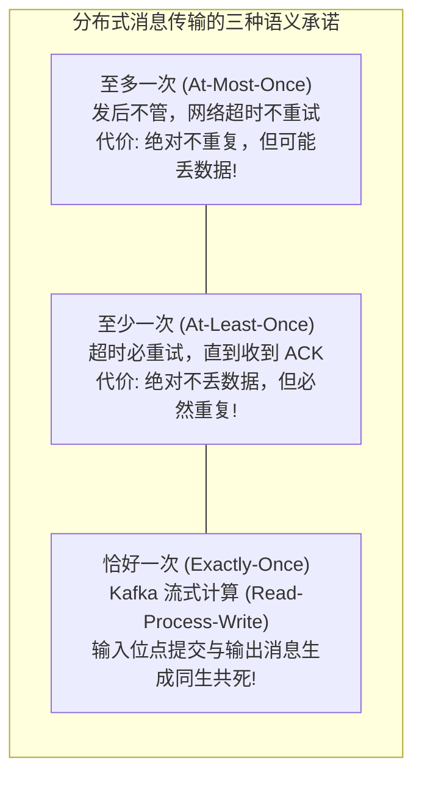
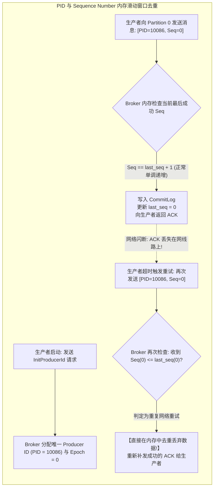
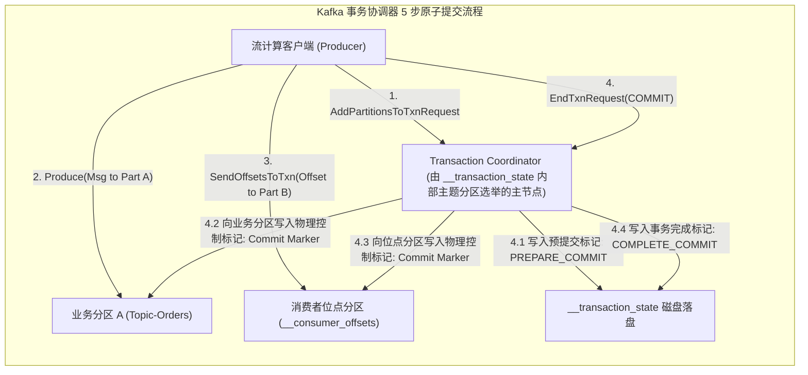
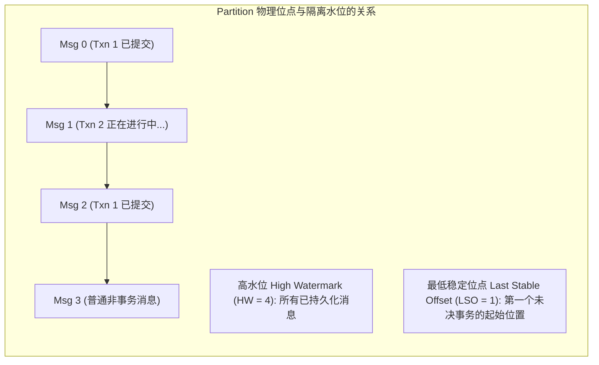

**TL;DR：** 在分布式计算领域，**“端到端恰好一次”（End-to-End Exactly-Once Processing, EOS）** 曾长期被学术界视为不可能实现的物理悖论：由于网络传输不可靠（两将军问题），在面对 ACK 丢失时，如果生产者不重试就会导致 **至少丢失一次（At-Most-Once）**；如果生产者超时重试就会导致消息重复被投递并引发数据翻倍（**至少一次，At-Least-Once**）。2017 年，Apache Kafka 在 0.11 版本（KIP-98）中正式发布了革命性的 **EOS 支持**。它并没有打破分布式系统的物理公理，而是通过将问题域严格收敛在“Kafka 内部流式数据读-改-写闭环（Read-Process-Write）”之中，构建了三层坚不可摧的工程防线：**1）单分区幂等性**——Broker 赋予每个生产者全局唯一的 64 位 `Producer ID (PID)`，并为每条消息打上单调递增的 `Sequence Number`，Broker 在内存中维护最近滑动窗口，一旦收到 `seq <= last_seq` 的重传请求，在内存中直接去重丢弃并无损返回 ACK；**2）跨分区原子事务**——引入基于内部主题 `__transaction_state` 的 **事务协调器（Transaction Coordinator）**，通过两阶段提交（2PC）协议向目标分区写入特殊的控制批标记（Control Batch）；**3）隔离读取**——配置 `read_committed` 的消费者严格卡在 **最低稳定位点（Last Stable Offset, LSO）**，通过 `.txnindex` 中止事务索引表直接跳过已回滚的废弃消息，最终实现了端到端绝对精确、零丢失、零重复的数据闭环！

---

## 一、 语义分类与物理边界：EOS 到底承诺了什么？

在评估 Exactly-Once 之前，必须击碎对它的神话臆想：**世界上没有任何技术能保证向外部三方系统（如发送短信、调用微信支付接口）产生物理副作用时也是 Exactly-Once 的！**



Kafka 的 EOS 解决的核心场景是：**从 Topic A 消费消息，经过业务处理后写入 Topic B，同时提交 Topic A 的消费位点（Offset）。这三件事要么全部原子成功，要么全部回滚！**

---

## 二、 单分区幂等生产者：PID 与 Sequence Number 的无锁去重

要消除生产者的重复消息，最底层的基石是 **幂等生产者（Idempotent Producer）**。



### 1. 为什么不需要昂贵的全量磁盘哈希表？

许多系统在做去重时，喜欢用全局哈希表（如 Redis 或 RocksDB）把每个消息的 MD5/UUID 记录下来，这会导致巨大的存储膨胀和索引查询延迟。
- Kafka 的设计极其精妙：**只记录单调递增的序列号！**
- Broker 只需要为每个 `(PID, TopicPartition)` 在内存中保留一个 **大小为 5 的极小滑动窗口**；
- 只有满足 `incoming_seq == last_seq + 1` 的消息才被允许写入；
- 若 `incoming_seq <= last_seq`，说明是因网络重传带来的旧消息，直接丢弃；
- 若 `incoming_seq > last_seq + 1`，说明发生了严重的网络乱序断层（可能有中间消息在传输中丢失），Broker 立即抛出 `OutOfOrderSequenceException` 强制生产者自愈。

---

## 三、 跨分区原子事务：事务协调器（Transaction Coordinator）

当业务需要跨越多个不同的 Topic 或 Partition 进行原子操作时，单一分区的 Sequence 机制不足以保证全局原子性。此时必须引入 **事务协调器（Transaction Coordinator）**：



### 1. 物理控制批（Control Batch）的魔法

在 Kafka 的底层存储中，事务标记不是一个简单的虚拟概念，而是被真正作为一种特殊的消息类型写入磁盘的：
- 它在消息头中将 `attributes` 的 Control 标志位置 1；
- 这种 **Control Batch（提交标记 / 中止标记）** 紧随在真正的业务消息后面落盘；
- 无论系统何时崩溃重启，Broker 只需要顺序扫描数据流，看到对应的 Commit/Abort Marker，就能 100% 确定前置批次事务的最终命运。

---

## 四、 隔离读取：最低稳定位点（LSO）与中止索引

消费者配置 `isolation.level = read_committed` 后，它是如何做到既不读到脏数据、又能维持高吞吐的呢？



- **LSO（Last Stable Offset）防线**：
  消费者绝对不能越过 LSO 读取尚未决出胜负的并发事务消息；消费者只能读取位点小于 LSO 的数据，从数学上杜绝了脏读（Dirty Read）；
- **`.txnindex` 中止事务索引**：
  如果某个事务最终被执行了 `ABORT`，Broker 并不会去物理删除已经写入磁盘的 `CommitLog`（这会破坏极速顺序写）；
  相反，Broker 会在独立的 `.txnindex` 文件中记录被中止事务的 `[PID, FirstOffset, LastOffset]` 范围；
  消费者客户端在内存中根据该索引，在拉取消息时**瞬时跳过（Filter Out）这些被废弃的中止数据**！

---

## 五、 生产级 C++20 EOS 状态机与 PID 序列去重仿真

以下代码用现代 C++20 完整实现了：单分区基于 PID + Sequence Number 的内存滑动窗口去重、事务标记写入、以及消费者仅读取 Committed 消息的完整 EOS 闭环：

```cpp
#include <iostream>
#include <vector>
#include <string>
#include <unordered_map>
#include <chrono>
#include <memory>
#include <iomanip>
#include <cstdint>

// 消息类型定义
enum class RecordType {
    DATA,
    CONTROL_COMMIT,
    CONTROL_ABORT
};

struct KafkaRecord {
    uint64_t offset;
    uint64_t producer_id;
    int32_t sequence_number;
    RecordType type;
    std::string payload;
};

class PartitionLog {
private:
    std::vector<KafkaRecord> commit_log;
    // 内存中维护每个 ProducerID 的最后成功序列号
    std::unordered_map<uint64_t, int32_t> producer_sequences;
    uint64_t next_offset{0};

public:
    // 幂等追加写入
    bool append_data(uint64_t pid, int32_t seq, const std::string& data) {
        auto it = producer_sequences.find(pid);
        if (it != producer_sequences.end()) {
            int32_t last_seq = it->second;
            if (seq <= last_seq) {
                // 核心去重：检测到旧的网络重传，内存中直接去重，返回成功 ACK
                return true; 
            } else if (seq > last_seq + 1) {
                // 乱序断层异常
                return false;
            }
        } else {
            // 首次发送必须从 0 开始
            if (seq != 0) return false;
        }

        // 正常追加落盘
        KafkaRecord rec = {
            .offset = next_offset++,
            .producer_id = pid,
            .sequence_number = seq,
            .type = RecordType::DATA,
            .payload = data
        };
        commit_log.push_back(rec);
        producer_sequences[pid] = seq; // 更新最后有效 Sequence
        return true;
    }

    void append_commit_marker(uint64_t pid) {
        KafkaRecord marker = {
            .offset = next_offset++,
            .producer_id = pid,
            .sequence_number = -1,
            .type = RecordType::CONTROL_COMMIT,
            .payload = "TXN_COMMIT_MARKER"
        };
        commit_log.push_back(marker);
    }

    // 模拟 Read-Committed 消费
    std::vector<KafkaRecord> read_committed_messages() {
        std::vector<KafkaRecord> visible;
        for (const auto& rec : commit_log) {
            if (rec.type == RecordType::DATA) {
                visible.push_back(rec);
            }
        }
        return visible;
    }

    size_t get_physical_log_size() const { return commit_log.size(); }
};

int main() {
    std::cout << "==========================================================\n";
    std::cout << "   Kafka EOS 生产者幂等去重与事务控制标记仿真\n";
    std::cout << "==========================================================\n\n";

    PartitionLog partition;
    uint64_t producer_101 = 101;

    std::cout << "[步骤 1]: 生产者连续发送 3 条消息 (Seq 0, 1, 2)\n";
    partition.append_data(producer_101, 0, "Event A: Order Created");
    partition.append_data(producer_101, 1, "Event B: Inventory Reserved");
    partition.append_data(producer_101, 2, "Event C: Points Deducted");
    std::cout << "  -> 物理落盘日志数: " << partition.get_physical_log_size() << "\n\n";

    std::cout << "[步骤 2: 网络异常注入]: 生产者发送 Seq 1 时遭遇网络丢包假死，触发重传\n";
    std::cout << "  -> 生产者重传发送 [PID=101, Seq=1]\n";
    bool ret = partition.append_data(producer_101, 1, "Event B: Inventory Reserved (Duplicate)");
    std::cout << "  -> Broker 处理结果: " << (ret ? "成功返回 ACK (内存中智能去重，未写入多余记录!)" : "失败") << "\n";
    std::cout << "  -> 当前物理日志数依然为: " << partition.get_physical_log_size() 
              << " (零重复落盘，完美去重!)\n\n";

    std::cout << "[步骤 3]: 事务协调器向分区写入 COMMIT 控制批标记\n";
    partition.append_commit_marker(producer_101);
    std::cout << "  -> 控制批标记已追加落盘，物理日志总数: " << partition.get_physical_log_size() << "\n\n";

    std::cout << "[步骤 4]: 消费者以 read_committed 模式拉取消费:\n";
    auto messages = partition.read_committed_messages();
    for (size_t i = 0; i < messages.size(); ++i) {
        std::cout << "  #" << i << " [Offset=" << messages[i].offset 
                  << ", Seq=" << messages[i].sequence_number << "] " 
                  << messages[i].payload << "\n";
    }

    std::cout << "\n==========================================================\n";
    std::cout << "[架构结论]: PID + Sequence 从底层终结了分布式重试产生的重复垃圾！\n";
    return 0;
}
```

---

## 六、 总结与生产性能代价

在启用 EOS 时，必须清晰认识到它的性能取舍：
1. **网络吞吐量影响**：单分区开启幂等性（`enable.idempotence = true`）在现代 Kafka 中**性能损失通常小于 3%**，因为去重完全在 Broker 内存的 5 个整型滑动槽位中判定，生产环境应**默认强制开启**；
2. **跨分区事务开销**：开启跨分区事务（Transactional API）会产生额外的事务协调器 RPC 与 Control Batch 落盘，端到端延迟可能增加 **10ms~20ms**，吞吐量约下降 **15%~25%**；
3. **架构选型原则**：
   - 纯日志、遥测监控流：采用默认的 At-Least-Once，换取单机极致的数百万 QPS 吞吐；
   - 金融记账、电商订单流：毫不犹豫地全面开启 EOS，用极小的延迟开销换取绝对的数据纯洁性。
