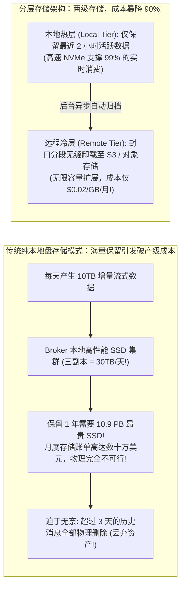
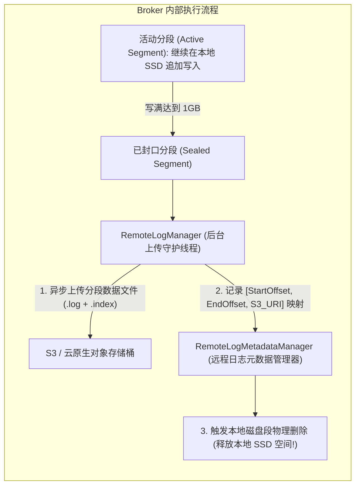
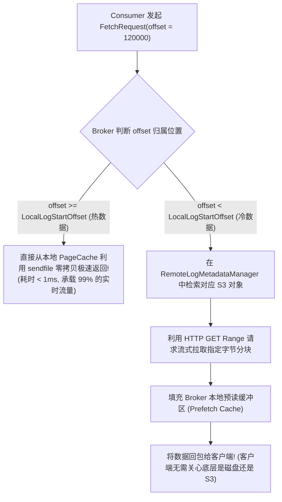
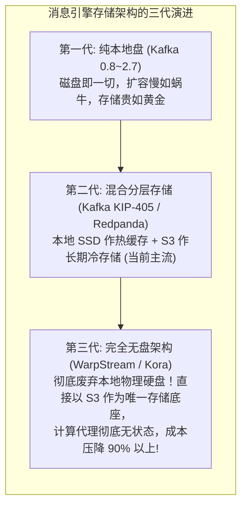

**TL;DR：** 在长达十年的时间里，分布式消息队列的生命周期管理一直被一个残酷的物理现实所绑架——**“本地磁盘容量墙”**。由于高性能 NVMe SSD 硬盘价格极其昂贵（算上三副本与云盘开销，每月每 TB 成本高达数百美元），企业不得不将消息保留期严格限制在 **24~72 小时**，一旦超出期限，无论数据多么珍贵都必须被操作系统无情地物理删除。然而，在大模型时代与现代数据湖仓架构中，数据科学家与开发团队迫切希望保留 **数月甚至数年的全量流式事件**，以便用于实时流重放（Replay）、历史指标回溯（Backfilling）以及大模型预训练数据挖掘。为了终结“昂贵本地盘”与“海量长期保留”的不可调和矛盾，**分层存储（Tiered Storage，如 Kafka KIP-405 / Apache Pulsar / Redpanda）** 应运而生：它将存储解耦为 **本地热数据层（Local Tier）** 与 **远程冷数据层（Remote Tier）**——最近数小时的热消息在高速本地 NVMe 上利用 PageCache 提供微秒级吞吐；一旦 Segment 文件写满封口，后台守护线程立即将其**异步推送到成本仅为本地盘十分之一的云对象存储（AWS S3 / 阿里云 OSS / Ceph）**，随后在本地物理删除腾出空间！更惊艳的是，**对客户端而言整个物理下沉过程 100% 透明**——无论拉取 5 秒前的数据还是 5 个月前的数据，API 接口与 Offset 位点空间完全无缝平滑！

---

## 一、 存储经济学困境：昂贵本地盘与无限保留的冲突

传统的 Kafka 架构中，数据保留时间由 `log.retention.hours` 控制。为什么不能直接把这个值改成 1 年？



### 1. 物理成本的降维打击

- **本地企业级 NVMe SSD（含三副本冗余）**：约 **$200 ~ $300 / TB / 月**；
- **AWS S3 标准对象存储（自带跨可用区高持久性）**：约 **$23 / TB / 月**；
- **S3 归档冷存储（Glacier）**：约 **$4 / TB / 月**。

引入分层存储后，本地磁盘仅作为轻量级的“读写环形缓冲区（Circular Buffer）”，**整体集群的存储成本直接下降 85% ~ 95%**，且获得了理论上无限的历史数据回溯能力！

---

## 二、 KIP-405 分层存储核心架构与元数据流转

在 Kafka 2.8+ 引入的 KIP-405 中，分层存储通过两个核心内核组件驱动：



### 1. 双层位点空间（Dual Offset Space）

- **本地日志起始位点（`LocalLogStartOffset`）**：本地 SSD 上还保留的最早消息偏移量；
- **日志起始位点（`LogStartOffset`）**：整条逻辑日志的起始偏移量（可能指向 1 年前存储在 S3 上的数据）；
- **高水位线（`HighWatermark`）**：当前最新写入的消息偏移量。

---

## 三、 客户端完全透明的读取寻址路径

对于消费端应用程序（如 Flink、Spark、业务微服务），分层存储的设计遵循 **零侵入契约（Zero Client-Side Impact）**：



### 1. HTTP S3 Range 字节分块加速

- 历史回溯读取并不需要把整整 1GB 的冷分段完全下载到本地磁盘；
- Broker 利用 S3 协议标准的 `Range: bytes=start-end` 头部，**仅流式按需获取当前批次所需的几百 KB 数据**；
- 配合流式预取与本地 LRU 块缓存，即使从 S3 深度回溯历史数据，消费吞吐量依然能稳定跑满千兆带宽。

---

## 四、 生产级 C++20 分层存储引擎与透明寻址仿真

以下代码用现代 C++20 完整实现了一个包含本地 NVMe 环形缓冲区、封口段向 S3 异步卸载、以及客户端透明位点寻址的生产级分层存储引擎：

```cpp
#include <iostream>
#include <vector>
#include <string>
#include <unordered_map>
#include <chrono>
#include <memory>
#include <iomanip>
#include <algorithm>
#include <cstdint>

// 模拟 S3 对象存储上的远程分段元数据
struct RemoteSegmentMetadata {
    uint64_t start_offset;
    uint64_t end_offset;
    std::string s3_object_key;
    std::vector<std::string> s3_data_payload; // 模拟 S3 存储内容
};

class TieredStorageEngine {
private:
    // 1. 本地热存储层 (仅容纳最近的有限消息)
    std::unordered_map<uint64_t, std::string> local_hot_storage;
    uint64_t local_log_start_offset{0};
    uint64_t next_offset{0};

    // 2. 远程冷存储层 (S3 对象池)
    std::vector<RemoteSegmentMetadata> remote_segments;

    const size_t LOCAL_CAPACITY_LIMIT = 5; // 本地磁盘最多存 5 条，超额立即卸载至 S3

public:
    // 写入消息 (永远先写本地热存储)
    uint64_t append_message(const std::string& msg) {
        uint64_t offset = next_offset++;
        local_hot_storage[offset] = msg;

        // 若本地热数据达到阈值，触发分段封口并卸载到 S3
        if (local_hot_storage.size() > LOCAL_CAPACITY_LIMIT) {
            offload_oldest_segment_to_s3();
        }

        return offset;
    }

    // 将最早的分段异步推入 S3 并从本地删除
    void offload_oldest_segment_to_s3() {
        uint64_t seg_start = local_log_start_offset;
        uint64_t seg_end = seg_start + 2; // 假设每 3 条作为一个 Segment

        RemoteSegmentMetadata meta;
        meta.start_offset = seg_start;
        meta.end_offset = seg_end;
        meta.s3_object_key = "s3://kafka-cold-bucket/topic-orders/seg-" + std::to_string(seg_start);

        for (uint64_t off = seg_start; off <= seg_end; ++off) {
            meta.s3_data_payload.push_back(local_hot_storage[off]);
            // 从本地磁盘物理清除！
            local_hot_storage.erase(off);
        }

        remote_segments.push_back(meta);
        local_log_start_offset = seg_end + 1; // 提升本地起点

        std::cout << "  [分层存储事件]: 分段 [" << seg_start << " - " << seg_end 
                  << "] 已成功卸载至 S3 对象存储，本地磁盘空间已释放！\n";
    }

    // 客户端透明读取 (无论在本地还是在 S3，统一按 Offset 返回)
    std::string fetch_message(uint64_t offset) {
        // 判定 1: 命中本地热数据层
        if (offset >= local_log_start_offset) {
            auto it = local_hot_storage.find(offset);
            if (it != local_hot_storage.end()) {
                return "[来自本地 NVMe SSD (零拷贝极速)]: " + it->second;
            }
        }

        // 判定 2: 穿透至远程 S3 冷数据层
        for (const auto& seg : remote_segments) {
            if (offset >= seg.start_offset && offset <= seg.end_offset) {
                size_t idx = offset - seg.start_offset;
                return "[来自远程 S3 对象存储 (流式 Range 拉取)]: " + seg.s3_data_payload[idx];
            }
        }

        return "OFFSET_OUT_OF_BOUNDS";
    }

    uint64_t get_local_start() const { return local_log_start_offset; }
    size_t get_local_size() const { return local_hot_storage.size(); }
    size_t get_remote_segments_count() const { return remote_segments.size(); }
};

int main() {
    std::cout << "==========================================================\n";
    std::cout << "   Kafka 分层存储 (Tiered Storage) 冷热解耦仿真\n";
    std::cout << "==========================================================\n\n";

    TieredStorageEngine engine;

    std::cout << "[流程 1]: 连续生产 8 条消息 (触发本地热盘容量超限与 S3 卸载)\n";
    for (int i = 0; i < 8; ++i) {
        engine.append_message("Order-Event-Payload-#" + std::to_string(i));
    }

    std::cout << "\n当前存储状态分布:\n";
    std::cout << "  -> 本地 NVMe 保留的最新消息起始位点: " << engine.get_local_start() << "\n";
    std::cout << "  -> 本地 SSD 当前实际占用条数: " << engine.get_local_size() << " (容量被严格压制在安全阈值)\n";
    std::cout << "  -> 远程 S3 存储的已归档分段数: " << engine.get_remote_segments_count() << " 个\n\n";

    std::cout << "[流程 2]: 客户端发起透明读取 (统一的 Offset 寻址抽象)\n";

    // 1. 读取 1 分钟前的历史冷消息 (Offset = 1，已卸载至 S3)
    std::cout << "读取历史 Offset 1: " << engine.fetch_message(1) << "\n";

    // 2. 读取刚刚写入的实时热消息 (Offset = 7，依然在本地 NVMe)
    std::cout << "读取实时 Offset 7: " << engine.fetch_message(7) << "\n";

    std::cout << "\n==========================================================\n";
    std::cout << "[架构结论]: 分层存储消除了本地磁盘物理墙，实现了接近零成本的无限保留！\n";
    return 0;
}
```

---

## 五、 行业变革：WarpStream 与 Redpanda 的架构激进演进

分层存储的思想正在彻底重构整个消息队列领域的商业版图：



- **Redpanda Shadow Indexing**：以 C++ 重写的 Redpanda 将分层存储提升为一等公民，通过内建的 S3 上传流控，实现万兆吞吐下的平滑冷热迁移；
- **WarpStream 的“零本地盘”终局**：直接打破了“写入必须先落本地盘”的传统教条，所有批次直接借由高速内网并发灌入云对象存储，将 Kafka Broker 的运维复杂度降为完全无状态的普通 Docker 容器。

---

## 六、 系列完结总结：掌控现代高并发消息引擎的底层灵魂

随着本篇的落幕，《现代高并发消息引擎内核：从磁盘顺序写到分布式事务消息》全系列 6 篇文章画上了圆满的句号：
1. **顺序写与零拷贝**：揭开了 PageCache 预读、DMA 散布收集与 `sendfile` 绕过内核的数据面极速通道；
2. **高性能时间轮**：溯源 Varghese 1987 经典论文，以钟表齿轮的降级级联实现了千万级延迟消息的 $O(1)$ 调度；
3. **存算分离架构**：以 Apache Pulsar 与 BookKeeper 的两层解耦，终结了困扰业界十年的分区重平衡风暴；
4. **分布式事务消息**：拆解 RocketMQ 两阶段半消息与反向状态回查，奠定了微服务最终一致性的金标准；
5. **端到端 Exactly-Once**：推导 PID + Sequence 内存去重、事务协调器与 LSO 隔离防线，达成了流计算的圣杯；
6. **现代分层存储**：融合本地 NVMe 与云端 S3 对象存储，打破了物理磁盘容量与存储成本的天然天花板。

消息引擎是现代分布式系统的心脏与大动脉。穿透这些表层 API，洞悉操作系统、内存总线、磁盘几何与网络协议在极限高并发下的物理共振，你便掌握了架构演进中最坚实、最不随框架更迭而过时的核心力量！
