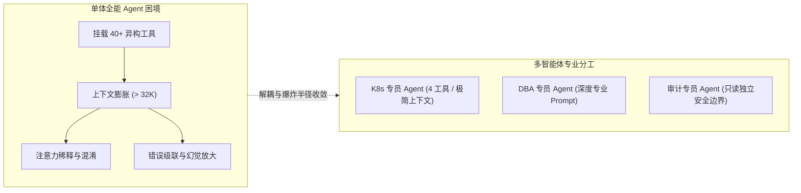
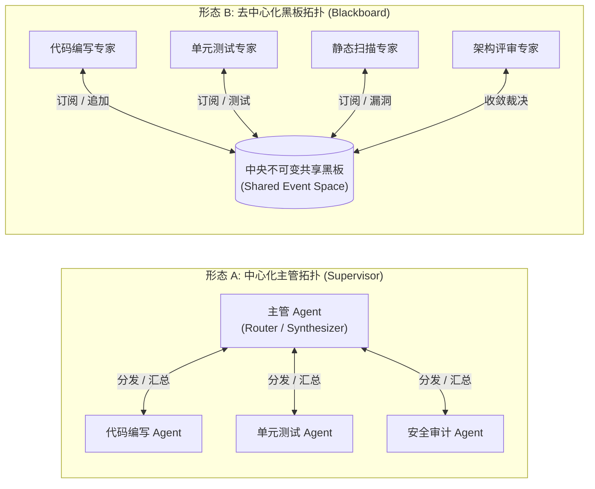
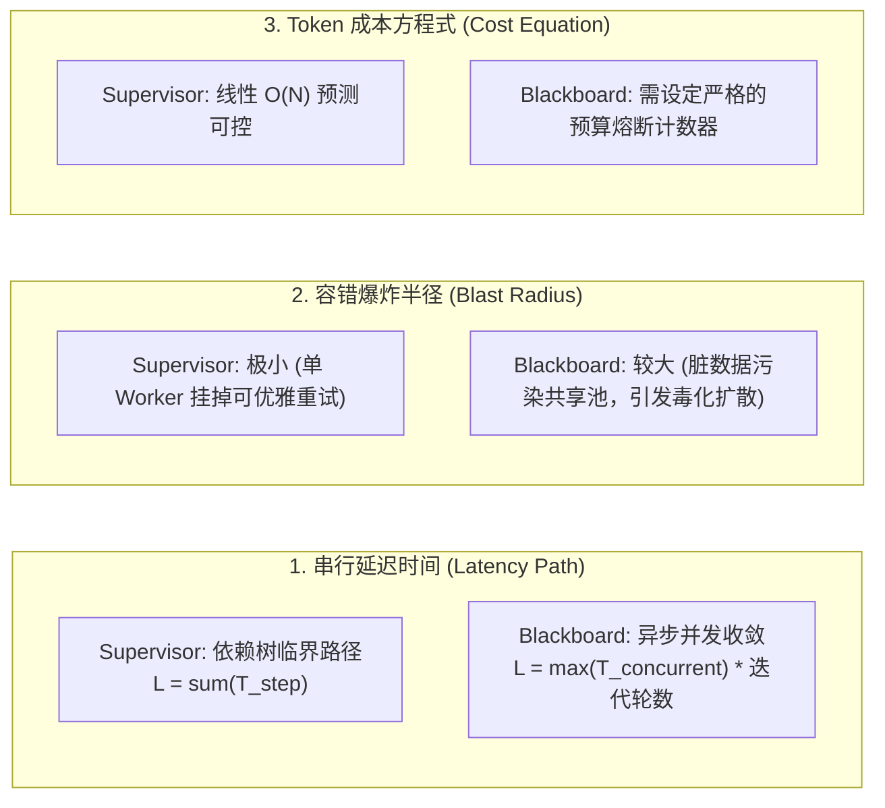

**TL;DR：** 当单一智能体被挂载超过 20 个工具、执行跨数十个步骤的复杂工程（如全自动端到端软件开发、企业级财报深度审计）时，**单体 Agent（Monolithic Agent）会必然遭遇上下文注意力稀释与错误级联放大（Error Cascading）的双重物理绝境**。将单体拆分为多智能体（Multi-Agent Systems, MAS）已经成为 2026 年行业共识，但在分布式拓扑设计上存在两大截然不同的流派：**中心化层级编排模式（Hierarchical Supervisor）** 采用树状控制流，通信复杂度严格维持在优雅的 $O(N)$，具备极佳的确定性与调试能力，但存在主管节点的“认知漏斗瓶颈”；**去中心化黑板模式（Blackboard Pattern）** 采用事件驱动总线与知识源（Knowledge Sources）自发认领机制，摆脱了单点调度约束，适合非线性探索任务，但通信开销在最坏情况下膨胀至 $O(N^2)$ 并伴随状态收敛震荡风险。架构师必须根据任务图的有向无环性（DAGness）、容错爆炸半径与延迟预算，选择确定性 Supervisor 或是自适应 Blackboard 混合拓扑。

---

## 一、面试切入：工具越多越蠢？单体 Agent 为什么必须走向多智能体？

> **面试高频考题：**  
> “在开发一个企业级自主运维系统时，我们起初设计了一个全能型 Agent，把 Kubernetes 操作、MySQL 调优、Prometheus 监控排障和工单系统的 40 多个 Tool 全部塞给它。但在压测中发现：这个‘全能神’在处理线上事故时经常陷入幻觉，甚至在诊断网络慢查询时误删了数据库表。后来团队将其重构为多个垂直 Agent（K8s专家、DBA专家、网关专家）。但在多 Agent 组织上，应该采用像 LangGraph / AutoGen 那样的层级主管（Supervisor）模式，还是采用类似微服务事件总线的黑板（Blackboard）模式？两者的通信复杂度、状态一致性与故障爆炸半径（Blast Radius）有何数学本质区别？”

这个题目直击多智能体系统与分布式架构的交汇核心。很多工程师以为“多 Agent 只是多写几个 Prompt 互相聊天”，完全没有意识到：**多智能体系统在本质上是一个典型的分布式协作状态机**。

如果不从拓扑学和通信复杂度的第一性原理进行顶层设计，盲目堆砌 Agent 只会将“单体的注意力崩溃”转化为更灾难性的“分布式通信死锁与上下文爆炸”。

---

## 二、单体 Agent 的物理认知极限：为什么必须解耦？

理解多 Agent 拓扑之前，必须先看名单体 Agent 在复杂业务下的两大物理死穴：



### 2.1 工具注意力稀释（Tool Attention Dilution）
当一个 Prompt 中塞入数十个 Tool Schema 时，大模型在计算注意力时，不同工具描述之间的向量表示会出现严重的语义重叠与干扰。模型经常在需要调用精确数据库索引检查时，错误触发了类似名称的全文检索工具，工具调用的召回率（Recall）与精度（Precision）呈非线性断崖式下跌。

### 2.2 错误级联与不可逆执念（Error Cascading）
单体 Agent 的决策流依赖自身的单一条历史上下文（Single Memory Track）：
* 一旦在第 3 步发生轻微的逻辑误判（例如误以为磁盘满是因为日志目录）；
* 在第 4~15 步的推理中，模型会**全力为第 3 步的错误假设寻找自洽理由**，即使后续工具返回的指标明显反驳该假设，模型也会强行通过自言自语（Rationalization）掩盖矛盾，最终在执念中越走越偏。

**引入多 Agent 的本质：不仅是专业分工，更是为了建立“独立的认知上下文隔离”与“跨智能体纠错审查机制”。**

---

## 三、拓扑学对决：层级主管模式（Supervisor） vs 去中心化黑板模式（Blackboard）

在将任务分配给多个专业 Agent 时，业界演化出了两种根本对立的拓扑流派。



---

### 3.1 形态 A：中心化层级编排（Hierarchical Supervisor）

* **控制哲学**：严格自顶向下的指令控制（Command and Control）。
* **执行流程**：
  1. 用户将高阶目标交付给顶层 **Supervisor Agent**；
  2. Supervisor 负责大纲拆解（Decomposition），维护全局任务进度图（Task DAG）；
  3. Supervisor 像调度器一样，逐个调用下游 Worker Agent，收集返回值；
  4. Worker 之间互不通信，所有信息交换均由 Supervisor 作为中继（Relay）。

#### 通信复杂度推导
设系统中有 $N$ 个专业 Worker Agent，完成一个包含 $M$ 个步骤的任务：
* 每个子任务只需由 Supervisor 发出 1 次调用并接收 1 次响应；
* 整体通信消息总数严格线性收敛：
  $$C_{\text{supervisor}} = 2 \cdot M = O(M) \quad (\text{当 } M \approx N \text{ 时，为 } O(N))$$
* **优势**：
  * **确定性强**：整个状态流转可以无缝映射为 LangGraph 的状态图或 Temporal 工作流，极其容易调试、重放与打断；
  * **权限受控**：Worker Agent 完全不需要网络出站权限，所有跨域交互受 Supervisor 严格把关；
  * **零死锁风险**：由于不存在对等环状调用，系统天然无死锁。
* **致命缺陷（认知漏斗瓶颈）**：
  * Supervisor 的上下文成为系统的物理天花板。如果所有 Worker 返回的万字报告都塞给 Supervisor 汇总，Supervisor 将最先遭遇 Token 窗口溢出与归纳丢失（Summarization Loss）。

---

### 3.2 形态 B：去中心化黑板协同（Blackboard Pattern）

* **控制哲学**：源自 1970 年代经典分布式 AI（Hearsay-II 语音识别系统）的事件驱动协作。
* **核心构件**：
  1. **黑板空间（Blackboard Space）**：一个全局可见的、结构化的不可变状态数据池（保存当前问题、已知事实、部分解与未解决假设）；
  2. **知识源（Knowledge Sources / Specialist Agents）**：每个专员 Agent 独立自治，像观察黑板的学者一样，**持续监听黑板状态变化**；
  3. **控制核（Controller / Arbiter）**：不直接分配任务，只负责管理黑板写入冲突与收敛终结判定。

#### 执行流程与通信复杂度
当“代码专家”在黑板上贴出一份初步实现方案时：
* “测试专家”立刻检测到新代码事件，自动拉取并生成测试用例贴回黑板；
* “安全专家”同时独立扫描该代码，并在黑板上标红指出 SQL 注入漏洞；
* “代码专家”发现自己的方案被标红，重新主动发起修改。

* **通信消息数量分析**：
  * 在完全自由的广播与自适应抢答模式下，每个 Agent 贴出的状态可能引发其他 $N-1$ 个 Agent 的联动反应；
  * 如果控制策略设计不当，系统消息数会发生**二次方组合爆炸**：
    $$C_{\text{blackboard}} = \sum_{i=1}^{R} N \cdot (N-1) \approx O(R \cdot N^2)$$
    其中 $R$ 为协同迭代轮数。
* **优势**：
  * **突破单点思维局限**：无需事先编排死板的流程图。面对复杂的科学研究、探索性 Debug 或复杂博弈，能够自发涌现（Emergence）出意想不到的破局路径；
  * **真正的并行性**：多个专家对同一问题的不同切面可以完全异步并发推进。
* **致命缺陷**：
  * **非确定性震荡**：A 觉得 B 的方案有问题，B 觉得 A 的补充有漏洞，若缺乏仲裁者（Arbiter）强行阻断，黑板系统极易陷入无限消耗 Token 的“学术争吵死循环”。

---

## 四、拓扑动力学指标推导：延迟、爆炸半径与成本

为了用严密的数学模型指导架构选型，我们建立多智能体系统的三大度量方程。



### 4.1 容错爆炸半径（Blast Radius）

在 Supervisor 拓扑中，Worker $A$ 执行异常返回崩溃堆栈，Supervisor 可以捕获该异常、实施单点重试（Retry）或优雅降级（Fallback）：
$$\text{BlastRadius}(\text{Supervisor}) = \text{Local Worker Context}$$

在 Blackboard 拓扑中，如果 Agent $A$ 产生了一段带有幻觉的错误推理并写入了全局黑板的“已确认事实”区，监听黑板的 Agent $B$ 和 Agent $C$ 会**基于该虚假事实继续推导**，导致脏数据像病毒一样迅速污染整个黑板上下文，系统最终彻底崩溃：
$$\text{BlastRadius}(\text{Blackboard}) = \text{Global Shared Context}$$
因此，黑板模式必须引入 **版本化分支与回滚（Branching & Time-Travel）机制**。

---

## 五、生产级 TypeScript 核心引擎实现

下面给出一个工业级可运行的多智能体拓扑引擎核心框架，支持在**“层级调度（Supervisor）”**与**“黑板事件订阅（Blackboard）”**之间无缝切换。

```typescript
// multi_agent_topology.ts
// 生产级多智能体拓扑核心抽象

export interface AgentMessage {
  id: string;
  sender: string;
  topic: string;
  payload: Record<string, unknown>;
  timestamp: number;
}

export interface AgentNode {
  name: string;
  roleDescription: string;
  handleTask(task: Record<string, unknown>): Promise<Record<string, unknown>>;
  onBlackboardUpdate?(event: AgentMessage, blackboard: BlackboardState): Promise<AgentMessage | null>;
}

// ==========================================
// 1. 结构化黑板状态空间 (Blackboard State)
// ==========================================
export class BlackboardState {
  private facts: Map<string, unknown> = new Map();
  private history: AgentMessage[] = [];
  private listeners: Array<(event: AgentMessage) => void> = [];

  public writeFact(key: string, value: unknown, sender: string): void {
    this.facts.set(key, value);
    const event: AgentMessage = {
      id: crypto.randomUUID(),
      sender,
      topic: `fact_updated:${key}`,
      payload: { key, value },
      timestamp: Date.now()
    };
    this.history.push(event);
    this.listeners.forEach((fn) => fn(event));
  }

  public getFact<T>(key: string): T | undefined {
    return this.facts.get(key) as T;
  }

  public subscribe(callback: (event: AgentMessage) => void): void {
    this.listeners.push(callback);
  }
}

// ==========================================
// 2. 层级主管协调器 (Hierarchical Supervisor)
// ==========================================
export class HierarchicalSupervisor {
  private workers: Map<string, AgentNode> = new Map();

  public registerWorker(worker: AgentNode): void {
    this.workers.set(worker.name, worker);
  }

  public async executePipeline(
    goal: string,
    executionPlan: Array<{ workerName: string; inputKey: string; outputKey: string }>
  ): Promise<Record<string, unknown>> {
    const pipelineContext: Record<string, unknown> = { goal };

    for (const step of executionPlan) {
      const worker = this.workers.get(step.workerName);
      if (!worker) {
        throw new Error(`找不到指定的 Worker 节点: ${step.workerName}`);
      }

      console.log(`[Supervisor] 正在调度任务给专员: ${worker.name}...`);
      const stepInput = {
        goal,
        inputData: pipelineContext[step.inputKey]
      };

      // 强隔离的子任务调用：O(N) 线性通信
      const stepResult = await worker.handleTask(stepInput);
      pipelineContext[step.outputKey] = stepResult;
      console.log(`[Supervisor] 专员 ${worker.name} 执行完成，上下文已归拢。`);
    }

    return pipelineContext;
  }
}

// ==========================================
// 3. 去中心化黑板协调器 (Blackboard Coordinator)
// ==========================================
export class BlackboardCoordinator {
  private blackboard = new BlackboardState();
  private agents: AgentNode[] = [];
  private maxIterations = 10;

  public registerAgent(agent: AgentNode): void {
    this.agents.push(agent);
    this.blackboard.subscribe(async (event) => {
      if (agent.onBlackboardUpdate && event.sender !== agent.name) {
        const response = await agent.onBlackboardUpdate(event, this.blackboard);
        if (response) {
          this.blackboard.writeFact(response.topic, response.payload, agent.name);
        }
      }
    });
  }

  public async solveProblem(initialFactKey: string, initialData: unknown): Promise<void> {
    console.log(`[Blackboard] 初始问题已张贴至黑板，触发知识源协同...`);
    this.blackboard.writeFact(initialFactKey, initialData, "SYSTEM");
  }
}
```

---

## 六、架构决策矩阵：什么时候选 Supervisor？什么时候选 Blackboard？

| 架构评估维度 | 中心化层级编排（Supervisor）| 去中心化黑板总线（Blackboard）|
| :--- | :--- | :--- |
| **任务目标性质** | **明确的流水线与有向无环图（DAG）** | **模糊探索、多假设求证或网状博弈** |
| **通信开销与复杂度**| **严格 $O(N)$ 线性受控，成本可精算** | 最坏情况 $O(N^2)$，需设置 Token 熔断计数器 |
| **状态一致性保障** | **极高（单点决策，顺序严格）** | 弱最终一致性（需引入仲裁者消解写冲突） |
| **调试与排障可观测性**| **极佳（调用链路完全确定，易加 Trace）**| 极难（事件驱动交织，难以还原绝对因果线） |
| **容错与爆炸半径** | 极小（单点崩溃就地重试/优雅降级） | 较大（错误假设易顺着事件流污染全盘） |
| **典型代表场景** | **CI/CD 自动化、客户工单路由、代码 Review 门禁** | **量化研报推演、渗透红蓝攻防对抗、复杂数学猜想证明** |

---

## 七、总结与拓扑选型决策树

多智能体架构并不是“越复杂越好”，拓扑学的核心在于**用最小的通信熵增换取最大的任务确定性**。

```text
生产多智能体拓扑选型决策树：
                      [业务目标是否具备清晰的阶段与步骤？]
                                  /            \
                              (是)              (否)
                              /                    \
              [是否允许子任务自主并发探索？]      [去中心化黑板拓扑 (Blackboard)]
                    /           \                 + 必须部署收敛仲裁者 (Arbiter)
                 (否)           (是)              + 必须配置全局 Token 熔断器
                 /                 \
       [单级 Supervisor]      [分层树状主管 (Tiered Supervisor)]
       + 线性编排流水线        + 领域子集群划分 (Sub-Cluster)
       + 极高确定性与低延迟    + 规避单点认知漏斗溢出
```

在正式立项多智能体系统之前，架构师必须牢记以下生产铁律：
- [ ] 严禁在没有通信流控的前提下直接部署对等网状（Mesh）多 Agent 系统，避免陷入 $O(N^2)$ 的通信死锁；
- [ ] 采用 Supervisor 拓扑时，必须对 Worker 返回的载荷进行结构化摘要压缩，防止 Supervisor 根节点上下文溢出；
- [ ] 采用 Blackboard 拓扑时，必须严格禁止将全局黑板设计为“可覆盖读写”，强制使用版本化追加事实（Append-Only Event Sourcing）；
- [ ] 任何多智能体系统，必须在全局入口设定硬性的 **最大调用步数限制（Max Step Budget）** 与 **总费用熔断阈值（FinOps Circuit Breaker）**。

---

## 参考资料

1. **Ermst, H. P. et al.**: *The Hearsay-II Speech-Understanding System: Integrating Knowledge to Resolve Uncertainty (ACM 1980)*.
2. **Wu, Qingyun et al. (Microsoft)**: *AutoGen: Enabling Next-Gen LLM Applications via Multi-Agent Conversation (2023)*.
3. **LangChain Team**: *LangGraph: Multi-Agent Workflows and Hierarchical Supervision Patterns (2024)*.
4. **Zaharia, Matei et al.**: *The Shift from Models to Compound AI Systems (Berkeley BAIR 2024)*.
