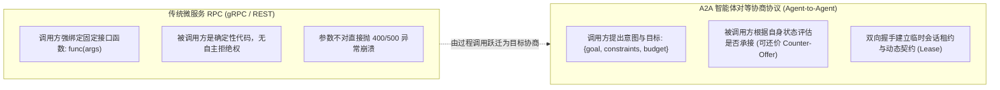
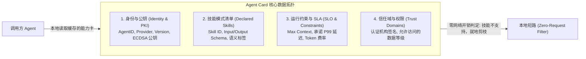
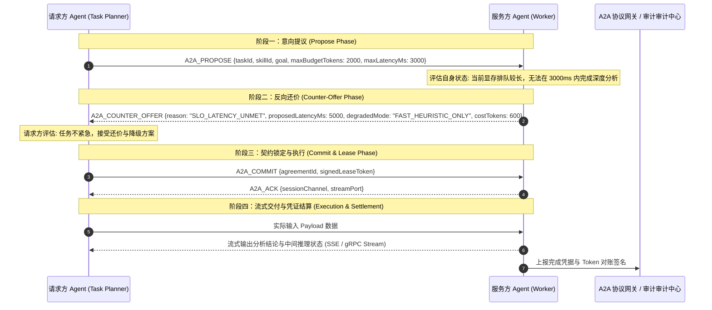

**TL;DR：** 在微服务时代，服务间通信依赖 gRPC 或 OpenAPI 契约，调用方在编译期明确知道被调用方的函数签名。但在多智能体系统（Multi-Agent Systems）中，协作方是拥有自主决策能力、模型认知差异且运行在不同技术栈（Python LangGraph、Node.js 运行时、外部托管平台）上的**自治实体（Autonomous Entities）**。传统 RPC 的静态接口语义在此彻底失效：调用方无法预知被调用方当前是否认知过载、是否具备特定子领域知识，更无法处理非确定性的输出。2025~2026 年快速成型的 **A2A（Agent-to-Agent）通信协议** 建立了全新的面向目标（Goal-oriented）的协商范式：核心由 **Agent Card（能力卡自省协议）** 提供零网络请求的本地能力过滤，配合 **三阶段契约协商状态机（Propose $\to$ Counter-Offer $\to$ Commit）**，使异构智能体之间不仅能传递数据，更能就任务边界、SLA 保证和 Token 成本达成分布式确定性共识。

---

## 一、面试切入：已有 gRPC 和 REST，为什么还要专门设计 A2A 协议？

> **面试高频考题：**  
> “在我们的企业架构中，不同团队分别用 Python、Go 和 Node.js 开发了多个专业 Agent。当一个规划 Agent 需要委托代码生成 Agent 完成任务时，如果直接用标准的 HTTP RESTful API 或 gRPC 调用，在生产场景中会遭遇哪些无法克服的协议缺陷？为什么行业正在推动 A2A 协议？Agent Card（能力卡）是如何实现‘零网络请求’就能拦截不匹配任务的？”

很多初学者容易将 A2A 简单理解为“又造了一套 JSON Schema 轮子”。

但回答这个问题的根本，在于看清**微服务 RPC（Deterministic Procedure Call）**与**智能体协作（Autonomous Delegation）**之间的物理代际鸿沟：



### 1.1 静态签名的破产：被调用方不是死板的代码
在传统微服务中，OrderService 调用 InventoryService 的 `DeductStock()`，只要参数符合 Protobuf 定义，被调用方**必然无条件执行**。
但在多智能体系统中：
* 被调用方是一个由 LLM 驱动的自治节点，可能当前已经处理了 10 轮对话，上下文即将溢出；
* 或者是它虽然具备通用 Python 编写能力，但并不支持特定 GPU 算子编写库（如 Triton）；
* 传统 RPC 无法在请求发起前感知这种**细粒度的认知与状态约束**，盲目发起长达数十秒的 LLM 推理只会导致超时、报错与 Token 浪费。

### 1.2 协商机制的缺失
传统 RPC 不存在“讨价还价”机制。如果调用方请求：“请在 1 秒内生成完整的前端系统”，传统 API 只能返回超时错误。
而在 A2A 协议中，被调用方可以返回 **Counter-Offer（还价）**：“我无法在 1 秒内完成全量系统，但我可以在 500ms 内提供骨架路由结构，单价消耗 1500 Token，你是否接受？”

---

## 二、Agent Card（能力卡）物理结构与零请求过滤

A2A 协议的首要基石是 **Agent Card（能力卡）**。它是一个由智能体自省（Self-Reflection）并公开发布的结构化声明，类似智能体的“数字身份证与技能简历”。



### 2.1 规范定义的 Agent Card 核心载荷

在标准 A2A 实现中，能力卡遵循严格的声明式规范：

```json
{
  "agentId": "agent://company.internal/dba-specialist-v2",
  "name": "MySQL & TiDB Performance Optimizer",
  "version": "2.4.0",
  "publicKey": "04a1b2c3d4...",
  "capabilities": [
    {
      "skillId": "explain_slow_query",
      "description": "分析 MySQL 执行计划并给出联合索引优化建议",
      "supportedDialects": ["mysql-8.0", "tidb-v7"],
      "inputSchema": {
        "type": "object",
        "properties": {
          "sql": { "type": "string" },
          "executionPlanJson": { "type": "string" }
        },
        "required": ["sql", "executionPlanJson"]
      },
      "sla": {
        "maxTimeoutMs": 8000,
        "averageLatencyMs": 1200,
        "estimatedCostToken": 800
      }
    }
  ],
  "trustBoundary": {
    "organization": "Infra-Core-Team",
    "clearanceLevel": "INTERNAL_CONFIDENTIAL"
  }
}
```

### 2.2 零请求过滤（Zero-Request Filtering）的物理意义
在包含上百个异构 Agent 的超大规模集群中，如果每次需要寻找协作方都向网络发起广播探测，整个内网网络将被发现风暴（Discovery Storm）淹没。
* **物理机制**：调用方在启动时从中心元数据节点（如 Consul / etcd）批量拉取全网 Agent Card 并缓存至本地只读内存；
* 当本地规划器产生一个意图（如“优化一段 Postgres 查询”）时，本地引擎首先对缓存的 Agent Card 列表执行模式匹配（Schema Matching）；
* 发现当前 DBA Agent 的 `supportedDialects` 仅支持 `mysql` 和 `tidb`，**直接在本地毫秒级过滤掉该节点，不发出任何网络 I/O 请求**！网络带宽与调用开销被直接压降为绝对的 **0**。

---

## 三、双向契约协商时序图（Three-Phase Negotiation）

当确定候选 Agent 具备潜在能力后，A2A 协议进入核心的**三阶段协商握手状态机**。



### 3.1 协商状态机的四种终态

1. **`COMMITTED`（达成共识）**：双方就执行范围、预算与超时上限完成数字签名，生成唯一的临时会话租约（Session Lease）；
2. **`REJECTED`（彻底拒绝）**：服务方因为权限不足（Clearance Mismatch）或完全不支持该类型任务，明确拒绝并附带标准错误码（RFC 9457）；
3. **`COUNTER_OFFERED`（协商中）**：服务方提出降级方案，等待请求方裁决（最多允许协商 2 轮，防止死锁）；
4. **`TIMED_OUT`（协商超时）**：若在协议约定的协商窗口（如 500ms）内未收到响应，请求方自动切走寻找下一个备选 Agent。

---

## 四、生产级 TypeScript 实现：A2A 协商协调引擎

下面给出一个符合 A2A 协议规范的最小高可用通信与协商协调器实现。

```typescript
// a2a_protocol_engine.ts
// 生产级 A2A 协商与通信协调器核心实现

export interface AgentCard {
  agentId: string;
  name: string;
  capabilities: Array<{
    skillId: string;
    maxTimeoutMs: number;
    estimatedCostToken: number;
  }>;
}

export interface TaskProposal {
  proposalId: string;
  requesterId: string;
  skillId: string;
  payload: Record<string, unknown>;
  maxBudgetTokens: number;
  deadlineMs: number;
}

export type NegotiationResult = 
  | { status: "COMMITTED"; agreementId: string; finalBudget: number }
  | { status: "COUNTER_OFFER"; proposedBudget: number; proposedDeadlineMs: number; reason: string }
  | { status: "REJECTED"; reason: string };

export class A2ANegotiator {
  private localCard: AgentCard;
  private currentContextLoad: number = 0; // 0.0 ~ 1.0 当前认知负载

  constructor(card: AgentCard) {
    this.localCard = card;
  }

  // 服务方：处理对端发来的协作提案
  public async handleProposal(proposal: TaskProposal): Promise<NegotiationResult> {
    // 1. 本地硬匹配：是否具备该技能
    const matchedSkill = this.localCard.capabilities.find((c) => c.skillId === proposal.skillId);
    if (!matchedSkill) {
      return {
        status: "REJECTED",
        reason: `本智能体不支持声明的技能: ${proposal.skillId}`
      };
    }

    // 2. 检查预算约束
    if (proposal.maxBudgetTokens < matchedSkill.estimatedCostToken) {
      return {
        status: "COUNTER_OFFER",
        proposedBudget: matchedSkill.estimatedCostToken,
        proposedDeadlineMs: matchedSkill.maxTimeoutMs,
        reason: `预算不足：该技能基线消耗为 ${matchedSkill.estimatedCostToken} tokens`
      };
    }

    // 3. 检查当前自身认知负载 (Backpressure / 负载自适应)
    if (this.currentContextLoad > 0.85) {
      return {
        status: "COUNTER_OFFER",
        proposedBudget: proposal.maxBudgetTokens,
        proposedDeadlineMs: proposal.deadlineMs * 2, // 申请延长时间
        reason: "当前排队并发任务较高，需延长交付时间窗口"
      };
    }

    // 4. 达成契约！签署临时租约
    const agreementId = `lease_${crypto.randomUUID()}`;
    return {
      status: "COMMITTED",
      agreementId,
      finalBudget: proposal.maxBudgetTokens
    };
  }
}
```

---

## 五、架构决策矩阵：A2A 协议 vs 现有主流方案

| 评估维度 | 传统 REST / gRPC | 简单大模型 Function Calling | A2A 分布式智能体协议（推荐） |
| :--- | :--- | :--- | :--- |
| **交互主体关系** | 严格的主从控制（Client-Server） | 模型调用死工具（Model-Tool） | **平等的自治对等体（Peer-to-Peer）** |
| **语义协商能力** | **完全无协商（参数不对直接报错）**| 伪协商（仅靠 Prompt 猜测） | **原生三阶段契约协商（支持还价与降级）** |
| **能力自省机制** | 静态 API 文档（Swagger / Proto） | 仅在系统提示词声明文本 | **动态版本化 Agent Card（支持零请求过滤）**|
| **成本与 SLA 约束** | 无法在协议层感知与核算 | 无法在调用前预测 Token 成本 | **将 Token 预算与 P99 延迟纳入契约** |
| **异构跨运行时互通** | 仅传输通用 JSON / 二进制 | 局限在单一 Agent 框架内部 | **跨系统（LangGraph / AutoGen / 外部云）互通** |

---

## 六、总结与排障 Checklist

A2A 协议并不是简单的报文格式，而是**智能体分布式协作时代的“TCP/IP 握手协议”**。它将过去混乱的“提示词黑盒调用”，规范为“能力可自省、请求可协商、预算可核算、责任可审计”的工程化体系。

在多智能体系统接入 A2A 协议前，架构师必须逐项核对以下关键指标：
- [ ] 所有 Agent 是否均实现了规范的 Agent Card 导出端点（`/.well-known/agent-card.json`）？
- [ ] 调用方是否实现了本地能力卡缓存与零网络请求前置过滤（Zero-Request Filtering）？
- [ ] 协商状态机是否严格限制了最大还价轮次（建议 $\le 2$ 轮），杜绝两个智能体互相还价陷入死循环？
- [ ] 跨组织智能体调用时，是否在 Agent Card 中强制集成了 ECDSA 公钥签名与时间戳防重放校验？
- [ ] 协商成功后生成的 `AgreementLease` 是否绑定了明确的最大生命周期（TTL），防止由于客户端断网引发服务端资源悬挂泄露？

---

## 参考资料

1. **Linux Foundation / Open Agentic Alliance**: *Agent-to-Agent (A2A) Protocol Draft Specification (2025)*.
2. **Anthropic Model Context Protocol Working Group**: *Beyond Tools: Peer-to-Peer Agent Communication Patterns*.
3. **IETF RFC 9457**: *Problem Details for HTTP APIs (Structured Error Contracts)*.
4. **FIPA (Foundation for Intelligent Physical Agents)**: *FIPA ACL Message Structure Specification*.
