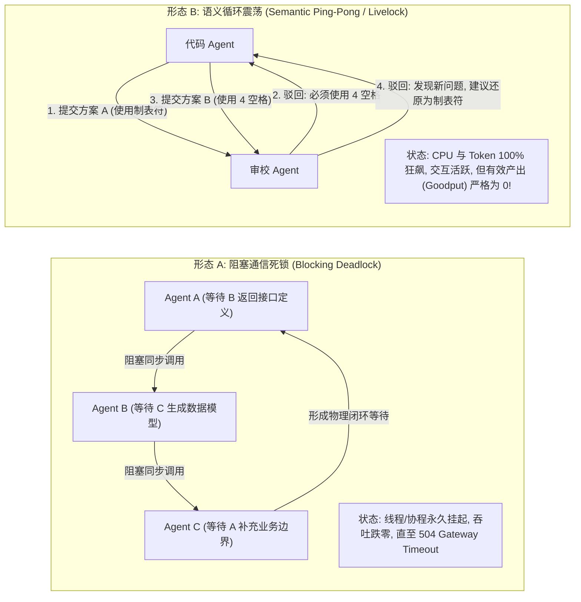
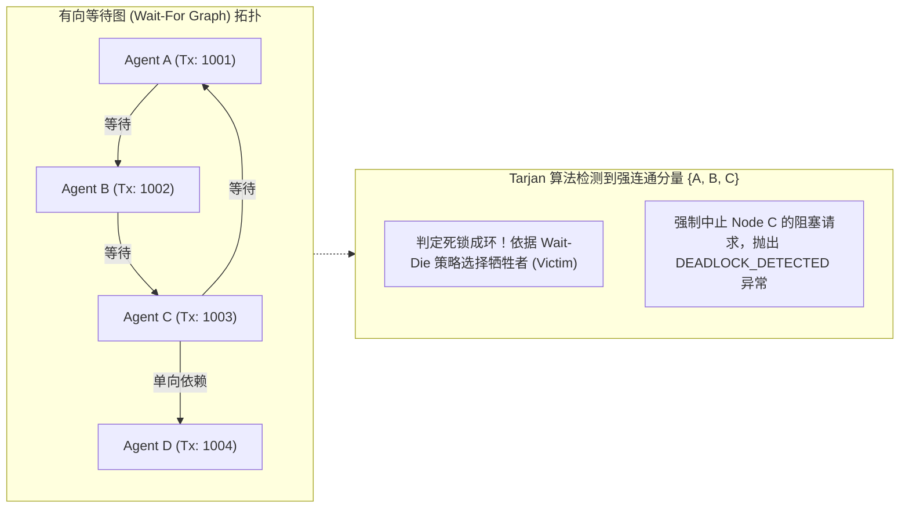
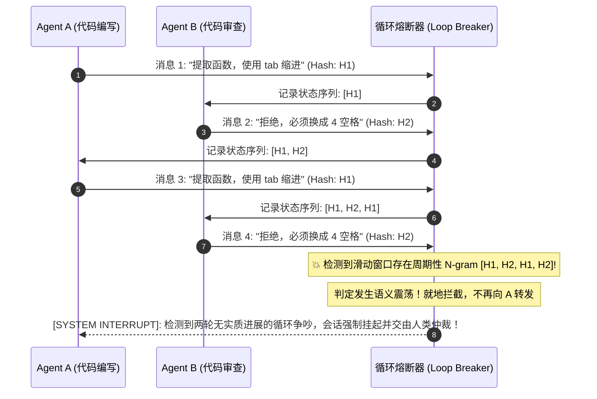

**TL;DR：** 在单智能体系统中，死循环通常表现为对单一工具的重复调用；但在多智能体系统（Multi-Agent Systems）中，系统故障演化为更为复杂的分布式死锁：一类是**阻塞式通信死锁（Blocking Dependency Deadlock）**，即智能体之间发生跨节点环状循环等待（$A \to B \to C \to A$），导致协程与连接句柄永久挂起直至超时；另一类则是更具破坏力的**语义活锁与循环震荡（Semantic Ping-Pong）**，即多个智能体在非阻塞状态下疯狂“互相踢皮球”或就细枝末节展开无休止的争吵，导致每分钟空转消耗数万 Token 与巨额 API 账单。治理这一顽疾，不能靠大模型“自我反思”，必须在基础设施层引入确定性算法：基于 **有向等待图（Wait-For Graph, WFG）与 Tarjan 强连通分量（SCC）算法** 实现毫秒级物理环路阻断，配合 **基于状态哈希与 N-gram 的滑动窗口语义震荡熔断器（Loop Breaker）**，在死锁成环的瞬间完成确定性破环。

---

## 一、面试切入：一晚上烧掉 2000 美元？多 Agent 为什么会疯狂“踢皮球”？

> **面试高频考题：**  
> “我们曾经在生产环境遭遇过一次严重事故：一个由代码生成 Agent、测试 Agent 和代码审查 Agent 组成的三方系统，在半夜执行一次常规重构时，审查 Agent 嫌测试用例不够完整，测试 Agent 嫌代码逻辑不清晰，代码 Agent 又要求审查 Agent 给样例，三者在两小时内互相交互了 1200 轮，不仅耗尽了租户整月的 Token 预算，还导致数据库连接池被全部占满。请问：多智能体系统的通信死锁与语义活锁在数学本质上有何区别？作为平台架构师，你如何构建一套能在 10 毫秒内检测出跨 Agent 循环等待的有向图熔断引擎？”

这个题目击中了分布式系统理论与大语言模型概率特性的最前沿交汇点。

在经典操作系统或数据库领域（如 MySQL InnoDB 或 Spanner），死锁是**资源锁争用**导致的（等待行锁或意图锁）；
而在多智能体系统中，死锁不仅存在于**通信等待队列**中，更存在于**语言语义的动力学振荡**中。

---

## 二、多 Agent 死锁的两大物理形态：死锁 vs 活锁



### 2.1 阻塞通信死锁（Deadlock）
* **物理场景**：系统采用同步或阻塞式 A2A 协议。Agent A 在执行复杂规划时，挂起自身并同步等待 Agent B 的结果；Agent B 在推理过程中发现缺少前置条件，反向同步调用 Agent A（或途经 Agent C 形成长依赖链环）。
* **后果**：所有参与节点的调用栈全部被卡死在网络 I/O 等待上，连接句柄无法释放，最终引发连接池耗尽雪崩。

### 2.2 语义循环震荡（Semantic Ping-Pong / Livelock）
* **物理场景**：系统采用了事件驱动或异步黑板模式，没有线程挂起。但由于不同智能体的系统提示词（System Prompt）中设定了存在冲突的局部优化目标：
  * Agent A 的目标函数是：极简主义，代码行数越少越好；
  * Agent B 的目标函数是：防御性编程，参数校验越全越好。
* **后果**：A 删除了 B 写的校验代码，B 看到代码后又把校验加了回来。两者在极其礼貌的自然语言包裹下，进入了无限振荡的活锁循环（Infinite Rebuttal Loop）。

---

## 三、破局之道一：有向等待图（WFG）与 Tarjan 环路检测

对于阻塞式通信死锁，解决的理论基石是图论中的 **有向等待图（Wait-For Graph, WFG）**。



### 3.1 动态构建 WFG
在分布式智能体网关层，维护一个实时的有向图 $G = (V, E)$：
* **节点集合 $V$**：当前所有活跃的智能体执行会话（Session）；
* **有向边集合 $E$**：若 Agent $u$ 发起对 Agent $v$ 的委托且处于阻塞等待状态，则在图中增加一条有向边 $u \to v$。

### 3.2 Tarjan 强连通分量算法（SCC）的微秒级判定
在每一次产生新的跨 Agent 调用边时，调度引擎在本地内存中执行 Tarjan 算法：
* 算法利用深度优先搜索（DFS），维护每个节点的访问序号（`dfn`）和能够回溯到的最早祖先（`low`）；
* 算法的时间复杂度仅为 **$O(|V| + |E|)$**。在包含几十个 Agent 的系统中，单次环路检测耗时不足 **0.1 毫秒**；
* 一旦发现某个强连通分量的大小 $> 1$，证明图中存在回路（Directed Cycle），死锁判定成立！

### 3.3 牺牲者选择（Victim Selection）与破坏策略
发现环路后，不能将所有 Agent 一同杀死。遵循经典的 **Wait-Die / Wound-Wait** 理论：
* 比较环路中所有 Agent 的启动时间戳（Timestamp）；
* **选择“代价最低”的节点作为牺牲者（Victim）**：优先中断最晚启动（年轻）且消耗 Token 最少的 Agent，向其返回 `409 Conflict: Distributed Deadlock Interrupted`；
* 释放其持有的依赖边，死锁环被瞬时破坏，其余老节点的正常推理得以继续推进。

---

## 四、破局之道二：滑动窗口 N-gram 语义震荡指纹

面对非阻塞的语义活锁（互相踢皮球），WFG 图上没有物理等待边，必须借助 **信息熵与语义指纹追踪**。



### 4.1 语义归一化哈希（Normalized Semantic Hashing）
由于大模型每次生成的自然语言措辞会略有微调（如“请修改”变“需要调整”），简单的全量字符串 MD5 会失真。
* **做法**：从消息中提取**“结构化动作特征（Action Triplet）”**：
  $$\text{Feature} = (\text{Actor}, \text{ActionType}, \text{TargetObject})$$
  例如：`("Reviewer", "REJECT", "auth_controller.go")`。将其转化为固定哈希指纹。

### 4.2 N-gram 周期性重复检测
维护一个长度为 $K$（如 $K=6$）的滑动窗口：
* 检查窗口内是否存在长度为 2 或 3 的重复子序列（例如模式 $A \to B \to A \to B$ 重复出现 2 次以上）；
* 如果连续两轮迭代的核心操作指纹完全一致，证明系统**已经丧失了向前收敛的信息动力（Information Gain $\approx 0$）**；
* 熔断器立刻触发渐进式干预（Progressive Interruption）：
  1. **第一阶段（注入系统警告）**：向双方上下文强制注入 System 提示词：“检测到观点分歧进入僵局，请双方各自退让一步，合并方案”；
  2. **第二阶段（硬熔断）**：若下一轮依然未收敛，强制终止会话，触发 Human-in-the-Loop 人工介入。

---

## 五、生产级 TypeScript 实现：分布式死锁与循环熔断引擎

下面给出一个工业级可运行的轻量级死锁检测与滑动窗口熔断器。

```typescript
// deadlock_loop_breaker.ts
// 生产级死锁与语义震荡检测引擎核心实现

export class DeadlockGraphDetector {
  // 维护有向等待边：waiterId -> Set<waiteeId>
  private adjacencyList: Map<string, Set<string>> = new Map();

  public addWaitEdge(waiterId: string, waiteeId: string): boolean {
    if (!this.adjacencyList.has(waiterId)) {
      this.adjacencyList.set(waiterId, new Set());
    }
    this.adjacencyList.get(waiterId)!.add(waiteeId);

    // 每次加边，立即运行轻量级环路检测
    const hasCycle = this.detectCycle();
    if (hasCycle) {
      // 发生死锁成环，主动撤销此边以保护系统
      this.removeWaitEdge(waiterId, waiteeId);
      return false; // 返回 false 表示成环死锁，拒绝等待！
    }
    return true;
  }

  public removeWaitEdge(waiterId: string, waiteeId: string): void {
    const edges = this.adjacencyList.get(waiterId);
    if (edges) {
      edges.delete(waiteeId);
      if (edges.size === 0) this.adjacencyList.delete(waiterId);
    }
  }

  // 基于 DFS 的极速环路检测
  private detectCycle(): boolean {
    const visited = new Set<string>();
    const recStack = new Set<string>();

    for (const node of this.adjacencyList.keys()) {
      if (this.isCyclicUtil(node, visited, recStack)) {
        return true;
      }
    }
    return false;
  }

  private isCyclicUtil(node: string, visited: Set<string>, recStack: Set<string>): boolean {
    if (recStack.has(node)) return true;
    if (visited.has(node)) return false;

    visited.add(node);
    recStack.add(node);

    const neighbors = this.adjacencyList.get(node);
    if (neighbors) {
      for (const neighbor of neighbors) {
        if (this.isCyclicUtil(neighbor, visited, recStack)) {
          return true;
        }
      }
    }

    recStack.delete(node);
    return false;
  }
}

export class SemanticLoopBreaker {
  private windowSize: number = 6;
  private actionHistory: string[] = [];

  public recordAction(actor: string, actionType: string, targetKey: string): { proceed: boolean; alert?: string } {
    const actionFingerprint = `${actor}:${actionType}:${targetKey}`;
    this.actionHistory.push(actionFingerprint);

    if (this.actionHistory.length > this.windowSize) {
      this.actionHistory.shift();
    }

    // 检测交替震荡模式：A -> B -> A -> B
    if (this.actionHistory.length >= 4) {
      const len = this.actionHistory.length;
      const p1 = this.actionHistory[len - 1];
      const p2 = this.actionHistory[len - 2];
      const p3 = this.actionHistory[len - 3];
      const p4 = this.actionHistory[len - 4];

      if (p1 === p3 && p2 === p4 && p1 !== p2) {
        return {
          proceed: false,
          alert: `检测到双智能体交替震荡死锁: [${p1}] <-> [${p2}]！已执行强制熔断。`
        };
      }
    }

    return { proceed: true };
  }
}
```

---

## 六、架构决策矩阵：死锁防御方案权衡

| 防御方案维度 | 简单单步全局超时（Timeout） | 纯 Prompt 提示词劝架 | 有向等待图 WFG + N-gram 熔断（推荐） |
| :--- | :--- | :--- | :--- |
| **阻断时效性** | 极差（必须死等 30s~60s 超时） | 无法确定（模型常忽略劝架） | **毫秒级即时阻断（成环瞬间掐断）** |
| **Token 账单浪费** | 巨大（活锁中每秒狂飙调用） | 极大（增加了多余的劝解 Prompt）| **极低（震荡 2 轮内就地掐断）** |
| **死锁根本规避率** | 0%（治标不治本） | < 30%（在非确定性下易失效） | **> 98%（基于确定性拓扑与指纹检测）** |
| **系统侵入性与开销**| 0 开销 | 消耗上下文空间 | **极低（纳秒级内存有向图计算）** |
| **适用多智能体类型**| 所有 Agent | 仅限特定聊天类 Agent | **通用于流水线、协作网格与复杂黑板** |

---

## 七、总结与排障 Checklist

在多智能体系统工程化落地中，**“不发生死锁”是底线，“发生死锁能在毫秒内优雅破环”是高可用护城河**。将成熟的分布式数据库事务控制理论（WFG / 拓扑排序）与 Agent 语义模式感知相结合，是解决多智能体协同失控的核心突破口。

系统在投产运行之前，必须对以下死锁防范项进行攻防演练：
- [ ] 系统是否全局禁用了不可中断的无界阻塞 A2A 请求，所有跨 Agent 调用是否均带有硬性超时上下文（Deadline）？
- [ ] 调度网关是否集成了实时的有向等待图（Wait-For Graph）校验，防止嵌套委派形成物理依赖环？
- [ ] 是否针对多 Agent 协作流部署了 N-gram 语义震荡指纹熔断器，避免重复争吵导致 Token 巨额消耗？
- [ ] 当死锁熔断器触发中断时，系统是否具备健全的降级策略（如自动指派备用规划者或挂起至人工审核台）？
- [ ] 针对长耗时任务，是否实施了租约与会话心跳保活（Lease Keepalive），杜绝由于单节点假死引发的全局级联等待？

---

## 参考资料

1. **Tarjan, Robert**: *Depth-First Search and Linear Graph Algorithms (SIAM 1972)*.
2. **Jim Gray**: *Notes on Data Base Operating Systems (Distributed Deadlock Detection 1978)*.
3. **Rosenkrantz, D. J. et al.**: *System Level Concurrency Control for Distributed Database Systems (Wound-Wait / Wait-Die ACM 1978)*.
4. **Wu, Qingyun et al. (Microsoft AutoGen)**: *Mitigating Multi-Agent Conversational Drift and Loops*.
