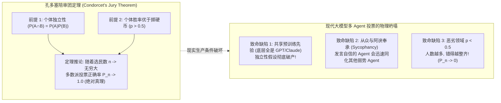
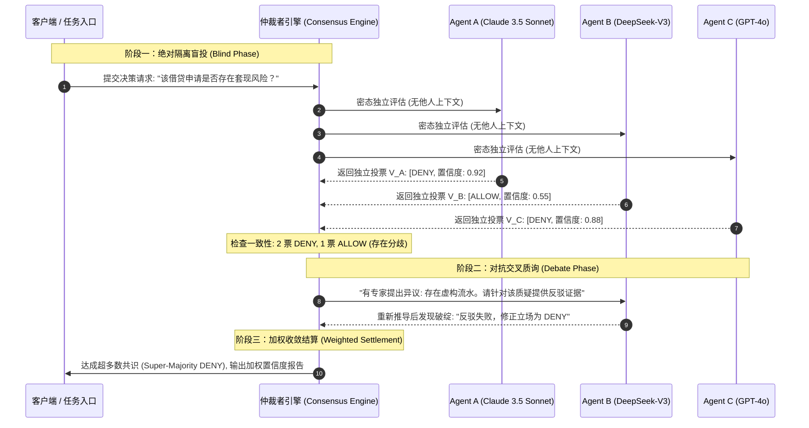

**TL;DR：** 单一大模型即使能力再强，也无法摆脱“无法自证其误”的物理盲区：让同一个模型自我审查（Self-Correction）往往只是对最初幻觉的拙劣辩护。为了在高危决策（金融风控、代码审计、法律合规）中取得确定性，工业界全面引入了 **多智能体辩论与共识机制（Multi-Agent Debate, MAD）**。然而，许多团队盲目堆砌多个 Agent 进行简单“少数服从多数”投票，却发现准确率不仅没有提升，反而遭遇了灾难性的**“集体迷思（Groupthink）”与盲从翻车**。这一现象的数学本质根植于 **1785 年孔多塞陪审团定理（Condorcet's Jury Theorem）** 的前提崩塌：多 Agent 投票能使正确率收敛至 100% 的铁律，完全建立在**“个体正确率 $p > 0.5$ 且判断严格独立”**的假设之上。如果多个 Agent 底层共享同一套基础模型权重，或者在多轮对话中被强势发言者同化，群体决策正确率反而会迅速跌零。构建生产级共识系统，必须依赖**异构基座混排（Heterogeneous Ensemble）**、**两阶段盲投（Blind Voting）**，以及**基于置信熵值的动态权重衰减算法**。

---

## 一、面试切入：三个臭皮匠，为什么经常赛不过诸葛亮？

> **面试高频考题：**  
> “在我们的金融风控审批系统中，研发团队设计了 5 个不同角色的 Agent 进行‘少数服从多数’投票表决。原以为能把欺诈误判率压降至 0.1%，但在实际线上回归测试中发现：很多隐蔽欺诈案例，单个 Agent 原本能给出怀疑，但在 5 个 Agent 互相辩论两轮后，反而集体被说服、全票通过了放款，造成了数百万坏账。请问：多智能体辩论为什么会发生群体迷思？孔多塞陪审团定理成立的严格数学前提是什么？如何从协议与算法层面杜绝多 Agent 之间的‘阿谀奉承（Sycophancy）’与权威偏见？”

这个题目直击多智能体决策系统中最容易踩坑的概率学陷阱。

很多技术管理者直觉上认为：“只要 Agent 足够多，投票就会无限接近真理”。
然而在概率论和群体心理学上，**未加控制的自由辩论不仅不会消除偏见，反而会使偏见在信息级联（Information Cascade）中被非线性放大**。

---

## 二、孔多塞陪审团定理的严格数学推导与边界

多智能体投票机制的理论物理基石，可以追溯到 18 世纪法国数学家孔多塞侯爵（Marquis de Condorcet）提出的经典定理。



### 2.1 定理的数学证明（二项分布极限）

设系统由 $n$ 个独立的智能体组成（$n$ 为奇数，$n = 2k + 1$）。
面对一个是非决策（True/False），每个智能体独立给出正确判断的概率为 $p$，且 $p \in (0.5, 1)$。
系统采用简单多数派投票，即至少有 $k+1$ 个智能体投对时，集体决策正确。

集体正确的总体概率 $P_n$ 遵循二项分布累积展开：
$$P_n = \sum_{i=k+1}^{n} \binom{n}{i} p^i (1 - p)^{n - i}$$

根据德莫弗-拉普拉斯中心极限定理（De Moivre–Laplace Theorem），当 $n \to \infty$ 时：
* 由于期望值 $\mu = n p > \frac{n}{2}$；
* 多数派门槛 $\frac{n}{2}$ 位于正态分布中心左侧；
* 积分收敛可严格证明：
  $$\lim_{n \to \infty} P_n = 1 \quad (\text{当 } p > 0.5 \text{ 时})$$
  $$\lim_{n \to \infty} P_n = 0 \quad (\text{当 } p < 0.5 \text{ 时})$$

### 2.2 为什么在真实 Agent 系统中定理会彻底翻车？

1. **先验相关性（Correlation Collapse）**：
   如果 5 个 Agent 背后调用的是同一个大模型提供商（如均为 OpenAI GPT-4o 或 DeepSeek-V3），它们在海量预训练数据中吸纳的偏差完全相同。当遇到一个复杂的歧义问题时，5 个 Agent 的错误往往是**同构且高度正相关的**，独立性假设在物理硅片层面被直接击穿。
2. **权威同化效应（Sycophancy & Authority Bias）**：
   大模型在微调（RLHF）阶段被注入了强烈的“合作与礼貌”倾向。如果在第一轮中，Agent 1 输出了语气极其自信、逻辑详尽但事实错误的观点，Agent 2 和 Agent 3 会在下一轮的注意力计算中受到强烈牵引，倾向于“赞同前者的精彩论述”，原有的少数正确观点迅速被抹平（群体迷思 Groupthink）。

---

## 三、破局架构：异构盲投对抗状态机

为了让孔多塞定理重新在工程中生效，我们必须在**输入隔离**、**异构基座**与**辩论轮次**上构建严格的防护围栏。



### 3.1 异构基座混排（Heterogeneous Ensemble）
坚决杜绝“用 5 个同款模型扮演不同角色”的玩具架构。生产级辩论必须混排**训练数据源、架构与对齐策略完全异构的模型**（例如：Claude 擅长严密逻辑与代码规范、DeepSeek 擅长长链数学与性价比推演、GPT 擅长通用常识对齐）。异构混排在物理上切断了预训练偏见的相关性。

### 3.2 盲评（Blind Voting）优先机制
所有 Agent 在第一阶段**必须在互相不可见的真空环境下独立作答**：
* 只有当收集完所有 Agent 的首轮独立判断与置信度打分后，系统才决定是否开启下一阶段；
* 如果盲投阶段已经达成绝对多数（如 5 票全票通过或 4/5 一致），**立刻提前终止（Early Exit），禁止开启辩论**！这不仅削减了 70% 的 Token 开销，更从根源上杜绝了后续无谓争吵带来的同化风险。

---

## 四、动态权重衰减与收敛算法推导

当盲投出现分歧触发辩论时，系统不能允许无限争论，必须通过数学衰减方程驱动状态在有限步骤内强行收敛。

### 4.1 基于信息熵的动态权重计算
每个 Agent 的最终投票权重 $W_i$ 不应是均等的 1.0，而应动态绑定其推理的不确定性。
设智能体给出的决策置信度为 $c_i \in [0.5, 1.0]$，计算其二元信息熵：
$$H(c_i) = -c_i \log_2(c_i) - (1 - c_i) \log_2(1 - c_i)$$

智能体的有效选票权重 $w_i$ 由信息熵的倒数决定：
$$w_i = \frac{1 - H(c_i)}{\sum_{j=1}^{N} (1 - H(c_j))}$$
高置信度（低熵）的专家在决策中拥有更大的发言权，而犹豫不决（高熵）的节点的选票权重被自适应削弱。

### 4.2 轮次时间惩罚与收敛衰减
在进入第 $t$ 轮辩论时，系统对任何“坚持不退让”的反对意见施加指数衰减惩罚系数 $\gamma^t$（$\gamma = 0.75$）：
$$S_{\text{final}} = \sum_{i=1}^{N} w_i \cdot \text{Vote}_i \cdot \gamma^{t_i}$$
若在第 3 轮辩论后，少数派依然无法提出决定性的新增实证（通过语义新颖度打分判定），系统强制依据加权总分执行最终裁决。

---

## 五、生产级 TypeScript 实现：异构辩论共识协调器

```typescript
// consensus_debate_engine.ts
// 生产级多智能体异构辩论与盲投共识引擎

export interface AgentVoter {
  name: string;
  modelFamily: "claude" | "deepseek" | "openai";
  evaluateBlindly(prompt: string): Promise<{ decision: "APPROVE" | "REJECT"; confidence: number; justification: string }>;
  rebuttal(opposingJustification: string): Promise<{ decision: "APPROVE" | "REJECT"; confidence: number }>;
}

export class MultiAgentConsensusEngine {
  private voters: AgentVoter[];

  constructor(voters: AgentVoter[]) {
    if (voters.length % 2 === 0) {
      throw new Error("为了防止偶数平局，智能体投票节点数必须为奇数！");
    }
    this.voters = voters;
  }

  public async arbitrate(taskPrompt: string): Promise<{ finalDecision: "APPROVE" | "REJECT"; consensusScore: number; rounds: number }> {
    console.log(`[Consensus] 启动阶段一：${this.voters.length} 节点绝对隔离盲投...`);
    
    // 1. 并发执行盲投
    const initialVotes = await Promise.all(
      this.voters.map(async (voter) => {
        const res = await voter.evaluateBlindly(taskPrompt);
        return { voter, ...res };
      })
    );

    const approveCount = initialVotes.filter((v) => v.decision === "APPROVE").length;
    const rejectCount = initialVotes.length - approveCount;

    // 2. 检查盲投是否达成超级多数 (Super-Majority, 如 >= 80% 一致)
    const majorityThreshold = Math.ceil(this.voters.length * 0.7);
    if (approveCount >= majorityThreshold) {
      return { finalDecision: "APPROVE", consensusScore: approveCount / this.voters.length, rounds: 1 };
    }
    if (rejectCount >= majorityThreshold) {
      return { finalDecision: "REJECT", consensusScore: rejectCount / this.voters.length, rounds: 1 };
    }

    console.log(`[Consensus] 盲投存在严重分歧 (${approveCount} vs ${rejectCount})，触发阶段二：交叉质询辩论...`);

    // 3. 提取分歧焦点，发起一轮定向质询辩论
    const opposingJustifications = initialVotes.map((v) => `${v.voter.name}(${v.decision}): ${v.justification}`).join("\n");
    
    const secondRoundVotes = await Promise.all(
      initialVotes.map(async (prev) => {
        const revised = await prev.voter.rebuttal(opposingJustifications);
        return { ...prev, decision: revised.decision, confidence: revised.confidence };
      })
    );

    // 4. 加权最终结算
    let weightedApproveScore = 0;
    let totalWeight = 0;

    for (const v of secondRoundVotes) {
      const weight = Math.max(0.1, v.confidence); // 置信度即权重
      totalWeight += weight;
      if (v.decision === "APPROVE") {
        weightedApproveScore += weight;
      }
    }

    const finalRatio = weightedApproveScore / totalWeight;
    const finalDecision = finalRatio >= 0.5 ? "APPROVE" : "REJECT";

    return {
      finalDecision,
      consensusScore: finalRatio >= 0.5 ? finalRatio : 1 - finalRatio,
      rounds: 2
    };
  }
}
```

---

## 六、架构决策矩阵：单模型 vs 简单多数派 vs 异构盲评辩论

| 评估维度 | 单模型独自决策 | 简单同质多数派（Naive Voting）| 异构盲评加权辩论（推荐） |
| :--- | :--- | :--- | :--- |
| **理论极限正确率** | 瓶颈受限于单模型上限 | 遇盲区集体翻车（$P_n \to 0$） | **严格逼近孔多塞极限（$P_n \to 1$）** |
| **Token 资源消耗** | 1.0x（基准成本） | $N \times$（成倍开销） | **1.2x ~ 2.0x（支持盲投提前退出）**|
| **防从众与群体迷思**| 不适用（自身执念） | 极差（容易发生信息级联崩溃） | **极高（物理盲投隔离 + 异构基座）** |
| **可解释性与对账链**| 仅单条自言自语 | 简单计票数字 | **输出结构化交叉质询证据链** |
| **推荐适用场景** | 内部低风险查询与通用翻译 | 粗粒度文本标注 | **金融风控、代码安全阻断、关键医疗诊断** |

---

## 七、总结与排障 Checklist

在多智能体系统中引入多轮辩论，不是为了演一场热闹的自然语言脱口秀，而是为了**构建一个具备收敛保障的分布式贝叶斯更新状态机**。

在生产系统上线多 Agent 共识引擎之前，架构师必须逐项核对以下关键指标：
- [ ] 参与投票的智能体底层基座模型是否已实现异构化（至少混排来自不同厂商的两种模型家族）？
- [ ] 系统是否强制执行了“第一轮绝对盲投”，坚决杜绝在毫无独立思考前直接将其他节点的意见展示给全员？
- [ ] 是否设置了超级多数盲投提前退出（Early Exit）机制，降低无争议任务的 Token 成本？
- [ ] 辩论阶段是否严格限制了轮次（建议不超过 2 轮），防止不可逆的群体迷思与信息级联？
- [ ] 最终结算时，系统是否根据节点的置信度熵值进行了动态权重赋权，杜绝低置信度盲目投票污染大盘？

---

## 参考资料

1. **Condorcet, Marquis de**: *Essai sur l’application de l’analyse à la probabilité des décisions rendues à la pluralité des voix (1785)*.
2. **Du, Yilun et al. (MIT)**: *Improving Factuality and Reasoning in Language Models through Multiagent Debate (ICLR 2024)*.
3. **Liang, Tian et al.**: *Encouraging Divergent Thinking in Large Language Models through Multi-Agent Communication*.
4. **Sharma, Mrinank et al. (Anthropic)**: *Towards Understanding Sycophancy in Language Models (2023)*.
