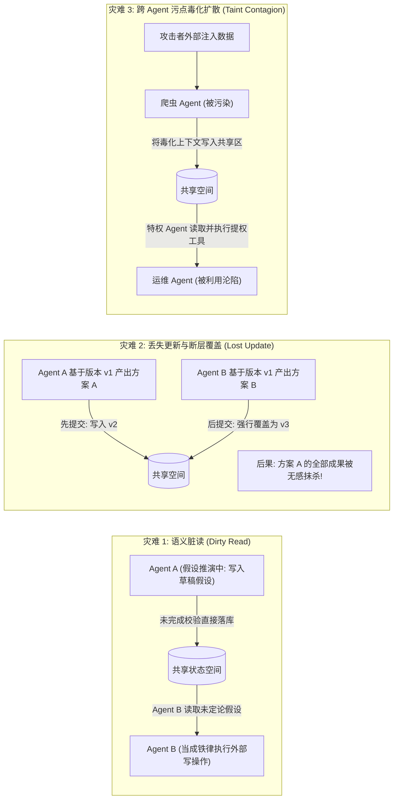
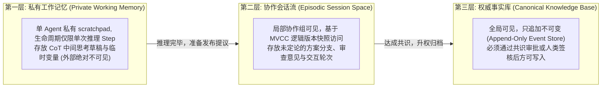
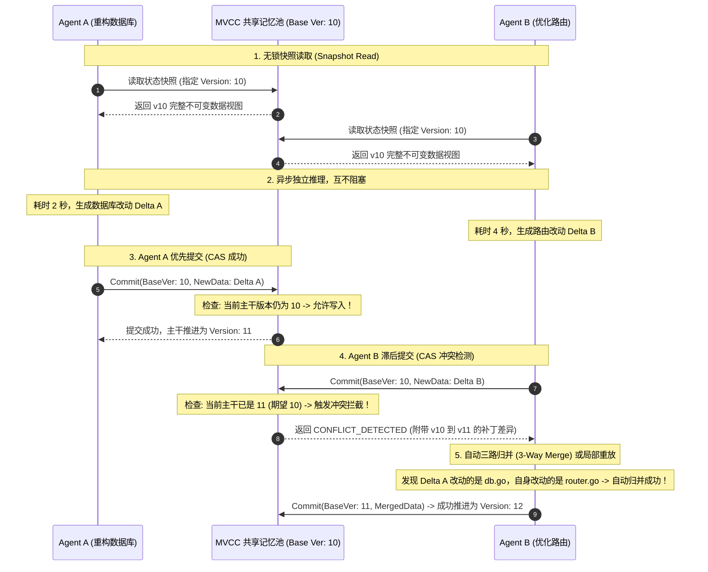
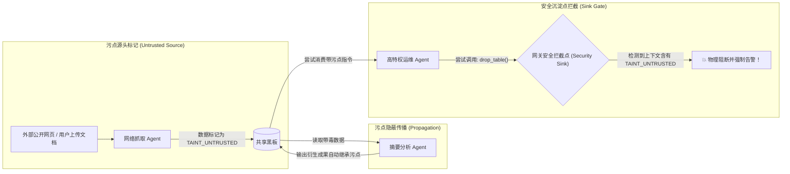

**TL;DR：** 在单智能体架构中，记忆仅仅是一个随时间单调追加的线性消息数组（`messages`）；但在多智能体系统（Multi-Agent Systems）中，状态管理瞬间跃迁为一个**高并发分布式共享内存（Distributed Shared Memory）系统**。如果允许多个 Agent 扁平化地读写同一个共享上下文，系统必然爆发经典数据库并发灾难：**脏读（Dirty Read）** 会导致 Agent A 误将 Agent B 尚在论证中的荒谬假设当作确凿事实；**写冲突（Write Conflict）** 会导致不同 Agent 相互覆盖彼此的成果；而未经隔离的外部注入更会顺着共享通道引发**跨 Agent 污点数据雪崩（Taint Contagion）**。彻底终结多 Agent 状态失控，必须在架构层确立三大支柱：**三层金字塔记忆分层（私有工作记忆 $\to$ 协作会话流 $\to$ 不可变权威事实库）**、**基于多版本并发控制（MVCC）的只读快照隔离**，以及**基于动态污点追踪（Taint Tracking）的跨域写安全防御**。

---

## 一、面试切入：当 10 个 Agent 同时写一个上下文，系统为什么会精神分裂？

> **面试高频考题：**  
> “在我们的复杂软件重构智能体集群中，架构 Agent、前端 Agent、后端 Agent 和 DBA Agent 共享同一个上下文状态空间。在一次压测中，架构 Agent 刚刚在上下文中写下一句‘假定我们将数据库由 MySQL 切换为 DynamoDB’，后端 Agent 读到后立刻删除了所有 SQL 事务代码，而架构 Agent 在随后的第 2 轮推演中又否定了这个假设。此时整个项目代码已被后端 Agent 改得支离破碎。请问：多智能体并发读写共享记忆时，为什么传统的互斥锁（Mutex）会彻底卡死系统？如何借鉴数据库的 MVCC 快照隔离来设计多 Agent 记忆架构？”

这个面试题直击分布式系统并发控制与大模型认知状态管理的深水区。

在传统后端开发中，遇到并发写操作，最直观的反应是“加互斥锁（Mutex）”。
然而在 AI 智能体场景中，**加锁意味着系统性能的彻底崩塌**：一次大模型推理耗时通常在 2 秒到 10 秒之间，如果一个 Agent 占用了写锁，其余 9 个 Agent 必须全部在挂起中空转等待，分布式并行的吞吐优势瞬间归零。

---

## 二、多 Agent 共享状态的三大经典并发灾难

当多个拥有独立认知决策周期的节点同时访问共享状态时，经典数据库的 ACID 异常会在语义层面全面爆发：



### 2.1 语义脏读（Semantic Dirty Read）
Agent 在执行思维链（CoT）推理时，往往需要经历“提出假说 $\to$ 工具验证 $\to$ 证伪推翻”的过程。如果中间未定论的假说被暴露在共享空间，下游执行型 Agent 无法感知该文本的“置信度等级”，会直接将其视为不可逆的事实输入，引发灾难性误操作。

### 2.2 丢失更新（Lost Updates）
两个 Agent 同时从共享黑板中读取了当前的 `schema.prisma` 文件并分别进行局部扩展。Agent A 耗时 3 秒添加了用户表，Agent B 耗时 5 秒添加了订单表。若缺乏乐观并发控制（OCC），后完成的 Agent B 会在提交时完整覆写文件，导致 Agent A 的改动被静默丢弃。

---

## 三、分层记忆金字塔（Memory Hierarchy）

为了兼顾并发隔离与全局协作，多智能体系统必须采用**金字塔式三层解耦记忆模型**。



| 记忆层级 | 读写权限 | 隔离机制 | 生命周期 | 典型存储介质 |
| :--- | :--- | :--- | :--- | :--- |
| **L1 私有工作记忆** | 单 Agent 独占可读写 | 进程内存/局部变量隔离 | 单步推理周期（秒级） | 本地进程内存（RAM） |
| **L2 协作会话流** | 多 Agent 协作读写 | **MVCC 快照隔离 + CAS 乐观锁** | 会话周期（分钟至小时）| Redis / etcd / 内存树 |
| **L3 权威事实库** | 全局只读，受控追加 | **单向写入审批门禁** | 持久化周期（天至永久） | 向量数据库 + PostgreSQL |

---

## 四、MVCC 快照隔离与乐观并发控制（OCC）实战

为了杜绝任何导致线程阻塞的互斥锁，多 Agent 共享空间全面拥抱 **MVCC（Multi-Version Concurrency Control）**。



### 4.1 核心原语：不可变快照与版本指针
* 共享空间维护一个单调自增的全局版本号 `current_version`；
* 任何 Agent 在发起协同任务时，首先获取当前版本的只读引用（Read Snapshot）；
* 在推理全程中，**无论其他 Agent 写入了什么新内容，当前 Agent 看到的视图始终固定不变**，彻底杜绝不可重复读与中间脏读。

### 4.2 冲突裁决与三路归并（3-Way Merge）
当发生提交冲突时，系统调用三路归并器：
* 比较 `BaseVersion`、`CurrentHeadVersion` 与 `AgentProposedVersion`；
* 如果两个 Agent 修改的并非同一键值或文件（基于抽象语法树 AST 或 JSONPath），**由系统原子自动合并**，无需人类介入；
* 只有当发生真正的同字段写冲突时，才通知 Agent 局部重新拉取最新快照进行差异重排。

---

## 五、跨 Agent 污点追踪防御（Taint Tracking）

多 Agent 共享空间不仅面临并发问题，更面临**安全污染扩散风险**。

如果一个低特权的爬虫 Agent 抓取了带有提示词注入载荷的外部网页，并写入了共享黑板；随后拥有资金划拨或运维权限的高特权 Agent 读取了该条目，整个系统将陷入提权渗透危机。



### 5.1 污点溯源元数据规范
共享黑板中的每一个状态条目，必须附带不可篡改的元数据信封（Envelope）：

```typescript
export interface MemoryCell<T> {
  id: string;
  version: number;
  authorAgentId: string;
  taintLevel: "CLEAN_SYSTEM" | "TAINTED_UNTRUSTED" | "HUMAN_VERIFIED";
  provenanceTrail: string[]; // 完整数据流动溯源链
  data: T;
}
```

### 5.2 污点穿透沉淀门禁（Security Sink）
所有具有写副作用的高危工具（数据库写入、代码提交、邮件外发），在被 Agent 调用时，**运行时底层会自动检查触发该调用的上下文记忆中是否包含 `TAINTED_UNTRUSTED` 标记**：
* 若包含污点，不论 Agent 的自然语言理由多么充分，工具调用被强制就地熔断；
* 唯一的去污（Sanitization）途径是必须经过独立的审计 Agent 进行双向盲审，或者由人类在后台签署解除授权。

---

## 六、生产级 TypeScript 实现：MVCC 共享记忆池引擎

下面给出一个工业级可运行的轻量级 MVCC 状态池与污点流控核心实现。

```typescript
// mvcc_shared_memory.ts
// 生产级多智能体 MVCC 共享记忆与污点流控引擎

export interface MemoryEnvelope<T> {
  key: string;
  version: number;
  data: T;
  isTainted: boolean;
  author: string;
}

export class MVCCMemoryPool {
  private globalVersion: number = 1;
  // 维护全版本历史链: key -> Map<version, MemoryEnvelope>
  private store: Map<string, Map<number, MemoryEnvelope<unknown>>> = new Map();
  // 维护每个 key 当前最新版本号
  private latestVersions: Map<string, number> = new Map();

  // 1. 无锁快照读取：指定版本时间旅行
  public readSnapshot<T>(key: string, targetVersion: number): MemoryEnvelope<T> | null {
    const history = this.store.get(key);
    if (!history) return null;

    // 寻找小于等于 targetVersion 的最大有效版本
    let bestVersion = -1;
    for (const v of history.keys()) {
      if (v <= targetVersion && v > bestVersion) {
        bestVersion = v;
      }
    }

    if (bestVersion === -1) return null;
    return history.get(bestVersion) as MemoryEnvelope<T>;
  }

  // 2. 乐观并发提交 (CAS Check)
  public commit<T>(
    key: string,
    newData: T,
    expectedBaseVersion: number,
    author: string,
    isTainted: boolean
  ): { success: boolean; newVersion?: number; conflictCurrentVersion?: number } {
    const currentLatest = this.latestVersions.get(key) || 0;

    // 检测写冲突：当前主干已被他人推进
    if (expectedBaseVersion !== currentLatest) {
      return {
        success: false,
        conflictCurrentVersion: currentLatest
      };
    }

    // 推进全局版本
    this.globalVersion++;
    const newVersion = this.globalVersion;

    if (!this.store.has(key)) {
      this.store.set(key, new Map());
    }

    const envelope: MemoryEnvelope<T> = {
      key,
      version: newVersion,
      data: newData,
      isTainted,
      author
    };

    this.store.get(key)!.set(newVersion, envelope as MemoryEnvelope<unknown>);
    this.latestVersions.set(key, newVersion);

    return { success: true, newVersion };
  }

  public getHeadVersion(): number {
    return this.globalVersion;
  }
}
```

---

## 七、架构决策矩阵：共享内存方案权衡

| 架构维度 | 简单单文本追加（Naive Shared Prompt）| 分布式互斥锁（Distributed Mutex）| MVCC 快照隔离 + 污点流控（推荐） |
| :--- | :--- | :--- | :--- |
| **并发吞吐能力** | 极低（容易发生混乱覆盖） | **极差（Agent 推理长周期导致锁卡死）** | **极高（全并发只读，CAS 无阻塞重试）** |
| **脏读与幻读防护**| 0 防护（随写随读，全盘污染） | 能防（但代价是吞吐跌零） | **100% 免疫（只读历史确定性快照）** |
| **防外部间接投毒**| 极差（毒化数据秒速穿透全集群） | 无法防范（锁不管语义安全） | **极高（污点自动继承与 Sink 强制熔断）**|
| **系统调试与溯源**| 无法还原状态变迁轨迹 | 仅记录锁竞争日志 | **支持任意时间点的全链路时光旅行（Time-Travel）**|
| **适用多智能体类型**| 3 节点以内的简单 Demo | 严禁在 LLM 场景使用 | **工业级流水线、协作黑板与自主软件工程集群** |

---

## 八、总结与排障 Checklist

将多个自治智能体接入同一个协作网络时，**“内存状态的并发控制”与“认知安全边界的隔离”是决定系统能否走向大规模生产的关键生死线**。

在生产多智能体共享状态池投产前，架构师必须逐项核对以下关键指标：
- [ ] 系统是否全局禁用了在 LLM 推理循环中持有长时间分布式互斥锁的反模式？
- [ ] 共享状态存储是否基于 MVCC 实现了只读快照隔离，确保 Agent 在单次任务周期内看到确定性视图？
- [ ] 针对高频更新的实体，是否实现了基于乐观并发控制（OCC）的冲突检测与局部重试机制？
- [ ] 外部未受信源流入的数据是否均打上了全局唯一的 `TAINTED` 污点标记，且下游衍生数据能自动继承该标记？
- [ ] 所有涉及资金划拨、删除数据库、修改系统配置等写操作的工具，底层是否均部署了污点检查门禁（Sink Firewall）？

---

## 参考资料

1. **Kung, H. T.; Robinson, John T.**: *On Optimistic Methods for Concurrency Control (ACM TODS 1981)*.
2. **Bernstein, Philip A. et al.**: *Concurrency Control and Recovery in Database Systems (MVCC Foundations)*.
3. **Newsome, James; Song, Dawn**: *Dynamic Taint Analysis: Automatic Detection and Defense of Security Vulnerabilities*.
4. **Packer, Charles et al. (UC Berkeley)**: *MemGPT: Towards LLMs as Operating Systems with Hierarchical Memory*.
