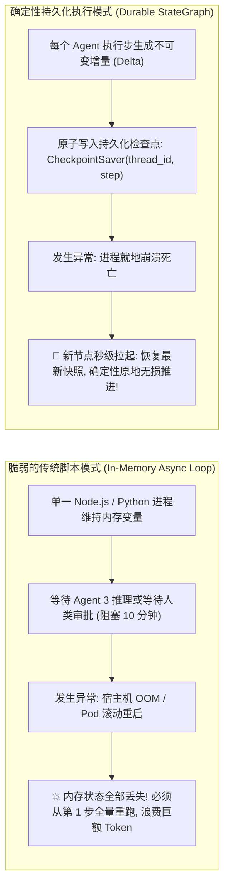
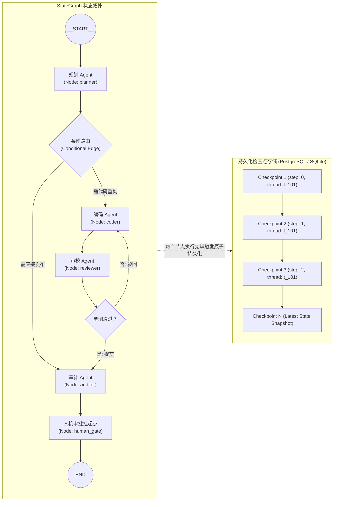
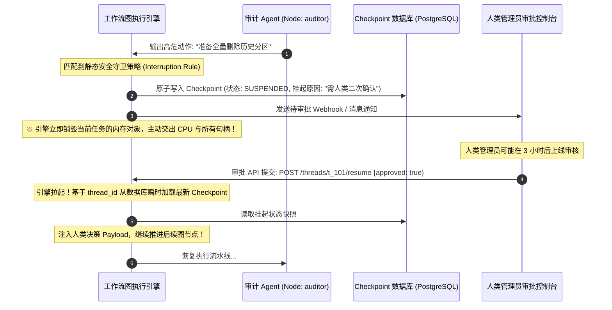
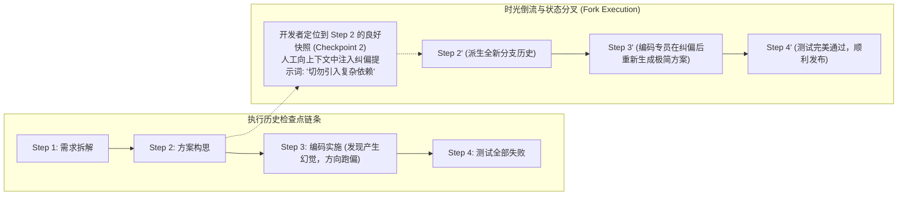

**TL;DR：** 许多多智能体演示项目（Demo）依赖单一进程中的 `async/await` 或递归 `while` 循环进行状态串联，这在长生命周期（如长达 30 分钟的复杂金融审计、端到端自主代码重构）的生产环境中是极其致命的脆弱反模式：宿主机一旦遭遇网络抖动、OOM-Killer 强杀或发布重启，进程中的调用栈与数万 Token 成果瞬间灰飞烟灭；更糟糕的是，若让大模型从头重新执行，由于生成的概率非确定性，系统甚至无法复现之前的推理路径。2025~2026 年成熟的生产级多 Agent 架构全面拥抱了以 Temporal 与 LangGraph 为代表的 **确定性持久化执行（Durable Execution）** 哲学：将多智能体协作建模为带条件跳转的 **有向无环图（DAG / StateGraph）**；通过 **事件溯源（Event Sourcing）检查点（Checkpoints）** 固化每一个状态跃迁，系统即便遭遇物理掉电也能在重启后毫秒级原地复活；更通过 **无阻塞状态冻结（Freeze & Suspend）** 彻底解决了人机协同（Human-in-the-Loop）长周期审批的连接悬挂与资源浪费死穴。

---

## 一、面试切入：跑了 25 分钟的 Agent 崩溃后，只能重跑一遍？

> **面试高频考题：**  
> “在我们的企业合规审计平台上，一个由 6 个专业 Agent 协同执行的深度尽调任务通常需要运行 20~30 分钟，累计消耗价值 50 美元的 Token。在实际生产中，由于云上节点弹性缩容或瞬时网络断连，工作流在第 25 分钟时进程崩溃了。如果让用户从头重新发起，不仅成本无法接受，而且由于大模型的随机性，上一步已经由合规专家确认的数据结构很可能会发生漂移。作为智能体平台架构师，你如何设计一套支持秒级断点续跑（Resume）、时光倒流（Time-Travel）以及人类审批时零资源挂起的高可用工作流状态机引擎？”

这个题目直击多智能体系统从“实验室原型”迈向“企业级关键任务支撑”的必经之路。

回答的核心在于建立 **持久化执行（Durable Execution）** 的心智模型：
**将大模型的每一次推理与工具执行，视为分布式事务流水线中的不可变状态转移（State Transition）。业务代码不应该假定自己会“连续执行”，而必须设计为“随时可以崩溃、随时可以重放”的确定性状态机。**

---

## 二、从玩具脚本到持久化执行：根本范式转移

传统脚本与生产级持久化工作流在架构底层存在不可调和的鸿沟：



### 2.1 传统内存脚本的脆弱本质
许多早期的开源 Agent 框架将多 Agent 嵌套在一个大的递归函数或 Promise 链中：
* **调用栈无法序列化**：操作系统的函数调用栈帧（Call Stack）深度绑定在单机的物理内存中，一旦进程退出，所有飞航（In-Flight）任务的局部变量、Token 历史全部蒸发；
* **幂等性黑洞**：如果工作流在前 20 步中已经向 GitHub 提交了 PR、在数据库中创建了新表，重跑不仅浪费算力，更会导致外部系统发生**不可预知的重复副作用（Duplicate Side-Effects）**。

### 2.2 事件溯源（Event Sourcing）与重放哲学
Durable Execution 彻底重构了执行模型：
1. **状态驱动而非控制流驱动**：Agent 的行为被解耦为 `Node(State) -> StateDelta` 的纯函数映射；
2. **所有副作用必须记录在事件日志中**：每次工具调用产生的入参和返回值，被持久化到数据库的事件账本中；
3. **确定性重放（Deterministic Replay）**：当系统从故障中恢复时，引擎重放历史事件，对于已经执行成功的工具调用，**直接从缓存返回历史结果（Memoized Result）**，既不重新消耗 LLM 算力，也不向外部系统发起二次调用。

---

## 三、有向状态图（StateGraph）与 Checkpoint 检查点模型

生产级多 Agent 编排引擎通常采用 **有向图状态机（StateGraph）** 拓扑：



### 3.1 检查点（Checkpoint）的核心数据结构

在底层数据库中，每一个检查点条目记录了完整的上下文快照：

```typescript
export interface CheckpointRecord {
  threadId: string;       // 全局唯一的会话链路 ID
  checkpointId: string;   // 单调递增的版本时间戳
  parentCheckpointId: string | null;
  nodeName: string;       // 刚刚执行完成的 Agent 节点名
  stateValues: Record<string, unknown>; // 当前全局状态的完整只读快照
  nextNodes: string[];    // 下一步即将被激活的候选节点
  pendingInterrupts: Array<{
    type: "HUMAN_APPROVAL" | "EXTERNAL_WEBHOOK";
    reason: string;
  }>;
}
```

### 3.2 节点更新的原子性原则
* 节点在执行业务逻辑时，所有的改动仅缓存在本地内存的 `StateDelta` 中；
* 只有当节点逻辑执行完毕、且路由条件完成计算后，引擎向持久化存储发起一次**单事务原子写入（Atomic Transaction）**：
  * 保存状态快照；
  * 更新下一步就绪队列；
* 若节点在推理中间突然崩溃，未提交的事务自动回滚，系统重启后能够精确回到上一个健康检查点。

---

## 四、Human-in-the-Loop（HITL）毫秒级无损挂起与唤醒

在高危多智能体应用中，**人类必须拥有最终否决权（Human-in-the-Loop）**。但传统开发经常将人机协同写成“噩梦模式”：

```typescript
// ❌ 极度危险的反模式：线程睡眠阻塞
async function executeAgentFlow() {
  await coderAgent.run();
  // 危险！进程被挂起在内存中等待人类响应，若人类 2 小时后才回复，连接早已断裂，进程随时崩溃
  const approval = await waitHumanApprovalViaPoll(); 
  await deployAgent.run();
}
```

### 4.1 真正的无阻塞挂起（Durable Interruption）
在持久化引擎中，人机审批绝不消耗任何物理线程或网络连接：



1. **进入挂起**：当图执行遇到带有 `interrupt_before` 或 `interrupt_after` 的节点时，引擎将当前完整的上下文状态快照持久化到数据库，将该会话标记为 `SUSPENDED`，**随后立即彻底销毁当前工作流在内存中的所有对象**；
2. **人类响应**：无论管理员是 5 秒后点击还是 5 天后审批，底层的计算资源都处于绝对的**零消耗状态**；
3. **精准热唤醒**：人类在 Web 控制台点击“通过”后，前端向调度集群发起 HTTP 请求，集群中任意一台无状态 Worker 节点根据 `thread_id` 从数据库载入快照，在内存中瞬间重建状态，顺畅向下推演。

---

## 五、时间旅行与分叉推演（Time-Travel & Branching）

由于每一个执行步都生成了版本化的不可变快照，持久化工作流天然获得了传统调试工具梦寐以求的能力——**时间旅行调试（Time-Travel Debugging）**。



* **生产价值**：在复杂多 Agent 调试中，一个任务如果需要经历 15 个步骤，开发人员无需因为第 12 步的一个 Prompt 缺陷而从第 1 步重头跑起；
* 只需在可视化界面中选择第 11 步的快照，原地微调 Prompt 或修正输入变量，直接从第 11 步启动**状态分叉（Branching）**，开发与排障效率实现百倍提升。

---

## 六、生产级 TypeScript 实现：轻量级 Durable StateGraph 引擎

下面给出一个工业级可运行的微内核状态图执行引擎，支持检查点持久化与中断挂起。

```typescript
// durable_state_graph.ts
// 生产级确定性工作流图执行引擎核心实现

export interface GraphState {
  values: Record<string, unknown>;
}

export type NodeHandler = (state: GraphState) => Promise<Partial<GraphState["values"]>>;

export interface CheckpointSaver {
  save(threadId: string, checkpointId: string, state: GraphState, nextNode: string | null): Promise<void>;
  load(threadId: string): Promise<{ state: GraphState; nextNode: string | null } | null>;
}

// 内存版持久化实现 (生产环境替换为 PostgreSQL / Redis)
export class InMemoryCheckpointer implements CheckpointSaver {
  private storage: Map<string, { state: GraphState; nextNode: string | null }> = new Map();

  async save(threadId: string, checkpointId: string, state: GraphState, nextNode: string | null): Promise<void> {
    // 深拷贝快照，保证不可变性
    this.storage.set(threadId, {
      state: JSON.parse(JSON.stringify(state)),
      nextNode
    });
  }

  async load(threadId: string): Promise<{ state: GraphState; nextNode: string | null } | null> {
    return this.storage.get(threadId) || null;
  }
}

export class DurableStateGraph {
  private nodes: Map<string, NodeHandler> = new Map();
  private edges: Map<string, string> = new Map();
  private interruptNodes: Set<string> = new Set();
  private checkpointer: CheckpointSaver;

  constructor(checkpointer: CheckpointSaver) {
    this.checkpointer = checkpointer;
  }

  public addNode(name: string, handler: NodeHandler): this {
    this.nodes.set(name, handler);
    return this;
  }

  public addEdge(fromNode: string, toNode: string): this {
    this.edges.set(fromNode, toNode);
    return this;
  }

  public setInterruptBefore(nodeName: string): this {
    this.interruptNodes.add(nodeName);
    return this;
  }

  public async run(
    threadId: string,
    startNode: string,
    initialState: Record<string, unknown>
  ): Promise<{ status: "COMPLETED" | "SUSPENDED"; state: GraphState }> {
    // 1. 尝试从检查点恢复，若不存在则使用初始状态
    let checkpoint = await this.checkpointer.load(threadId);
    let currentState: GraphState = checkpoint ? checkpoint.state : { values: { ...initialState } };
    let currentNode: string | null = checkpoint ? checkpoint.nextNode : startNode;

    // 2. 状态驱动的循环推进
    while (currentNode) {
      // 检查当前节点是否需要挂起等待人机协同
      if (this.interruptNodes.has(currentNode) && (!checkpoint || checkpoint.nextNode === currentNode)) {
        console.log(`[DurableEngine] 节点 [${currentNode}] 命中安全守卫！触发无损挂起，释放计算句柄。`);
        await this.checkpointer.save(threadId, crypto.randomUUID(), currentState, currentNode);
        return { status: "SUSPENDED", state: currentState };
      }

      console.log(`[DurableEngine] 正在执行节点: ${currentNode}...`);
      const handler = this.nodes.get(currentNode);
      if (!handler) throw new Error(`找不到未声明的图节点: ${currentNode}`);

      // 执行节点纯逻辑
      const delta = await handler(currentState);
      // 合并状态
      currentState.values = { ...currentState.values, ...delta };

      // 寻址下一个节点
      const nextNode: string | null = this.edges.get(currentNode) || null;
      // 原子保存当前推进步
      await this.checkpointer.save(threadId, crypto.randomUUID(), currentState, nextNode);

      currentNode = nextNode;
      checkpoint = null; // 重置初始游标
    }

    console.log(`[DurableEngine] 工作流执行完毕，顺利收敛达成终态。`);
    return { status: "COMPLETED", state: currentState };
  }
}
```

---

## 七、架构决策矩阵：传统脚本 vs 外部任务队列 vs 持久化图状态机

| 架构对比维度 | 纯异步代码循环 (Naive Async Loop) | 经典分布式任务队列 (Celery / BullMQ) | 确定性图状态机 (Durable StateGraph) |
| :--- | :--- | :--- | :--- |
| **故障宕机自愈能力** | **0 自愈（进程崩溃全部丢失）** | 粗粒度（只能重跑整个 Task） | **毫秒级细粒度原地续跑（断点无损）** |
| **人类长周期审批** | 严重阻塞连接与线程池 | 需自行维护复杂的状态回调表 | **原生支持无阻塞状态冻结与热唤醒** |
| **Token 成本防浪费** | 极差（每次故障从第 1 步重买） | 较差（重跑重试无缓存隔离） | **极致节省（已完成步骤直接读快照）** |
| **非确定性状态漂移** | 极高（每次重跑结果不同） | 较高（缺乏时间旅行溯源） | **绝对受控（状态跃迁具备完整因果链）** |
| **排障与时间旅行** | 依赖翻找分散的日志 | 难以还原中间局部变量 | **支持任意历史快照的可视化状态分叉** |

---

## 八、总结与排障 Checklist

在构建面向生产的多智能体系统时，**大语言模型的概率不可靠性，必须由底层基础设施的绝对确定性来对冲**。将工作流状态机固化为带持久化检查点的有向图，是构建企业级高可用 Agent 运行时的不可逾越的技术分水岭。

在将多智能体工作流推向关键业务生产前，架构师必须逐项核对以下关键工程指标：
- [ ] 系统是否彻底消除了在单一进程内存中维持长时间长连接与会话状态的反模式？
- [ ] 每一个 Agent 节点的输入输出是否均绑定了唯一的 `Idempotency-Key`，避免重放时发生外部重复写调用？
- [ ] 检查点存储（Checkpointer）是否支持高并发下的原子写入与快照版本隔离？
- [ ] 针对人机协同（HITL）审批节点，是否做到了挂起时主动切断数据库连接与协程挂起，拒绝线程睡眠模式？
- [ ] 状态快照中是否过滤掉了临时的超大无用二进制文件，防止持久化数据库随着执行步数急剧发生空间膨胀？

---

## 参考资料

1. **Temporal Technologies**: *Temporal Platform Architecture and Durable Execution Paradigm*.
2. **LangChain Team**: *LangGraph: Building Resilient Multi-Agent State Machines (2024)*.
3. **Fowler, Martin**: *Event Sourcing and CQRS Architectural Patterns*.
4. **Cadence Workflow Open Source Project**: *Fault-Tolerant, Stateful Code Execution*.
