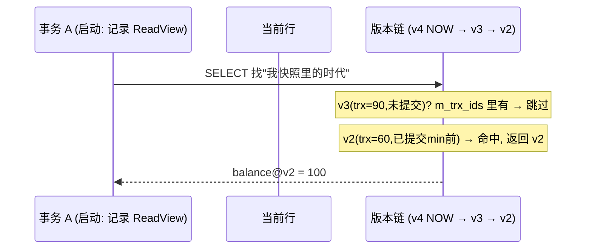

**TL;DR：** MySQL 的「可重复读」不是用锁把数据冻住的，而是用 MVCC 给了每个事务一个"时间机器"：InnoDB 把每一行都维护成一串**版本链**（由 undo log 提供），每个事务启动时拍一张 **ReadView 快照**（记录了当时所有在飞事务的 ID），之后所有快照读都只看版本链上"自己启动那一刻"的版本。于是"别人改了行"对你不可见，不是因为行被锁住，而是因为**你的快照账本里根本没有那一笔**。代价是：当前读（UPDATE/FOR UPDATE）必须走最新锁，写与读的账本必须对账——本文拆开这组账本，并给出复现实验。

## 一、隔离级别是张背出来的表

可重复读（REPEATABLE READ）、读已提交（READ COMMITTED）、读未提交、串行化——几乎每个后端工程师都背过这张表：哪个级别防脏读、哪个防不可重复读、哪个防幻读。背诵的代价是产生了三个流行误解：

1. **隔离是锁锁出来的**。错。默认 RR + 读走快照，锁只出现在"当前读"上。
2. **可重复读是无条件成立**的。错。带条件的"当前读"视角下它破功，见第五节。
3. **隔离级别是从这四种里挑一种**。错。MySQL 的 RR 和 RC 在快照读上用的是同一套 MVCC，只是**快照生成的时机**不同。

本文把这张表翻译回 InnoDB 的资源账：行版本、undo 链、ReadView、当前读。读完你不再需要背表——因为你能自己推出为什么表格长那样。

## 二、行不是一行，是一串版本

`UPDATE users SET balance = 100` 在 InnoDB 里做的事情，不是"覆写"一行，而是"**新建一个版本，并把旧版本链接在它下面**（通过版本链）。"行的物理结构（隐藏列）带四个字段：`DB_TRX_ID`（最近改本行的**事务 ID**）、`DB_ROLL_PTR`（指向上一个版本的 undo 记录）。


这一串版本链，就是一个"行"的完整账本。现在的问题只剩一个：**给定一个事务 T，它该看链上哪个版本？** 答案就是 ReadView——快照。

## 三、ReadView：一张"我启动时还有谁活着"的名单

事务启动快照时，InnoDB 记下这份名单：**当前所有正在执行的事务 ID 集合（m_ids）、其中最小的一个（min_trx_id）、当前系统里最大的事务 ID（max_trx_id)、以及自己（creator_trx_id）**。判断某个版本能否被看到，规则只有一个——顺着版本链往下找，直到找到"这个版本的事务 ID 在我启动那一刻已经结束"：

- 版本的事务 ID < min_trx_id 或 == creator_trx_id（自己改的当然看得见）→ **可见**，停。
- 版本的事务 ID >= max_trx_id（我启动之后才开的事务，闻所未闻）→ **不可见，往旧版本找**。
- 位于两者之间，但在 m_ids 里出现（启动那一刻还在跑）→ **不可见，往旧版本找**。

一句话：快照里能见的，永远是"**我做快照之前，已提交的版本**"。所以可重复读的"重复"是字面意思——同一事务两次 SELECT 用的是同一个 ReadView，整个事务期间都指着启动那一帧。

换到物理形态画出来，链路应是：



在读到那一刻，**行被谁改、改完没，都与我无关**——因为我从不看"现在"，我只读"过去我定格的那一页"。

## 四、快照读 vs 当前读：版本账本必须分开记

如果全是快照读，MVCC 就太平了。但 `UPDATE`、`DELETE`、`SELECT ... FOR UPDATE` 不能读旧版本——**写必须基于最新值，否则覆盖就丢了**。MySQL 把读分成两类：

- **快照读**（普通 SELECT）：读版本链上"我看得见"的那个版本，**不加锁**。走的是 ReadView。
- **当前读**（UPDATE / DELETE / `FOR UPDATE` / `LOCK IN SHARE MODE`）：读**最新版本并加锁**，走的是"锁 + 版本链的当前值"。

这两类读的并存，是 MySQL 事务模型所有奇怪行为的根源。两个经典案例：

1. **事务内先 UPDATE 再普通 SELECT，能读到自己的 UPDATE**——因为写的时候，你自己抢占了"当前值"并把新版本事务 ID 记成了自己；之后快照读虽然看旧账本，但账本规则说"自己写的可见"，于是新值现身。
2. **快照读永远读的是事务第一次读取那一刻**——如果整个事务只做快照读，RC 与 RR 的表现差异就只剩一个：RC 在**每条语句**开头重新拍快照，RR 在**事务第一条语句**拍一次。所以 RC 下同一事务两次 SELECT 可能看到不同值（不可重复读），RR 下永远不会——这就是"可重复读"三个字的全部含义。

## 五、可重复读为什么还会"读到新行"：当前读与幻读

快照账本困住的是"快照读"。一旦代码走到**当前读**，账本就破了。经典的破案例子是幻读：同一事务内两次查询，满足条件的**集合**变了。

```sql
-- 事务 A（RR 隔离级别）
START TRANSACTION;
SELECT * FROM t WHERE id > 5;   -- 返回 2 行（快照读）
-- ...（此刻事务 B 插入 id=9 并提交）
SELECT * FROM t WHERE id > 5;   -- 仍返回 2 行 —— 快照读不破功
SELECT * FROM t WHERE id > 5 FOR UPDATE;  -- 现在返回 3 行 —— 幻读出现了
```

为什么快照读不破功，`FOR UPDATE` 破？**因为当前读不走快照，它锁住"最新版本的行"，然后按最新值统计集合。** 间隙锁（gap lock）能防的是"其他事务往我锁定的间隙里插入"，但防不住这样一个顺序：B 的插入发生在 A 锁住间隙**之前**、A 的第二次当前读**之后**提交——A 锁的是"当时存在的间隙"，B 已经在那之前把行放进去了，A 只能看到"我锁范围里多出来的行"。

也就是说：**MVCC 给快照读一个不变的世界，却必须给写操作一个真实的世界；两个世界在"当前读"上相交，幻读就是相交处的裂缝。**

一个必须诚实说明的边界：MySQL 的 RR 在**当前读**上依赖"行锁 + 间隙锁"来近似防幻读，而 PostgreSQL 的 MVCC 用 SSI（可串行化快照隔离）走另一条路——两者都不完美。MySQL 在默认 RR 下的常见错误认知是"RR 就完全防幻读"，**这个说法只对快照读成立**。

## 六、实验：两个会话把账本画出来

以下脚本给出**最小可复现**，复现「不可重复读」「幻读」「当前读破功」，每次逐条在同一 MySQL 8 实例上执行：

```sql
-- 准备
CREATE TABLE acc(id INT PRIMARY KEY, balance INT);
INSERT INTO acc VALUES (1, 100);

-- SESSION 1                       -- SESSION 2
SET autocommit=0;
START TRANSACTION;
SELECT * FROM acc WHERE id=1;      -- 100 （快照读）
                                   UPDATE acc SET balance=200 WHERE id=1; COMMIT;
SELECT * FROM acc WHERE id=1;      -- 仍是 100 —— MVCC 账本在 RR
SELECT balance FROM acc WHERE id=1 LOCK IN SHARE MODE; -- 又读到 200 —— 当前读
```

关键配套观测：执行 `SHOW ENGINE INNODB STATUS`，在 `TRANSACTIONS` 段能看到两个事务的详情——其中一个事务的 `READ VIEW` 会列出 `m_ids` 的集合，这就是它"定格"的世界；执行 `SELECT * FROM performance_schema.data_locks\G` 可以看到当前读持有的锁（X 锁 / 间隙锁）。配合两次 SELECT 之间手动停顿几秒、给会话 2 一个提交窗口，就是 MVCC"账本"最直观的物理演示。

## 结论：MVCC 用快照隔离读，当前读仍会进入锁竞争

MVCC 把"隔离"从"用锁冻住数据"的直觉，换成了"**每个读者一本书，翻到哪一页由快照决定**"——读不用等写、写不用等读，靠的是两样东西：**版本链**（行的历史）和**快照**（启动时刻的可见事务集合）。隔离级别的表不值得背，值得背的是那条验证线：**快照读不破功，当前读能越过账本**。

下一步：把第六节实验自己跑一遍，在两次 SELECT 之间停几秒，用 `SHOW ENGINE INNODB STATUS` 看 `READ VIEW`——你会在那几秒里亲眼看见"时间被定格"。这也是下一篇（死锁与锁排队）的前置知识：MVCC 管读的快照，锁管写的顺序。

## 参考资料

1. InnoDB 官方文档：可重复读与一致性读取—— https://dev.mysql.com/doc/refman/8.0/en/innodb-consistent-read.html
2. InnoDB 官方文档：MVCC—— https://dev.mysql.com/doc/refman/8.0/en/innodb-multi-versioning.html
3. MySQL 内部：InnoDB 版本链与 undo 日志（MySQL 官方博客）—— https://dev.mysql.com/blog-archive/mysql-8-0-3-a-new-data-dictionary/
4. 隔离级别官方表（READ UNCOMMITTED 到 SERIALIZABLE）—— https://dev.mysql.com/doc/refman/8.0/en/innodb-transaction-isolation-levels.html

> 延伸阅读：本文的版本链是"行级可见性"；同系列中，持久层账本见[数据库为什么宁可慢，也要等你 fsync](/writing/fsync-group-commit)，读路径的一致性代价见[主从复制延迟 300ms 的账单](/writing/replication-lag-read-paths)；与本文配套的锁排队视角，见同系列[死锁不是靠重试：wait-for graph 与间隙锁](/writing/database-deadlock-wait-graph)。
