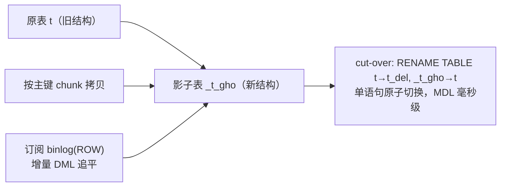

**TL;DR：** MySQL 的 ALTER TABLE 号称”在线 DDL”，但这个在线是打折的。无论走 COPY 还是 INPLACE，DDL 都要先把元数据锁的可升级共享档（SU）拿到手，结束时再升级成排他做切换；而任何一条 DML 都要先拿共享档，排他与共享天生互斥。只要有一条长事务开着不提交，ALTER 就停在 `Waiting for table metadata lock`，它挂起的排他请求还会把这张表之后所有读写请求全部挡在门外——一条 ALTER 让整表读写排队，而 `lock_wait_timeout` 默认 31536000 秒（一年），意味着没人干预就一直排到超时。5.6+ 的 in-place 只是把“拷贝整表”换成“原地改页”，元数据锁的等待窗口一个不少。这也是 gh-ost / pt-osc 至今不可替代的原因：影子表 + 追平 + 原子 rename，把 MDL 长持有压成毫秒级切换。

## 一、一条加索引的 ALTER 是怎么把线上读写卡住的

先立场景：线上订单表 5000 万行，开发在压测后补一条索引：

```sql
ALTER TABLE orders ADD INDEX idx_uid (user_id);
```

执行这条语句期间，接口突然开始大面积超时，监控里 `orders` 表的所有读请求耗时飙到秒级。大部分人的第一反应是“重建索引把磁盘 IO 打满了”——但真正卡住读写的往往不是重建本身，而是元数据锁。时间线是这样的：

1. 某个服务里有一个“开了不提交”的事务，它碰过 `orders` 表（比如一次 `SELECT` 之后去做跨服务调用，事务一直挂着）。
2. ALTER 执行完自己的数据工作，走到提交切换那一步，需要把元数据锁从“可升级共享”升级成排他；长事务手里那枚共享锁不撒手，ALTER 停在 `Waiting for table metadata lock`。
3. 排他请求一旦在队列里挂起，之后任何想碰 `orders` 的 `SELECT`/`UPDATE` 都会排到它后面，而不是插队——这张表的所有读写开始排队。
4. 如果长事务一直不结束，ALTER 要等满 `lock_wait_timeout` 才会放弃，而这段等待里每一条 DML 都在陪它等。

`SHOW FULL PROCESSLIST` 里就是这行（实验脚本的预期输出，见第六节）：

```text
| Id | User | db        | Command | Time | State                           | Info                                           |
| 11 | root | ddl_demo  | Query   |   9  | Waiting for table metadata lock | ALTER TABLE big_table ADD INDEX idx_val (val)  |
```


这里的关键不在慢查询：一条在 autocommit 下 2 毫秒就跑完的 `SELECT`，一旦被包进“开着不提交”的事务里，它那枚共享元数据锁就变成烫手山芋。慢，不是它造成的；它只是把门从里面别住了。

## 二、MDL 的两种锁：DML 要 SHARED，DDL 要 EXCLUSIVE

MDL 锁的是“这张表的元数据”，和 InnoDB 的行锁、表锁是两层东西——`UPDATE t SET ...` 先拿 MDL 共享锁（确认表结构没变），再在引擎层拿行锁改数据。对应用层而言 MDL 对外可以归纳成两类：

| 锁 | 谁拿 | 什么时候释放 |
| :--- | :--- | :--- |
| SHARED（共享） | 一切 DML：SELECT / INSERT / UPDATE / DELETE | autocommit 下语句结束即放；显式事务里持有到事务结束 |
| EXCLUSIVE（排他） | 一切 DDL：ALTER / DROP / RENAME / TRUNCATE | DDL 结束 |

互斥关系一句话：共享档之间互相兼容（并发读写不打架），排他档和所有档都冲突。所以 DDL 一旦持排他，表上就没有任何读写能过。

内部实现其实比两分法细：`performance_schema.metadata_locks` 能看到 `SHARED_READ`、`SHARED_WRITE`、`SHARED_UPGRADABLE`、`EXCLUSIVE` 等 8 种。但方向不变——DDL 开始取“可升级共享”档，执行完毕切换瞬间升级成排他档；对外你看到的就是“DML 要共享、DDL 要排他，两者互斥”。这个升级动作，正是第六节实验里 `EXCLUSIVE` 处于 `PENDING` 的那一行。

MDL 的两条反直觉性质，决定了事故形态：

1. **持有粒度是“事务级”不是“语句级”**：autocommit 的 `SELECT` 语句结束即放；但显式事务里碰过的表，MDL 持有到提交/回滚。这是“占着茅坑”的根因——一个空闲的长事务，占的是别人做 DDL 的资格。
2. **排他请求挂起后，新共享请求不会插队**：MDL 队列按请求到达顺序排，后来的 `SELECT` 只能排在等待的排他请求后面。于是一条长事务本身不碍事（它占的是共享档，和别人的共享档兼容），但它让排他锁悬空，把整张表拖进排队——这就是“一条 ALTER 卡住全部读写”的放大机制。

配套的 `lock_wait_timeout`，官方文档给出的默认值是 **31536000 秒（365 天）**。意思是没人干预的话，这条 ALTER 会老实等一年才报 `ERROR 1205` 放弃——期间整表读写一直在排队。事故高发不是 DDL 本身有多重，是这个默认值把“卡住”的代价放到了最大。

## 三、Online DDL 的算法谱系：COPY / INPLACE / INSTANT 与 LOCK 参数

“在线”打折的第一刀在名字上：Online DDL 不是全程在线，是**先拿到元数据锁的准入资格（一枚执行完会升级成排他的可升级共享档）才开工，结束切换时再升级成排他**。5.6 引入的 INPLACE 只是把执行期的“拷贝整表”换成“原地改页”，这两道元数据锁窗口一个不少——它们才是锁事故的来源，算法解决不了。

MySQL 8.0 里 DDL 有三档算法：

| | INSTANT | INPLACE | COPY |
| :--- | :--- | :--- | :--- |
| 本质 | 只改元数据，不动数据页 | 原地改页 / 重建二级索引 | 新建整表 → 逐行拷贝 → 切换 |
| 额外磁盘 | 无 | 索引构建用临时文件，不整表复制 | 约一份整表空间 |
| 并发 DML | 全程可 | LOCK=NONE 时执行期可 | 不支持 LOCK=NONE，写入被挡 |
| 时间量级 | 秒级（不随行数涨） | 随表大小涨，但无 IO 翻倍 | 最慢 + 写放大最重 |
| 支持范围 | 仅少数操作 | 索引 / 加删列等多数 | 几乎所有操作（保底） |

**INSTANT**（8.0.12+）：只改元数据、不碰数据页，耗时与行数无关，是加列的最优解。但官方文档给出的支持面很窄，例如：表尾加列（8.0.12+）、删列（8.0.29+）、改列默认值（8.0.12+）、加/删虚拟生成列、改列名。加索引不支持——索引本质上要生成新叶子页，不是元数据能描述的。

**INPLACE**（5.6+）：原地改。加索引、加删列大多走这条。执行期配合 `LOCK=NONE` 允许并发 DML，代价是执行期那些并发变更要记进 **online row log**（在线 ALTER 日志，独立于 redo，受 `innodb_online_alter_log_max_size` 控制、落临时文件），commit 阶段在排他锁下回放到新结构上；**崩溃不续跑**——恢复时回滚/清理半成品，DDL 必须重跑（Online DDL 不可恢复）。**但两道排他窗口照旧**——开头准入、结尾切换，任何一道窗口里有长事务，就回到第二节的排队现场。

**COPY**：最保底也最贵。新建一张同结构的新表，逐行拷贝老数据，完成后 rename 切换。需要约一份整表空间，磁盘和 IO 都翻倍，且不支持 `LOCK=NONE`（拷贝期间写入被挡）。加列但没法 INSTANT/INPLACE（比如列加到中间、无默认值）时就会掉进这条。改主键只能走 COPY（聚簇索引要整体重建）。

具体操作能走到哪一档，官方文档给过支持矩阵，常见几条：

| 操作 | INSTANT | INPLACE | 备注 |
| :--- | :--- | :--- | :--- |
| 表尾加列（有默认值） | ✓ 8.0.12+ | ✓ | 最省的做法 |
| 删列 | ✓ 8.0.29+ | ✓ | 8.0.29 前删列只能 INPLACE/COPY |
| 加二级索引 | ✗ | ✓ | 大表加索引的默认路径 |
| 删索引 | ✗ | ✓ | 只删元数据 |
| 改列类型 | ✗ | 仅少数 | 多数要 COPY |
| 改主键 | ✗ | ✗ | 只能 COPY |

配套还有 `ALGORITHM` / `LOCK` 两个参数。`ALGORITHM=INSTANT|INPLACE|COPY|DEFAULT` 限定算法档位；`LOCK=NONE`（读写都放行）| `SHARED`（放行读、挡写）| `EXCLUSIVE`（全挡）限定你能接受的最小并发。注意语义是“你请求的并发度必须能被满足，否则报错而不是偷偷降级”：`ALGORITHM=INSTANT` 撞上不支持的操作为报“does not support this operation”，`LOCK=NONE` 撞上 COPY 为报错。所以实际写 DDL 时，习惯是 `ALGORITHM=INPLACE, LOCK=NONE` 尽力而为——跑不了就退 `ALGORITHM=COPY, LOCK=SHARED` 并接受全表排写。

这套谱系与 [MySQL 的三条日志：redo、undo、binlog 各记一本账](/writing/mysql-redo-undo-binlog) 接得上：INPLACE 执行期并发的 DML 变更由 **online row log** 承接（redo 只保证元数据事务落盘）；undo/MVCC 让执行期并发的读拿到一致快照；DDL 语句本身走 binlog 复制到从库，从库执行同样的 ALTER——所以从库同样要过这两道排他窗口，主库的长事务也会连坐从库。

## 四、为什么还有 gh-ost / pt-osc：把 MDL 长持有换成短持有

既然 5.6+ 有 INPLACE、8.0 有 INSTANT，为什么 GitHub 还维护 gh-ost、Percona 还维护 pt-osc？因为 INPLACE 的两道排他窗口没消掉，大表 + 高峰 + 长事务 = 全表排队一年。真实的运维事故里，很多不是“DDL 把磁盘打满”，而是“一行 ALTER 卡住一张核心表”。第三方工具卖的就是把 MDL 长持有换成短持有。

gh-ost 的做法（以 GitHub 官方文档的语义为准）：



1. 建一张新结构的影子表 `_t_gho`，**不建触发器**。
2. 按主键分块把原表数据拷进影子表。
3. 以复制身份订阅原表 binlog，把拷贝期间的增量 DML 回放到影子表，追到接近零延迟。
4. cut-over：一条 `RENAME TABLE t TO t_del, _t_gho TO t`。MySQL 官方文档明确多表 rename 在同一条语句里是原子的，gh-ost 只在 rename 前拿一次极短排他锁，毫秒级——MDL 长持有被压成一次原子切换。

pt-osc 走的是另一条路：**触发器**把每个写镜像到影子表（每次 DML 多写一份，写放大），同样用原子 rename 切换。它不依赖 8.0 的 INSTANT，5.x 也能用，但触发器是每次写都要多付的一笔税。

三者的语义承诺差异，落到一句话 + 一句为什么：

| 方案 | 卖什么 | 为什么这个卖点成立 |
| :--- | :--- | :--- |
| MySQL Online DDL | “数据页级在线” | 执行期放行 DML，但两道 MDL 排他窗口是硬成本，长事务让它失效 |
| gh-ost | “MDL 只短持有” | 长追平 + 短切换，把排他锁从“分钟级重建”换成“毫秒级 rename” |
| pt-osc | “不依赖 8.0 特性” | 触发器在 5.x 通用，代价是每次写多付一份 |

选型的取舍：gh-ost 要求 `binlog_format=ROW` + 复制账号权限，追平延迟受主库写入速率制约；pt-osc 的触发器拖慢每次写；两条路线都要约一倍影子表磁盘，且改完原表结构没变、业务无感，但排期、限流、回滚都变成你自己的运维纪律。对于能在低峰做的小表，直接 INPLACE 甚至 INSTANT 就够了——用 gh-ost 属于杀鸡用牛刀。

## 五、结论与判断：小表无所谓、大表要排期、长事务是元凶

把四节的判断落成三条可执行的分级：

1. **小表（几十万行内）无所谓**：重建也就一两秒，锁窗口短到无感，直接 `ALTER TABLE ... ALGORITHM=INPLACE, LOCK=NONE`，别为它引入第三方工具和一套切换流程。
2. **大表（千万行以上）必须排期**：错峰执行，执行前先扫一遍有没有长事务——查 `information_schema.innodb_trx` 里 `TIME` 超阈值的事务、`performance_schema.metadata_locks` 里 `EXCLUSIVE` 处于 `PENDING` 的请求。先杀掉或等掉长事务再开工，否则 ALTER 永远先卡在锁上，重建本身根本没开始。
3. **长事务是元凶，不是 DDL**：事故的根因是“开着不提交”让排他锁悬空，DDL 只是那根引线。监控把 `Waiting for table metadata lock` 和长事务时长做成告警，比研究 DDL 参数有用得多。

技术判断一句话：**INPLACE 治的是“拷贝慢”，治不了“锁等待”；INSTANT 连锁等待都没有，但只覆盖极少数操作；要在大表高峰做 DDL，就把 MDL 长持有换掉——gh-ost 的原子 rename 是目前最干净的答案。**

下一步可执行的动作：先把第六节的实验跑一遍，亲眼看到 `Waiting for table metadata lock` 和 `EXCLUSIVE / PENDING` 那两行，你对“在线打折”的体感就从“知道”变成“见过”；然后给 `innodb_trx` 和 `metadata_locks` 各挂一条告警，下次有人半夜排 DDL 前，长事务会先替你报警。

## 六、实验入口：把“Waiting for table metadata lock”复现出来

实验在 `experiments/mysql-ddl/`（MySQL 8.0.12+），三会话复现第二节的排队现场：

```bash
mysql -u root < experiments/mysql-ddl/01_setup.sql           # 20 万行表
mysql -u root ddl_demo < experiments/mysql-ddl/02_long_txn.sql   # 会话A: 长事务占共享锁, SLEEP 120s
mysql -u root ddl_demo < experiments/mysql-ddl/03_ddl_wait.sql   # 会话B: ALTER, 20s 后报 ERROR 1205
mysql -u root ddl_demo < experiments/mysql-ddl/04_watch.sql      # 会话C: 观察 processlist + MDL 队列
mysql -u root ddl_demo < experiments/mysql-ddl/05_algorithm_compare.sql  # INSTANT/INPLACE/COPY 对比
```

关键观察点：processlist 里 ALTER 的 State 是 `Waiting for table metadata lock`；`performance_schema.metadata_locks` 里长事务的共享锁是 `GRANTED`、ALTER 的排他锁是 `PENDING`——共享与排他对峙的现场。负对照组是把 02 撤掉直接跑 03，ALTER 秒回，证明卡住读写的是 MDL 而非重建。

当前尚未保存可发布的 MySQL 运行快照；以下三项是发布前必须补齐的证据，不把预期值写进正文：

1. `lock_wait_timeout` 调到 60 秒后，ALTER 从发起到报 1205 的实测等待秒数（对照：长事务结束后同一条 ALTER 秒回）。
2. 05 脚本在 20 万行表上 INSTANT / INPLACE / COPY 三条 ALTER 的实测耗时，与 `information_schema` 里 `DATA_LENGTH` / `INDEX_LENGTH` 的前后变化。
3. processlist 与 metadata_locks 的实际输出文本。

> 延伸阅读：MDL 是元数据层的锁，InnoDB 行锁那一层还有自己的排队与死锁，见[死锁不是靠重试](/writing/database-deadlock-wait-graph)；DDL 日志靠 redo 承接、语句靠 binlog 复制，见[MySQL 的三条日志：redo、undo、binlog 各记一本账](/writing/mysql-redo-undo-binlog)；大表加索引本质上是在给二级索引算账，见[回表为什么贵：InnoDB 的二级索引账本](/writing/covering-index-avoid-back-to-table)。

## 参考资料

1. MySQL 官方：Metadata Locking（MDL 持有与释放语义）—— https://dev.mysql.com/doc/refman/8.0/en/metadata-locking.html
2. MySQL 官方：Online DDL 背景（INIT/EXECUTION/COMMIT 三阶段）—— https://dev.mysql.com/doc/refman/8.0/en/innodb-online-ddl-background.html
3. MySQL 官方：Online DDL 操作支持矩阵（哪些操作能 INSTANT/INPLACE）—— https://dev.mysql.com/doc/refman/8.0/en/innodb-online-ddl-operations.html
4. MySQL 官方：ALTER TABLE 语法（ALGORITHM / LOCK 子句）—— https://dev.mysql.com/doc/refman/8.0/en/alter-table.html
5. MySQL 官方：lock_wait_timeout（默认 31536000）—— https://dev.mysql.com/doc/refman/8.0/en/server-system-variables.html#sysvar_lock_wait_timeout
6. gh-ost（GitHub）：影子表 + binlog 追平 + 原子 cut-over —— https://github.com/github/gh-ost
7. pt-online-schema-change（Percona Toolkit）：触发器镜像写 —— https://docs.percona.com/percona-toolkit/pt-online-schema-change.html
