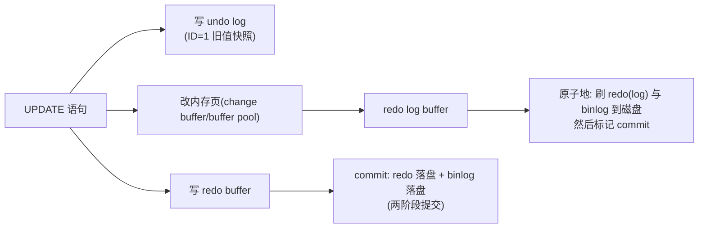
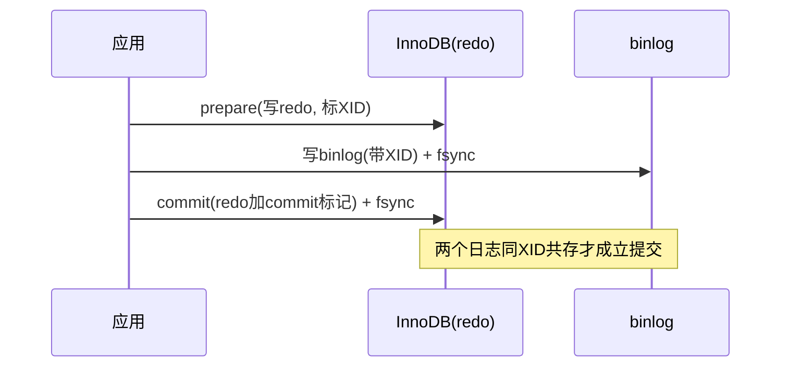
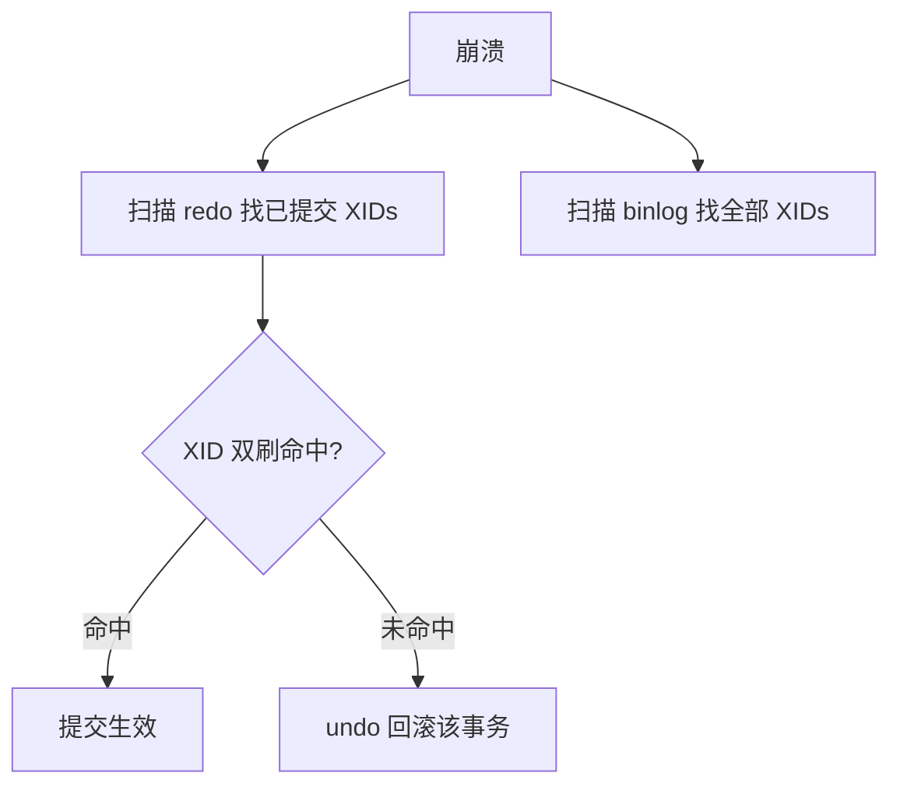

**TL;DR：** MySQL 一个提交里同时写三本账，各管一件事：**redo** 管崩溃恢复（页的物理变化，幂等、可重放），**undo** 管回滚与 MVCC 看旧版本（逻辑反操作），**binlog** 管复制与时间点恢复（写出来的是行记录/语句）。三者的账本格式完全不同（redo 是物理页的 diff，undo 是行的逆向操作，binlog 是 SQL/row 事件），由**两阶段提交协议**（在 redo 与 binlog 之间做原子协调）保证彼此不打架。本文用一个"脏页被刷回"的故事，把三本账同时讲清，并给出 crash 场景的推演。

## 一、三本账为什么不能合并成一记

很多人在这一点上入门即乱：为什么库要写三条日志，不能一记通用的？答案：**三个读者不同**。

| 账本 | 读者 | 内容粒度 | 是否幂等 |
| :--- | :--- | :--- | :--- |
| redo log | 存储引擎（崩溃后按它重放） | 物理页变更（"第 17 页偏移 0x100 改成 xxx"） | 幂等（重放同一记录多次结果不变） |
| undo log | 回滚段、MVCC | 行的逆向逻辑（"这条 UPDATE 之前的值是…"） | 反函数（多次执行会叠加） |

binlog 与两者最大的不同：它不是存储引擎的账，是**服务器层**的账。它不管内存页，只管"这个改动在 SQL 语义上是什么"（statement 或 row），专门喂给复制与恢复时间点。所以第一个直觉：**redo 是引擎记给自己的，binlog 是服务器写给世界的**。

## 二、一条 UPDATE 的三本账顺序

一条 `UPDATE t SET c=200 WHERE id=1`，InnoDB 内部相当于是"三本账本就同步缴税"：



- **写 undo**：把旧行值记录下来，仅在做"如果我这条事务失败，要把值退回去"。
- **改内存 + 写 redo**：先改 buffer pool，脏页先不动盘；redo 把"我来改这一页"记成物理 diff。
- **提交时**：redo + binlog 同时刷盘（两阶段），返回成功。

这里的关键时间窗就是 fsync：**commit 前必须保证 redo 与 binlog 一起落盘**，之后即使进程崩了，恢复流程可以"重放 redo 到最近提交的那条、再用 binlog 对账"。

## 三、为什么是"两阶段"而不是各写各的

redo 归 InnoDB，binlog 归服务层，两个组件各自落盘，**谁先谁后决定正确性**：

- 若 redo 先落、binlog 后落，崩溃在中间 → redo 能恢复，**但从库没收到这条**（binlog 没写）→ 主从不一致。
- 若 binlog 先落，redo 后落，崩溃在中间 → binlog 说"这条已提交"，主库 redo 却没有 → 从库像在做主库没做的操作。

**两阶段提交**协议的妙处：把主库的 redo 刷盘动作拆成 prepare + commit 两段。binlog 作为"协调者"，写入时顺便写一笔 `XID`。回放时：

1. 崩溃后发现 redo 段里有 XID 且 binlog 段有同一 XID → **完整提交**。
2. redo 有 XID 但 binlog 没有同 XID → **回滚**。
3. binlog 有 XID 但是 redo 丢了 → 也无法提交。



这套"先 prepare 再 commit 的两步写"是数据库保证"引擎自己的 redo 与服务器层 binlog 一致"的标配。对学习者来说，记住一个动作即可：**对账**——两条日志各写各的，靠 XID 对账裁决。

## 四、崩溃恢复：把账重放

崩溃后发生两件事：

1. **redo 重放**：把未落盘的脏页，按 redo 顺序写回磁盘（IDEMPOTENT，可多放少放，结论相同）。
2. **binlog 对账**：负责"哪些事务可以被从库看到"——redo 里已 commit 且 binlog 有 XID 的，算数；redo 里未 commit 且无 XID 的，回滚（undo 帮忙退）。



## 五、可复现的最小推演

一条命令制造 crash 观察：用 `FLUSH LOGS` 每 n 秒刷一次，然后 kill -9，重启看 `SHOW ENGINE INNODB STATUS` 的 `RECOVERY LOG` 段，其中 "Log sequence number" 与崩溃前对比，可以看到 redo 追到的最高 LSN——正是"熬过重放的前进目标"。

```sql
-- 观察三个日志的存在与大小
SHOW VARIABLES LIKE 'innodb_log%';
SHOW BINARY LOGS;

-- 模拟：中途 kill
-- 然后在错误日志找 crash-diff 的 redo（重放目标）、与 binlog 的 XID
```

**诚实注明**：本文把两阶段提交简化为"对账"，真实的 InnoDB + binlog 两阶段还有 group commit 优化（把多个事务的 binlog 攒一批一起 fsync），见本系列[数据库为什么宁可慢，也要等你 fsync](/writing/fsync-group-commit)。

## 结论

三本账为什么要分开，因为**读者不同**：redo 给失败恢复、undo 给回滚与历史、binlog 给复制。不能合一还有一层——引擎层与服务器层各自落盘，只能靠**两阶段 + XID 对账**保持一致，而崩溃恢复就是"重放 + 对账 + 回滚"三动作按账本执行。总结就两句：**redo 记物理、binlog 记语义、undo 记"怎么回去"**。

下一步：用 `FLUSH LOGS` + `KILL -9` 一起跑一遍，在 InnoDB status 里找崩溃点前最大 LSN，与 binlog 目录里最后一次 XID 对起来，你会看到账对上了。

## 参考资料

1. MySQL 官方：InnoDB Redo Log—— https://dev.mysql.com/doc/refman/8.0/en/innodb-redo-log.html
2. MySQL 官方：Binlog 与复制—— https://dev.mysql.com/doc/refman/8.0/en/binary-log.html
3. MySQL 官方：XA / 两阶段提交—— https://dev.mysql.com/doc/refman/8.0/en/xa.html
4. MySQL 官方：InnoDB Undo Logs—— https://dev.mysql.com/doc/refman/8.0/en/innodb-undo-logs.html
5. MySQL 官方：mysqlbinlog（检查 binlog 事件的工具）—— https://dev.mysql.com/doc/refman/8.0/en/mysqlbinlog.html

> 延伸阅读：redo 的 fsync 究竟是怎样的账，见[数据库为什么宁可慢，也要等你 fsync](/writing/fsync-group-commit)；redo 之外，binlog 交给复制读路径的一致性，见[主从复制延迟 300ms 的账单](/writing/replication-lag-read-paths)；undo 就是 MVCC 的行历史源，见[事务隔离不是靠锁：MVCC 的版本链与快照账本](/writing/mvcc-isolation-snapshot)。