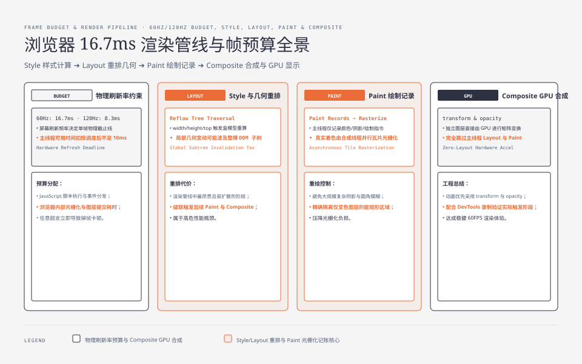
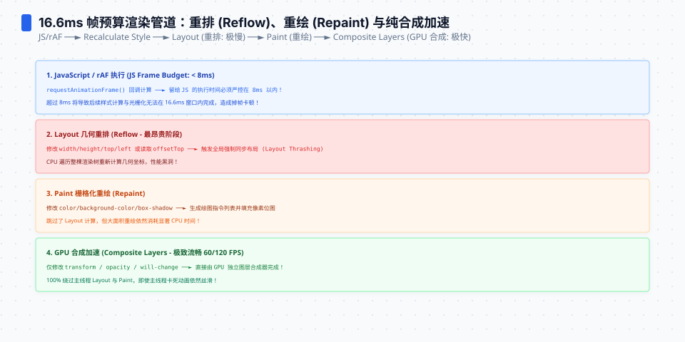
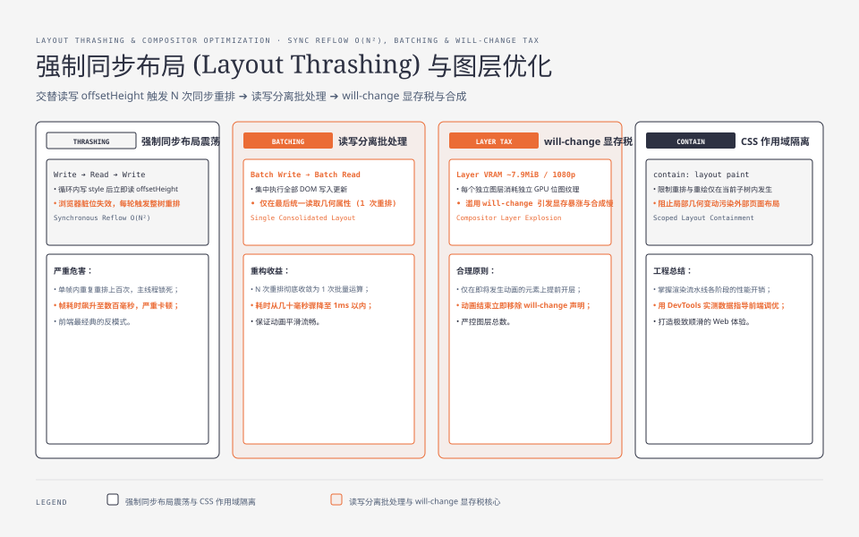

**TL;DR：** 60Hz 的显示刷新周期约为 16.7ms，但这不是开发者永远可用的主线程预算，也不是所有设备的目标频率。浏览器会在不同线程和阶段安排脚本、样式、布局、绘制、光栅化和合成；某个 CSS 属性是否能停在 Composite，还取决于元素、效果、图层和浏览器实现。`transform`/`opacity` 常是更容易优化的动画候选，`width`/`height` 常会引起布局，但两者都不能替代 DevTools 录制。优化的第一判断不是“属性贵不贵”，而是“这次更新实际触发了哪一段”。


---



## 一、16.7ms 从哪来：刷新率是物理约束，不是性能目标

显示器以目标频率刷新：60Hz 的周期约为 16.7ms，120Hz 约为 8.3ms。浏览器需要在提交截止时间前完成当前帧的必要工作，但一帧并不等于“主线程从 JS 一路同步跑到显示器”：光栅化、合成、输入和系统调度可能由其他线程或阶段参与。超过某个截止时间会增加错过帧的概率，最终是否掉帧要看实际时间线，而不是只比较一个总数。

两件事让这个预算比听起来更紧：

1. 浏览器还有调度、输入、光栅化和提交成本，**开发者可用的主线程时间通常少于刷新周期**；“10ms”可以作为团队的实验目标，但不是浏览器合同。
2. 高刷新率屏幕把截止时间缩短到 8.3ms 或更少。判断性能时应记录设备刷新率、录制方式和 dropped frame，而不是在所有设备上套用 16.7ms。




## 二、管线四段：每段的账本不一样

渲染管线可以压缩成四段，各自的工作与成本模型：


| 段 | 干什么 | 成本由什么决定 | 触发器示例 |
| --- | --- | --- | --- |
| Style | 匹配 CSS 规则并计算受影响元素的最终样式 | 失效元素范围、选择器和规则复杂度 | 会影响样式的更新，范围由引擎失效策略决定 |
| Layout | 计算受影响盒子的位置与尺寸 | **受影响的布局树范围** | width/height/padding/top 等可能改变几何的更新 |
| Paint | 生成绘制指令（记录） | 绘制区域大小与复杂度 | color/background/box-shadow |
| Composite | 把图层合成为最终画面 | 图层数 × 每个图层的偏移 | transform/opacity 的动画 |

**关键不对称：越靠前的段，影响面通常越大。** Layout 修改一个元素的宽度，可能波及父容器、兄弟和后代，具体范围由布局依赖决定。而 Composite 只更新合成参数时，通常不需要重新计算几何和绘制；图层的纹理内存、合成数量、遮罩、滤镜和设备 GPU 能力仍然会影响成本。

## 三、Style：选择器的税

浏览器会根据样式失效范围重新匹配 CSS 规则。一个适合教学的上界模型是：

**总成本 ≈ 选择器数量 × 元素数量 × 每条规则的平均匹配代价**

所以复杂后代选择器可能扩大匹配工作，但“后代选择器一定慢、class 一定快”不是可直接套用的性能结论。现代引擎会做选择器索引和失效优化，样式变更也不必对整棵 DOM 全量重算。真正的工程问题是识别受影响范围，并在 Performance 录制中确认 Style 是否成为瓶颈。

实测视角（DevTools Performance 面板的 Style 行）：一次 `el.style.width = '100px'` 在小规模页面上可能几乎看不到，在大型表格页面上也可能拉出明显的 Style 或 Layout 块。具体结果要和 DOM 数量、样式失效范围、浏览器版本及框架更新方式一起记录，不能从属性名推出固定毫秒数。




## 四、Layout：最贵的一段，全局性税

Layout（也叫 reflow）计算每个盒子的几何信息：宽高、内边距、位置。它有两个让成本失控的特点：

**特点一：一次局部变更，可能重排整棵子树。** 一个元素的宽度变化，其兄弟、父容器、乃至父容器之后的所有兄弟（取决于几何依赖）都会跟着重排。生产里最典型的场景：往列表顶部插一条记录，可能触发整列 reflow。

**特点二：读布局会阻塞。** 浏览器有"脏位"机制：布局只要在"你读的时候"还未提交，就会**立刻强制同步执行**。这个模式叫 layout thrashing：循环里"写样式 → 读 offsetHeight"交替出现，每一轮都触发一次整树重排，把 O(N) 变成 O(N²)。

```js
// 反例：循环里读写交替，每轮强制 reflow
for (const el of list) {
  el.style.width = width + 'px'  // 写
  console.log(el.offsetWidth)    // 读 → 立刻同步 layout！
}
```

```js
// 正解：先批量写，再统一读
for (const el of list) el.style.width = width + 'px'
for (const el of list) console.log(el.offsetWidth)
```

**Layout 的成本判断**：看 DevTools 里 Layout 行的时间，如果它 >5ms，多半是整树重排或 thrashing，而不是单条样式的问题。

## 五、Paint：绘制记录是"记账"，不是"画"

Paint 段生成绘制指令（paint record）：这一块填什么颜色、这里画一条什么弧线、阴影的范围。它不直接画像素——真正的像素着色发生在后面的光栅化（rasterize），通常由合成线程并行的"瓦片"（tile）完成，不在主线程时间线上。

所以 Paint 的成本通常受**需要重绘的区域、绘制内容和缓存命中**影响：

| 属性 | 是否触发 Paint | 成本感受 |
| --- | --- | --- |
| `color` / `background-color` | 是 | 区域大时明显 |
| `box-shadow` | 是（通常需要额外图层） | 模糊半径大时明显 |
| `border-radius` | 是 | 会触发图层边界 |
| `transform` | 常可避免每帧 Paint，但不保证 | 需要检查图层、滤镜、内容变化 |
| `opacity` | 常可避免每帧 Paint，但不保证 | 与图层、混合和子树内容有关 |

**核心结论：transform/opacity 是优先验证的动画候选，不是“只走 Composite”的语法保证。** 如果浏览器为该元素建立了合适的合成路径，它们可以避免每帧 Layout/Paint；如果效果包含滤镜、混合、内容变化或图层没有按预期建立，仍可能发生额外工作。JS `requestAnimationFrame` 也可以更新 transform，CSS 动画也可能因属性和效果不当产生额外成本，差异要由录制确认。

## 六、Composite：便宜但有限，图层不是免费的

Composite 把各图层按 z-order 合成为最终画面。它便宜，但图层本身有税：

- **图层内存**：每个独立图层都可能需要对应的位图纹理。以未压缩 RGBA、1080p 为例，下界约为 `1920×1080×4≈7.9MiB`，实际还受 tile、格式、缩放和设备实现影响。
- **图层数量**：合成器要遍历所有图层，太多小图层反而拖慢合成。

所以"每个元素都加 `will-change: transform` 强行开层"是经典误用：图层数量爆炸，内存与合成都超支。`will-change` 的正确用法是给**即将动画的元素**提前开层，用完即删。

真正省钱的组合拳：

1. **动画只用 transform/opacity**（尤其 `translate` 代替 `left/top`）；
2. **需要开层的元素少而精**（页面主体、卡片的移动动画），避免全屏覆盖层；
3. 对边界明确的组件评估 `contain: layout paint`，但先验证它改变的布局、溢出和绘制语义，不能把 containment 当成无副作用的加速开关。

## 七、DevTools 实操：找到谁在吃预算

Performance 面板录制一段交互（如滚动、点击动画），看主线程时间线：

```text
Frame main thread（示意数据，非真实录制）:
  [Style 0.8ms] [Layout 2.4ms] [Paint 1.2ms] ... [Composite 0.4ms]
  总 4.8ms → 仅作为该次录制的一个时间线快照
```

三个排查顺序：

1. **看 Layout 行**：如果它在录制中占据主要比例，检查布局失效范围和“写后立刻读”的强制布局；不要用一个固定毫秒阈值替代基线。
2. **看 Paint 行**：检查阴影、背景大图、滤镜和重绘区域，再比较 `transform` 方案是否真的减少了 Paint。
3. **看总时长与帧结果**：把脚本、样式、Layout、Paint、Composite 和 dropped frame 放在同一时间线里，按设备刷新率判断是否错过提交截止时间。

对长时间运行的页面，还可以用 Performance 面板的帧轨道确认 dropped frame（掉帧）。它比“某个函数超过 5ms”更接近用户结果，但仍应记录设备刷新率、窗口状态和录制设置。

## 八、结论：16.7ms 预算要看哪一段在消耗

渲染性能的答案从来不是“CSS 里别用动画”，而是先确认实际触发路径，再尽量减少影响范围：

| 触发位置 | 代价 | 何时允许 |
| --- | --- | --- |
| Style + Layout | 全树级 | 页面结构变更，不可避，但应批量 |
| Paint | 绘制复杂度 | 需要真正重绘视觉效果 |
| Composite-only | 图层级 | 动画的优先候选，需用时间线确认 |

越往后通常越容易控制影响面，但不能把“越后越便宜”当成绝对规则。动画优先尝试 transform/opacity，结构变更尽量批量，最后用目标设备的帧轨道验证结果。真正的掉帧还受事件循环、输入、GPU 和 vsync 影响，见[事件循环不是一个循环](/writing/understanding-event-loops)。

## 参考资料

1. Chromium 文档：Rendering Pipeline（Style/Layout/Paint/Composite）—— https://developer.chrome.com/docs/devtools/performance/reference
2. web.dev：Animations and performance（为什么 transform/opacity 走合成）—— https://web.dev/animations-guide/
3. web.dev：Avoid layout thrashing —— https://web.dev/avoid-large-complex-layouts-and-layout-thrash/
4. CSSWG：will-change 属性与层提升语义 —— https://drafts.csswg.org/css-will-change/
5. Chrome 开发者工具：Performance 面板帧通道 —— https://developer.chrome.com/docs/devtools/performance

> 延伸阅读：一帧里"何时渲染"由事件循环的渲染机会决定，见[事件循环不是一个循环](/writing/understanding-event-loops)；渲染之外的网络等待如何消耗首帧预算，见[HTTP 缓存不是"快慢"问题：Cache-Control 与 304 的账本](/writing/http-cache-control-etag)。
