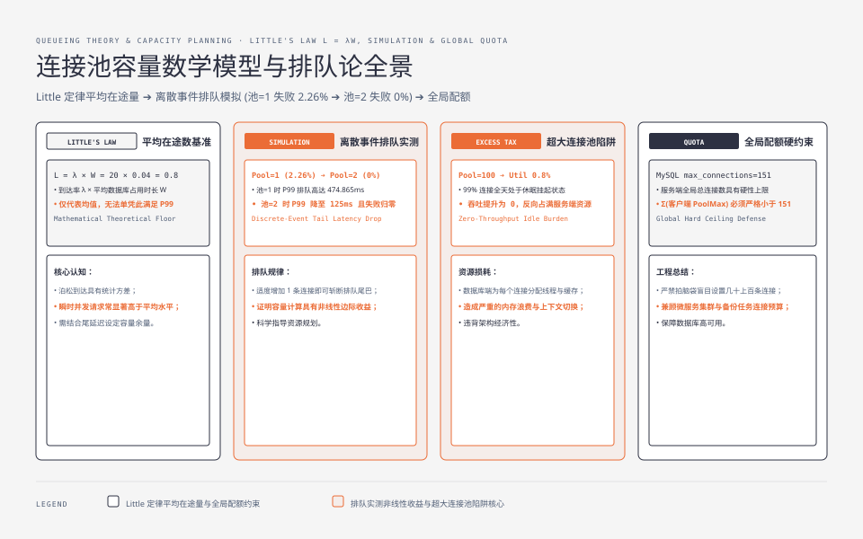
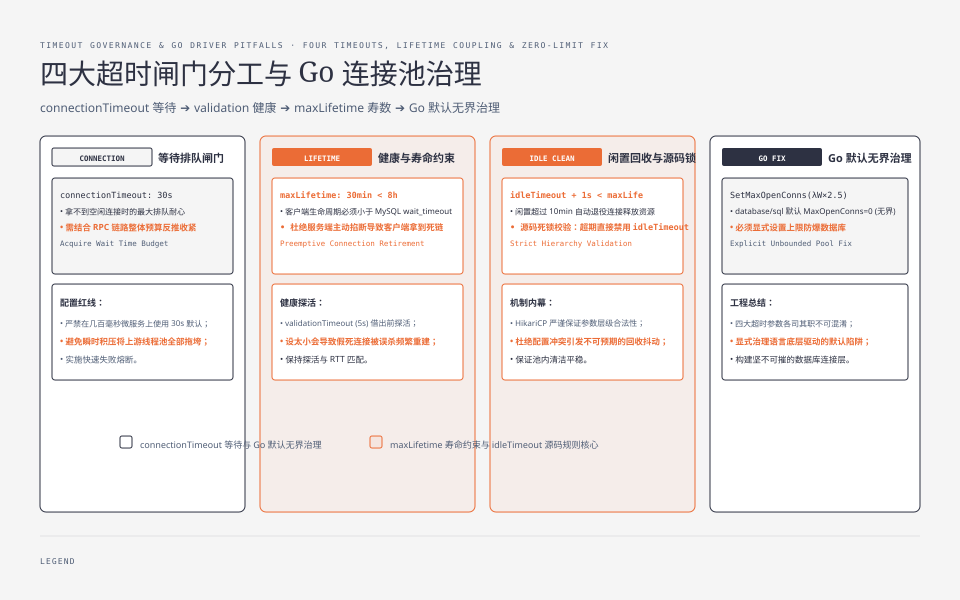
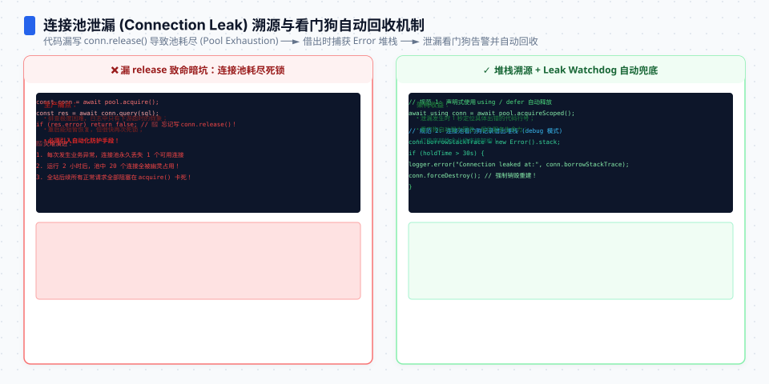

**TL;DR：** 连接池的平均在途数约为 `λ × W`（到达率 × 平均数据库占用时间，Little 定律），但它不是“池容量的自动答案”：服务时间方差、尾延迟目标和 acquire timeout 决定还要留多少余量。本机固定 seed 离散事件模拟（20 req/s、平均 40ms、60s、500ms acquire timeout）得到：池=1 失败率 **2.2628%**、排队 P99 **474.865ms**；池=2 失败归零、排队 P99 **125.003ms**。这只证明该模型下的排队关系，不是数据库或连接驱动 benchmark。四个超时各管一件事，不许互相顶替：**connectionTimeout**（等连接的耐心，HikariCP 默认 30s）管“池子不够时还能撑多久”；**validationTimeout**（默认 5s）管“这条连接还活着吗”；**maxLifetime**（默认 30min）管“这条连接该寿终正寝了”；**idleTimeout**（默认 10min）管“空着的连接收不收”。把前三个混成同一个值，等于把故障窗口全部交还给数据库上限（MySQL 默认 `max_connections=151`）。


---



## 一、直觉错在哪：池总该"越大越稳"，其实 2 倍平均并发就过剩

先纠正一个最普遍的直觉："连接池等于配几张牌，配多了没坏处"。**连接池不是资源配额，它是并发闸门**：池里有多少个连接，同时最多就有多少个请求在挤数据库。在池子后面的排队，就是应用请求自己。所以"多开几条"并不会加大吞吐，只会把"数据库容量"这份账单记到自己头上。

风险不出在"池子太小请求失败"，而出在"池子大小你根本量不到"。服务端 MySQL 的默认 `max_connections=151`（MySQL 8.0 官方文档确认除非显式调大，默认 151 条连接）。6 个服务各开 32 条连接的池子，加上备份任务，151 条配额你先安排给谁？池子不是"开得越多越稳"，是"**每个池都在吃一份全局配额**"。




## 二、容量下界：Little 定律给出"在途请求数"，池子开给它们看

Little 定律：一个稳定系统里，**在途请求数 L = 到达率 λ × 平均停留时间 W**。放在连接池上：

一个服务 20 req/s、每条请求平均 40ms 在数据库上——任意瞬间平均有 `20 × 0.04 = 0.8` 条请求正占着连接。这是**平均在途量**，不是“池=1 就能满足 p99”的保证：随机到达和长尾服务时间仍会让多个请求同时竞争。容量配置至少要让平均利用率低于 1，再用 acquire timeout、队列 P99 和数据库上限决定余量。

但注意：Little 定律算的是**均值**。请求是泊松到达、服务时间有方差，瞬时并发会超过平均。所以池容量公式还要乘一个方差余量系数（下面实测给出量级）。

## 三、实验：把"排队"本身模拟出来

仓库中的 `experiments/connection-pool-sim/sim.py` 提供一个固定 seed 的小型离散事件模拟：泊松到达率 λ、指数服务时长 `1/μ`，请求分配给最早空闲的连接，预测等待超过 acquire timeout 就失败。它不创建真实 socket、不连接数据库，也不模拟驱动的健康检查。命令是 `python3 experiments/connection-pool-sim/sim.py`。第一组参数为 60 秒、20 req/s、平均服务 40ms、acquire timeout 500ms（`λW = 0.8`）：

```
池容量  到达数  完成数  平均排队  P50    P99    失败率   利用率
   1    1149   1123   117.064  75.867  474.865  2.2628%  77.867%
   2    1149   1149    10.764   0.000  125.003  0.0000%  40.102%
   4    1149   1149     0.348   0.000    8.546  0.0000%  20.051%
   8    1149   1149     0.000   0.000    0.000  0.0000%  10.025%
  16    1149   1149     0.000   0.000    0.000  0.0000%   5.013%
```

三句话：

1. **池=1 仍会失败**：平均在途量只有 0.8，但随机到达让 26/1149 个请求超过 500ms acquire timeout；平均值不能替代尾延迟。
2. **池=2 在这组 seed 和 timeout 下没有失败**：P99 排队从 474.865ms 降到 125.003ms，但“失败归零”只属于 60 秒样本，不是长期 SLO 证明。
3. 再往上，池=8 已把这组模拟的排队 P99 压到 0ms、利用率降到 10.025%——它降低了排队等待，同时留下了更多空闲连接；数据库端的连接内存、并发上限和真实查询波动仍需单独测。

换一个重负载场景（40 req/s × 80ms，λW=3.2；排队超 300ms 判失败）：

```
池容量  到达数  利用率   平均排队  P99      失败率
4      2431   79.349%   39.899ms  231.494ms  0.2057%
8      2431   39.752%    0.181ms    6.610ms  0.0000%
16     2431   19.876%    0.000ms    0.000ms  0.0000%
32     2431    9.938%    0.000ms    0.000ms  0.0000%
```

在第二组固定参数里，λW=3.2，池=4 的利用率接近 80% 且仍出现超时；池=8 后排队 P99 降到 6.610ms。**这只是该随机样本的形状，不是 λW×2.5 的通用甜点位**：再增大池容量会降低排队，却同时增加数据库端的连接占用（MySQL 默认 `max_connections=151` 只是服务端上限，不是单服务配额）。

这组输出也需要收窄：池=8 的失败归零只表示本次 60 秒、固定 seed、指数分布和 300ms timeout 下没有样本超时；它不是“λW×2.5 永远是甜点位”。真实系统要把服务时间分布、突发到达、数据库锁等待、连接建立时间和重试放进同一容量实验。

把池开到 100 看看"过大"到底多大代价（同样 20 req/s × 40ms）：利用率 0.8%，99% 的连接全程在睡觉。池不是越大越安全——大出来的每一条，都是服务端的一份常驻资源，而它对吞吐的贡献是 0。代价平时看不见，直到集群里有 5 个服务各开 100，数据库在 `max_connections` 撞墙时，你才知道每条连接都标了价。

模拟结论复用两处：TCP 侧的排队见[握手排队的机制](/writing/tcp-syn-queue-backlog)，服务端侧的队列见后文。




## 四、超时的分工：四把参数闸，各管一段

连接池的参数多，最常被搞混的就是"这个超时到底在给谁设限"。表一张说清：

| 参数 | HikariCP 默认 | 守护的东西 | 设错的症状 |
|---|---|---|---|
| `connectionTimeout` | 30s | 拿不到连接时，排队上限 | 设太小：高峰/故障期瞬时大面积的 acquire 失败 |
| `validationTimeout` | 5s | 借出去前验证连接是否还活着的时间预算 | 设太小：活连接被误杀，频繁重建 |
| `idleTimeout` | 10min | 空闲连接回收 | 设太小：低峰期频繁断开/重连 |
| `maxLifetime` | 30min | 连接寿命（防 MySQL 侧主动断开 8h wait_timeout） | 设太大：服务端先断，客户端拿死连接 |

`maxLifetime` 与 `idleTimeout` 之间有个反直觉的联动：MySQL 的 `wait_timeout=28800s`（8 小时）是会话空闲上限，**池侧的 `maxLifetime` 必须小于服务端空闲限制**，否则服务端先主动断掉，客户端下一次借出直接失败。而 `idleTimeout` 纯粹是池子内部的清洁工，不受服务端约束。HikariCP 甚至为此写死了一条逻辑（源码 `HikariConfig.validateNumerics()`）：`idleTimeout + 1s > maxLifetime` 时直接禁用 `idleTimeout`。

## 五、实践口径：这四个问题的标准答案

1. **pool 多大？** 先测，再调，别拍脑袋：用 `平均到达率 λ × 平均数据库占用时间 W` 估算平均在途量，再用服务时间分布、目标 P99 和 acquire timeout 选择余量；不能把 `P99` 直接代入 Little 定律后称为精确 `λW`。同时保证**整个集群的池容量总和 < 服务端 max_connections**（MySQL 默认 151）。
2. **connectionTimeout 设多少？** 与你的重试策略一起声明——它是"申请连接"环节的预算。多数池默认 30s，如果你在 300ms 级的 RPC 链路上用了这个默认值，一次数据库故障就会吃掉请求的 30s。按你的端到端超时反推：RPC 超时 = 连接等待 + 查询 + 重试余量，每一项各自设数，不要共用一个大超时。
3. **maxLifetime 设多少？** 池侧连接寿命必须小于服务端空闲断连时限（MySQL `wait_timeout` 默认 28800s ≈ 8h；PostgreSQL 默认不主动断空闲会话），给数据库自己的回收节奏留出余量。HikariCP 默认 30min 已足够保守；按你的数据库参数再收紧即可，切记 `idleTimeout + 1s` 不能反超 `maxLifetime`（源码强制）。
4. **validationTimeout**：别小于一次往返的时间；这是"这条连接还健康吗"的答复预算，设小了会把半死不活的连接误判成断链，白白重建。

## 六、Go 一侧：database/sql 的默认是"无界"

Go 的标准库连接池与 HikariCP 语义完全不是一回事：`database/sql` 默认 `MaxOpenConns=0`（不设上限）、`MaxIdleConns=2`、`ConnMaxIdleTime=0`（永久）、`ConnMaxLifetime=0`（永久）。坑在最前面那条：**默认不开连接数上限**。忘了 `SetMaxOpenConns`，任何连接池数学都来不及——服务端先被占满，这是 Go 服务最常见的"Too many connections"。

落地口径（对应 §四 的参数）：`db.SetMaxOpenConns(λW×2.5)`、`db.SetMaxIdleConns(同 max open)`、`db.SetConnMaxLifetime(短于服务端空闲断连时限)`、`db.SetConnMaxIdleTime(10min)`。ConnMaxLifetime 对应 maxLifetime（寿数）、ConnMaxIdleTime 对应 idleTimeout（清洁工），两对参数各管一件事，别互相替代。

## 七、结论：池容量先算 λW，再受 max_connections 约束

连接池容量是测量和约束共同决定的结果，不是感觉：**λW 只给平均在途量，尾延迟和 acquire timeout 决定余量，上限受服务端 `max_connections` 约束**。超时参数各有分工——connectionTimeout 管“等待”，validationTimeout 管“生死”，maxLifetime 管“寿数”，idleTimeout 管“闲置”。连接只是闸门，闸门后面的数据库并发上限、查询分布和锁等待才是鲁棒性的天花板。

本文模拟的完整环境、参数和原始输出保存在 `evidence/connection-pool-math-timeout/2026-08-17-local/`；它只支持排队模型的教学结论，不支持 HikariCP、MySQL 或任意生产连接池的性能承诺。

## 参考资料

1. Little's law: https://en.wikipedia.org/wiki/Little%27s_law
2. HikariCP README（默认值 + idleTimeout/maxLifetime 互为前提的说明）: https://github.com/brettwooldridge/HikariCP
3. MySQL 8.0 官方文档 `wait_timeout` / `max_connections`：https://dev.mysql.com/doc/refman/8.0/en/server-system-variables.html#sysvar_wait_timeout
4. Go 官方 `database/sql` 文档（连接池行为）: https://pkg.go.dev/database/sql
