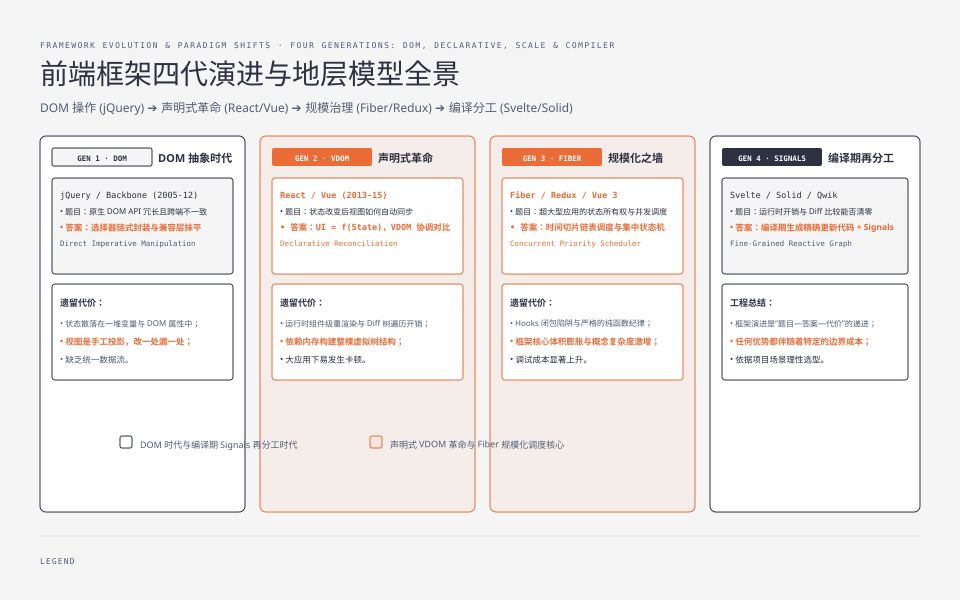
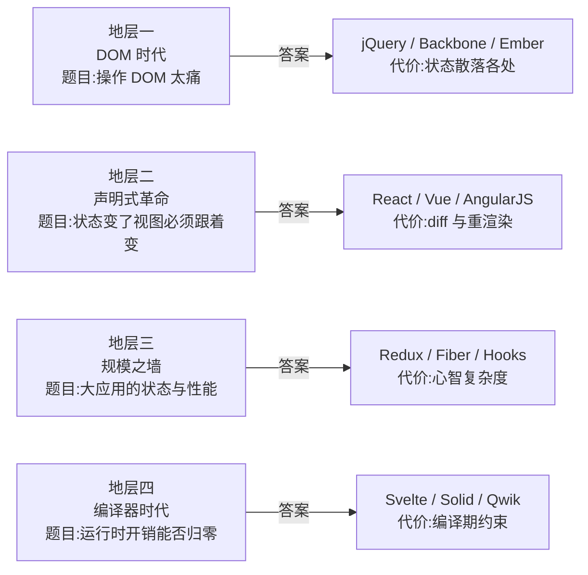
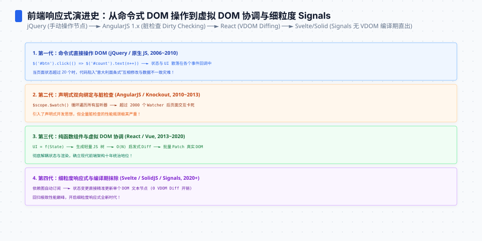
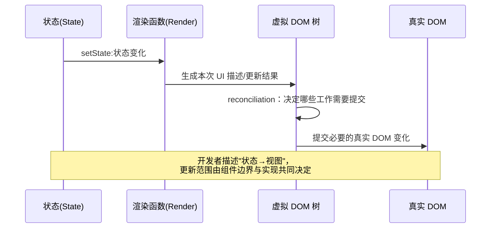
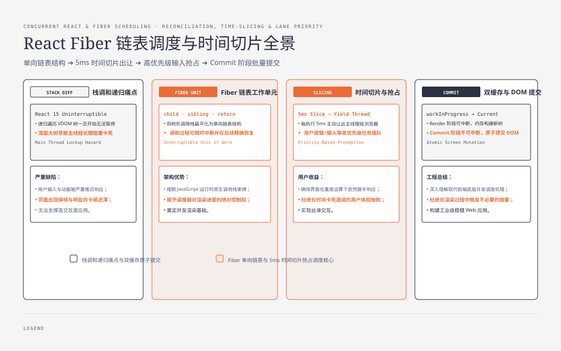
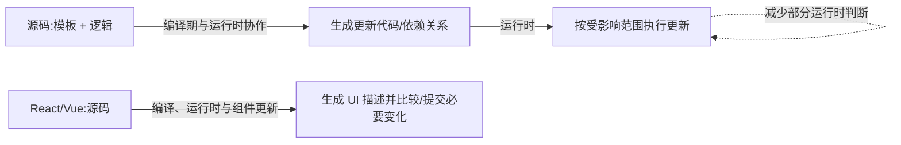

**TL;DR：** 前端框架的“乱”可以用四个反复出现的问题来解释：DOM 操作、状态与视图同步、规模化治理与更新成本、编译/运行时边界。本文的“地层”是分析模型，不是严格的历史分期，也不是每个框架的唯一动因；同一时期的工具会重叠，今天的框架也常同时回答多层问题。记住每个答案留下的代价，比背一张会变化的名单更有用。

---

## 一、乱象的真相：选择瘫痪是地层叠加的症状

截至本文修订日，前端生态同时存在 UI 库、应用框架、编译器、运行时和跨端工具：React、Vue、Angular、Svelte、Solid、Preact、Qwik、Lit，以及 Next.js、Nuxt、Astro 等上层框架都不能放进同一张“框架名单”后直接比较。初学者面对这份名单的典型反应是“我该学哪个”，以及随之而来的焦虑：选错是不是就完了。

这个焦虑建立在一个错误前提上——好像这些工具是同一个问题的多个答案，选一个就完事了。更准确的说法是：它们在不同层次回答不同问题，时间上重叠、动机上部分接力。React 与 Svelte 当然可以竞争同一项目，但它们强调的运行时、编译和生态取舍并不相同；先对齐问题，再谈输赢。

本文把这四层拆开，每层用“题目→答案→代价”三元组解释。看完你得到的是一张可校正的框架地图，以及一组判断新工具的提问方式；具体年份和版本仍应回到官方发布记录核对。

## 二、地层一 · DOM 抽象：重复的选择器与事件逻辑太贵（约 2005–2012）

在 jQuery 普及前，浏览器原生 DOM API、浏览器兼容性和事件模型让页面代码承担了大量重复工作；这不等于当时“没有框架”，而是还没有今天这种统一的组件/应用框架心智。痛点很具体：**选择元素、改内容、绑事件和处理兼容性要反复写**。jQuery 在 2006 年发布后，用选择器、链式 API 和兼容层压缩了这部分工作——它主要回答的是“DOM 操作能不能更短、更一致”，不是“应用状态如何建模”。

但 jQuery 没有回答下一道题：**状态与视图的一致性**。一个页面上有表单、列表、筛选器，用户改了一个输入框，列表要重新渲染，勾选框的状态要联动——用 jQuery 写，你得在十几个事件处理器里手动"更新相关的 DOM"。状态散落在一堆变量里，视图是状态的手工投影，改一处忘一处是常态。

随后约在 2010–2011 年，Backbone、Ember 等工具把 Model、View、路由和约定带进浏览器应用。它们让页面从“脚本集合”更接近可组织的应用，但也把观察者、事件总线和生命周期关系带进了复杂项目：**谁监听谁、谁通知谁**，会形成难以追踪的关系网络。这里是代表性趋势，不是说它们是当时唯一或第一个框架答案。

地层一的遗产是两件事：DOM 可以被打包抽象（jQuery 教会了我们），状态与视图必须被自动同步（Backbone 教会了我们）。这两道题都没有被彻底解决，它们被地层二的答案接管了。

## 三、地层二 · 声明式革命：状态变了，视图必须跟着变（2013–2015）

约 2013–2014 年，AngularJS、React 和 Vue 先后进入大量团队视野（项目诞生、开源和流行时间并不相同）。它们都在回答“状态变化后，视图如何保持一致”，但给出的绑定、组件和渲染模型不同，后来形成了不同的生态路径。

**AngularJS 的答案：模板、依赖注入与双向绑定。** 模板里写 `{{name}}`，模型和视图可以通过绑定互相反映。它降低了早期应用的手工同步成本，但变更检测、watch 表达式和隐式依赖也让更新路径变难追踪；性能问题取决于 watcher 数量、表达式和应用结构，不应简化成“绑定一多就必然崩盘”。

**React 的答案：声明式组件 + 单向数据流 + 可比较的 UI 描述。** 状态变化使相关组件进入 render/reconciliation 路径，React 再把结果提交到真实 DOM；“重新执行组件函数”和“重建整棵真实 DOM”不是一回事。它把手工 DOM 同步换成框架管理的更新工作，代价是组件边界、引用稳定性、调度和比较成本需要被理解，而不是凭“虚拟 DOM”三个字直接推导性能。

**Vue 的答案：模板、响应式与渐进式组合。** Vue 在 2014 年公开后形成了自己的路线：模板接近 HTML、响应式系统自动追踪一部分依赖、组件可以从局部增强逐步扩展到完整应用。把它叫“中间态”只能帮助定位，不能替代对具体版本、模板编译和运行时更新路径的阅读。

地层二的重要分岔点之一，是**模板 vs JSX/JavaScript 表达式**：模板可以提供更强的静态约束和 HTML 心智，JSX 则把 UI 描述与 JavaScript 逻辑放在同一语言环境里。两者都能通过编译器、插件和约定扩展；Vue 支持 JSX，React 生态也存在模板和编译工具，所以不要把它们写成互斥阵营。

地层二留下的未答题是：更新工作并没有消失，只是从手写同步转为组件渲染、比较、调度和提交；大型应用的状态所有权、缓存失效和跨团队约束也没有被单靠声明式 UI 解决。

## 四、地层三 · 规模之墙：大应用的状态与性能（2015–2019）

2015 年之后，单页应用开始承载真正的业务复杂度，地层二的答案撞上了墙。这面墙有两个立面：**状态**和**性能**。

**状态立面：组件状态一多，所有权和变更路径会失控。** 两个不相关的组件要共享数据、跨页面维持登录态、撤销重做需要完整历史——“UI 是状态的函数”本身没有回答“状态放哪、谁能改、服务端数据何时失效”。Redux 在 2015 年提供了集中 store、action 和 reducer 的约束；它用可追踪性换取样板和心智成本。后来出现的 Zustand、Jotai 等工具不是简单地证明 Redux 错了，而是针对不同规模和约束重新定价了集中式纪律。

**性能立面：更新工作在深层组件和交互并发下需要调度。** React 的组件更新会沿组件边界传播，但不是“父组件一变就必然重建整棵真实 DOM”。Fiber 在 React 16 时代引入了可分段的协调架构，为后续调度能力提供基础；Hooks 在 React 16.8 时代把状态和副作用按逻辑组织。Vue 3 在 2020 年发布后，以 Composition API 和新的响应式实现重组了开发模型。它们解决的是不同层次的问题：调度、逻辑复用、依赖追踪和渲染成本不能混成一个“性能升级”。

地层三还有一个独立的转折：**AngularJS → Angular 的断裂（Angular 2 在 2016 年更名为 Angular）**。这是一次架构、语言和组件模型的大迁移，不能按普通小版本升级理解；但“应用基本要重写”仍取决于项目和迁移策略。它暴露了全家桶路线的取舍：内置路由、DI、表单和工具能减少团队分叉，代价是框架升级会牵动更多边界；这不是后来所有框架都收敛为“拼装生态”的单一路线。

地层三留下的未答题是：**运行时和构建时各自应该承担多少工作**。状态约束、调度和组件抽象可以提升可维护性，但它们也会带来运行时、构建和调试成本；这为编译器导向的路线提供了讨论空间。

## 五、地层四 · 编译器与运行时重新分工：哪些工作可以前移（约 2019–）

第四个答案的起点是一个质疑：**运行时是否必须承担所有更新判断？** 如果编译器或响应式系统能更早知道“状态 X 影响哪些计算/节点”，一部分比较和调度工作就可以前移；这不等于所有运行时都能消失，也不等于虚拟 DOM 在所有场景都是多余的。

**Svelte** 把较多工作放到编译期，生成面向组件更新的代码；具体输出、运行时和响应式语义随版本/模式变化，不能用固定“几 KB”概括。**Solid** 保留 JSX，并以 signals 等细粒度响应式原语定位更新；它的关键并不只是“编译器没有 diff”。**Qwik** 把 resumability 作为重要目标：服务端输出可恢复的状态和事件信息，客户端按需加载交互代码；这与传统 hydration 的取舍不同，但网络瀑布、序列化、调试和生态成本仍需评估。

四代走到这里出现的是部分收敛：越来越多工具在讨论显式依赖、编译优化、选择性 hydration、signals 或更小的运行时，但它们的语义和目标并不相同。Vue、Angular、Svelte、React 的相关能力都应按当前版本文档核对；“大家都在向 signals 靠拢”可以作为观察，不应当当作统一实现或性能结论。新的分界线更像是**编译期、运行时、服务器和浏览器各承担多少工作**。

地层四的代价同样真实：编译期方案把一部分灵活性和错误发现前移到构建阶段，服务器/客户端边界也会增加调试难度；生态和工具成熟度因项目而异。微基准只能回答固定 DOM 操作下的局部问题，真实应用还受到网络、数据获取、渲染、内存、可访问性和团队效率影响——选框架不能只看 benchmark 名次。

## 六、统一模型：框架 = 对"状态→视图"路径的取舍

把四层地层并成一张横截面表：

| 地层 | 题目 | 代表答案 | 遗留代价 |
| :--- | :--- | :--- | :--- |
| 一 · DOM 抽象 | 重复的选择器、事件和兼容性逻辑太贵 | jQuery、Backbone、Ember 等 | 状态所有权和同步关系仍分散 |
| 二 · 声明式 UI | 状态变化后如何保持视图一致 | AngularJS、React、Vue 等 | 更新工作、组件边界和状态约束仍需付费 |
| 三 · 规模化治理 | 大应用如何组织状态、逻辑和更新 | Redux、Fiber、Hooks、Vue 3 等 | 纪律、构建和运行时复杂度 |
| 四 · 编译/运行时分工 | 哪些更新判断和加载工作可以前移 | Svelte、Solid、Qwik 等 | 编译约束、服务器/客户端边界与生态成本 |

这张表的读法只有一条：**看一个工具时，先问它回答哪一个问题，再问它把成本留给开发者、构建系统、服务器、浏览器还是运维**。四层会重叠；一个现代应用框架可能同时包含 UI 库、路由、数据加载和部署约束，不能只给它贴一个年代标签。

顺带澄清一个常年被混在一起的三胞胎——**虚拟 DOM**（某些框架用来表示 UI 的数据结构）、**Shadow DOM**（浏览器 Web Components 的样式/结构封装能力）、**真实 DOM**（浏览器维护的文档对象）。三者机制不同，版本和浏览器标准应以官方文档为准；Shadow DOM 不是虚拟 DOM 的升级版，虚拟 DOM 也不是所有框架都必须采用的内部结构。

## 七、结论：框架演进是问题换代，不是名单竞赛

前端框架的名单是四代问题留下的地层，每一代都在回答上一代没答完的题，同时留下自己的账。选择瘫痪的解法不是"背下所有框架"，而是**把框架还原成题目**：它解决什么问题、把什么代价留给了谁。

对正在入门的人，一个稳妥的推论是：先选一个有成熟文档、调试工具和项目机会的栈，完整做出真实应用；React、Vue、Angular 都可能满足这一条件，选择应结合团队和目标岗位，而不是按“第几层”排名。第二个框架再用同一交互做对照，才能看出编译、响应式和状态边界的代价。选型的完整路线图，见本系列下一篇。

下一步：打开任一框架的官方教程，把“状态 → 视图”的最小例子亲手写一遍，再在 DevTools 中观察真实 DOM、网络请求和 hydration/客户端启动路径。之后用第二个栈复现同一交互，记录实现约束与调试成本；这比把“没有 diff”当成答案更接近真实选型。

## 参考资料

1. React 官方文档（虚拟 DOM、Reconciliation、Fiber）—— https://react.dev/learn/render-and-commit 、 https://react.dev/reference/react/useState
2. React 官方博客：React v16.0（Fiber 发布，2017）—— https://reactjs.org/blog/2017/09/26/react-v16.0.html
3. React 官方博客：Hooks 发布（16.8，2019）—— https://reactjs.org/blog/2019/02/06/react-v16.8.0.html
4. Vue 官方文档（响应式原理、Composition API、Proxy 重写）—— https://vuejs.org/guide/extras/reactivity-in-depth.html
5. AngularJS 与 Angular 2 重构历史（Google 官方博客）—— https://blog.angular.dev/
6. Redux 官方文档（动机、单向数据流、reducer）—— https://redux.js.org/introduction/motivation
7. Svelte 官方文档（编译器思路、runes）—— https://svelte.dev/docs
8. Solid 官方文档（signals、细粒度响应式）—— https://www.solidjs.com/docs/latest
9. Qwik 官方文档（resumability、可恢复性）—— https://qwik.dev/docs/concepts/resumable/
10. JS Framework Benchmark（微基准，注意其局限）—— https://krausest.github.io/js-framework-benchmark/
11. MDN：Shadow DOM（与虚拟 DOM 无关的浏览器原生封装）—— https://developer.mozilla.org/en-US/docs/Web/API/Web_components/Using_shadow_DOM

> 延伸阅读：框架跑在什么容器里、引擎与运行时如何排列组合，见[V8 加减法：一个 JS 引擎的五种包装](/writing/js-ecosystem-layers)；四层地层的框架如何在三根轴上排位、以及完整选型路线，见[前端框架真正差在哪：渲染、响应式与状态](/writing/frontend-framework-taxonomy)。
