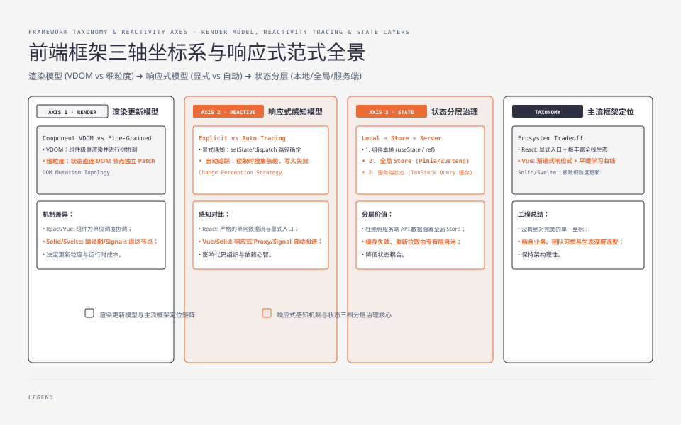
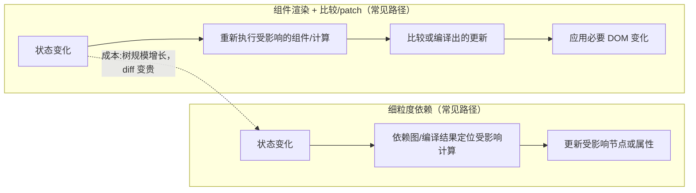
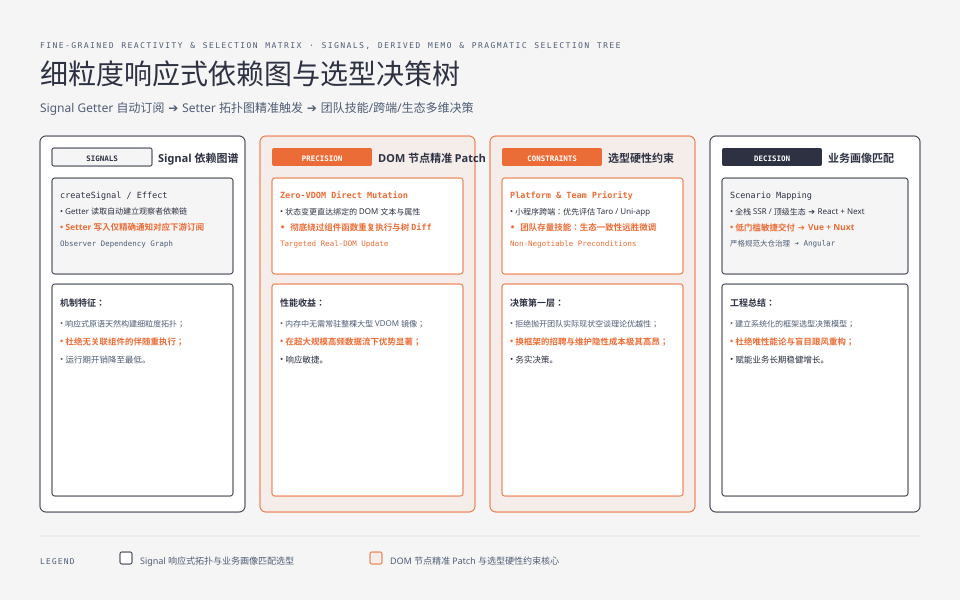
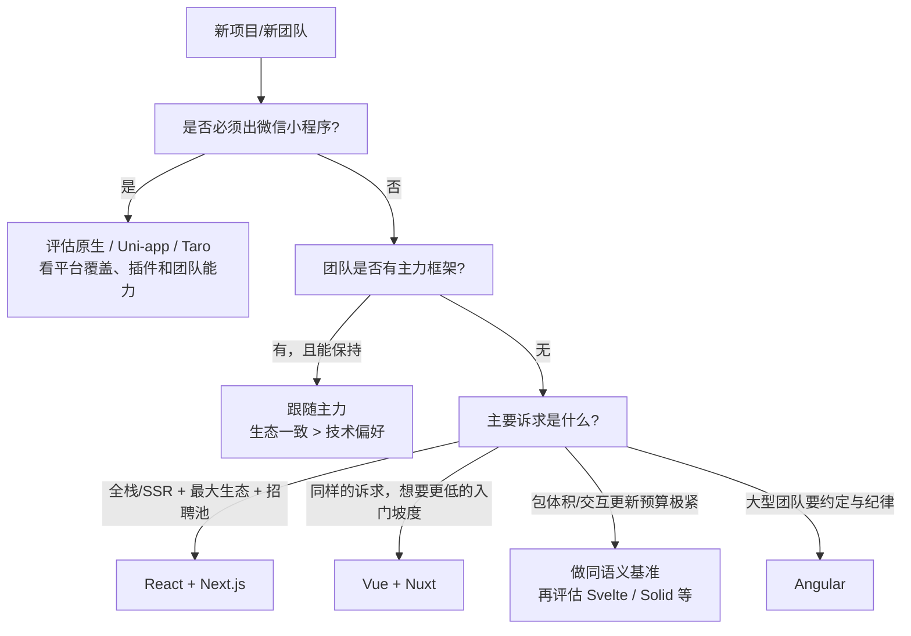

**TL;DR：** 渲染、响应式、状态三根轴适合做第一张地图，但不是任何框架的完整规格书。它们分别帮助你追问“组件更新到哪里”“依赖怎样失效”“数据由谁拥有”；之后还要核对编译/运行时、SSR/水合、可访问性、调试工具、生态和团队迁移成本。React、Vue、Svelte、Solid、Angular 不是几个固定坐标，而是各自版本和构建模式下的一组取舍。

---

## 一、三根轴：先把"这是什么问题"讲清楚

上一篇[前端框架为什么这么乱](/writing/frontend-framework-history)把历史压成了四层地层。这一篇给一张工作地图：大多数 UI 框架都能沿三根轴提出问题，但一个完整选型还需要把编译器、运行时、渲染目标和生态单独列出来。每一根轴，都先问“这是哪道题”，再看当前版本的实现和代价。

### 轴一：渲染模型——状态变了，谁负责更新 DOM

每框架都要回答：**状态变化之后，用什么方式把变化变成 DOM 更新？**

一种常见答案是**组件渲染 + 可比较的 UI 描述 + patch**：状态变化使某个组件或响应式 effect 重新执行，框架再把新的描述与旧结果比较，最后只把必要的变化应用到 DOM。React 的 render/reconciliation 与 Vue 的模板编译、组件更新都可以放进这个解释框，但“整棵树每次都从头到尾重建”是教学模型，不是对每次更新路径的实现承诺。代价是组件边界、依赖失效和比较范围仍然需要理解；`memo`、稳定引用、编译优化或局部响应式只是减少工作量的不同手段。

另一种答案是**细粒度更新**：编译期、signals 或二者的组合建立“状态 → 它影响的计算/节点”的依赖关系，状态变化时只重新运行受影响的部分。Svelte 的编译器、Solid 的 signals/JSX 运行时和不同版本的模板编译并不完全相同；“没有整树重建”描述的是常见更新路径，不等于没有运行时、没有比较，也不等于所有动态场景都能静态确定。

React 的一条优化方向是让编译器或运行时减少不必要的组件重算：`memo` 需要开发者维护边界，React Compiler 则试图自动推导一部分稳定性。它改善的是工作量与缓存决策，不应被概括成“仍然全量”或“已经变成细粒度”；实际结果取决于版本、编译配置和代码形状。

### 轴二：响应式模型——状态变化怎么被发现

第一根轴回答"更新怎么做"，第二根轴回答"**变化怎么被感知**"。

一端的答案是**显式更新入口**：代码通过 `setState`、dispatch 或 store API 告知框架状态发生了变化。以 React 本地 state 为例，更新入口明确，便于追踪；但外部 store、订阅和异步缓存仍有各自的通知协议，不能把“显式”简化成只有 `setState`。

另一端的答案是**依赖自动追踪**：响应式系统记录一次计算读取了哪些信号或 proxy 属性，写入时让相关计算失效。Vue 的 `ref`/reactive、Solid 的 signals，以及其他框架的响应式原语都可以采用这种思路，但具体依赖边界、批处理和异步语义不同。好处是局部更新表达自然，代价是需要理解追踪范围、批处理和闭包捕获，否则“谁消费了它”会变得隐式。

这组对比可以浓缩成一句有限的直觉：**React 本地 state 强调“更新入口明确”，Vue/Solid 的响应式原语强调“依赖由读取建立”。** Angular 既有 Zone.js 驱动的变更检测，也有 signals 等新机制；不能把某个版本的默认配置、增量迁移状态或第三方库行为压缩成一条“已经移动到端点”的结论。

### 轴三：状态管理——状态放哪、谁有权改

前两轴回答"状态怎么流动"，第三轴回答"**状态存在哪**"。按位置分三档：

1. **组件本地**：状态随组件生灭。只服务一个组件的状态放这里，这是默认起点，也是被滥用最少的一档。
2. **全局 store**：跨组件/跨页面共享的状态（登录态、购物车、主题），需要脱离组件存在。Redux、Zustand、Vuex/Pinia 都是这一档的实现，差异在纪律严格度（纯函数 reducer vs 直接修改）。
3. **服务端状态**：来自 API 的数据（用户列表、订单），它不“属于”任何组件，有自己的生命周期（缓存、失效、重取）。TanStack Query、SWR、Apollo 等工具专门处理其中一部分问题；把它们复制进全局 store 往往会重复实现缓存、失效和重试，但离线编辑、审计快照等场景仍可能需要显式的本地副本。

第三档是被误解最多的：很多人把“组件间的共享数据”和“来自服务端的数据”混进同一个 store，然后发现缓存、重试、失效和编辑冲突互相耦合。先分开建模，再决定哪些数据需要本地副本、哪些交给缓存层，通常能减少重复协议；这不是禁止所有服务端数据进入 store 的硬规则。

## 二、主流框架在三根轴上的位置

| 框架 | 渲染模型 | 响应式模型 | 状态档位 | 形态 |
| :--- | :--- | :--- | :--- | :--- |
| React | 组件 render/reconciliation；可配合编译优化 | 本地 state 有显式入口，外部 store 另有订阅协议 | Redux/Zustand/TanStack Query 等 | UI 库，常与路由/框架拼装 |
| Vue | 模板编译 + 组件更新与 patch | `ref`/reactive 等自动追踪 | Pinia、Query 类工具与生态 | 渐进式框架 |
| Svelte | 编译器生成更新逻辑；版本/模式相关 | runes 等响应式原语 | store 与生态 | 编译器 + 运行时 |
| Solid | 细粒度 signals/JSX 更新 | 自动追踪 signals | 轻量 store 与生态 | JSX UI 库 |
| Angular | 模板编译、组件变更检测与 signals 并存 | Zone.js、signals 等取决于配置与版本 | DI、路由、表单等整套能力 | 约束较强的框架 |
| Preact | 轻量虚拟 DOM 实现；以版本和构建结果为准 | React 风格 API，但不是完整行为等价 | 兼容层与独立生态 | 适合体积/兼容性约束场景 |

这张表是用于提出问题的压缩模型，不是兼容性或性能保证。读表时先记住三条边界：

- **React 的“显式 + 比较”只是常见心智模型**：它可以通过 memo、外部 store、编译器和框架集成改变实际更新范围；不要从模型直接推导 p99 或 DOM 操作数量。
- **Vue、Svelte、Solid 都有自动追踪或编译辅助，但依赖边界不同**：要比较它们，至少要固定版本、构建配置、SSR/CSR 模式和相同交互，而不是只比较框架名字。
- **Angular 的机制是迁移中的组合**：Zone.js、signals、模板编译和组件策略可以并存；“全家桶”描述的是治理与默认能力，不是单一渲染算法。

## 三、一个常被混为一谈的概念：框架 vs 库 vs 运行时

选型讨论里最容易卡壳的其实不是三根轴，而是三个层级的名词：**库、框架、运行时**。

- **库**：你调用它；React 的 UI 核心通常按库来使用，Vue 的核心也可以渐进接入，但两者都常与更高层工具一起组成应用栈。
- **框架**：它在生命周期、路由、构建或数据加载等方面约束应用结构（Angular、Next.js、Nuxt 的约束范围并不相同，不能只按“全家桶”一词判断）。
- **运行时**：上一集[容器层](/writing/js-ecosystem-layers)的 Node/Bun 是运行时；RN 的 Hermes 也是。

React 与 Angular 的争论有一半是层级的争论——拿"框架"的批评（替你决定太多）去批评一个"库"，不成立。先分清它是库还是框架，再谈它做得好不好。

## 四、选型决策树：什么时候选什么

技术细节的结论是：**三根轴上没有任何一个坐标是"绝对更好"**，所以选型决策树的第一层不是技术轴，而是约束条件：

每条分支的"为什么"：

- **小程序 → 先确认跨端边界**：如果同时维护 Web、多个小程序和原生能力，Uni-app/Taro 可能减少重复代码；如果平台差异大、依赖原生插件或团队已有原生能力，原生方案也可能更稳。跨端框架不是“几乎必选”，而是把平台差异换成框架约束。
- **跟随主力**：团队里已有五年 React 经验的人，换 Vue 的隐性成本（心智、招聘、存量代码）远大于三根轴上的收益。
- **React vs Vue**：两者三根轴都极近，真正的差异是生态密度（React）与入门坡度（Vue 的模板更接近 HTML 心智）。选它俩没有技术上的错误答案，只有"团队谁会"的答案。
- **Svelte/Solid**：如果体积、更新路径或编译模型是硬约束，先用目标交互做同语义基准；同时把调试、组件库、SSR、招聘和迁移成本列入总账。
- **Angular**：如果团队更看重内置治理、DI、表单和一致约定，它可能减少决策分叉；代价是学习曲线、升级策略和框架边界更重，不是“大团队自动适用”。

**"框架不重要"的悖论**：这句话最多说明微观更新机制不是唯一决策因素；它不能替团队免除生态、招聘、工具链、SSR、无障碍、可观测性和迁移成本的评估。正确的做法不是“技术轴上谁都行”，而是把硬约束、可接受代价和验证方法写成一张小型决策表。

## 五、如果重新学，我会怎么走

给正在入门的人一条具体的路（也是给转给团队新人的清单）：

1. **先把原生 HTML/CSS/JS 走完一遍**，至少能手写"点击按钮改列表"这种 DOM 操作——没有这一步，后面所有"框架帮你省了事"都没有参照系，你会把框架当魔法。
2. **选 React 或 Vue 之一，完整写完一个真实应用**（不是待办清单：一个有列表、筛选、表单、路由、本地存储的应用）。这一遍要理解的只有三件事：组件、状态、props。
3. **再学第二个框架，写同一个应用**。此时你才会真正感到三根轴的存在——"哦，原来这个框架不需要 setState，它自己知道"。
4. **然后才轮到状态管理与 SSR**：服务端状态用专门工具，全局状态用最薄的一档。
5. **最后再回头看 Svelte/Solid**——把“没有整树比较”当成待验证的实现假设，亲手观察编译产物、更新路径和调试体验，而不是把它当成无条件的性能结论。

顺序的关键是第 3 步：**第二个框架是第一个框架的说明书**。只学一个框架的人，会把框架的约定当成语言的语法；学过两个的人，才能看出哪些是约定、哪些是原理。

## 六、结论：框架选型先看渲染、响应式与状态三根轴

框架差异可以先用三根轴提出问题：渲染模型、响应式模型、状态管理；但判断任何新框架时，还要问它的编译目标、运行时、部署模型、生态和迁移路径。新框架不一定只是把某个端点推远，也可能重新定义了渲染目标、数据边界或开发体验。

选型时，约束条件排在技术轴前面：出口（小程序）、团队主力、生态与招聘池。入门时，按第五节的路走——先原生，再一个框架写完整应用，再用第二个框架做对照。

下一步：如果你已选定入门框架，把第五节第 2 步的真实应用清单列出来；再用同一交互在第二个框架中实现一次，并记录包体积、冷启动、更新路径、可访问性和调试体验。只有固定语义和环境后的对照，才足以支持团队选型。

## 参考资料

1. React 官方文档：Render and Commit（全量投影模型）—— https://react.dev/learn/render-and-commit
2. React 官方文档：useMemo 与 React Compiler（diff 前的剪枝）—— https://react.dev/reference/react/useMemo
3. Vue 官方文档：Reactivity in Depth（Proxy 自动追踪）—— https://vuejs.org/guide/extras/reactivity-in-depth.html
4. Svelte 官方文档：Runes（5.x 的 signals 化响应式）—— https://svelte.dev/docs/svelte/what-are-runes
5. Solid 官方文档：Reactivity（signals 与细粒度更新）—— https://www.solidjs.com/docs/latest
6. Angular 官方文档：Signals（与变更检测机制的关系以当前版本文档和配置为准）—— https://angular.dev/guide/signals
7. TanStack Query 官方文档（服务端状态的缓存层定位）—— https://tanstack.com/query/latest
8. Redux 官方文档：Motivation（全局状态的问题域）—— https://redux.js.org/introduction/motivation
9. Preact 官方文档（兼容性、体积和能力边界以当前版本文档为准）—— https://preactjs.com/
10. 各框架包体积参考（Bundlephobia）—— https://bundlephobia.com/

> 延伸阅读：这些框架跑在什么容器里、引擎与运行时如何排列组合，见[V8 加减法：一个 JS 引擎的五种包装](/writing/js-ecosystem-layers)；三根轴背后的四层历史地层，见[前端框架为什么这么乱：四代问题与解法](/writing/frontend-framework-history)。
