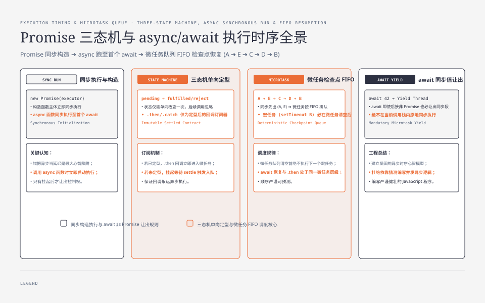
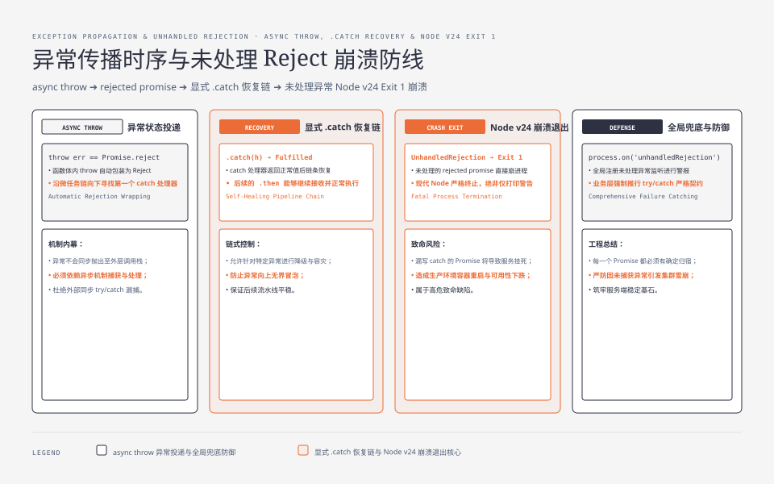

**TL;DR：** Promise、async、await 让人昏头的根源是**错把"异步"当成了"延迟执行"**——它们真正做的是两件事：**同步执行 + 微任务排队**。三条可复验的边界：① Promise 构造函数的执行体是同步的，回调（`.then`/`.catch`）才是异步排队的；② async 函数体同步执行到**第一个 await**，await 之后的一切都排进微任务队列；③ await 恢复与 `.then` 回调都发生在"当前宏任务结束、下个宏任务开始前"的微任务检查点（机制见[事件循环](/writing/understanding-event-loops)）。当前 Node v24 smoke 还显示：**未处理的 rejected promise 以 exit 1 退出**（不是"打印警告继续跑"）。至于内部到底排了几个 Promise Job，不能只凭一段打印顺序下结论，应以规范/运行时源码和独立 benchmark 为准。


---



## 一、先纠正直觉：Promise 不是"延迟"，是"状态机 + 排队"

最常见的错误心智模型是"Promise 让代码晚点执行"。先看仓库 smoke 的谜题 1（Node v24.19.0）：

```js
console.log("A");
setTimeout(() => console.log("B"));
queueMicrotask(() => console.log("C"));
Promise.resolve().then(() => console.log("D"));
console.log("E");
// 实测输出：A E C D B
```

输出顺序告诉你 Promise 做了什么、没做什么：

1. **构造与注册是同步的**：`Promise.resolve().then(...)` 这一行在打印 E 之前就把回调注册好了；
2. **回调执行被推迟到同步代码全部跑完**（A、E 先出）；
3. **回调进的是微任务队列**：C（`queueMicrotask`）先注册所以先出，D 后注册后出——**微任务按 FIFO 排队，不是按"谁更高级"**；
4. **宏任务（setTimeout）永远在微任务清空之后**。

真正的模型：Promise 是一台**状态机**（pending → fulfilled / rejected，且只能变一次），`then` 是"状态定型时把回调投进微任务队列"的订阅器。同步部分（构造、执行体、注册）与异步部分（回调运行）被微任务队列隔开。




## 二、状态机：三态一次定型，回调在定型时入队

Promise 的完整语义表：

| 状态 | 触发方式 | 之后的行为 |
|---|---|---|
| `pending` | 构造时 | 等待 `resolve` / `reject` |
| `fulfilled` | 调 `resolve(value)` | 该 promise 上注册的 `.then` 回调排入微任务 |
| `rejected` | 调 `reject(reason)` 或执行体 throw | 该 promise 上注册的 `.catch`/第二个参数排入微任务 |

三个关键语义，都是可验证的行为：

1. **状态只能变一次**：`resolve` 之后再调 `reject` 无效（后来的调用被忽略）。
2. **回调注册时机 vs 执行时机分离**：`p.then(fn)` 在 promise 已定型时，`fn` 不会同步运行，而是立即排入微任务；在未定型时，`fn` 被挂起，等定型的那一刻入队。
3. **then 返回新 promise**：`.then` 链是"新状态机接旧状态机"，所以 `p.then(f).then(g)` 里 g 一定在 f 之后，且 f 的返回值会传给 g。

这解释了谜题 3 的可观察部分：**await 恢复与 `.then` 回调都发生在微任务检查点**。这段日志能证明它们相对先入队的任务如何排序，但不能单独证明 V8 内部 Promise Job 的数量；“await 少烧一个微任务”或“二者永远完全等价”都需要版本绑定的运行时证据，不能从一段输出外推。

```js
let n = 0;
queueMicrotask(() => n++);
queueMicrotask(() => n++);

async function f() {
  await Promise.resolve();
  console.log("await 恢复时 n =", n, "（排在", n, "个先入队微任务之后）");
}
f();

let m = 0;
queueMicrotask(() => m++);
queueMicrotask(() => m++);
Promise.resolve().then(() => console.log("then 回调时 m =", m));
// 实测输出：
// await 恢复时 n = 2
// then 回调时 m = 2
```

两个恢复都排在 2 个先入队的微任务之后。这个现象足以说明 FIFO 和恢复位置，但**不等于内部只排了一个 Job，也不等于所有 Node/V8 版本的 CPU/GC 成本相同**。V8 的 fast path、Promise 是否为原生对象、thenable 交接和版本实现都会改变内部路径；若要讨论微任务数量或成本，应把运行时版本、源码位置和 benchmark 一起保存。

## 三、await 的展开：async 函数体同步跑，await 之后排微任务

谜题 2（Node smoke）：

```js
async function f() {
  console.log("f:start");
  await Promise.resolve("p");
  console.log("f:after-await");
}
console.log("main:before-f");
f();
console.log("main:after-f");
Promise.resolve("q").then((v) => console.log("main-then:", v));
// 实测输出：
// main:before-f
// f:start        ← async 函数体是同步执行的！
// main:after-f
// f:after-await  ← await 之后的代码排进微任务
// main-then: q
```

`async function` 的可观察行为是"**同步跑到第一个 await，然后返回一个 promise**"：

1. 调用 `f()` 时，函数体从第一行**同步**执行到 `await` 表达式；
2. `await` 把函数挂起，`f()` 立即返回一个 pending 的 promise；
3. await 后的代码（含后续所有 await）被压缩进微任务队列，逐个排队恢复；
4. 整个 async 函数无论中间有几个 await，**对外只返回一个 promise**，它的 settled 状态由函数体最终结果决定。

await 表达式的另一个语义（smoke 谜题 4）：**await 非 promise 值也照样让出当前同步段**。

```js
const order = [];
async function f() {
  order.push("before-await");
  await 42;                 // 非 promise
  order.push("after-await");
}
f();
order.push("sync-end");
queueMicrotask(() => order.push("microtask"));
setTimeout(() => console.log("最终顺序:", order.join(" -> ")), 0);
// 实测输出：
// 最终顺序: before-await -> sync-end -> after-await -> microtask
```

`after-await` 排在 `sync-end` 之后——**await 一个同步值也不会在当前同步段原地继续**；"await 一个同步值会原地继续"是错误直觉。`after-await` 又排在 `microtask` 之前，是因为这次运行中 await 的恢复回调先进入了队列，FIFO 决定了观察到的顺序。

## 四、错误时序：throw 就是 reject，不接 catch 会崩

谜题 5（Node smoke）：async 函数里 `throw` 等价于 `return rejected promise`，且 catch 之后的链会恢复。

```js
async function boom() {
  throw new Error("同步 throw");
}
boom()
  .catch((e) => { console.log("catch 到:", e.message); return "救回"; })
  .then((v) => console.log("catch 之后恢复:", v));
// 实测输出：
// catch 到: 同步 throw
// catch 之后恢复: 救回
```

错误时序的三条规则：

1. **async 函数体 throw → 返回的 promise 变为 rejected**（谜题 6 实测：`.then(成功回调, 失败回调)` 里走的是失败回调）；
2. **`.catch` 返回什么，链条就是什么**：返回普通值 → 下一个 `.then` 恢复；返回 rejected promise → 错误继续往下传；
3. **没接 `.catch` 的 rejected promise 是程序错误**：Node v24 实测直接抛错退出（exit code 1），连宏任务都来不及跑。浏览器行为是打印 Uncaught (in promise) 警告不崩溃——但"不崩"不等于"没事"，状态机的 reject 永远要有接收方。

## 五、组合子时序：all 的 fail-fast 与串行/并行的耗时差

四个组合子谁等谁，一张表（语义 smoke + 固定输入）：

| 组合子 | 语义 | 固定输入下的可观察行为（a=50ms、b=20ms 失败、c=100ms） |
|---|---|---|
| `Promise.all` | 全部成功才算成功，**任一失败立即整体失败** | b 失败时整体 reject，但 c 仍继续执行 |
| `Promise.allSettled` | 等所有任务落定，不管成败 | 所有任务落定后返回 `['fulfilled','rejected','fulfilled']` |
| `Promise.race` | 第一个落定的结果为准 | 最快那个的 status 为准 |
| `Promise.any` | 第一个**成功**的为准；全失败才 reject | 最慢成功者决定耗时 |

`all` 的 fail-fast 是时序陷阱：**all 在第一个失败时就 reject，但其余任务照跑**——失败回调触发后，c 的任务还在后台继续。用 `allSettled` 可以等全部落定再决策。

串行 vs 并行的关键路径（3 个固定 80ms 任务；不是稳定 wall-clock benchmark）：

```
串行（await 一个接一个）: 关键路径 240ms  ← 80+80+80
并行（Promise.all）      : 关键路径  80ms  ← max(80,80,80)
```

写代码的决策点：**两个任务没有依赖时，绝不串行 await**——`await a(); await b()` 是 2 倍耗时，`await Promise.all([a(), b()])` 是 1 倍耗时。调用 `a()` 的那一刻任务就启动了，串行 await 的"串行"只是把恢复排了队。

最后一个陷阱（smoke 谜题 7）：**await 一个 thenable（有 then 方法的对象），恢复时机交给那个 then**。

```js
let n = 0;
queueMicrotask(() => n++);
async function f() {
  await {
    then(resolve) {
      console.log("thenable 的 then 被调用 @ n =", n);
      setTimeout(() => resolve(), 30);
    },
  };
  console.log("await thenable 恢复 @ n =", n);
}
f();
queueMicrotask(() => n++);
// 实测输出：
// thenable 的 then 被调用 @ n = 1   ← 在微任务里被调用
// await thenable 恢复 @ n = 2      ← 等它的 resolve 之后（30ms 后）
```

await 的协议是"**调用对方的 then，把 resolve 交出去**"。thenable 可以把 resolve 延后到定时器、I/O 或永远不调用；因此“await 一定很快恢复”不是合同。这里验证的是交接顺序，不是老库或网络 I/O 的延迟。

## 六、结论：可观察时序不等于运行时成本

Promise/async/await 的完整心智模型是一张图：**同步代码 → 微任务检查点（清空微任务队列）→ 宏任务 → 微任务检查点 → ……**。Promise 是状态机，then/await 会安排异步恢复，async 是"同步跑到第一个 await"。当前 smoke 支持四个边界：① await 恢复与显式 `.then` 都在微任务检查点发生，但单段日志不证明内部 Job 数；② async 函数体同步执行到第一个 await；③ 未处理的 rejected promise 在 Node v24 进程中以非零状态退出；④ 无依赖任务并行用 all，串行 await 的关键路径是 240ms 对 80ms（固定 80ms 输入），不是可直接外推的生产延迟。

下一步可做的事：把你手头的异步代码过一遍这张图——每个 `await` 问一句"它等待的状态是什么、是否允许后台任务继续"；把所有没接 `.catch` 的 promise 找出来接上；把无依赖的串行 await 改成 `Promise.all`。仓库 smoke 的原始输出与环境记录在 `evidence/js-async-await-promise-timing/2026-08-17-local/`。改完之后，用[事件循环的时间线排查法](/writing/understanding-event-loops)复查一遍；不要把本地微任务顺序当成网络 I/O 或取消语义。

## 七、参考资料

1. V8 博客 "Faster async functions and promises"（await fast path 的原理）：https://v8.dev/blog/fast-async
2. ECMAScript 规范 §27.2（Promise 对象）与 §14.7.6（async 函数）: https://tc39.es/ecma262/
3. MDN：Using promises / async function：https://developer.mozilla.org/en-US/docs/Web/JavaScript/Guide/Using_promises
4. Node.js unhandledRejection 行为变更说明（v15 起默认崩溃）：https://nodejs.org/api/process.html#event-unhandledrejection
