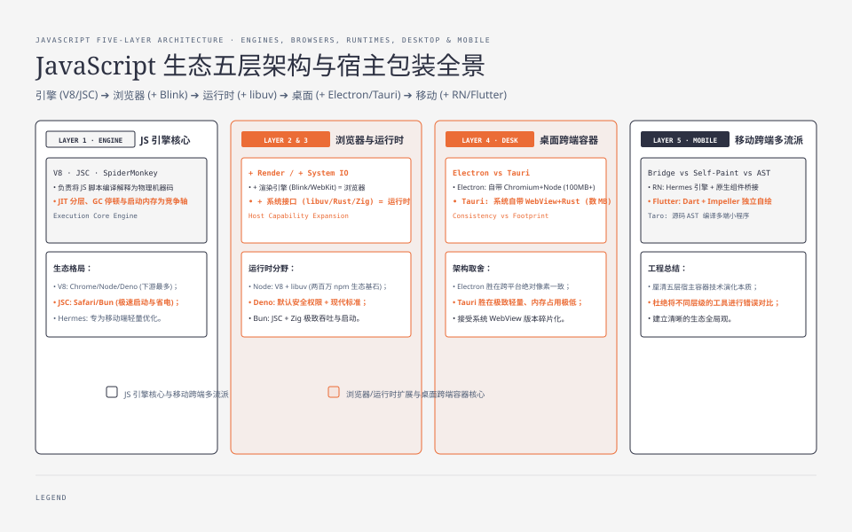
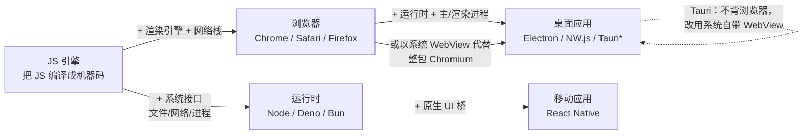
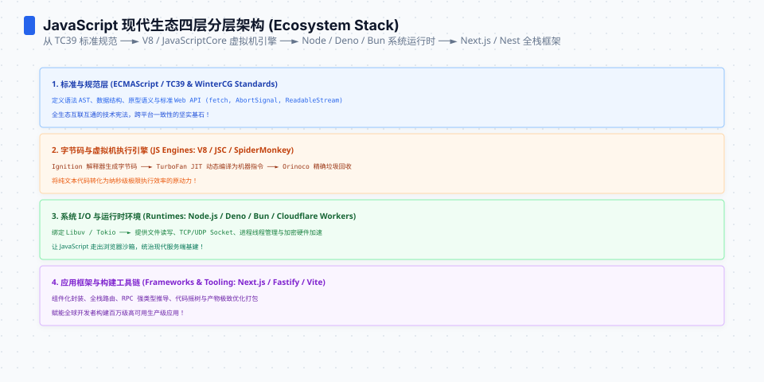
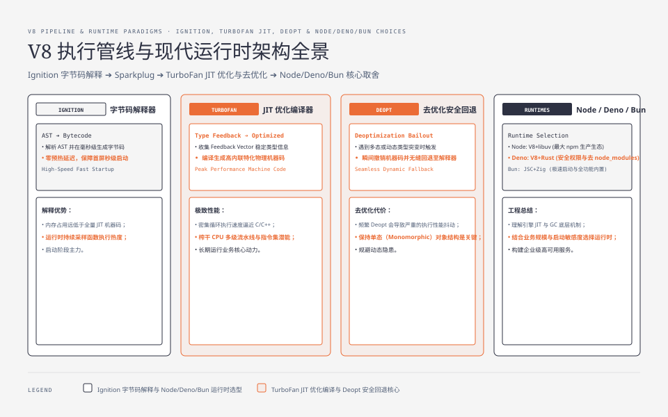
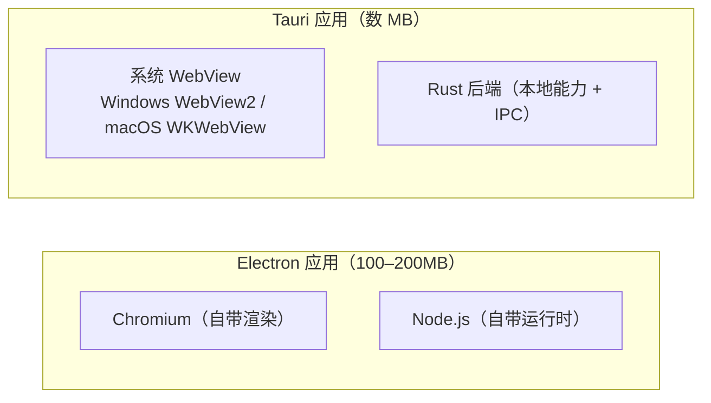

**TL;DR：** JS 生态的“乱”可以先用一张容器模型拆开：许多产品都是 JS 引擎与渲染、系统接口、原生 UI 或 WebView 的组合，但并不是所有产品都共享同一台引擎，也不是每个层次都能互换。加渲染能力是浏览器，加系统接口是运行时，两者都加是 Electron，把原生 UI 接到引擎上是 React Native，依赖系统 WebView 的桌面壳是 Tauri。本文按引擎、浏览器、运行时、桌面、移动五层拆开，每层回答“题目是什么、答案是什么、代价是什么”。

---

## 一、一个引擎，五种包装

JavaScript 的特别之处在于：1995 年它诞生时只是浏览器的脚本语言，三十年后的今天，同一个语言跑在服务端、桌面、移动、边端。这么多形态不是凭空长出来的，它们通常把少数主流 JS 引擎与不同宿主能力组合起来。常见引擎家族包括 V8、JavaScriptCore 和 SpiderMonkey，另有 Hermes、QuickJS 等面向不同约束的实现；剩下的产品多数是在“翻译官”外面做加法：

*图注：星号表示 Tauri 是特例——它不加浏览器，而是依赖操作系统自带的 WebView。这个例外正是理解整张图的关键，第五节展开。*

看懂这张图，浏览器大战、运行时之争、Electron 的吐槽、RN 与 Flutter 的对比，全部归位为同一个问题的不同答案：**在一个 JS 引擎外，加什么部件去解决什么场景的问题**。本文剩下的篇幅，就是逐层把每道题和每笔账写清楚。

## 二、引擎层：把 JS 变成机器码的翻译官

第一道题最基础：JS 是脚本语言，谁把它变成机器能跑的代码？答案是引擎。1995 年 Brendan Eich 十天设计出 JS 的时候，它只是给 Netscape 用的脚本；今天独立存在的 JS 引擎只剩四台名声在外的：

| 引擎 | 年份 | 属于谁 | 命运 |
| :--- | :--- | :--- | :--- |
| SpiderMonkey | 1996 | Mozilla / Firefox | JS 引擎鼻祖，随 Netscape 2 首次发布 |
| JavaScriptCore（Nitro） | 2008 | Apple / Safari | 也被 Bun 借用，见第四节 |
| V8 | 2008 | Google / Chrome | 占比最大的引擎，下游最多 |
| Chakra | 2011 | Microsoft / 旧 IE·旧 Edge | 随 IE 退役，开发停止 |

引擎之间表面都在"编译 JS"，差异集中在四条决策轴上：

1. **JIT 的层级**。解释执行（Ignition、JSC 的 LLInt）→ 基线编译 → 高级优化编译（V8 的 TurboFan、JSC 的 B3/FTL）。层次越多越能榨性能，但每层都是启动和内存的税。
2. **GC 策略**。V8 的并发/增量标记（Orinoco）、JSC 的世代 GC，谁能把停顿压得更平滑，谁在大应用里更稳。
3. **启动速度**。引擎第一次执行要完成多少预热，直接决定"进程从零到能跑"要多快。这正是 Bun 弃 V8、选 JSC 的核心原因（见第四节），也是 React Native 换用 Hermes 的原因。
4. **内存占用**。JIT 编译器本身要吃内存，引擎常驻内存是移动端最敏感的指标。

一个诚实的观察：**在桌面端，这几台引擎的"翻译速度"差距通常在一个数量级以内，而且互有胜负。** 纠结"谁最快"意义不大；真正拉开差距的是启动与内存，这就是为什么移动端和运行时领域出现了专门的引擎（Hermes、QuickJS）。引擎竞争的关键词是 JIT、GC、启动、内存，不是"谁的机器码更快"。

Chakra 的退场是一道历史注脚：2018 年微软宣布 Edge 转用 Chromium（2020 年正式切换），Chakra 失去宿主，开发随之停止。**引擎的命运绑定在宿主上**——这个规律贯穿整个容器层。

## 三、浏览器层：引擎 + 渲染引擎

第二道题：页面怎么画出来？单靠 JS 引擎不够，还要一个能把 HTML/CSS 布局并画到屏幕上的渲染引擎。于是每个浏览器 = 一台 JS 引擎 + 一台渲染引擎：

| 浏览器 | JS 引擎 | 渲染引擎 | 份额（桌面，约） |
| :--- | :--- | :--- | :--- |
| Chrome | V8 | Blink | 六成以上 |
| Safari | JavaScriptCore | WebKit | 一成上下 |
| Firefox | SpiderMonkey | Gecko | 约 3% |

网上的说法是"浏览器就是换壳"，这个比喻有一半不对。**渲染引擎不是壳，是另一大工程**：CSS 布局算法（Blink/WebKit/Gecko 各不相同）、绘制与合成、GPU 加速、安全隔离——换一台渲染引擎几乎等于换一个操作系统里的窗口系统。Blink 本身就是从 WebKit 分叉出来的（2013 年），这个分叉证明了渲染引擎是独立于 JS 引擎的战争。所以更准确的模型是：浏览器 = **两份分别选择的工程**的乘积，V8+Blink、JSC+WebKit 只是最著名的两组搭档。

两个值得记住的边界事实：

- **iOS 的浏览器引擎政策取决于地区、系统版本和 entitlement**。在许多地区，第三方浏览器仍使用 WebKit；但 Apple 的开发者文档说明，欧盟用户在满足 Web Browser Engine Entitlement、iOS 17.4/iPadOS 18 等条件时可以使用替代引擎，日本也有后续系统版本的特定资格路径。因此“iPhone 上的 Chrome、Firefox 永远只是 Safari 的皮”已经不是无条件成立的判断；做兼容性决策时要把地区、最低系统版本和分发资格写进矩阵。
- **引擎与渲染引擎的绑定是营销之外的技术选择**。Firefox 坚持自家两份引擎是意识形态（开源、防止一家垄断），也是技术负担——它必须独自维护 Gecko 的兼容性。

"换壳游戏"的真相其实是：壳（渲染引擎）和心脏（JS 引擎）都值得各自单独算一笔账，而多数用户感知到的差异（内存、速度、省电）是这两份工程加总的结果。Chrome 吃内存的槽点，一半来自 Blink 的进程模型，一半来自 V8；Safari "省电"的卖点，同样来自 JSC（更省的 JIT 预热）与 WebKit 的渲染管线共同作用。

## 四、运行时层：引擎 + 系统接口

第三道题：让 JS 离开浏览器。2009 年 Ryan Dahl 把 V8 和 libuv（事件循环 + 异步 IO）缝起来，Node.js 诞生——JS 第一次能读文件、开 TCP、起 HTTP 服务。运行时 = **引擎 + 系统调用接口**。这个市场现在有三个选手，恰好是三代答案：

| 运行时 | 年份 | 引擎 | 核心取舍 |
| :--- | :--- | :--- | :--- |
| Node.js | 2009 | V8 | 生态最大（npm 上超过两百万包），历史包袱最重 |
| Deno | 2020 | V8 | 同一个作者推倒重来：内置 TS、默认权限最小化、去 node_modules |
| Bun | 2022 | JavaScriptCore | 换成启动快的 JSC + 用 Zig 实现后端，并把打包/测试并入 |

**Deno 的出发点是对 Node 的否定**：Node 的权限模型是"什么都给"（跑你的脚本就等于给它全部系统权限），Deno 改为默认拒绝、按需授权；Node 的模块系统是 CommonJS 加历史包袱，Deno 直接用 ES Module + URL 导入。代价很清楚：十多年积累的 npm 兼容性没了，生态要重新造。诚实地说，Deno 目前是"更干净，但要自理"的一边。

**Bun 的关键决策是换引擎**。它把能干的活（bundler、test runner、包管理器）尽量自己做（用 Zig 写，快），但执行 JS 时挑了 JSC 而不是 V8——因为 JSC 的启动更快、预热更省，这让"脚本启动"这个最敏感的场景占了便宜。代价同样明确：**JSC 不等于 V8**，部分 C++/N-API 原生模块在 Bun 下不可用，生态兼容性是它最大的短板。

这道题的共性判断：**runtime 之争本质是"启动与内存"对"生态兼容"的交换**。Node 老而全，Deno 新而净，Bun 快而险；选谁都行，前提是你清楚自己买的是哪一边。对大多数后端服务，"那几百毫秒的启动差"远不如生态省下的时间值钱。

## 五、桌面层：浏览器 + 运行时

第四道题：用 Web 技术写桌面软件。2013 年的答案是把 Chromium 和 Node.js 直接打包进应用——Electron。一个 Electron 应用自带完整浏览器（渲染 UI）和完整运行时（访问文件、进程、系统能力），应用占 100–200MB 的安装体积、每个应用各带一份 Chromium（不共享）是这个答案的固定税。

Electron 的架构贡献是**主进程/渲染进程模型**：Node 逻辑跑在主进程，UI 跑在渲染进程，两者通过 IPC 通信，而不是像它同时代的 NW.js 那样把 Node 和 DOM 揉在同一个进程里（所以可以在页面里直接 `require()`，听起来方便，实际是污染模型：页面代码能碰到系统 API，安全和心智都乱）。NW.js 没做错技术，它输在架构演进慢了一拍。

2022 年 Tauri 给出了第二答案：**不背浏览器，改用操作系统自带的 WebView**。桌面三大系统都有内建的 web 渲染（Windows 的 WebView2、macOS 的 WKWebView、Linux 的 WebKitGTK），Tauri 用 Rust 实现本地逻辑、把前端跑在系统 WebView 上，通过 IPC 调用 Rust 能力：

| 维度 | Electron | Tauri |
| :--- | :--- | :--- |
| 渲染 | 自带 Chromium，版本可控 | 系统 WebView，随操作系统走 |
| 体积 | 应用常见 100MB+ | 数 MB 到十几 MB |
| 后端 | Node.js（JS 全家桶） | Rust（性能好，学习成本高） |
| 短板 | 体积、内存、多副本 Chromium | WebView 行为因系统而异、跨平台一致性弱 |

选择逻辑很直白：想要"写一次、处处一致"（即使是很胖的一致），选 Electron；想要"软件小、吃系统少"，接受"行为由操作系统决定"，选 Tauri。Tauri 的代价是它把 Chromium 的一致性换成了系统 WebView 的分散性，这是这场交易里的风险点。

## 六、移动层：桥接原生 vs 自绘 vs 编译

第五道题：一套代码跑 iOS 和 Android。这里有三个流派，答案各不相同，是容器层里最容易混的部分：

**流派一：引擎 + 原生 UI 桥（React Native）。** RN 在 iOS/Android 上跑一个 JS 引擎（2019 年起用自家 Hermes，为移动端优化启动与内存），页面渲染交给操作系统的原生组件——JS 描述"我要一个按钮"，桥把命令交给原生画出来。代价是 JS 与原生之间的桥曾是性能瓶颈，每次跨桥都有序列化开销。

**流派二：自绘渲染（Flutter）。** Flutter 干脆不接原生 UI：用 Dart 语言写应用，用一个独立的 2D 渲染引擎（早年是 Skia，iOS 上已切换为新的 Impeller；Android 也在迁移）把每个像素自己画出来。两端 UI 绝对一致是自然的，性能也不受桥的限制；代价是要学 Dart、以及"平台特征"（系统对话框、无障碍）要靠插件沟通。

**流派三：编译到各端（Uni-app、Taro）。** 这一派经常被误称为"RN 的平替"，其实路线完全不同：RN/Flutter 是"运行时渲染"，而 Uni-app（Vue 语法）和 Taro（React 语法）是**把一份代码编译/映射成不同目标的源码**——最常见的是微信小程序，其次是 H5，Taro 还能编译到 RN。它的主战场是"必须出小程序"的中国市场，代价是落在目标平台时做的往往是"能力下限的并集"，深度功能要写各端条件代码。

| 流派 | 代表 | 渲染方式 | 主战场 | 主要代价 |
| :--- | :--- | :--- | :--- | :--- |
| 引擎 + 原生 UI | React Native | 原生组件，JS 桥接 | 存量 Web 团队 | 桥的性能与原生模块维护 |
| 自绘 | Flutter | 自己的 2D 渲染器 | 追求一致性/性能 | 学 Dart、平台特性靠插件 |
| 编译映射 | Uni-app / Taro | 编译成小程序/H5 源码 | "必须有小程序"的国内业务 | 多端能力取并集/下限 |

三派之间的选择几乎不看技术上限，看**你的出口是什么**：目标是 iOS/Android 双端 App、且团队会 JS，RN 最顺；目标是极致一致 + 新语言成本可接受，Flutter；目标是微信生态，Uni-app/Taro 几乎是必选项而不是备选项。

## 七、横截面：加减法总表

把五层串成一张表，容器层的全景就齐了：

| 层 | 题目 | 公式 | 代表产品 |
| :--- | :--- | :--- | :--- |
| 引擎 | 把 JS 变机器码 | 引擎 | V8 / JSC / SpiderMonkey / Hermes / QuickJS |
| 浏览器 | 把页面画出来 | 引擎 + 渲染引擎 | Chrome / Safari / Firefox |
| 运行时 | 让 JS 离浏览器 | 引擎 + 系统接口 | Node / Deno / Bun |
| 桌面 | Web 写桌面软件 | 浏览器 + 运行时（或系统 WebView） | Electron / NW.js / Tauri |
| 移动 | 一套代码跑多端 | 引擎 + 原生 UI（或自绘，或编译） | RN / Flutter / Uni-app / Taro |

贯穿这张表的两个规律：

1. **引擎的数量远少于产品的数量**。真正独立的"翻译官"只有几台，其余全是容器。看到一个陌生名词，先问"它用什么引擎、在哪个层"，定位就完成了一半。
2. **每一层都是在用'一致性'换'轻'（或反过来）**。Electron 用体积换一致性，Tauri 用一致性换轻；Bun 用生态兼容换启动快；浏览器们用各自引擎换命运自主。凡是看到"X 完胜 Y"的标题，先找它没写出来的那半笔账。

## 八、结论：先分清运行时容器，再谈框架

JS 生态不是一堆各自为战的框架，而是一个引擎的五种包装。学习前端时，先分清**容器层**（引擎/浏览器/运行时/桌面壳/移动壳，本系列第 0 篇）和**框架层**（UI 如何组织，见系列后两篇），就不会再被"又一个新名词"带节奏——绝大多数新名词只是某层上的一个新容器，而非新原理。

下一步：选一个最贴近你目标场景的容器动手（写浏览器→用浏览器；写服务→装 Node；写 App→按主战场选 RN/Flutter），把它默认顺手的东西跑通一遍。

## 参考资料

1. V8 官方博客：Ignition（解释器）与 TurboFan（优化编译器）—— https://v8.dev/blog/ignition-interpreter
2. WebKit 官方博客：JavaScriptCore 的四层 JIT—— https://webkit.org/blog/3362/introducing-the-webkit-fts-tree/
3. SpiderMonkey 资料：Mozilla 开发者文档、Netscape 2 首发背景—— https://spidermonkey.dev/
4. Microsoft Chakra 开源仓库（已归档停止维护）—— https://github.com/microsoft/ChakraCore
5. Node.js 官方与 npm 生态规模（npm:超过两百万个包）—— https://nodejs.org/en/about
6. Deno 官方手册（TS 支持、权限模型、URL 导入）—— https://docs.deno.com/runtime/manual/
7. Bun 官方文档（JavaScriptCore、Zig、内置工具链）—— https://bun.sh/docs
8. Electron 官方文档（主进程/渲染进程架构）—— https://www.electronjs.org/docs/latest/tutorial/process-model
9. Tauri 官方文档（系统 WebView 与 Rust 后端）—— https://tauri.app/
10. React Native 官方文档（Hermes、桥与 Fabric）—— https://reactnative.dev/
11. Flutter 官方文档（Impeller 渲染引擎取代 Skia 的情况）—— https://docs.flutter.dev/perf/impeller
12. Uni-app / Taro 编译原理文档 —— https://uniapp.dcloud.net.cn/ 、 https://docs.taro.zone/
13. Apple Developer：欧盟替代浏览器引擎资格（iOS/iPadOS 版本、地区与 entitlement，2026-08-17 核对）—— https://developer.apple.com/support/alternative-browser-engines/

> 延伸阅读：容器层（本文）讲 JS 在哪里跑，接下来两篇讲 UI 怎么组织——见[前端框架为什么这么乱：四代问题与解法](/writing/frontend-framework-history)和[前端框架真正差在哪：渲染、响应式与状态](/writing/frontend-framework-taxonomy)；容器层的异步机制，见[事件循环不是一个循环](/writing/understanding-event-loops)。
