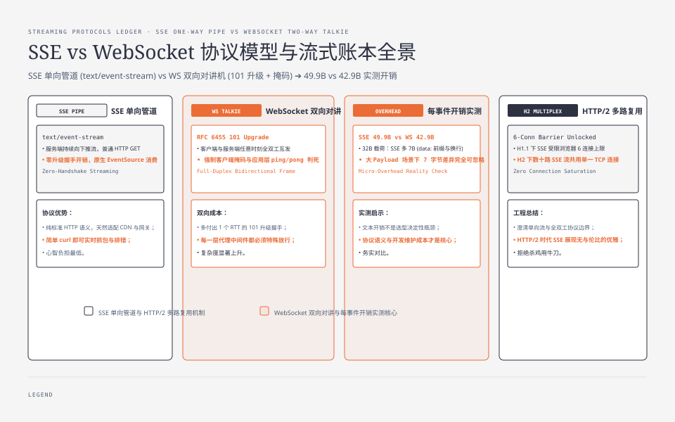
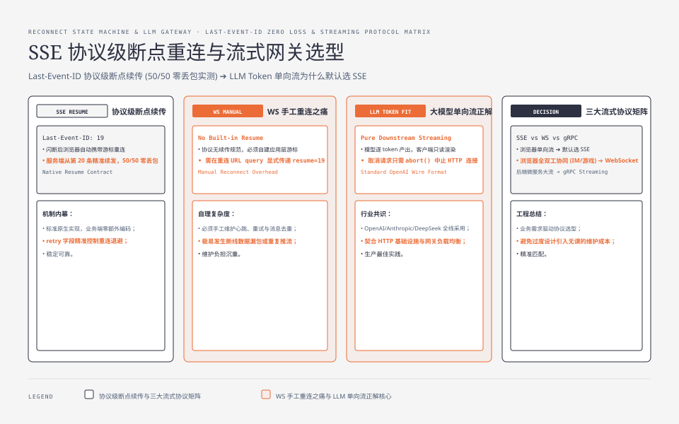

**TL;DR：** "SSE 是 WebSocket 的廉价版"把两者关系说反了。SSE 是**服务端→客户端单向流**的正解，WebSocket 解决的是**双向实时**，后者为此付出一次升级握手 RTT、客户端帧掩码、心跳与死连接检测、断线重连与续传游标全部自己实现的复杂度。LLM 的 token 流是纯单向，默认该选 SSE——它是 HTTP 流（`text/event-stream`），浏览器 EventSource 原生，重连语义（`Last-Event-ID` + `retry:`）协议内置。本机一轮（Node 24.19.0 / macOS 26.5.1）：每事件线上字节 SSE 49.9B vs WS 42.9B（32B payload）；服务端掐断连接后 SSE 一次自动重连 50/50 无缺口，WS 要自己重连、把续传游标塞进重连请求的 query。判定标准就一句：**你的场景需不需要客户端随时上行。需要，才上 WebSocket。**


---



## 一、反直觉先立住：SSE 不是降级方案，是单向流的正解

"SSE 是 WebSocket 的廉价版"这句话暗示 SSE 是功能残缺的 WebSocket——去掉双向、去掉二进制、去掉消息推送，剩下个残次品。这不是退化：单向推送本来就不需要双向协议。

把场景摆开。一条 LLM 流式响应里，数据只朝一个方向流动：模型在服务端逐个产出 token，客户端只负责接收和渲染。这是**单向管道**：源头在服务端，水只往客户端流。WebSocket 是**对讲机**：两边都能按住说话键。用对讲机去解决"水往一个方向流"，你为用不到的说话键付了整套对讲机的钱——频率协商、按住才能说、随时可能被对方打断。对单向往下送数据，管道才是对的那个工具。

这不是比喻层面的洁癖，工程上贵得很具体。WS 的固定成本包括：一次升级握手 RTT、客户端帧掩码、心跳与判死、断线重连与续传游标。SSE 把这四样里除心跳外的三样都做成协议内置（心跳用一行注释也能糊弄过去）。当你只需要单向时，这些成本没有对应收益。




## 二、SSE 机制：text/event-stream 的四行字段与 Last-Event-ID 重连

SSE 就是一条普通 HTTP 响应，只是 `Content-Type: text/event-stream`，靠分块传输（`Transfer-Encoding: chunked`）逐块送达，而不是等整个 body 结束。本机 `curl -N` 直接能看到原始流：

```text
HTTP/1.1 200 OK
Content-Type: text/event-stream
Cache-Control: no-cache
Transfer-Encoding: chunked

: connected
retry: 100
id: 1
data: xxxx（payload）

id: 2
data: xxxx（payload）
```

（真实输出见实验一节。）字段语义按 WHATWG HTML 规范的 Server-sent events 一节：

- `data:`：一条消息的数据，多个 data 行会以换行拼接；
- `event:`：事件名，缺省 `message`；
- `id:`：设置 lastEventId，断线重连时回传给服务端；
- `retry:`：重连间隔毫秒数；
- 空行触发一次事件派发；`:` 开头是注释行，浏览器忽略——常用作 keep-alive，因为中间代理对长时间无数据的空闲连接有超时，注释行把连接"喂活"。

浏览器用 EventSource 消费，核心逻辑就三行：

```js
const es = new EventSource("/v1/chat/stream");
es.onmessage = (e) => render(JSON.parse(e.data));
// 断线自动重连，Last-Event-ID 由浏览器带上，服务端据此续发
```

重连是**协议语义而不是库行为**：连接被掐断（网络闪断、服务端重启）后，EventSource 按 retry 间隔自动重连，请求头带 `Last-Event-ID`，服务端读这个头从下一条续发；而 HTTP 显式返回 4xx/5xx 会终止重连。限制也要诚实承认：EventSource 只支持 GET，且浏览器不允许设自定义请求头——Authorization 得走 cookie 或短期 token 塞 query，这是生产里两个常见的坑。

服务端更简单，Node 里就是往响应里写：

```js
res.writeHead(200, { "Content-Type": "text/event-stream", "Cache-Control": "no-cache" });
res.flushHeaders(); // 不刷头，整个流会被 Node 缓冲住
res.write(`id: ${seq}\ndata: ${JSON.stringify(delta)}\n\n`);
```

## 三、WebSocket 机制：一次升级握手、帧与掩码、要自己写的重连

WS 协议（RFC 6455）的复杂度分三笔。

**第一笔，升级握手。** 客户端发 HTTP GET 带 `Upgrade: websocket` 和 `Sec-WebSocket-Key`（16 字节随机数的 base64），服务端回 `101 Switching Protocols`，`Sec-WebSocket-Accept = base64(SHA1(key + 固定 GUID))`（RFC 6455 §1.3、§4）。多一次 RTT，而且链路里每一层代理都必须放行 Upgrade 与 101——在严格的中间件网络里，这本身就是兼容性成本。

**第二笔，帧格式**（RFC 6455 §5.2、§5.3）：FIN + opcode（1=text、2=binary、8=close、9=ping、10=pong）+ MASK 位 + 7/16/64 位长度 + 4 字节掩码密钥。规则是客户端→服务端帧必须掩码、服务端→客户端禁止掩码。没有掩码帧处理，就没有 WS。

**第三笔，生命周期全得自己写。** ping/pong 控制帧定义了，但"多久发一次 ping、多久没 pong 算死连接"没有规定；浏览器 API 没有心跳、没有自动重连、没有续传游标。断线重连要应用层自己做，而"上次发到哪了"的续传状态，协议里没有任何字段——必须自己约定（本实验里是塞进重连请求的 query）。这三笔摊开在 `experiments/sse-vs-ws/ws-server.mjs` 的百来行里，是完整的、可运行的本地教学原型，不是能直接上线的实现。

## 四、关键差异账：五条对比与各自的坑

| 维度 | SSE | WebSocket |
| --- | --- | --- |
| 数据方向 | 单向（服务端→客户端） | 双向 |
| 承载 | HTTP 流（text/event-stream + chunked） | 独立帧协议（RFC 6455） |
| 握手 | 无，普通 GET | 升级握手 101，一次 RTT |
| 重连 | 协议内置：Last-Event-ID + retry | 自己写；续传游标靠应用层约定 |
| 心跳 | 注释行 keep-alive | ping/pong 帧，频率与判死自己定 |
| 二进制 | 文本（二进制需 base64） | 原生二进制帧 |
| 每事件开销 | 本机 49.9B（32B payload） | 本机 42.9B |
| 每源连接数 | HTTP/1.1 约 6 条内各占 1；HTTP/2 多路复用解绑 | WS 有独立连接池（Chrome 每 host:port 约 255），不受 HTTP 的 6 条限制 |

逐条说：

1. **单向 vs 双向**：这是语义承诺差异——SSE 卖的是"服务端持续推送一条流"，WS 卖的是"任意时刻双向互发"。为什么：WS 的双向是协议根设计（握手后走裸 TCP + 帧），不是能按需关掉的开关；只要前者，SSE 就够，需要后者才轮到 WS。

2. **重连语义**：SSE 的重连是规范行为，浏览器自动带 Last-Event-ID，服务端读头续发；本机实验里服务端掐断连接后，SSE 一次自动重连就 50/50 无缺口。WS 没有这回事——重连代码、续传游标、服务端"从哪接着发"的状态，全要你搭。本实验里续传游标是塞进重连请求 query 才对齐的（`GET /?resume=19`），这是应用层约定，协议一无所知。

3. **连接数限制**：HTTP/1.1 下主流浏览器对每个源限制并发连接数约 6 条（Chrome/Firefox/Safari 的实现值，非 RFC 硬约束），SSE 每开一条占 1 条——6 路实时流就撞顶。**WS 不吃这堵墙**：浏览器给 WS 单独开了一个连接池（Chromium 每 host:port 上限 255、WebKit/Firefox 每进程约 200），不走 HTTP/1.1 的 6 条池。所以 HTTP/1.1 下 WS 反而能开更多并发流；SSE 的连接数优势要到 HTTP/2 才出现——SSE 是普通 HTTP 流、同一条连接里多路复用、6 条限制直接解绑；WS 也能走 HTTP/2（RFC 8441 的 extended CONNECT），但要浏览器和服务器同时支持，远不如 SSE"无脑走 HTTP"。注意多路复用解开的只是应用层并发，HTTP/2 的队头阻塞那笔账还在（见 [HTTP/2 的队头阻塞还在](/writing/http2-head-of-line-blocking)）。并发连接数与排队的数量关系见 [连接池的容量是算出来的](/writing/connection-pool-math-timeout)。

4. **中间层缓冲**：这是 SSE 最阴的坑。Nginx 对上游响应默认开缓冲（`proxy_buffering` 默认 on），SSE 的块会被攒进缓冲区，直到 buffer 满或连接关闭才一次性吐给客户端——实时性被缓冲成"攒一波再发"。修法：`proxy_buffering off;` 或上游回 `X-Accel-Buffering: no`，gzip 也要关（压缩层会再缓冲一层）。WS 升级期要代理放行 Upgrade，传输期是原始帧，没有攒缓冲问题，但兼容性窗口在握手。两层都不是开箱即用，只是坑的位置不同。

5. **每事件开销与背压**：本机一轮，SSE 每事件 49.9B、WS 42.9B（都含 id 与 32B payload）——SSE 多约 7B，来自 `data:` 前缀和空行；payload 变大时相对差异缩小，普通体量下无感，每秒数千事件的高频推送才看得见。背压单独说：两条路都是 TCP 上的写，服务端都要尊重写缓冲——`res.write()` / `socket.write()` 返回 false 就得等 `drain`，否则积压只是换了个地址（背压要沿整条链路验收，见 [背压不是语法糖](/writing/typescript-streams-backpressure)）。而且 HTTP/1.1 下 EventSource 没有应用层反向控速信号，服务端是背压责任的唯一承担者。

## 五、LLM 流式为什么默认选 SSE；gRPC streaming 作为第三方

把上一节的账套到 LLM 流式上：

- **单向**：token 只从服务端流向客户端。生成过程客户端没有任何必须上行的话语权——连"停止生成"都是通过关闭连接/中止请求实现的，HTTP 请求中止即取消。
- **语义匹配**：一条 `data:` 一个 token 增量，`id:` 做序号，断了能靠 Last-Event-ID 从中间续上——"长对话中断后接着看"是现成语义，不用自己发明。
- **可缓存可调试**：SSE 是 HTTP，`curl -N` 直接看原始流（本实验就靠它验证），可被 CDN/代理缓存与重放。WS 是二进制帧流，调试、缓存、打点都更费劲。
- **成本**：没有 ws 库、没有心跳、没有重连框架、没有掩码与帧解析，浏览器原生 EventSource；HTTP/2 多路复用解绑 6 连接限制后，同源开几十条 SSE 流没有连接数压力。

行业已经默认了这个答案：主流 LLM 的 chat completions 流式接口暴露的线上格式就是 `text/event-stream`（curl 即可见）。这不是偶然，是"token 流是单向流"的工程直觉。推理侧配套的吞吐成本见 [LLM 推理的排队税：continuous batching](/writing/llm-continuous-batching-throughput)。

什么时候才轮到 WebSocket：客户端必须随时上行、且与下行耦合在一条连接里——多人实时协作、游戏状态、IM 的"正在输入"+并发消息。LLM 场景里唯一的上行需求是取消，那不值得为它上 WS；真出现"生成中改参数并立刻收到影响"的需求，那才是双向的场子。

第三方是 gRPC server-streaming：HTTP/2 上的强类型流，协议级流控（HTTP/2 WINDOW_UPDATE）加明确取消语义，服务端到服务端（例如模型推理服务内部透传）很合适；但浏览器不原生支持 gRPC，公网浏览器场景要 gRPC-Web + 代理，复杂度高。排序：**浏览器单向流 → SSE；浏览器双向 → WebSocket；服务端到服务端的强类型大流 → gRPC streaming。**

## 六、可复现实验：Node 双服务端，压每事件开销与重连语义

实验在 `experiments/sse-vs-ws/`，纯 Node 内置模块、零依赖，`ws-server.mjs` 是手写的最小 RFC 6455 实现：

```bash
cd experiments/sse-vs-ws
node bench.mjs       # 每事件开销与吞吐（脚本自拉起并回收两个服务端）
node reconnect.mjs   # 断线重连语义（服务端发到第 19 条后掐断，第 20 条未送达）
```

2026-08-16 本机（macOS 26.5.1 / Apple Silicon / Node v24.19.0）一轮结果：

| 指标（100k 事件、32B payload，本机一轮） | SSE | WebSocket |
| --- | ---: | ---: |
| 每事件线上字节 | 49.9 B | 42.9 B |
| 事件/秒 | 约 85 万 | 约 22 万 |

重连对照（服务端发到第 19 条后掐断、第 20 条未送达，预期 50 条）：

| 场景 | 重连次数 | 结果 |
| --- | ---: | --- |
| SSE | 1 | 50/50，无缺口（Last-Event-ID 自动续传） |
| WebSocket + 续传游标 | 1 | 50/50，无缺口（游标塞在重连请求 query，应用层约定） |
| WebSocket 仅重连不续传 | 1 | 收到 69 条、重复 19（服务端从头重推） |

读结果要诚实：**吞吐是两台 toy 客户端实现之间的差距**（WS 端逐帧 Buffer 编解码更重），不是协议承诺——两协议在回环上吞吐同量级是常态，SSE 的赢面不在吞吐，在重连语义、连接数、中间层兼容与部署成本。换机器、换 payload、换客户端解析方式都会改变绝对值；完整命令与原始输出在 `experiments/sse-vs-ws/README.md` 与 `experiments/sse-vs-ws/evidence/2026-08-16-local/output.txt`。

## 七、结论：单向推送选 SSE，双向实时才上 WS

"SSE 是 WebSocket 的廉价版"是反的。正确的话是：**单向推送场景，SSE 是正解；WebSocket 解决的是双向实时，为此付出协议复杂度。** 判定标准只有一条：你的场景需不需要客户端随时上行。需要，上 WebSocket；不需要（LLM token 流、行情推送、通知、日志流），选 SSE——协议内置重连、浏览器原生、可缓存可调试、HTTP/2 下多路复用解绑连接数。

可以立刻做的下一步：把 `experiments/sse-vs-ws/` 跑一遍，用 `curl -N` 看 SSE 原始流，再改 `--drop-at` 感受重连语义的差距；生产部署前检查你的 Nginx/l7 代理有没有对 SSE 开 `proxy_buffering off`——这是单向流场景里唯一"选对了协议还会翻车"的地方。

## 参考资料

1. WHATWG HTML 规范：Server-sent events（text/event-stream、字段语义与 Last-Event-ID 重连）—— https://html.spec.whatwg.org/multipage/server-sent-events.html
2. RFC 6455：The WebSocket Protocol（§1.3/§4 打开握手、§5.2/§5.3 帧格式与掩码规则）—— https://www.rfc-editor.org/rfc/rfc6455
3. RFC 8441：Bootstrapping WebSockets with HTTP/2（extended CONNECT）—— https://www.rfc-editor.org/rfc/rfc8441
4. RFC 9112 §9：HTTP/1.1 连接管理—— https://www.rfc-editor.org/rfc/rfc9112（每源约 6 条是浏览器实现值，不是 RFC 硬约束）
5. Nginx：proxy_buffering 与 X-Accel-Buffering —— https://nginx.org/en/docs/http/ngx_http_proxy_module.html
