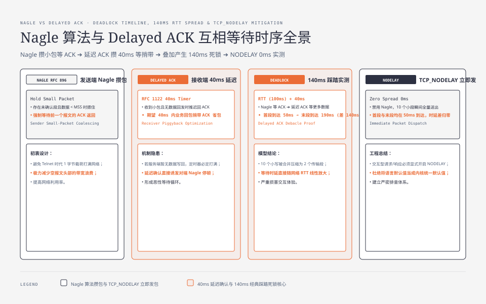
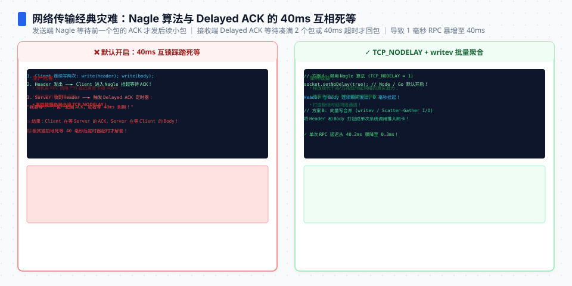
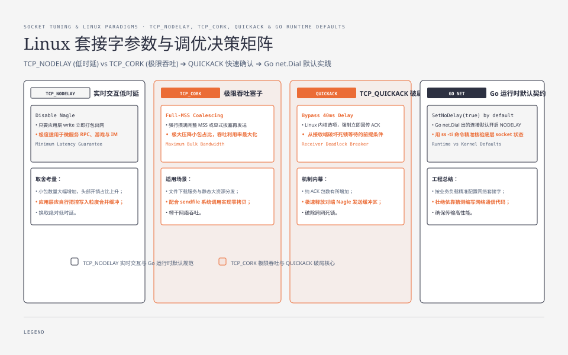

**TL;DR：** Nagle（发送端攒小包）与延迟 ACK（接收端攒 ACK）各自都在减少小包，但可能把等待叠加到同一条交互路径：Nagle 等 ACK，延迟 ACK 等更多数据。仓库内固定参数模型（RTT 100ms、延迟 ACK 40ms）得到：Nagle 先发 1 段、再发剩余 9 段，首段到最后一段相隔 140ms；`TCP_NODELAY` 则把 10 段同时送入模型。这个输出是因果时序模型，不是 Linux/Docker 抓包 benchmark。修法仍然是按交互粒度选择：小包交互先验证 `TCP_NODELAY`，批量写则先合并应用层 write。Go 的 `net` 包默认启用 NODELAY，但不能把 Go 的默认值外推到所有语言或框架。


---



## 一、两个定时器的各自逻辑：为什么要"省包"

TCP 是字节流协议，没有"消息"概念。应用写 12 字节，内核何时把它发出去，不全由应用决定——有两个内核策略在管：

**Nagle 算法（发送端）**，1984 年 RFC 896：
- 条件：连接中有**未确认**数据，且新数据小于一个 MSS（最大段大小）
- 行为：先把小数据**摁在发送队列**，等前一段数据被 ACK（或超时）再一起发
- 动机：避免"满窗口里塞小段"——尤其交互式应用（telnet 时代打一个字符发一个包），1 字节数据 + 40 字节头，包效率极低

**延迟 ACK（接收端）**，RFC 1122：
- 条件：接收方收到数据段，但暂无数据要发（ACK 无法捎带）
- 行为：不立即回 ACK；具体等待上限由协议约束和操作系统实现共同决定。本文时序模型使用 40ms 作为一个 Linux 常见配置的教学参数，不把它当作跨平台默认值
- 动机：ACK 是纯开销（无载荷），40ms 内到第二次交互的概率不低，少回一个纯 ACK 就能省一个包

两个策略的代价都是"延迟"，收益都是"少包"。在本地回环（RTT ≈ 0）上，两者几乎无感；一旦 RTT 变大，就成了互相亏欠。




## 二、踩踏现场：谁在等谁

经典死锁（Linux 内核注释里叫 "delayed ACK debacle"）：

```
客户端（Nagle 开）                    服务端（延迟 ACK 开）
      |---- 发包1（12B，未确认） ------->|
      |                             收到，无数据可回
      |   Nagle：包2 摁住，等 ACK      延迟 ACK：等 40ms 再回
      |<--- ACK（40ms 定时器到期） ----|
      |   ACK 到达，包2 放行           并捎带把包2-10 一起发
      |---- 发包2..10（合并一段） ------>|
```

关键点：**Nagle 摁住的是"后发的小包"，延迟 ACK 摁住的是"先收的 ACK"**。双方都在等对方先动。在本文模型里，整个循环打一个转耗掉 `一个 RTT + 40ms`；真实值由实现和网络决定。这个间隔不随批大小变化——所以批越大、单包越碎，Nagle 的税越显眼。

有一个重要前提：**服务端必须真的"无数据可发"**。只要服务端在 40ms 内回了业务数据，ACK 就被数据捎带出去了（TCP 的 ACK 可以搭在数据上，不需要独立包），Nagle 的摁包马上被解除——这是"很多 Nagle 罪状其实是别的锅"的原因：查问题先确认服务端是否延迟回包。

## 三、时序模型：100ms RTT 如何叠加一次 ACK 等待

旧版本曾写入跨容器 `netem` 的 118.6ms/1.5ms 精确输出，但当前 checkout 没有 Docker 配置、客户端/服务端源码、tcpdump 原始文件或对应环境快照；这组数字不能继续作为“本次可复现实测”。本节改为一个固定参数模型，先把等待关系算清楚，再把真实抓包当成独立的 Linux 验证。

```bash
python3 experiments/tcp-nagle-timeline/sim.py \
  --rtt-ms 100 --delayed-ack-ms 40 --messages 10
```

脚本不打开 socket，只计算两种理想化路径：服务端只读不回，单程传播延迟为 RTT 的一半，Nagle 在 ACK 到达前保留后续小包，NODELAY 则立即把每个 write 交给传输层。输出为：

```
rtt_ms=100.0 delayed_ack_ms=40.0 messages=10
mode segments first_arrival_ms last_arrival_ms spread_ms
nagle        2              50.0            190.0      140.0
nodelay     10              50.0             50.0        0.0
```

| 配置 | 模型中的段数 | 首段到达 | 最后一段到达 | 首段至末段 |
| --- | ---: | ---: | ---: | ---: |
| Nagle（后 9 个等待 ACK） | 2 | 50ms | 190ms | 140ms |
| TCP_NODELAY | 10 | 50ms | 50ms | 0ms |

模型支持的判断是：Nagle 路径的首段至末段间隔约为 `RTT + delayed_ack`，并且把 10 次小写合并成两个传输段；NODELAY 减少等待，但可能增加段数。模型没有实现 MSS、拥塞窗口、真实 ACK 策略、网卡聚合、调度抖动或丢包，因此不能从 `140ms` 推导某个内核的实际延迟。




## 四、修复的层次，从应用到内核

1. **应用层最干脆：`TCP_NODELAY`**，小包交互型负载（请求-响应、聊天、IoT 遥测）直接开。代价是每个独立 write 就是一个包——请同时注意"应用层小 write 风暴"问题，批量写数据应攒成一个 write。
2. **服务端主动破除延迟 ACK：`TCP_QUICKACK`**（Linux）——让服务端减少等待 ACK 的机会；具体效果取决于内核状态，不能承诺“立即回 ACK”。代价是纯 ACK 可能变多，但如果是半交互协议（客户端连续写、服务端写回），值得用抓包验证。
3. **协议层设计**：交互频率低、单荷载小的场景（游戏、华尔街行情），用 UDP/QUIC 自管可靠传输，彻底绕开这对定时器。
4. **实在解不了时**：把 Nagle 摁包上限调低或自实现喷发（`TCP_CORK` 手动攒批，明确"攒多少算一批"），比靠内核猜省心。

层级的取舍一句话：**NODELAY 让包变多但延迟可控；Nagle 让包变少但延迟看内核脸色**。交互式小包流量选前者，批量大包流选后者无所谓。

## 五、Go 默认 NODELAY：多数人从没踩过，少数人以为自己踩过

写 Go 的读者需要注意，但这也是最容易把语言默认值误当成内核默认值的地方：

```go
// Go net 包：Dial 出来的 TCPConn 默认 NoDelay=true（即 NODELAY）
conn.(*net.TCPConn).SetNoDelay(false)  // 想要 Nagle 必须显式关
```

Go 的 `net.Dial` 默认会为 TCP 连接启用 `TCP_NODELAY`；如果想观察 Nagle 路径，需要显式调用 `SetNoDelay(false)`。这说明应用运行时可能覆盖内核默认值；不能根据另一门语言或框架的习惯猜 socket 选项。

教训：**"默认"不一定是平台默认**。排查 Nagle 相关延迟时，先确认语言运行时是否暗改了 socket 选项（`lsof` 或 `ss -o` 能看到 TCP_NODELAY 状态）。

## 六、结论：Nagle 与延迟 ACK 要按 RTT 和交互粒度共同选择

Nagle + 延迟 ACK 是一对“各自合理、合起来可能翻车”的策略组合。固定模型只证明等待会按 `RTT + ACK 等待` 叠加；真实延迟还要看服务端是否回包、内核 ACK 策略、拥塞控制和网络抖动。修法按需取：小包交互先验证 `TCP_NODELAY`；服务端快速回 ACK 可评估 Linux `TCP_QUICKACK`；需要不同可靠传输语义时再评估 UDP/QUIC。若服务端是不可控的黑盒，应抓取端到端包时间线，不能把模型数字当线上 p99。

当前 checkout 可直接复现的是 `experiments/tcp-nagle-timeline/sim.py`；真实 Linux/Docker 验证还需要保存容器配置、内核版本、`tc qdisc`、客户端/服务端源码、tcpdump 原始输出和多轮统计。本次没有这些证据，因此不保留旧的 118.6ms、1.5ms 和“79 倍”结论。模型 raw 与环境记录在 `evidence/tcp-nagle-delayed-ack/2026-08-17-local/`。

## 参考资料

- [RFC 1122：Requirements for Internet Hosts](https://www.rfc-editor.org/rfc/rfc1122)：Delayed ACK 的等待上限与 TCP 主机要求。
- [RFC 896：Congestion Control in IP/TCP Internetworks](https://www.rfc-editor.org/rfc/rfc896)：Nagle 算法要解决的小报文拥塞问题。
- [Go `net.TCPConn.SetNoDelay`](https://pkg.go.dev/net#TCPConn.SetNoDelay)：Go `TCPConn` 的 NODELAY 配置及默认行为说明。
- [Linux `tcp(7)`](https://man7.org/linux/man-pages/man7/tcp.7.html)：`TCP_NODELAY`、`TCP_QUICKACK` 等 socket 选项。
