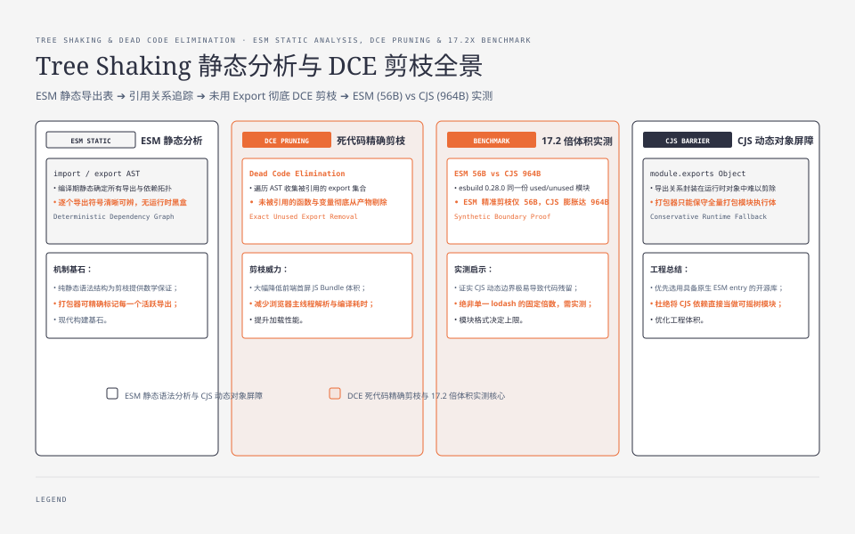
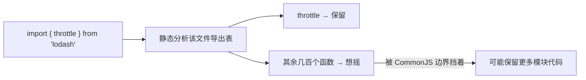
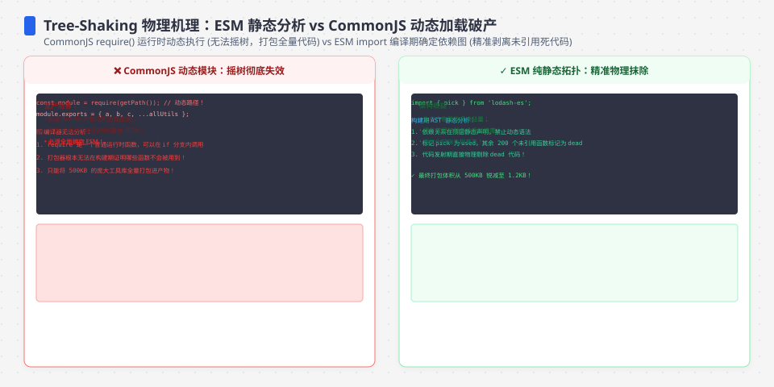
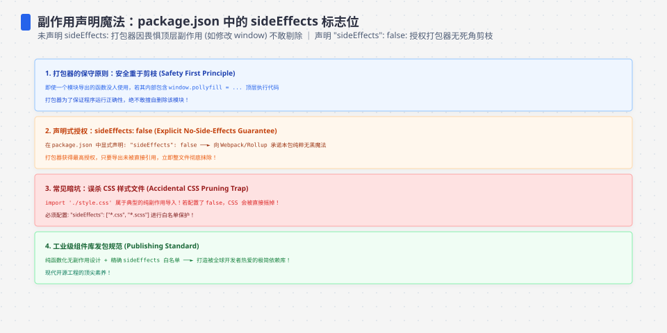

**TL;DR：** Tree Shaking（摇树）的前提是**模块边界和副作用都足够静态**：打包器需要知道哪个 export 被引用，也要知道删掉模块是否会改变执行结果。CJS、`sideEffects` 元数据和动态 `import()` 都可能破坏这个前提，但破坏方式不同，不能统称为“摇不动”。固定 esbuild 0.28.0、ESM/browser/ES2022/minify 的合成实验，把同一份 `used + five unused exports` 压成 **ESM 56B、CJS 964B**；这是边界示例，不是 lodash 在所有版本中的固定体积倍数。真正的优化顺序是先证明模块形状和副作用，再谈换库或拆包。


---



## 一、原理：摇树器到底在看什么

构建工具（webpack / rollup / esbuild）在编译期对每个模块做三件事：解析 ES 模块的导出表、收集"被引用的 export 名"、把没用到的函数按 DCE 剪掉。



问题在于 CJS 的 `module.exports = {}` 通常把导出关系藏在运行时对象里。打包器可以对部分 CJS 做启发式分析，但不能像 ESM 那样拥有稳定的逐 export 静态合同；因此常见结果是保留更多模块初始化和未使用代码。**“CJS 一定全量进包”过于绝对，正确说法是：CJS 让细粒度 Tree Shaking 失去静态保证，最终体积必须由目标 bundler 和版本实测。**




## 二、四个账

1. **从 CJS 拿进来（`import { x } from 'cjs-lib'`）**：模块导出对象通常要整体执行，bundler 只能保守处理。对策是优先选择有清晰 ESM entry、export map 和 side-effect 说明的包；文件级路径可能有效，但不能把“换一个 import 写法”当成所有库的保证。

2. **`sideEffects` 边界**：包在 `package.json` 声明 `"sideEffects": false`，是在承诺“未被引用的模块可以不执行”；也可以用数组保留 CSS、polyfill 等例外。缺失元数据不等于每个 export 都不能摇，错误声明 `false` 才是更危险的 bug：模块顶层注册、全局 patch 或样式导入可能被删掉。这个字段是语义合同，不是体积开关。

3. **动态 `import()` 路径拼接**：`import('./views/' + name + '.js')` 的候选集合需要由 bundler 推断；有的工具会生成 context chunk，有的直接拒绝，有的要求显式映射。它不必然“全量进一个包”，但会让分块边界和可删除 export 变得不透明。对有限路由使用字面量映射，才能把每个候选分块和加载失败语义写清楚。

4. **副作用被误删**：反之，`"sideEffects": false` 是打包器对你的承诺——若库在模块顶层偷偷干过事（打日志、写 window、垫 polyfill），它会被真删，bug 就从构建期混进你的应用。别为了脚本指标随便给库声明 false。

## 三、用锁定的合成模块把边界跑出来

```bash
cd experiments/ts-interface-schema
npm ci
node scripts/tree-shaking-boundary.mjs
```

仓库里的固定入口会得到：

```text
entry  raw_bytes
cjs    964
esm    56
```

这是合成库在 esbuild 0.28.0 下的 **17.2 倍**差异；它只证明 CJS 边界让未使用导出更难被删除，不证明真实 lodash、webpack 或 Rollup 都会得到同一个倍数。若文章要给真实库的体积结论，必须把库版本、entry、target、minify、压缩算法和 metafile 一起保存。




## 四、正确的调优顺序

真正有效的不是"多上怪招"，而是把 import 边界整理干净：

1. 先自查各自建包的 `sideEffects` 声明和真实顶层副作用；
2. 对目标依赖做固定版本、固定入口的 bundle 对照，再决定是否换成 ESM entry；不要把 `lodash`→`lodash-es` 这样的迁移当成无条件收益；
3. 把拼接式动态 `import()` 改成显式字面量映射，并单独验证初始包、异步 chunk 和失败路径。

## 五、诚实标注：体积是构建配置的函数

当前实验只覆盖 CJS 与 ESM 的静态入口，不覆盖真实 lodash、CSS side effect、dynamic import context、HTTP 缓存或 gzip/brotli。raw 结果绑定到 Node 24.19.0、esbuild 0.28.0 和当前 lockfile；换 bundler、target 或库版本都应重新运行，而不是沿用 17.2 倍。

## 六、结论：Tree Shaking 的上限是可证明的模块边界

摇树最容易发挥作用的前提是**静态、可证明安全的模块边界**：CJS 导入、含副作用的模块和动态路径都会削弱这个保证，但具体保留多少仍由 bundler 和配置决定。省体积的办法不是调一个“摇树开关”，而是**让每一条 import 都落在可静态分析的边界上，并把副作用声明当作合同维护**。摇树的极限，就是你的 import 口径。

下一步：先运行仓库实验，再对目标生产依赖建立同样的固定入口；记录 raw/minified/gzip/brotli、metafile 输入和副作用声明。**不管摇树多聪明，也只能删除它能证明安全的代码。**

## 参考资料
1. Webpack 官方指南：Tree Shaking—— https://webpack.js.org/guides/tree-shaking/
2. Webpack：`sideEffects` 字段—— https://webpack.js.org/guides/tree-shaking/#mark-the-file-as-side-effect-free
3. MDN：ES Modules—— https://developer.mozilla.org/en-US/docs/Web/JavaScript/Guide/Modules
4. esbuild：Tree shaking API—— https://esbuild.github.io/api/#tree-shaking
5. Rollup 官方文档：Tree-shaking—— https://rollupjs.org/javascript-api/#tree-shaking

实验入口：`experiments/ts-interface-schema/scripts/tree-shaking-boundary.mjs`；固定依赖、命令、环境和原始输出：`evidence/tree-shaking-comparison-costs/2026-08-16-local/`。

> 延伸阅读：模块系统为什么会卡在 CJS/ESM 的裂缝上，见[前端框架为什么这么乱](/writing/frontend-framework-history)；ESM 与渲染器的关系见[前端框架真正差在哪](/writing/frontend-framework-taxonomy)；JS 引擎如何解释与执行你 import 的代码，见[V8 加减法：一个 JS 引擎的五种包装](/writing/js-ecosystem-layers)。
