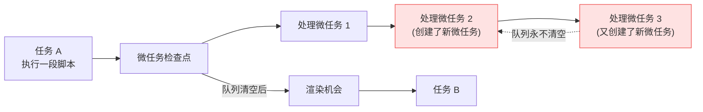
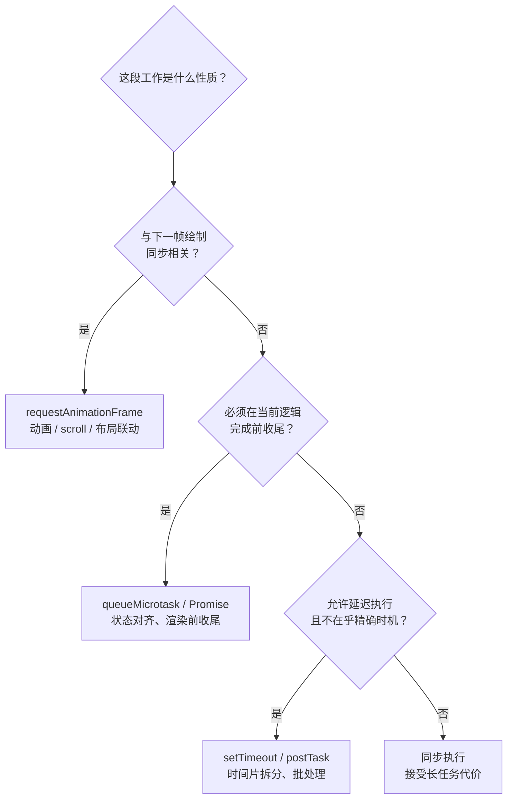

**TL;DR：**"事件循环"不是一个循环，是一套复合调度流程：每轮取**一个** 宏任务执行到栈空，然后进入**微任务检查点**（把微任务队列清到空），之后浏览器**可能** 渲染一帧，再回到下一轮。Promise 和 `queueMicrotask` 排进微任务队列、在渲染前清空；`requestAnimationFrame` 绑定渲染机会、`setTimeout(fn, 0)` 只保证"至少等 0ms"；主线程的总时长由长任务和微任务风暴决定，不是由"循环"决定。

## 一、为什么"循环"这个比喻会误导

我们常用"一条不断取任务的循环"解释事件循环。这个比喻适合入门，却掩盖了真正重要的细节：浏览器同时协调**任务队列**、**微任务检查点**、**渲染机会** 和多个**执行环境**。窗口与 iframe 是否共享同一个 event loop，取决于它们所在的 agent/agent cluster；worker 通常有自己的事件循环。更上层的进程级调度属于浏览器实现，不应直接当成 HTML 规范的事件循环合同。

先看一个经典的输出顺序谜题：

```js
console.log("A");

setTimeout(() => console.log("B"));
queueMicrotask(() => console.log("C"));

Promise.resolve().then(() => console.log("D"));

console.log("E");
// A, E, C, D, B
```

把"循环"当队列模型，解释不了为什么 `B`（最先注册）排在最后；把"循环"当真实调度，也解释不了为什么 `C`、`D` 在 `B` 之前。真正的模型是一轮里嵌套了多个阶段，每阶段的顺序才是决定输出的东西：


*图注：一轮事件循环不是"取一个任务再取一个"，而是任务 → 清空微任务 → 可选渲染的三段式；渲染这一步可能连续跳过好几轮。*

## 二、规范解剖：HTML 规范怎么定义事件循环

上面的模型图是概括，WHATWG HTML Living Standard 对事件循环的定义（§8.1.7，https://html.spec.whatwg.org/multipage/webappapis.html#event-loop-processing-model）要精确得多。先看它怎么定义任务队列：

> "An event loop has one or more task queues. A task queue is a set of tasks. Task queues are sets, not queues, because the event loop processing model grabs the first runnable task from the chosen queue, instead of dequeuing the first task. **The microtask queue is not a task queue.**"

三个字面细节都对应实际行为：

1. **"集合"而不是"队列"**：处理模型从选中的队列里"抓取第一个可运行任务"（grab the first runnable task），而不是机械地"出队第一个任务"——队列里还没到期的定时器是"不可运行"的，会被跳过，不会卡住后面已就绪的任务。
2. **微任务队列不是任务队列**：规范单独把它划出来——任务队列的选择过程永远选不中微任务队列，微任务只能通过检查点执行。后文"宏任务/微任务"的整个二分，依据就是这一句。
3. **选哪个队列由实现决定**："chosen in an implementation-defined manner"——浏览器内部给不同 task source 排优先级、是否聚合并行执行定时器，都属于实现细节；规范只约束顺序语义，不约束策略。

每一轮 processing model 的核心步骤，规范原文：

> "1. Let oldestTask and taskStartTime be null. 2. If the event loop has a task queue with at least one runnable task: (1) Let taskQueue be one such task queue, chosen in an implementation-defined manner... (4) Perform oldestTask's steps. ... (6) **Perform a microtask checkpoint.**"

注意第 (6) 步：微任务检查点是任务执行完之后、本轮事件循环结束之前的**强制收尾**，不需要任何渲染或空闲条件——这正是"Promise 一定先于下一个宏任务"的规范依据。检查点之后，规范继续定义两件事：**report long tasks**——把"任务 + 微任务检查点"的合并时长上报给 Long Tasks API（这就是第四节「后果二」那句"长任务时长包含微任务执行时间"的规范出处）；以及 window 事件循环在并行步骤里 "queue a global task on the rendering task source... to update the rendering"——**渲染本身也是一个任务**，挂在独立的 rendering task source 上。

而渲染任务要执行，得先通过 update the rendering 的两道过滤：

> "Filter non-renderable documents... Unnecessary rendering: Remove from docs any Document object doc for which... the user agent believes that updating the rendering of doc's node navigable would have no visible effect; and doc's map of animation frame callbacks is empty."

> "A navigable has a rendering opportunity if the user agent is currently able to present the contents of the navigable... accounting for hardware refresh rate constraints and user agent throttling..."

两道过滤解释了规范层面"渲染可以跳过"的全部理由：**渲染合并**——更新没有可见效果（且没有动画帧回调）时直接跳过，所以连续修改 DOM 只触发一次绘制；**后台标签页节流**——不可见页面的 rendering opportunity 由浏览器节流策略放行。渲染不是事件循环每轮"顺带做"的事，而是一个排队等待机会的独立任务——帧率从来不是事件循环保证的。

微任务检查点（perform a microtask checkpoint）本身也是一份完整的小流程：

> "1. If the event loop's performing a microtask checkpoint is true, then return. ... 3. While the event loop's microtask queue is not empty: ... run oldestMicrotask ... 4. notify about rejected promises ... 6. Perform ClearKeptObjects()."

第 1 步的 performing a microtask checkpoint 是防重入布尔标志：检查点执行中再次触发检查点会直接 return，绝不嵌套；第 4 步把"被拒绝但尚未处理的 Promise"汇报为 unhandledrejection 事件；第 6 步 ClearKeptObjects 清空 WeakRef 的 KeepDuringJob 集合，让本任务周期内被引用过的对象可以在后续周期被回收——检查点不只是"跑微任务"，还是任务边界的完整收尾。

浏览器可运行复现：打开 experiments/microtask/index.html，点按钮触发 100 万次微任务风暴，观察 Long Task 报告。

## 三、任务队列：宏任务的来源与规则

宏任务（task）是事件循环的基本工作单元。每轮事件循环从任务队列里**只取一个** 任务执行，执行期间产生的微任务先排队、不立即运行。常见来源：

| 来源 | 触发方式 | 优先级特点 |
| :--- | :--- | :--- |
| 脚本执行 | `<script>`、`eval` | 队列首个 |
| 定时器 | `setTimeout` / `setInterval` | 按到期时间入队，到期前不插队 |
| 事件回调 | 点击、键盘、`fetch` 完成 | 按事件触发顺序 |
| 消息投递 | `postMessage`、BroadcastChannel | 跨环境传递 |
| IO 回调 | XHR、fetch 解析 | 随网络栈通知 |

关键规则：**一轮一个任务**。即使队列里堆了 100 个定时器，一轮也只执行最早到期的那一个，执行完先走微任务检查点，再考虑渲染。这也意味着 `setTimeout(fn, 0)` 的真实语义是"**至少** 0ms 后入队"，而不是"立刻执行"——它要等当前任务结束、微任务清空、甚至渲染完成后的某一轮才轮到。

## 四、微任务检查点：真正的顺序开关

微任务（microtask）的来源比宏任务少得多：Promise 的 reaction（`.then`/`.catch`/`await` 的续体）、`queueMicrotask`、MutationObserver 回调。它们的执行时机是**检查点**：当前 JS 调用栈退出后（任务结束、或任务内每段脚本执行完），运行时会检查微任务队列并**清空到空**，包括清空过程中新产生的微任务：

```js
queueMicrotask(() => {
  console.log("m1");
  queueMicrotask(() => console.log("m2")); // 检查点内继续追加
});
queueMicrotask(() => console.log("m3"));

// m1, m3, m2 —— 清空过程是"排队"，不是"只跑一批"
```

这条规则有两个直接后果。

**后果一：Promise 一定在下一个宏任务之前。** 只要微任务队列没空，浏览器就不会取下一个宏任务，也不会渲染。所以 `Promise.resolve().then(...)` 总是先于 `setTimeout(..., 0)`，无论注册先后。

**后果二：微任务可以饿死渲染和输入。** 如果微任务不断创建新微任务，检查点就永远清不完，浏览器没有机会处理点击、绘制页面、执行下一个任务。这种"微任务风暴"很隐蔽：它不占宏任务队列，表现只是"页面像冻住一样"。但长任务的判定按规范计入微任务执行时间——HTML 规范把任务结束时的微任务检查点算进任务时长，因此微任务风暴产生的那次超长执行会被 Long Tasks API 以超过 50ms 的长任务形式报告给 PerformanceObserver，Performance 面板里依然能找到这条元凶：

```js
// 微任务风暴的可复现示例——整段粘贴到浏览器 console 运行：
// 1. 先挂长任务监听（必须在风暴开始之前）：
const obs = new PerformanceObserver((list) => {
  for (const e of list.getEntries()) {
    console.log("Long Task:", e.duration.toFixed(1) + "ms");
  }
});
obs.observe({ type: "longtask" });

// 2. 运行风暴：每次微任务完成都再追加一个，队列永远清不完
let n = 0;
function storm() {
  n += 1;
  if (n < 100_000) queueMicrotask(storm); // 递归 10 万次
}
storm();

// 观察：页面"冻住"一两秒，期间渲染与点击都排不上；
// 之后 console 报出一条远超 50ms 的 Long Task——按规范，
// 任务时长的终点是微任务检查点清空的那一刻。
```



**后果三（对应实践）**：微任务适合"当前逻辑必须赶在下一次渲染前完成"的收尾，比如同步状态对齐；不适合做异步批处理或时间片拆分——那是 `setTimeout` 或 `scheduler.postTask` 的领域。

**一个常见的误解：「微任务比任务'快'」。** 检查点确实在每轮任务结束后立即执行，但"立即"不等于"有限"：清空过程中微任务还能追加新微任务，检查点因此可能永远清不完——微任务风暴会把渲染无限期推迟，页面表现为"冻住"而不是"慢"。规范只提供了 performing a microtask checkpoint 布尔标志（见第二节的检查点步骤）防重入，并没有"微任务总数上限"：一轮检查点跑多少个微任务，完全由脚本自己决定。风暴不会自我终止，只有脚本停止追加、控制权回到任务队列之后才结束——"微任务快"只在队列能清空的条件下成立，一旦清不空，它比任何东西都慢。

## 五、渲染机会：主线程把时间还给浏览器

渲染不是每轮必做。浏览器把"是否渲染"当成一个可以跳过的机会，决策依据是刷新率（通常 60Hz，即每帧约 16.7ms）、页面可见性、以及主线程是否还有空闲。两个 API 对应两条不同的时间线：

| API | 时机 | 语义 |
| :--- | :--- | :--- |
| `setTimeout(fn, 0)` | 下一轮任务 | 快慢取决于队列拥挤度，与帧无关 |
| `requestAnimationFrame` | 本次渲染前 | 与帧同步，回调在布局/绘制之前执行 |
| `queueMicrotask` | 当前任务结束后 | 当前检查点内，渲染之前 |
| `scheduler.postTask` | 浏览器调度器 | 可设优先级，可被节流 |

把 `setTimeout(fn, 0)` 理解成"下一帧"是常见误区：它入队的是任务队列，而渲染发生在检查点之后、下一任务之前，两者之间隔着微任务队列和不定数量的渲染轮次。需要与绘制同步（动画、scroll 联动、布局读取）时，`requestAnimationFrame` 才表达了正确意图。

帧预算的账是这样算的：60Hz 下每帧 16.7ms，其中布局、绘制、合成占掉一部分，留给 JS 的实际预算常不足 10ms。一段超过 50ms 的任务叫 Long Task，它会让这一帧超时，渲染被推迟，用户看到的就是掉帧或输入延迟——Chrome 的 Performance 面板里长任务标红，就是这个原因。所以"优化事件循环"的大头不是减少任务数量，而是**让每个任务变短**：长任务拆成可让出主线程的分片，动画工作交给 `requestAnimationFrame`，能并行计算的交给 Worker。

## 六、渲染管道：从样式到像素

渲染机会只是"允许渲染"。一帧真正上屏，主线程还要走完一条依赖链：**样式计算（style）→ 布局（layout）→ 绘制（paint）→ 合成（composite）**。输入变了，后面的阶段都要重算；现代浏览器用逐级缓存跳过无关阶段——只改 `transform` 的动画全程走合成、不碰布局与绘制，`width` 一变就得从 layout 重来。从事件循环的视角看，关键是**阶段切换发生在哪个任务里**。

Performance 面板的时间轴把这条链画了出来：`Layout` 是紫色条、`Paint` 是绿色条、长任务标红。一个常见的排查入口是**强制同步布局（forced synchronous layout）**：脚本改了样式、但浏览器还没排到布局任务时读取布局信息（`offsetWidth`、`getBoundingClientRect()`），浏览器被迫中断当前脚本、立刻同步做一次布局，把本应属于下一帧的布局成本塞进当前任务。读一次做一次，布局次数不是"一帧一次"，而是"读几次算几次"：

```js
// 布局抖动：循环里交替"写样式 → 读布局"，每次读都触发一次强制同步布局
const items = document.querySelectorAll(".item");
for (const item of items) {
  item.style.width = Math.floor(Math.random() * 100) + "px"; // 写：只改样式，尚未布局
  item.offsetWidth; // 读：强制同步布局，把上一行写的样式立刻结算
}
// 修复方向：先批量写完所有样式，再统一读；或把"写循环"与"读循环"分开
```

代码里跑了多少次读，面板里就有多少条 Layout。所以排查"脚本不重却掉帧"时先数 Layout 条：数量远大于帧数，就是强制同步布局在作祟——它没有让"循环"变慢，而是把本可合并成一帧一次的布局拆散塞进一个个任务里，顺手把每个任务都拖成了长任务。

## 七、响应性指标：从 Long Task 到 INP

长任务是"坏"的原始信号，但用户感受到的是"点下去没反应"。2024 年 3 月，INP（Interaction to Next Paint，交互到下一次绘制）正式取代 FID 成为 Core Web Vitals 之一，衡量的就是这件事：**每一次** 交互（点击、按键、触控）从发生到下一帧绘制的耗时，取页面生命周期内的第 75 百分位评分——≤200ms 为良好，>500ms 为不佳。

FID 被取代的原因很直接：它只统计**首次** 交互，而且只测**输入延迟**（输入到回调开始执行的时间差），回调本身跑多久完全不计。于是一个事件回调执行 400ms 的页面，FID 照样漂亮。INP 则把一次交互拆成三段，每一段都能对应到事件循环的某个机制：

1. **输入延迟（input delay）**：输入到回调开始——主线程正被长任务占住时，这一段就是那条长任务的剩余时间；
2. **处理时间（processing time）**：回调执行本身、含它触发的微任务检查点——微任务风暴在这里原形毕露；
3. **呈现延迟（presentation delay）**：回调结束到画面更新——结束得太晚、正好错过渲染机会时，这段就是多等的 16.7ms。

三段对应三种修法：延迟高修调度，处理时间长修拆分与去重，呈现延迟高修渲染时机。Long Tasks API 提供长任务的时长与**归因（attribution）** 数据，把"页面卡"缩小到"哪个容器里的哪段脚本卡"：

```js
// 监听长任务与归因；监听器必须在问题发生前挂上
const obs = new PerformanceObserver((list) => {
  for (const entry of list.getEntries()) {
    console.log("长任务:", entry.duration.toFixed(1) + "ms", "开始于", entry.startTime.toFixed(1) + "ms");
    if (entry.attribution.length) {
      const a = entry.attribution[0];
      console.log("归因:", a.containerType, a.containerName || a.containerId || a.containerSrc);
    }
  }
});
obs.observe({ type: "longtask", buffered: true });
```

`entry.attribution` 为空代表归因不可得（常见于主文档自身的任务），此时回到 Performance 面板看时间轴。归因 + 面板的组合，基本能把一段变差的 INP 定位到具体的任务与容器。

## 八、后台节流：不可见页面的另一套时间

第二节提到"后台标签页节流"是 rendering opportunity 的放行条件，这里展开它：浏览器对**不可见** 标签页应用另一套、更严格的调度。`requestAnimationFrame` 直接停发（没有可见效果就没有渲染机会），定时器被逐级压榨——"`setTimeout` 至少等 0ms"里的"至少"，在这里被放大到了分钟级。

Chromium 的节流是阶梯式的（Chrome 88 起）：

| 阶段 | 条件 | 定时器检查频率 |
| :--- | :--- | :--- |
| 普通节流 | 页面隐藏（且未达重度条件） | 每秒 1 次 |
| 重度节流（intensive throttling） | 隐藏超 5 分钟 且 链式 `setTimeout` 深度 ≥5 且 静默 ≥30 秒 且无 WebRTC | 每分钟 1 次 |

判断标准是**链式深度**：递归 `setTimeout` 叠到 5 层以上，就被认定为"轮询/倒计时/动画"这类该停摆的工作。这是把手术刀：后台轮询从每秒 1 次掉到每分钟 1 次，省下的是真实 CPU 与电量；代价是依赖后台定时器的心跳、埋点、倒计时全部失真——微软 SignalR 的心跳断连就是真实翻车案例（Chromium issue 40172541）。

**一个常见的误解：「页面切到后台，我的代码就不跑了」。** JS 还在跑，只是定时器唤醒被节流到分钟级。区分两者的实践是 `visibilitychange` + 时间戳：倒计时不要数回调次数，只信 `Date.now()`——被节流后回调里的时间戳会突然跳一大截，那正是校准点：

```js
// 后台节流下的倒计时校准：不数回调次数，只信时间戳
const deadline = Date.now() + 60_000;
function tick() {
  const remain = Math.max(0, deadline - Date.now());
  renderCountdown(remain);
  if (remain > 0) setTimeout(tick, 1000); // 后台 5 分钟后：这行每分钟才执行一次
}
document.addEventListener("visibilitychange", () => {
  if (!document.hidden) tick(); // 回到前台立即校准，抹平被节流吞掉的时间
});
setTimeout(tick, 1000);
```

## 九、让出主线程：时间片、postTask 与 isInputPending

把长任务变短只有两条路：**让每段工作变小**（拆分），**让出主线程**（把控制权交还浏览器）；第三条是**移出主线程**——计算型负载交给 Web Worker，主线程只做 DOM 与编排，这不在事件循环的管辖范围内，这里不展开。

**时间片拆分** 是最古老也最可靠的手段：

```js
// 把 10 万条记录的处理拆成 50 个时间片，每片之间让出一轮事件循环
const data = Array.from({ length: 100_000 }, (_, i) => i);
const CHUNK = 2000;
let index = 0;
function processSlice() {
  const end = Math.min(index + CHUNK, data.length);
  for (; index < end; index++) {
    data[index] = data[index] * 2; // 模拟处理
  }
  if (index < data.length) {
    setTimeout(processSlice, 0); // 让出一轮：渲染机会可能插进来
  } else {
    console.log("完成", index);
  }
}
processSlice();
```

缺点也明显：片大小是拍脑袋定的——太大依然制造长任务，太小则每片都要过一遍定时器入队开销。

**scheduler.postTask**（Chrome 94+）把"让出"升级成"按优先级排队"。它入队到浏览器调度器自己的任务源，而不是定时器队列，于是多出一个 `setTimeout` 没有的维度：**优先级**。

- 三个级别：`user-blocking`（用户阻塞，如渲染关键工作）、`user-visible`（默认）、`background`（可延迟）；
- `TaskController` 能在任务**排队之后** 动态改优先级，还能用 `AbortSignal` 取消尚未执行的任务：

```js
// postTask：排队之后还能改优先级、能取消
const controller = new TaskController("background");
scheduler.postTask(heavyWork, { signal: controller.signal });
// 用户点开了相关面板，把还没开始的任务提到前台：
controller.setPriority("user-blocking");
// 或者后悔了，直接取消：
controller.abort();
```

在事件循环里，postTask 任务与定时器任务一样"一轮一个"，区别在调度策略：调度器可以按优先级插队、按后台节流规则压级，`setTimeout` 只有"到期时间"一个维度。

**isInputPending** 则是反过来的思路：不问"我该不该让"，直接问浏览器"现在有没有输入在排队"。有就让出，没有就继续干活，把"让出"从固定节奏变成按需：

```js
// 每处理一段就检查一次：有输入在排队就主动让出一轮
async function processWithYields() {
  while (index < data.length) {
    const end = Math.min(index + CHUNK, data.length);
    for (; index < end; index++) {
      data[index] = data[index] * 2;
    }
    if (navigator.scheduling?.isInputPending()) {
      await new Promise((resolve) => setTimeout(resolve, 0));
    }
  }
}
```

有两个现实要认清：其一，它只在 Chrome/Edge 87+ 可用，Firefox 与 Safari 至今不支持；其二，MDN 已把它标为 Experimental，并明确建议改用 Scheduler 接口上的 `yield()`，web.dev 甚至直接写了"Don't use `isInputPending()`"——所以生产代码优先考虑 postTask 与时间片，isInputPending 顶多作为渐进增强。

## 十、跨环境协调：窗口之间也有调度

浏览器里“事件循环”不是一个全局单例。窗口和 iframe 可能因为属于同一个 agent cluster 而共享事件循环，worker 通常拥有自己的事件循环；它们之间通过消息任务通信。`postMessage` 在窗口间投递的消息会进入目标环境的任务队列，同一发送方到同一目标的消息顺序应保持，但它们仍可能与其他 task source 的任务交错。它适合把工作移到目标环境的后续任务，也适合跨 iframe 传数据，但不能承诺“下一轮一定先执行”。

理解这一层的价值在排查跨窗口联动卡顿时：如果父窗口和子 iframe 共享渲染器或相关 agent，父窗口的长任务可能推迟子内容的渲染机会；具体是否共享事件循环、渲染调度和进程资源要用目标浏览器的 Performance trace 验证。单独测量子页面指标都正常、合在一起却掉帧，问题可能在共享调度资源，而不是某个 iframe 自己的任务队列。

```js
// iframe 场景：父页面连续投递三条消息，子页面按任务队列顺序逐个接收
// 子 iframe 端：
window.addEventListener("message", (e) => console.log("收到:", e.data));
// 父页面端：
iframe.contentWindow.postMessage("m1", "*");
iframe.contentWindow.postMessage("m2", "*");
iframe.contentWindow.postMessage("m3", "*");
// 同一发送方到同一目标的消息保持相对顺序；
// 但它们可能与目标队列中的其他任务交错，长任务也会延迟后续消息。
```

## 十一、用时间线而不是口诀

排查顺序问题时，画出当前调用栈、任务、微任务和渲染机会，通常比背诵输出顺序更可靠。模型越接近真实调度，越能解释性能问题。一套顺手的手工流程：

1. 在疑似问题处打点：`console.log` 标记宏任务边界、`queueMicrotask(() => console.log("mt"))` 标记微任务边界；
2. 用 Chrome Performance 录制，确认哪些回调在微任务检查点内、哪些在任务里；
3. 检查有没有长任务（>50ms）和微任务风暴——前者用拆分解决，后者几乎总是 `Promise` 链或 observer 回调里无限追加导致的；
4. 涉及动画或滚动，确认 `requestAnimationFrame` 里没有读取布局与绘制分离的坏味道（强制同步布局）。



> 异步 API 不等于并行，也不天然等于流畅。决定体验的是每段工作占用主线程的时长，以及它把控制权交还给浏览器的时机——事件循环只是这些时机的调度表，不是性能的替罪羊。

## 参考资料

1. HTML Living Standard：Event Loops（任务、微任务检查点与渲染时机的权威定义）—— https://html.spec.whatwg.org/multipage/webappapis.html#event-loops
2. MDN：Concurrency model and the event loop —— https://developer.mozilla.org/en-US/docs/Web/JavaScript/Event_loop
3. MDN：queueMicrotask —— https://developer.mozilla.org/en-US/docs/Web/API/queueMicrotask
4. MDN：requestAnimationFrame —— https://developer.mozilla.org/en-US/docs/Web/API/window/requestAnimationFrame
5. Jake Archibald：In the loop（事件循环可视化与微任务检查点的经典讲解）—— https://www.youtube.com/watch?v=cCOL7MC4Pl0
6. Chrome 开发者文档：Long Tasks API 与 INP —— https://web.dev/articles/inp
7. W3C Long Tasks API：长任务定义与 50ms 阈值，任务时长涵盖随后的微任务检查点 —— https://w3c.github.io/longtasks/
8. WHATWG HTML Living Standard：§8.1.7 Event Loop Processing Model（任务队列"集合"定义、processing model 逐条步骤、微任务检查点与渲染过滤原文）—— https://html.spec.whatwg.org/multipage/webappapis.html#event-loop-processing-model
9. Chrome for Developers：Heavy throttling of chained JS timers beginning in Chrome 88（普通节流每秒 1 次、重度节流每分钟 1 次的四个条件）—— https://developer.chrome.com/blog/timer-throttling-in-chrome-88/
10. Chromestatus：Intensive throttling of Javascript timer wake ups —— https://chromestatus.com/feature/4718288976216064
11. Chromium issue 40172541：Chrome 88 定时器节流导致 SignalR 心跳断连的真实案例 —— https://issues.chromium.org/issues/40172541
12. MDN：Page Visibility API（visibilitychange 与 document.hidden） —— https://developer.mozilla.org/en-US/docs/Web/API/Page_Visibility_API
13. MDN：Prioritized Task Scheduling API（scheduler.postTask、TaskController、三级优先级） —— https://developer.mozilla.org/en-US/docs/Web/API/Prioritized_Task_Scheduling_API
14. Chromestatus：scheduler.postTask —— https://chromestatus.com/feature/6031161734201344
15. MDN：Scheduling: isInputPending()（Experimental，已建议改用 Scheduler.yield） —— https://developer.mozilla.org/en-US/docs/Web/API/Scheduling/isInputPending
16. web.dev：Optimize long tasks —— https://web.dev/articles/optimize-long-tasks

> 延伸阅读：主线程被占满时，"让出控制权"的底层代价是调度切换——进程、线程与 Go 协程三级切换的物理开销差异，见[从晶体管到 Go 协程：图解 Linux 上下文切换的物理本质与硬核源码](/writing/understanding-context-switching-from-cpu-to-goroutines)。
