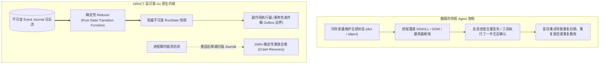
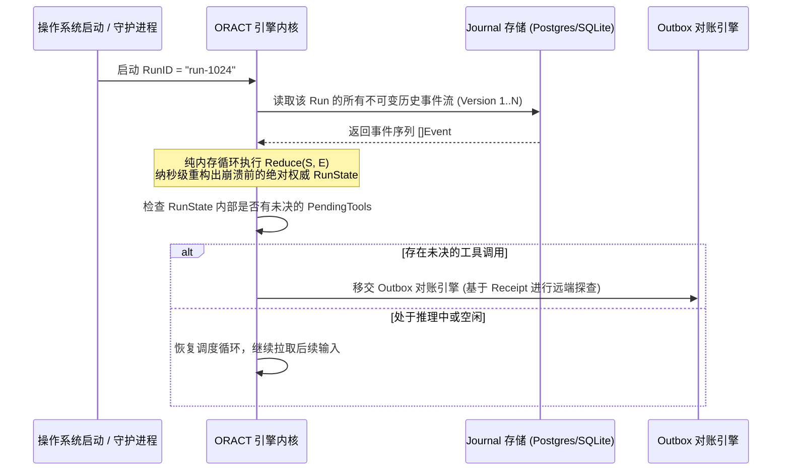

**TL;DR：** 业界主流的 Agent 框架往往诞生于 Python / TypeScript 生态，侧重于快速对接模型 API 和交互原型演示，但在面对系统崩溃、网络分区、长任务超时与高并发竞态时显得脆弱不堪。由 Go 语言构建的 **ORACT（Observe → Reason → Act）** 确立了一条硬核设计公理：**“模型可以是不确定的，但执行其决策的系统必须是确定可靠的（Models may be nondeterministic, but the system executing their decisions must be reliable）”**。ORACT 借鉴了数据库事务引擎与分布式状态机的设计精髓，基于不可变 Event Journal、确定性 Reducer 纯函数状态转移与崩溃即时自愈（Crash Recovery），为企业级严肃业务 Agent 奠定了高可靠执行底座。

---

## 一、为什么传统 Agent 在生产环境中“一碰就碎”？

在将 Agent 投入金融风控、自动化运维、数据库迁移等严肃工业场景时，传统基于内存易变状态的 Agent 架构通常会暴露出致命短板：



### 1.1 传统设计的四大可靠性危机

1. **状态易变与不可审计**：上下文全部以普通变量保存在内存堆中，一旦进程重启，任务进度彻底化为乌有；
2. **副作用重试灾难**：当模型提议发起“给用户退款 ¥10,000”或“DROP TABLE”的工具调用时，若网络中途超时，简单的盲目重试会引发灾难性的重复扣款与数据污染；
3. **隐式竞态与脑裂**：多节点并发执行同一任务时，缺乏分布式租约与纪元保护，造成后到的延迟写入覆盖先到的正确状态；
4. **测试无法确定性回归**：测试用例直接依赖外部模型 API，网络抖动或提示词微小变动导致 CI 频繁 Flaky 误报。

ORACT 的核心使命，就是用 Go 语言的系统级严谨性彻底解决这些工程隐患。

---

## 二、核心抽象：Run 状态机与确定性 Reducer

在 ORACT 体系中，一次 Agent 任务生命周期被抽象为一个 **Run**。Run 的状态演进严格遵循 **Event Sourcing + Reducer** 的数学形式。

### 2.1 状态转移的纯函数公理

$$S_{t+1} = \text{Reduce}(S_t, E)$$

- $S_t$：当前时刻的权威状态（`RunState`）；
- $E$：不可变事件（`Event`，如 `EventTurnStarted`, `EventToolProposed`, `EventToolFinished`）；
- $\text{Reduce}$：**绝对纯函数（Pure Function）**，禁止包含任何网络 I/O、磁盘写或系统时钟调用。

### 2.2 Go 语言状态转移内核源码拆解

```go
// runtime/core/reducer.go
package core

import "errors"

var (
    ErrInvalidStateTransition = errors.New("invalid state transition")
    ErrDuplicateToolInvocation = errors.New("duplicate tool invocation in turn")
)

type RunStatus string

const (
    StatusCreated    RunStatus = "CREATED"
    StatusReasoning  RunStatus = "REASONING"
    StatusExecuting  RunStatus = "EXECUTING"
    StatusSuspended  RunStatus = "SUSPENDED"
    StatusCompleted  RunStatus = "COMPLETED"
    StatusFailed     RunStatus = "FAILED"
)

type ToolInvocation struct {
    ID         string         `json:"id"`
    ToolName   string         `json:"tool_name"`
    Arguments  map[string]any `json:"arguments"`
    ProposedAt int64          `json:"proposed_at"`
}

type RunState struct {
    RunID        string                    `json:"run_id"`
    Version      int64                     `json:"version"`
    Status       RunStatus                 `json:"status"`
    TurnIndex    int                       `json:"turn_index"`
    PendingTools map[string]ToolInvocation `json:"pending_tools"`
    Variables    map[string]any            `json:"variables"`
}

// Reduce 必须保持 100% 确定性：相同输入永远产生完全相同的状态切片
func Reduce(state RunState, event Event) (RunState, error) {
    next := state.clone()
    next.Version++

    switch e := event.(type) {
    case *EventTurnStarted:
        if state.Status != StatusCreated && state.Status != StatusSuspended {
            return state, ErrInvalidStateTransition
        }
        next.Status = StatusReasoning
        next.TurnIndex++

    case *EventToolProposed:
        if state.Status != StatusReasoning {
            return state, ErrInvalidStateTransition
        }
        if _, exists := next.PendingTools[e.Invocation.ID]; exists {
            return state, ErrDuplicateToolInvocation
        }
        next.Status = StatusExecuting
        next.PendingTools[e.Invocation.ID] = e.Invocation

    case *EventToolFinished:
        if _, exists := next.PendingTools[e.InvocationID]; !exists {
            return state, ErrInvalidStateTransition
        }
        delete(next.PendingTools, e.InvocationID)
        // 当本轮所有并行工具均已执行完毕，状态机切回推理态
        if len(next.PendingTools) == 0 {
            next.Status = StatusReasoning
        }

    case *EventRunCompleted:
        next.Status = StatusCompleted

    case *EventRunFailed:
        next.Status = StatusFailed
    }

    return next, nil
}
```

---

## 三、不可变 Event Journal：崩溃自愈的唯一事实源

ORACT 抛弃了传统 CRUD 数据表设计，使用**不可变事件日志（Append-Only Journal）**作为持久化底座。

### 3.1 崩溃恢复算法 (Crash Recovery)

当 ORACT 运行节点遭遇断电或被系统 OOM 重启时，恢复引擎只需要两步即可 100% 确定性自愈：



这种架构赋予了系统两大物理级优势：
1. **0 数据损坏风险**：历史数据只增不删，数据库写入只有高效的追加，完全消除了死锁与并发更新冲突；
2. **绝对可复现性**：排查生产事故时，只需将用户的 Journal 导出并在测试机运行，便能以纳秒级精度复现当时的每一个细微决策。

---

## 四、为什么选用 Go？系统级并发与内存掌控

与 Python 和 Node.js 相比，Go 语言在构建工业级 Agent 运行时上展现出无与伦比的工程优势：

| 架构维度 | Python (LangChain / AutoGen) | Node.js (Pi Agent / DSH) | Go (ORACT) |
|---|---|---|---|
| **并发调度内核** | 依赖 `asyncio` 单事件循环，受 GIL 限制，CPU 计算易阻塞 | 单主线程 Event Loop + libuv，依赖 Promise 微任务 | **GMP M:N 原生协程调度**，带系统线程抢占，I/O 与计算无缝兼顾 |
| **内存与启动开销** | 解释器笨重，基础内存占用高 (200MB+) | V8 引擎堆内存开销中等 (100MB+) | **单静态二进制文件**，极低内存占用 (<20MB)，纳秒级冷启动 |
| **系统调用与沙箱** | 依赖第三方 C 动态库，跨平台胶水繁琐 | 依赖 node-gyp 原生模块编译 | **标准库原生提供 `syscall`、`os/exec`**，直接操作 Linux Namespaces |
| **链路取消与超时** | `asyncio.Task.cancel` 易抛出未捕获异常 | `AbortController` 需显式成对注销监听 | **`context.Context` 树状级联传递**，工业级标准范式 |

---

## 五、架构启示与工程收获

1. **不可变性是工程复杂度的解药**：把可变的状态更新降解为不可变的事件追加，系统的并发竞争与数据丢失风险直接下降一个数量级；
2. **状态转移与副作用必须物理隔离**：确定性状态计算（Reducer）属于纯计算，网络请求与文件修改属于副作用，二者混杂是 Agent 脆弱的根源；
3. **敬畏崩溃，把恢复当作日常**：不要假设系统永远不宕机；设计 Agent 系统的首要任务，是确保在任意一行代码处断电，重启后都能安全幂等接续。

---

## 六、参考资料与延伸阅读

1. [ORACT: Observable, Recoverable, and Model-Agnostic Agent Runtime (GitHub)](https://github.com/MoreConsequence/oract)
2. [Event Sourcing Pattern (Martin Fowler)](https://martinfowler.com/eaaDev/EventSourcing.html)
3. [Go Concurrency Patterns: Context and Cancellation](https://go.dev/blog/context)
