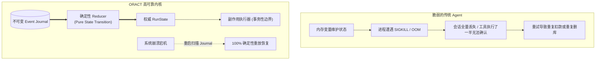
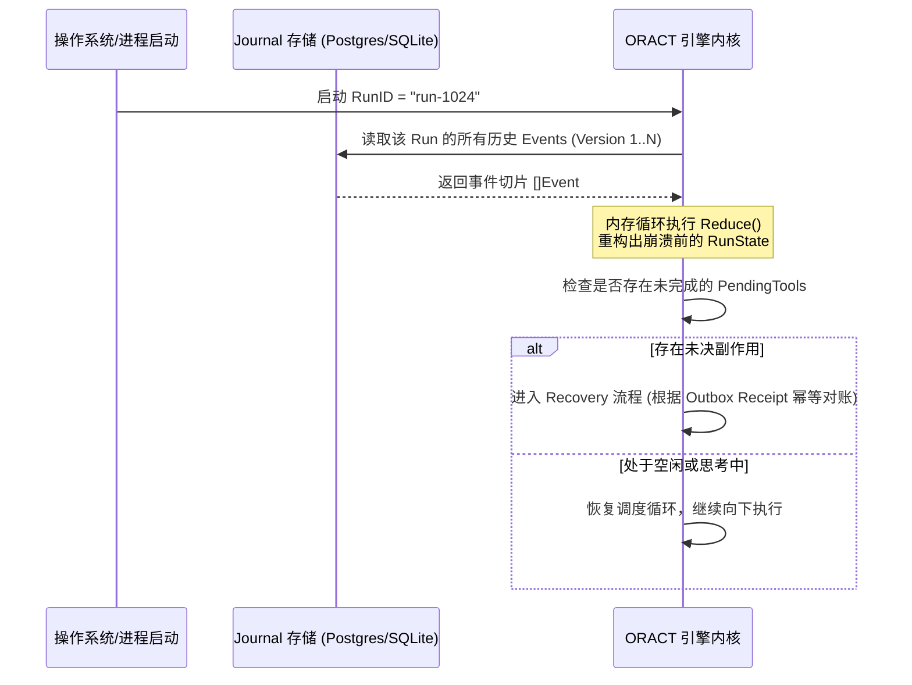

**TL;DR：** 业界主流的 Agent 框架往往诞生于 Python / TypeScript 生态，侧重于快速对接模型 API 和原型演示，但在面对系统崩溃、网络分区、工具超时与并发竞态时显得脆弱不堪。由 Go 语言构建的 **ORACT（Observe → Reason → Act）** 确立了一条硬核设计公理：**“模型可以是不确定的，但执行其决策的系统必须是确定可靠的（Models may be nondeterministic, but the system executing their decisions must be reliable）”**。ORACT 借鉴了数据库事务引擎与分布式状态机的设计精髓，基于不可变 Event Journal、确定性 Reducer 状态转移与崩溃即时恢复（Crash Recovery），为企业级 Agent 奠定了高可靠执行底座。

---

## 一、为什么传统 Agent 在生产环境中“一碰就碎”？

在将 Agent 投入严肃工业场景（如金融分析、数据库运维、基础设施编排）时，开发者会面临以下残酷现实：



1. **状态易变与进程脆弱性**：大部分框架将上下文保存在 Python/Node.js 运行时的普通变量中，一旦服务器断电、容器重启或 OOM，任务执行到哪一步彻底无法考证；
2. **副作用重试灾难**：当模型发起“转账 $10,000”或“DROP TABLE”的工具调用时，若网络中途超时，简单的重试会导致严重的重复扣款与数据污染；
3. **不可审计性**：当 Agent 给出错误决策时，开发团队无法从日志中 100% 还原当时的每一步观察、决策与执行细节。

ORACT 的核心目标，就是用 Go 语言的系统级严谨性彻底解决这些可靠性顽疾。

---

## 二、核心抽象：Run 状态机与确定性 Reducer

在 ORACT 中，一次 Agent 任务被抽象为一个 **Run**。Run 的状态转移严格遵循 **Event Sourcing + Reducer** 的确定性范式。

### 2.1 状态转移的数学形式

$$S_{t+1} = \text{Reduce}(S_t, E)$$

- $S_t$：当前时刻的权威状态（RunState）；
- $E$：不可变事件（Event，如 `EventTurnRequested`, `EventModelInvoked`, `EventToolExecuted`）；
- $\text{Reduce}$：**纯函数**，无任何 I/O 或系统副作用。

### 2.2 Go 语言状态转移内核实现

```go
// runtime/core/reducer.go 状态转移核心设计
package core

type RunStatus string

const (
    StatusCreated    RunStatus = "CREATED"
    StatusReasoning  RunStatus = "REASONING"
    StatusExecuting  RunStatus = "EXECUTING"
    StatusSuspended  RunStatus = "SUSPENDED"
    StatusCompleted  RunStatus = "COMPLETED"
    StatusFailed     RunStatus = "FAILED"
)

type RunState struct {
    RunID        string
    Version      int64
    Status       RunStatus
    TurnIndex    int
    PendingTools []ToolInvocation
    Variables    map[string]any
}

// Reduce 必须是确定性纯函数：相同输入永远产生完全相同的状态输出
func Reduce(state RunState, event Event) (RunState, error) {
    next := state
    next.Version++

    switch e := event.(type) {
    case *EventTurnStarted:
        if state.Status != StatusCreated && state.Status != StatusSuspended {
            return state, ErrInvalidStateTransition
        }
        next.Status = StatusReasoning
        next.TurnIndex++

    case *EventToolProposed:
        next.Status = StatusExecuting
        next.PendingTools = append(next.PendingTools, e.Invocation)

    case *EventToolFinished:
        next.PendingTools = removeTool(next.PendingTools, e.InvocationID)
        if len(next.PendingTools) == 0 {
            next.Status = StatusReasoning
        }

    case *EventRunCompleted:
        next.Status = StatusCompleted
    }

    return next, nil
}
```

---

## 三、不可变 Event Journal：唯一事实源

ORACT 抛弃了传统 CRUD 数据表，使用**不可变日志（Append-Only Journal）**作为持久化底座。

### 3.1 崩溃恢复算法 (Crash Recovery)

当 ORACT 节点遭遇断电重启时，它不需要任何复杂的数据修复脚本，只需执行两步：



这种设计带来两大决定性优势：
1. **0 数据损坏风险**：历史事件只增不改，数据库写入只有单调追加，不存在锁竞争与更新冲突；
2. **绝对可复现**：只要将 Journal 导出一份，在任何测试机上运行 Reducer，都能 100% 精确复现崩溃现场的每一个状态。

---

## 四、为什么选用 Go？系统级并发与资源掌控

与 Python 和 Node.js 相比，Go 语言在构建 Agent 运行时底座上展现出独特的架构优势：

| 架构考量 | Python (LangChain / AutoGen) | Node.js (Pi Agent / DSH) | Go (ORACT) |
|---|---|---|---|
| **并发调度模型** | 依赖 `asyncio` 单事件循环，受 GIL 限制，CPU 任务易阻塞 | 单主线程 Event Loop + libuv，依赖 Promise 微任务 | **GMP M:N 原生协程调度**，原生抢占，I/O 与计算无缝兼顾 |
| **内存与启动** | 解释器开销大，内存占用高 (200MB+) | V8 引擎堆内存开销中等 (100MB+) | **单静态二进制**，极低内存占用 (<20MB)，纳秒级启动 |
| **系统调用与沙箱** | 依赖外部 C 扩展，跨平台胶水繁琐 | 依赖 node-gyp 原生模块编译 | **标准库原生提供 `syscall`、`os/exec`**，直接操作 Linux Namespaces |
| **取消与级联** | `asyncio.Task.cancel` 易产生未捕获异常 | `AbortController` 依赖手动注销监听 | **`context.Context` 树状级联取消**，工业级标准范式 |

---

## 五、架构启示与工程收获

1. **不可变性是工程复杂度的解药**：把可变的状态更新降解为不可变的事件追加，系统的并发竞争与数据丢失风险直接下降一个数量级；
2. **状态转移与副作用必须物理隔离**：确定性状态计算（Reducer）属于纯计算，网络请求与文件修改属于副作用，二者混杂是 Agent 脆弱的根源；
3. **敬畏崩溃，把恢复当作日常**：不要假设系统永远不宕机；设计 Agent 系统的首要任务，是确保在任意一行代码处断电，重启后都能安全幂等接续。

---

## 六、参考资料与延伸阅读

1. [ORACT: Observable, Recoverable, and Model-Agnostic Agent Runtime (GitHub)](https://github.com/MoreConsequence/oract)
2. [Event Sourcing Pattern (Martin Fowler)](https://martinfowler.com/eaaDev/EventSourcing.html)
3. [Go Concurrency Patterns: Context and Cancellation](https://go.dev/blog/context)
