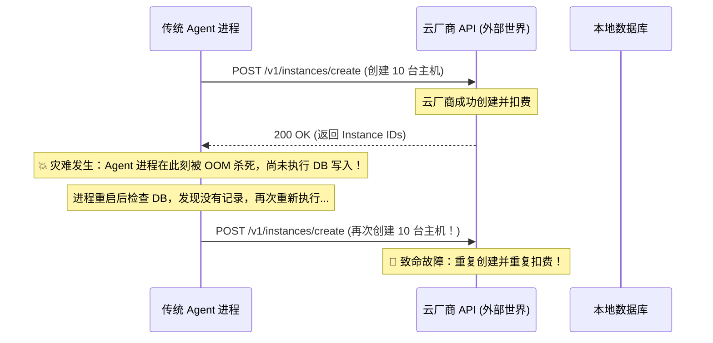
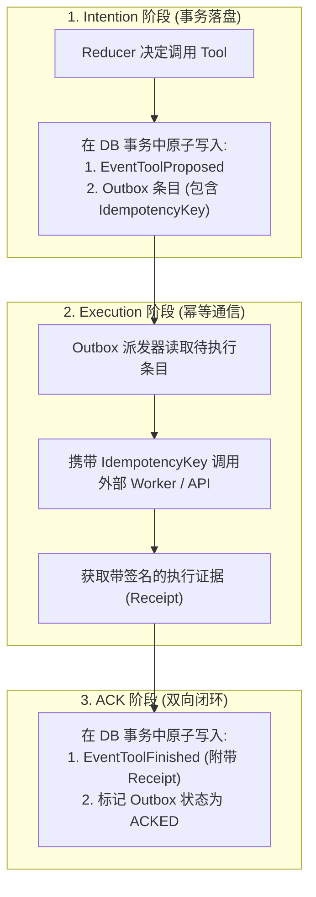

**TL;DR：** 在 AI Agent 系统中，大模型的纯文本生成是“无副作用的思考”，而调用外部 API、修改文件系统、操作云资源和发送消息则是带有物理状态变更的**“副作用（Side Effect）”**。如果 Agent 在向外部发起 HTTP 请求后由于网络抖动超时，或者在收到结果准备写入数据库的瞬间遭遇断电崩溃，系统就会陷入薛定谔状态：**这个操作到底执行成功了没有？** ORACT 借鉴分布式事务的经典范式，在 Agent 工具执行层引入了 **Transactional Outbox（事务性发件箱）** 与 **Receipt（执行回执证据链）** 机制，确保任何外部副作用在系统崩溃重启后均可精确对账，实现 At-least-once 发起与 Exactly-once 状态收敛。

---

## 一、副作用风暴：为什么传统 Agent 工具调用靠不住？

假设 Agent 正在执行一项自动化运维任务：“为用户扩容 10 台云服务器并扣减对应账户余额”。

在传统 Agent 实现中，流程通常是裸跑的线性调用：



### 1.1 核心症结剖析

1. **执行与记录缺乏原子性**：外部系统调用与本地状态持久化分布在两个异构系统中，无法用单一本地事务包裹；
2. **缺乏幂等性键（Idempotency Key）**：向外部发起的请求没有全局唯一的确定性指纹，导致重试被外部视为全新请求；
3. **缺乏回执证据（Receipt）**：系统在重启后无法区分“请求未发出”与“请求已发出但未收到响应”。

---

## 二、ORACT 的解答：事务性 Outbox 与三阶段执行协议

ORACT 将每一次副作用的执行严格划分为三个阶段：**Intention（意图落盘）➔ Execution（凭证执行）➔ Acknowledgment（回执确认）**。



### 2.1 阶段一：意图与发件箱原子落盘

当大模型提议调用某个工具时，ORACT 不会立即去发网络请求，而是在同一个数据库本地事务中，**原子性地**写入两项记录：
1. `EventToolProposed` 事件写入 Journal；
2. 构造包含确定性唯一哈希（基于 `RunID + TurnIndex + ToolName + ArgumentsHash`）的 Outbox 条目。

如果事务写入前崩溃，由于什么都没发生，安全；如果事务写入后崩溃，Outbox 中记录了“尚未完成的意图”。

### 2.2 阶段二：派发与幂等执行

Outbox 调度器读取未确认（UNACKED）的条目，向外部发起调用。所有发出的请求头部都必须携带该唯一 `IdempotencyKey`：
- 若外部服务已支持幂等键，重复请求会安全返回上次缓存的结果；
- 外部 Worker 在执行完毕后，必须返回一份包含执行时间、哈希指纹和结果载荷的不可变 **Receipt（回执）**。

### 2.3 阶段三：Post-Commit ACK 确认

收到 Receipt 后，调度器开启第二个本地事务：
- 将包含 Receipt 的 `EventToolFinished` 写入 Journal；
- 将 Outbox 中的条目标记为已确认（`ACKED`）。

---

## 三、崩溃对账引擎 (Reconciliation on Recovery)

当 ORACT 发生崩溃并重启时，`runtime/recovery.go` 引擎会自动执行对账流水线：

```go
// runtime/recovery.go 崩溃恢复对账核心逻辑
package runtime

func (r *RecoverySupervisor) ReconcilePendingEffects(ctx context.Context, runID string) error {
    // 1. 查询 Outbox 中所有处于 PENDING / IN_FLIGHT 状态的条目
    pendingEntries, err := r.outboxStore.ListUnacked(ctx, runID)
    if err != nil {
        return fmt.Errorf("failed to list unacked outbox entries: %w", err)
    }

    for _, entry := range pendingEntries {
        // 2. 根据 IdempotencyKey 向远端 Worker 探查执行状态
        receipt, err := r.workerClient.ProbeReceipt(ctx, entry.IdempotencyKey)
        if err == nil && receipt != nil {
            // 外部已经执行成功，直接补偿写入完成事件
            if err := r.commitAck(ctx, runID, entry, receipt); err != nil {
                return err
            }
        } else if errors.Is(err, ErrReceiptNotFound) {
            // 外部确认从未收到该请求，安全重新调度派发
            if err := r.requeueForExecution(ctx, entry); err != nil {
                return err
            }
        } else {
            // 网络仍然不通，进入指数退避等待
            r.scheduleRetry(entry)
        }
    }
    return nil
}
```

---

## 四、Receipt 证据链与审计防篡改

在严肃业务中，仅返回 `{ "status": "ok" }` 是不够的。ORACT 的 `Receipt` 结构包含了完整的密码学证据链：

```go
type EffectReceipt struct {
    ReceiptID      string    `json:"receipt_id"`
    IdempotencyKey string    `json:"idempotency_key"`
    ToolName       string    `json:"tool_name"`
    ExecutedAt     time.Time `json:"executed_at"`
    DurationMs     int64     `json:"duration_ms"`
    OutputHash     string    `json:"output_hash"`     // SHA-256 指纹
    Signature      string    `json:"signature"`       // 执行节点的私钥签名
    RawOutput      []byte    `json:"raw_output"`
}
```

任何被模型消费的工具结果，都附带执行节点的签名指纹。在出现业务纠纷或审计调查时，可以完全自证明“该操作确实在何年何月由哪个 Worker 节点执行”。

---

## 五、架构启示与工程收获

1. **分布式系统没有魔法，只有协议**：不可信网络下的可靠执行，必须依靠 Transactional Outbox 与 Idempotency Key 双重协议保证；
2. **意图必须先于动作落盘**：先在本地确立持久化意图，再去操作外部不可控世界，是所有可靠系统的第一性原理；
3. **证据链是严肃 Agent 系统的护城河**：带有数字签名与哈希指纹的 Receipt 回执，让 Agent 从“玩具演示”真正蜕变为“可进审计的生产系统”。

---

## 六、参考资料与延伸阅读

1. [Pattern: Transactional Outbox (microservices.io)](https://microservices.io/patterns/data/transactional-outbox.html)
2. [ORACT Reliable Effects 设计与实现源码](https://github.com/MoreConsequence/oract/tree/main/storage)
3. [Stripe: Designing robust and idempotent APIs](https://stripe.com/blog/idempotency)
