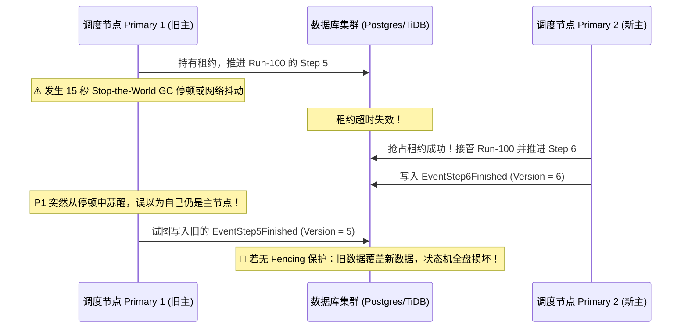
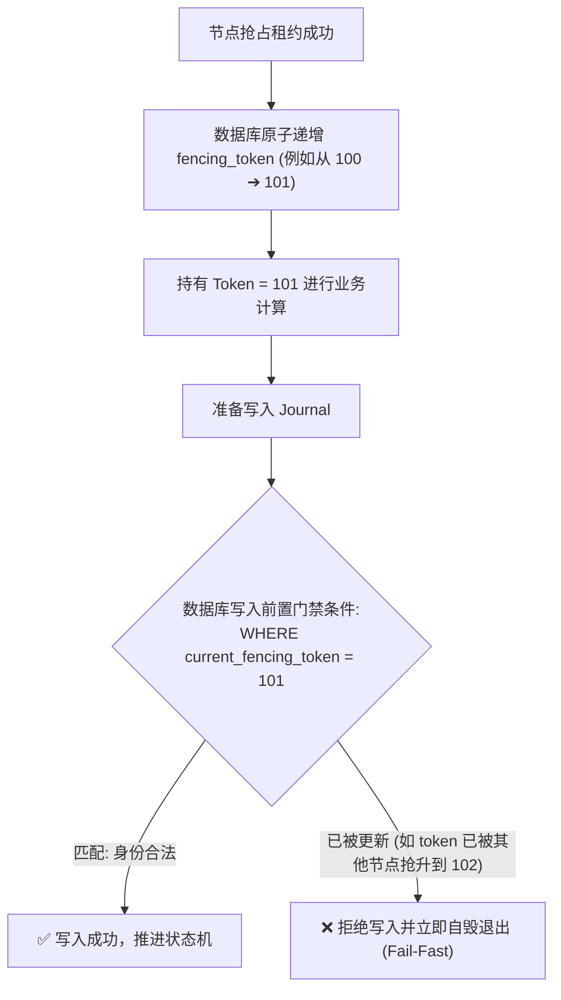
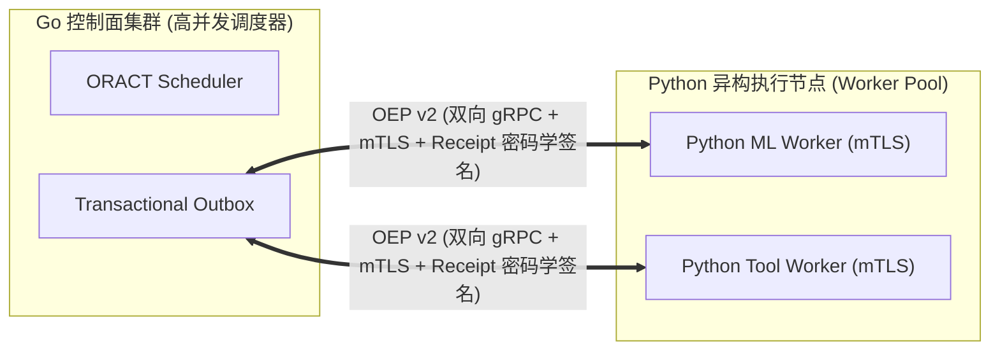

**TL;DR：** 当 Agent 运行时从单机演进为高可用分布式调度集群时，最严峻的挑战是如何防止**脑裂（Split-Brain）**与**幽灵写（Zombie Write）**：如果旧主调度节点因 10 秒的 GC 停顿或短暂网络抖动发生假死，备用节点抢占了执行权，随后旧主节点苏醒并继续向数据库写入过期状态，就会瞬间破坏整个状态机的确定性。ORACT 在分布式控制面设计了一套极其严谨的高可用架构：确立以 **Database-Time** 为单一权威时间源，采用 **分布式租约（Lease）** 与 **单调递增 Fencing Token（纪元栅栏）** 机制彻底阻断过期节点的无效写入；同时定义了 **OEP (ORACT Execution Protocol)** 跨语言通信协议，实现了 Go 高性能主控调度器与 Python 异构 Worker 之间的双向 mTLS 严密互联。

---

## 一、脑裂危机：分布式 Agent 的致命并发缺陷



在分布式环境下，单纯依赖本地服务器的 `time.Now()` 进行租约超时计算极度危险，因为不同物理服务器之间必然存在不可消除的 **NTP 时钟漂移（Clock Drift）**。

---

## 二、Database-Time 权威时钟与租约机制

ORACT 严格禁止使用应用节点本地时钟，所有租约的生效与过期计算全部收敛在**数据库服务器事务时钟（Database Time）**：

```sql
-- storage/postgres/lease.sql 原子选主与心跳续租 SQL 范式
UPDATE run_leases
SET 
    owner_id = $1,
    lease_until = NOW() + INTERVAL '10 seconds',
    fencing_token = fencing_token + 1
WHERE 
    run_id = $2 AND (
        lease_until < NOW() OR owner_id = $1
    )
RETURNING fencing_token, lease_until;
```

### 2.1 机制保证

1. **绝对单调时间**：所有租约判定基于数据库内核的 `NOW()` 时间戳，从物理上消除了分布式节点间时钟不一致的问题；
2. **原子性争抢与续租**：利用行级排他锁保证在任意时刻，一个 Run 只能被一个活动的 Go 调度协程持有；
3. **心跳续租 (Watchdog)**：主节点在后台运行守护协程，每隔 `LeaseDuration / 3` 的周期刷新一次租约。

---

## 三、Fencing 纪元栅栏：彻底粉碎幽灵写入

即使有了租约，如何防止假死节点苏醒后发出的延迟写入？答案就是 **Fencing Token（纪元栅栏）**。



### 3.1 Go 写入门禁实现

```go
// storage/journal/postgres_journal.go
package journal

import (
    "context"
    "errors"
    "github.com/MoreConsequence/oract/runtime/core"
)

var ErrFencingTokenStale = errors.New("fencing token is stale; lease ownership lost")

func (s *PostgresJournal) AppendWithFencing(ctx context.Context, runID string, token int64, event core.Event) error {
    query := `
        INSERT INTO run_events (run_id, fencing_token, event_type, payload, created_at)
        SELECT $1, $2, $3, $4, NOW()
        WHERE EXISTS (
            SELECT 1 FROM run_leases 
            WHERE run_id = $1 AND fencing_token = $2 AND lease_until > NOW()
        );
    `
    res, err := s.db.ExecContext(ctx, query, runID, token, event.Type(), event.Payload())
    if err != nil {
        return err
    }
    
    rowsAffected, _ := res.RowsAffected()
    if rowsAffected == 0 {
        // 核心保护：写入被栅栏拦截，说明当前节点已失去租约所有权
        return ErrFencingTokenStale
    }
    return nil
}
```

当假死节点苏醒尝试写入时，由于数据库内的 `fencing_token` 已经被新主节点自增，旧节点的写入影响行数为 0，系统立即返回 `ErrFencingTokenStale` 并主动触发自毁停机。

---

## 四、跨语言执行协议 OEP (ORACT Execution Protocol)

在企业级生产架构中，Agent 调度控制面通常由高并发的 Go 语言编写，而具体的深度学习计算、Python 代码分析或数据科学工具则运行在 Python 环境中。

ORACT 设计了统一的 **OEP (ORACT Execution Protocol)** 跨语言协议：



### 4.1 OEP 协议核心设计点

1. **严格双向 mTLS 认证**：控制面与 Worker 节点之间通过 X.509 证书进行双向身份认证与通信加密；
2. **Pinned RunSpec 绑定**：调度器发给 Worker 的每一个执行规范（RunSpec）都打上了强哈希指纹，防止传输篡改；
3. **Receipt 签名确认**：Python Worker 完成计算后，用私钥对输出进行不可抵赖的数字签名，回传给 Go 调度器写入 Outbox。

---

## 五、架构启示与工程收获

1. **分布式系统没有绝对时钟**：把时间与纪元收敛在单一权威存储端（如 Database Time），是解决分布式并发竞争的最稳妥之道；
2. **Fencing 是防止数据损坏的最后一道铁闸**：任何涉及持久化写的操作，必须携带单调递增的纪元令牌进行前置校验；
3. **控制面与执行面跨语言解耦**：用 Go 搞定高可靠状态机与调度，用 Python 搞定丰富的 AI 生态，通过 OEP 协议建立强类型安全契约，是大型 Agent 平台的终极架构形态。

---

## 六、参考资料与延伸阅读

1. [Martin Kleppmann: How to do distributed locking (Fencing Token 原理)](https://martin.kleppmann.com/2016/02/08/how-to-do-distributed-locking.html)
2. [Google Spanner: TrueTime and External Consistency](https://research.google/pubs/spanner-googles-globally-distributed-database/)
3. [ORACT Distribution & OEP 协议规范源码](https://github.com/MoreConsequence/oract/tree/main/runtime)
