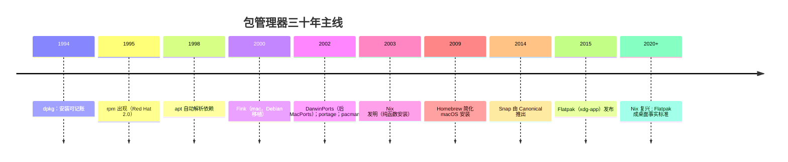

**TL;DR：** 每一代包管理器都是在回答上一代答不动的三问：**依赖从哪来、装到哪、怎么删**。三十年的演化能压成一条主线：**从"手动攒依赖"到"机器算依赖"，从"一股脑装进系统目录"到"装进隔离位置"，从"随系统版本走"到"应用自带整个世界"**。具体账目：dpkg（1994）让安装可记账 → apt（1998）让依赖解析自动化 → portage/pacman（2002）把选择权交给用户 → macOS 这条线则是 Fink（2000）→ MacPorts（2002）→ **Homebrew（2009）**，Homebrew 用"借用系统库 + /usr 之外 + Git 化 formula"把包管理做成普通开发者也能用 → Nix（2003 发明、2020 年前后流行）把"安装结果由输入哈希唯一决定"做到可复现可回滚 → Snap/Flatpak/AppImage（2014–2015）把依赖树塞进应用自身。当前推荐一句话：**服务器跟发行版走（Debian 系 apt、Red Hat 系 dnf），Linux 桌面 GUI 用 Flatpak 更主流，DevOps 与多版本共存上 Nix，macOS 开发者用 Homebrew（配 pip/cargo/npm 等语言级管理器）。**

## 一、起点：没有包管理器的时代在赌什么

手工 `./configure && make && make install` 的世界，三项风险全裸着：

1. **没有依赖清单**：没人记录"我装过哪些文件、它们属于哪个软件、这个软件还依赖别的什么"。
2. **安装不可逆**：`make install` 没有卸载的概念，装错了只能翻编译日志手工反操作，慢且易错。
3. **不同来源互相打架**：`/usr/local/bin` 与 `/usr/bin` 可能并存两份同名程序，PATH 顺序决定谁赢，靠肉眼调试。

于是整个 Unix/Linux 世界的包管理器，本质都是把这三个问题自动化 + 规范化：**依赖怎么声明、装到哪、怎样卸载还能回滚**。每一世代只在"这三问各自取什么答案"上拉开差异——这是读接下来三十年历史的那把钥匙。

## 二、第一代：把"安装"变成可记录的——dpkg、rpm（1994–1995）

1994 年 1 月，Debian 创始人 Ian Murdock 为 Debian 写了 **dpkg**：起初是个 Shell 脚本，后改写成 Perl，再由 Ian Jackson 用 C 重写。它引入今天所有包管理器都会有的基础：**每个包声明"我装哪些文件、依赖哪些包、占用哪个库"，安装前先校验依赖，卸载时照着清单清理**。`.deb` 包格式自此定型。

1995 年 9 月，Red Hat Linux 2.0 带着 **RPM（Red Hat Package Manager）** 首次出现，是第一个把打包格式内建进发行版的做法。RPM 与 dpkg 是同一问的两种答案——包格式、元数据、依赖命名不同，底层哲学一致。

这一代解决的问题：安装能记录、能查询、能卸载；坑也随之而来：**依赖解析靠包内声明，声明不全或成环就无解**，"依赖地狱"（dependency hell）一词由此诞生。`rpm -i` 时代装一个软件要先手动一次攒齐它要的所有依赖，像解连环锁。

## 三、第二代：把"依赖解析"变成可解的题——apt、yum、dnf（1998–2015）

手动逐个攒依赖太累，那就让机器算。**apt** 于 1998 年先行（Scott Drake 发布 0.0.1）：它不替代 dpkg，而是在其上加了**依赖仓库（repository）与解析层**——你只说"我要装 X"，它读索引库把依赖树算出、按拓扑排好，再交给 dpkg 一次性执行。

Red Hat 系的路径稍不同：先有 rpm 本身，再到 2002 年推出的 **YUM**（Yellowdog Updater Modified），再到 2015 年 Fedora 用 **dnf** 替换 yum，并成为 RHEL 8 开始的事实默认。**apt 与 yum/dnf 都把"先更新元数据 → 再算依赖 → 再执行安装"做成一件事**，这是这一代的核心贡献。

实现上有差别：apt 的解析器是手写的依赖规则，dnf 用 **libsolv（SAT 求解器）** 做全局一致性求解，语义更精确但历史上启动更慢。**deb 与 rpm 两个生态自此并列，再没有统一。**

| | apt/Debian 系 | dnf/RHEL 系 |
| :--- | :--- | :--- |
| 底层包格式 | `.deb`（dpkg） | `.rpm`（rpm） |
| 解析器 | apt 依赖规则 | libsolv（SAT 求解） |
| 仓库 | Debian 官方 + Ubuntu PPA | Fedora 官方 + EPEL |
| 事务/回滚 | 基本无 | `dnf history` 记录 + undo |

## 四、第三代：把"选择权"交给用户——portage 与 pacman（2002）

同期出现两个把用户选择权往前推的结构：

- **Portage**（2002 年随 Gentoo 1.0 发布）：从 FreeBSD ports 学到"源码 + 编译参数"模型。每个包是一个 ebuild 脚本，编译前按 **USE flags** 选特性（要不要 X、要不要 CUPS），装出"专为你的机器裁剪"的二进制。代价是大软件首次编译动辄几十分钟到数小时。
- **pacman**（2002 年随 Arch Linux 发布）：本质仍是二进制包 + 元数据仓库，但把 `-Syu` 一键同步 + 升级合并成一步，又铺了 AUR 社区源，"一条命令装整个宇宙"由此成型。代价是滚动发布，稳定性交给用户掌握。

两者的哲学都是"**系统是用户的选择，不是发行版的选择**"。现实是两个都留了学费：portage 的学习曲线陡、只吸引乐意折腾的少数；Arch 的滚动发布让用户得常修系统。它们没有成为主流，但留下了"包内参数可摸"的思想遗产。

## 五、岔路一：Nix——把安装结果变回纯函数（2003 发明，2020+ 流行）

2003 年，Eelco Dolstra 提出 **Nix**，把安装模型重新定义了一遍：

- 包不装进共享目录，而是装进 **`/nix/store/<hash>-name/`**，hash 由"源码 + 依赖 + 编译参数"推导而来。**同样的输入 → 完全相同的输出**，这就是"纯函数"的含义。
- 装两个版本互不冲突——它们住在不同 hash 目录；**升级 = 装入新 hash + 切换 symlink，回滚 = 切回旧 symlink**，秒级完成。
- 依赖全部显式：**编译时声明的依赖写进哈希**，缺失立时暴露在构建期，而不是运行期崩溃。

代价是：生态要"全部按 Nix 约定重打包"，学习曲线陡峭，`/nix/store` 占磁盘（一个包一份硬副本）。但在 CI 可复现构建、开发者个人 shell 环境的可迁移上，2020 年后的 Nix 成为显学。核心承诺是这一代独有的：**"我昨天装的、你三天后装的"可以被证明一字不差**。

## 六、macOS 这条线：Fink → MacPorts → Homebrew（2000–2009）

macOS 的包管理史和 Linux 平行但另起炉灶，因为 Mac 的处境完全不同：mac 有图形 GUI 生态，所以"系统包"的需求集中在开发者；又没有为第三方库定制的系统仓库，于是第一代直接把 Linux 的工具搬过来。

**2000 年，Fink** 把 dpkg/apt 移植到 Mac，做得很早但不温不火：它有 Debian 的仓库与依赖解析，但 build 链依附于 Xcode，演进慢、包旧，渐渐被边缘化。

**2002 年，Apple 内部员工与 BSD 社区做了 DarwinPorts**（2006 年改名为 **MacPorts**）。它继承 FreeBSD ports 的"源码编译"模型，默认编译并安装到 **`/opt/local`**，自带 X11 依赖链。优点是"纯源码、很干净"；缺点是装一次大库编译十分钟起，且 `/opt/local` 与系统库并存，升级中的版本错乱会让系统里的同一库出现两套。它在 macOS 上一直活着，时至今日仍在维护，但始终没成为开发者默认。

**2009 年 5 月，Max Howell 写下 Homebrew**，一举换赛道：

- **安装位置**：默认装到 **`/usr/local`（Intel）或 `/opt/homebrew`（Apple Silicon）**，不碰系统保护目录，卸载干净；
- **依赖哲学**：优先"借用"系统里已有的库（macOS 自带 openssl 等），缺的才由 Homebrew 自己装进 Cellar（`/usr/local/Cellar/<name>/<version>`），然后 symlink 链接出来——所以"挪用系统 + 最小自建"，比 MacPorts 少很多编译；
- **配方即代码**：一个"formula"就是一段 Ruby 脚本（描述源码地址、构建参数、依赖），存放在 **tap（Git 仓库）** 里，增删改提交都走 Git——社区贡献几乎零门槛；
- **bottle 机制**：预编译二进制（bottle）默认可用，常见的包直接下载，把"编译 N 分钟"压成"下载几秒"；
- **cask**：对 GUI 应用（.dmg/.pkg）用 `brew install --cask` 安装，把"去官网下载拖进 Applications"也脚本化。

结论：Homebrew 赢的**不是"更正确"，而是"更可用"**。它对准的是普通开发者：一条命令，缺什么装什么，升级、回滚都有预案。二十年后的 macOS 开发机，`brew install / --cask` 基本就是事实标准的发行口。

## 七、终局：应用自成一个世界——Flatpak、Snap 与 AppImage（2014–2015 起）

桌面应用的分发在 Linux 撕开新战场：**开发者不想替每个发行版、每个 glibc、每个 Gtk/Qt 变体各编一份**，发行版也不想让系统依赖被 app 绑架。于是三路"扁平化"答案：

| | AppImage | Snap | Flatpak |
| :--- | :--- | :--- | :--- |
| **出身** | 2004 年 klik 起家，2013 年定名 | 2014 年 Canonical（源自 Ubuntu Phone 的 click 格式） | 2015 年 Red Hat 的 xdg-app，2016 年更名 Flatpak |
| **核心形态** | 单个可执行文件 `.AppImage` | squashfs 打包 + snapd 系统服务 | OSTree 内容寻址 + Bubblewrap 沙箱 + 权限 portal |
| **依赖** | 全部打进单文件，自带运行时 | 自带 core 基座（core22 等） | 与宿主共享 runtime，多应用共用一份 |
| **隔离/沙箱** | 无（同普通用户权限） | AppArmor / seccomp 限制 | Bubblewrap 命名空间强制隔离 |
| **更新** | 无内置更新，替换文件 | snapd 自动 / 定时更新 | `flatpak update` 推送 |
| **痛点** | 无签名背书；权限无限制 | 闭源组件、仓库中心化，风评批评 | 沙箱边界会拦正常操作（走 portal 授权） |

一句话对照：**AppImage 卖'一个文件，拔插即用'；Flatpak 卖'沙箱内应用各行其是'；Snap 卖'厂商集中管理、自动更新、服务器友好'**。在主流桌面发行版语境里，Flatpak 在 2024 年后已成事实标准（Flathub 成为社区默认来源）；Snap 在 Ubuntu 默认但安装慢、透明度常被吐槽；AppImage 只适合便携分享。

## 八、一张总账：主流管理者的语义承诺

| 维度 | dpkg/apt | rpm/yum-dnf | pacman | Homebrew | Nix | Flatpak |
| :--- | :--- | :--- | :--- | :--- | :--- | :--- |
| **诞生** | 1994 / 1998 | 1995 / 2002（dnf 2015） | 2002 | 2009 | 2003 | 2015 |
| **适用系统** | Debian/Ubuntu | RHEL/Fedora | Arch | macOS（亦可 Linux） | 多平台 | Linux 桌面 |
| **安装位置** | `/usr` 全局 | `/usr` 全局 | `/usr` | `/usr/local` 或 `/opt/homebrew` | `/nix/store` 隔离 | runtime 共享目录 |
| **依赖策略** | 仓库求解 | 仓库求解 | 仓库 | 借用系统 + 最小 Cellar | 哈希显式 | 共享 runtime |
| **回滚** | 无事务回滚 | dnf history undo | 无 | 半：`brew list` 记录 | 秒级回滚 | commit 历史可回 |
| **沙箱** | 无 | 无 | 无 | 无 | 无（纯路径隔离） | Bubblewrap |

竖着读这张表，历史的"答案"主线是：**依赖从"装完算数"（dpkg/rpm）演进到"装完且能更新"（apt/dnf），再到"装完=依赖证明"（Nix 哈希）**。

## 当前推荐（2026 视角）

| 角色 | 推荐 | 理由一句话 |
| :--- | :--- | :--- |
| Linux 服务器 | 发行版自带（Debian→apt、RHEL→dnf） | 原厂安全补丁、审计面最小 |
| Linux 桌面 GUI 应用 | **Flatpak（Flathub）** | 沙箱 + 统一 runtime，跨发行版即装即用 |
| 开发机 / 多版本共存 | 语言级（pip/npm/cargo）+ Nix 兜底 | 项目级隔离，运行时库不污染系统 |
| macOS 开发者 | **Homebrew**（CLI + cask） | 事实默认、社区最大、cask 管 GUI |
| 可复现 CI/部署 | **Nix** | 同一 hash 同一比特，构建可复现 |

一个反直觉提醒：**"跨发行版通用"不是唯一标准，事务与回滚也不天然更优**。apt 没有事务功能也能活 25 年——因为"装错重装"的代价足够低；而"系统目录不可碰 + 依赖要显式证明"这些后来者才带出来的优点，恰恰是 macOS 与 Linux 桌面版在演进中逐渐补齐的。

## 结论：包管理器演进是在可安装、可复现与隔离之间换账

三十年的账没有绕开一个问法：**依赖怎么解决、装到哪、能不能删**——每一代的答案都不同，且每一代都是对前一代缺陷的一次还债。dpkg/rpm 解决"能记账"，apt/dnf 解决"能自己解依赖"，portage/pacman 把选择权让给用户，Homebrew 把"能用"普及到开发者，Nix 交付"可复现"，Flatpak 交付"隔离"。而当镜像构建与容器成为既有基建后，"包管理"与"镜像构建"两本账正走向合流——那是下一篇要记的账。

**下一步可动手（10 分钟）：** 在 macOS 上 `brew list --versions` 看 Homebrew 的账本；在 Linux VM 里敲 `dnf history` 或 `apt list --installed` 看"事务记录"；再一次性装 `brew install nix`，（或 `nix shell nixpkgs#hello -c hello` 看一眼哈希目录与秒级回滚）。把三个输出并排摆开，三十年不靠背，靠看。

## 参考资料

1. dpkg 项目与历史 —— https://wiki.debian.org/Dpkg
2. Debian 的 APT 历史 —— https://wiki.debian.org/Apt
3. RPM 官网 —— https://rpm.org/
4. Fedora DNF 文档 —— https://fedoraproject.org/wiki/DNF
5. Arch Wiki：pacman —— https://wiki.archlinux.org/title/Pacman
6. Homebrew 文档 —— https://docs.brew.sh/
7. MacPorts 官网与历史 —— https://www.macports.org/
8. Fink 项目主页 —— https://www.finkproject.org/
9. Nix 手册与系统综述（Dolstra, 2006）—— https://manual.nixos.org/
10. Flatpak 官网 / Alex Larsson《Flatpak: a history》—— https://flatpak.org/
11. Snap 官方文档 —— https://snapcraft.io/docs
12. AppImage 官方 Wiki（History）—— https://github.com/AppImage/AppImageKit/wiki/History
13. Andrew Nesbitt《Package Manager Timeline》—— https://nesbitt.io/2025/11/15/package-manager-timeline.html

> 延伸阅读：包管理器与事务、回滚的取舍，和[两阶段提交与 Saga/Outbox 的选择](/writing/distributed-transactions-2pc-saga)是同一种心态；把依赖冲突这种"并发写同一资源"的账，见[数据库死锁的等待图](/writing/database-deadlock-wait-graph)；把"启动快不快"放大到整台机器的包管理，见[理解事件循环](/writing/understanding-event-loops)。
