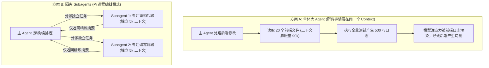
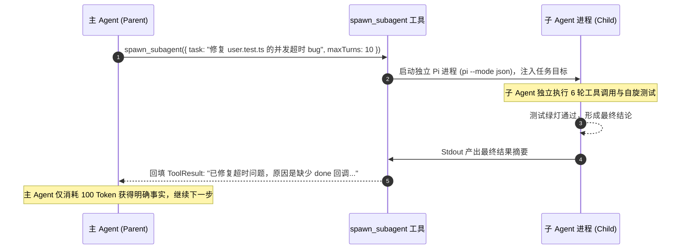

**TL;DR：** 许多多 Agent 框架（如 AutoGen、CrewAI）在核心库中硬编码了复杂的“角色分配”、“集中式路由器”与“多方聊天室”机制。这种设计在实际工程中极易导致 **Token 消耗雪崩（多个 Agent 互相寒暄复读）**、**死锁阻塞** 与 **上下文污染**。Pi 的工程哲学坚持：**核心只管单 Agent 循环，多 Agent 协作通过操作系统进程或轻量扩展来组装**。本文作为《Pi Agent 全景通才教程》第二十课，带你编写工业级的 `subagent.ts` 扩展，掌握父子进程上下文物理隔离、并发扇出与结果汇聚（Fan-out / Fan-in），并实现严格的防递归与深度熔断机制。

## 一、单体大上下文 vs 隔离 Subagent 模式

当一个任务非常复杂（例如：同时重构后端 API、编写前端组件并执行集成测试）时，两种模式的对比：



### Subagent 的三大黄金收益

1. **上下文物理隔离（Context Isolation）**：子 Agent 在探索过程中产生的上百条调试命令、编译报错和临时中间文件，全部留在子进程的私有会话中，**绝不污染主 Agent 的整洁上下文**；
2. **多模型特化（Model Specialization）**：主 Agent 可以使用高智力、高成本模型（如 Claude 3.7 Sonnet）做统筹规划，而分发给 Subagent 的重复性子任务（如“给 10 个函数补齐 JSDoc 注释”）可以使用极速低成本模型（如 GLM 4 / DeepSeek V3）；
3. **天然支持并行执行（Parallel Execution）**：多个 Subagent 在独立进程中并行跑测试或跑代码生成，耗时从串行线性累加缩短为最长子任务时间。

## 二、架构设计：Subagent 的生命周期与数据流

主 Agent 与 Subagent 之间必须遵循**严格的单向数据汇聚原则（One-way Aggregation）**：



## 三、动手实战：编写 subagent.ts 官方扩展

下面是利用 Pi 扩展 API 实现的 `subagent` 模块：

```ts
// extensions/subagent.ts
import { spawn } from "node:child_process";
import { ExtensionAPI } from "../extension-types";

export interface SubagentTaskParams {
  taskDescription: string;
  scopeDirectory?: string;
  model?: string;
  maxTurns?: number;
}

export default function (pi: ExtensionAPI) {
  // 防递归深度计数器
  const currentDepth = parseInt(process.env.PI_SUBAGENT_DEPTH ?? "0", 10);
  const MAX_RECURSION_DEPTH = 2; // 最多允许两级嵌套子 Agent

  pi.registerTool({
    name: "spawn_subagent",
    description: "Spawn an isolated subagent in a background child process to perform a specific sub-task without polluting main context.",
    parameters: {
      taskDescription: { type: "string", description: "Detailed goal and instructions for the subagent." },
      scopeDirectory: { type: "string", description: "Working directory relative to project root." },
      model: { type: "string", description: "Optional model override for this sub-task." },
      maxTurns: { type: "number", description: "Maximum turns allowed for subagent (default: 12)." },
    },
    execute: async (args: SubagentTaskParams) => {
      // 1. 递归深度熔断拦截
      if (currentDepth >= MAX_RECURSION_DEPTH) {
        return `Error: Maximum subagent recursion depth (${MAX_RECURSION_DEPTH}) reached. Subagents cannot spawn further subagents.`;
      }

      const maxTurns = args.maxTurns ?? 12;
      const cwd = args.scopeDirectory ? `${process.cwd()}/${args.scopeDirectory}` : process.cwd();

      // 2. 构造子 Agent 启动命令与环境变量
      const childEnv = {
        ...process.env,
        PI_SUBAGENT_DEPTH: String(currentDepth + 1), // 递归层数自增
      };

      const cliArgs = ["--mode", "json", "-p", args.taskDescription];
      if (args.model) {
        cliArgs.push("--model", args.model);
      }

      // 3. 拉起隔离进程
      return new Promise<string>((resolve) => {
        const child = spawn("pi", cliArgs, {
          cwd,
          env: childEnv,
          stdio: ["ignore", "pipe", "pipe"],
        });

        let finalAnswer = "";
        let errorOutput = "";

        child.stdout?.on("data", (chunk) => {
          const lines = chunk.toString().split("\n");
          for (const line of lines) {
            if (!line.trim()) continue;
            try {
              const ev = JSON.parse(line);
              // 捕获子 Agent 最终输出
              if (ev.type === "message_end" && ev.content) {
                finalAnswer = ev.content;
              }
              if (ev.type === "turn_end" && ev.output) {
                finalAnswer = ev.output;
              }
            } catch {
              // 忽略非 JSON 行
            }
          }
        });

        child.stderr?.on("data", (chunk) => {
          errorOutput += chunk.toString();
        });

        child.on("close", (code) => {
          if (code === 0) {
            resolve(`[Subagent Success]\n${finalAnswer || "Task completed without explicit text return."}`);
          } else {
            resolve(`[Subagent Failed with Exit Code ${code}]\n${errorOutput || "Unknown subagent execution error."}`);
          }
        });
      });
    },
  });
}
```

## 四、多 Agent 系统的三大反模式（Anti-Patterns）

在工业落地中，必须时刻警惕以下多 Agent 反模式：

1. **聊天室循环（Chatter-Loop Anti-Pattern）**：让 Agent A 和 Agent B 互相“交谈”、“评审代码”。通常经过 3 轮后，两者就会开始互相吹捧或陷入“我觉得你的建议很好”、“我也同意你的看法”的无意义自旋。
   - **对策**：只使用 **Task-Worker 树状任务模型**，禁止同级 Agent 自发随意私聊。
2. **无限递归派生（Fork Bomb）**：Agent 发现任务难，自己派生了 5 个子 Agent；每个子 Agent 又各自派生 5 个子 Agent，几秒内耗尽系统 PID 和 API 额度。
   - **对策**：基于 `PI_SUBAGENT_DEPTH` 环境变量进行硬深度截断。
3. **共享可变状态竞争（Shared Mutable State）**：父子 Agent 同时在未经锁同步的情况下修改同一个 `index.ts`。
   - **对策**：通过 `scopeDirectory` 严格划分各 Subagent 的文件所有权，或仅允许 Subagent 输出 Patch 供主 Agent 审阅应用。

## 五、小结与课后自检

在第二十课中，我们掌握了生产级多 Agent 协作的底层实现：
1. **进程隔离优先**：利用操作系统进程而非框架状态机实现干净的上下文与资源隔离；
2. **单向任务汇聚**：严格执行 Fan-out / Fan-in，仅把最终结构化结论回填给主 Agent；
3. **递归熔断机制**：通过环境变量计数器彻底杜绝多 Agent 递归炸弹。

在下一课 **《21 连接一切工具：为 Pi 编写标准 MCP 客户端桥接器》** 中，我们将探讨工具生态的标准化——如何为 Pi 编写一个轻量级 MCP Client 扩展，无缝接入全球海量 Model Context Protocol 工具生态。

---

## 参考资料

- `packages/coding-agent/examples/extensions/subagent/`：Pi 官方子 Agent 实现范例
- Model Context Protocol & Actor Model Concurrency Architecture
- Unix Process Forking & Environment Variable Inheritance Principles
