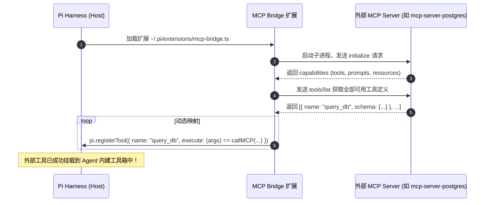

**TL;DR：** 随着 Anthropic 推出的 **MCP（Model Context Protocol）** 成为全球 AI 工具的事实标准，成千上万的开发者为 Postgres、GitHub、Slack、Figma 编写了标准 MCP Server。Pi 虽然在核心包中“刻意不做 MCP 绑定”以保持极简，但得益于其强大的扩展系统，我们只需编写一个约 80 行的 **MCP Bridge 扩展**，就能让 Pi 无缝连接全球所有开源 MCP 工具。本文作为《Pi Agent 全景通才教程》第二十一课，深入解析 MCP JSON-RPC 2.0 传输规范，手把手实现 **MCP Stdio 客户端桥接器**，并剖析如何利用 **Deferred Tool Loading（延迟工具加载）** 避免工具过多导致 Prompt Cache 崩溃。

## 一、MCP 协议全景：客户端与服务端的交互契约

MCP 采用标准的 JSON-RPC 2.0 消息协议，通过 `stdio` 或 `SSE（Server-Sent Events）` 建立连接：



### MCP 的三大核心能力

1. **Tools（工具）**：可供模型主动调用的可执行函数；
2. **Resources（资源）**：类似只读文件的上下文数据源（如数据库 Schema、日志文件）；
3. **Prompts（提示模板）**：服务器预定义的标准化交互模板。

## 二、为什么不能把 50 个 MCP 工具全部塞进上下文？

接入 MCP 时最容易犯的错误是：配置了 5 个 MCP Server，一股脑将 60 多个工具的完整 JSON Schema 全量注入到 System Prompt 中。

后果是致命的：
1. **Schema 占用超万 Token**：单是工具定义就消耗 15,000 Token，严重压缩了模型的有效上下文空间；
2. **破坏 Prompt Cache 稳定性**：每次增减或修改一个 MCP Server，导致工具 Schema 哈希变化，**直接使模型厂商的 KV Cache 全部失效**；
3. **注意力分散与调用错乱**：工具过多会导致大模型产生“选错工具（Tool Selection Hallucination）”的概率急剧上升。

### 工业级解法：Deferred Tool Loading（延迟按需加载）

现代高级 Agent（如 Kimi、Anthropic）支持**两阶段工具发现**：
- **阶段一（静态）**：上下文里只放工具的“名称与单行功能简述”；
- **阶段二（动态）**：当模型决定使用某个特定工具时，再动态将完整的 JSON Schema 注入给下一轮请求，最大限度保留 Prompt Cache 前缀不变。

## 三、动手实战：手写轻量 MCP Stdio 客户端桥接扩展

下面是利用标准 JSON-RPC 2.0 实现的完整 `mcp-bridge.ts` 扩展源码：

```ts
// extensions/mcp-bridge.ts
import { spawn, ChildProcess } from "node:child_process";
import * as readline from "node:readline";
import { ExtensionAPI } from "../extension-types";

interface JsonRpcMessage {
  jsonrpc: "2.0";
  id?: number | string;
  method?: string;
  params?: any;
  result?: any;
  error?: any;
}

class SimpleMcpClient {
  private child: ChildProcess;
  private nextId = 1;
  private pendingRequests = new Map<number | string, { resolve: (val: any) => void; reject: (err: any) => void }>();

  constructor(command: string, args: string[], env: Record<string, string> = {}) {
    this.child = spawn(command, args, {
      stdio: ["pipe", "pipe", "pipe"],
      env: { ...process.env, ...env },
    });

    const rl = readline.createInterface({ input: this.child.stdout!, crlfDelay: Infinity });

    rl.on("line", (line) => {
      const trimmed = line.trim();
      if (!trimmed) return;
      try {
        const msg: JsonRpcMessage = JSON.parse(trimmed);
        if (msg.id !== undefined && this.pendingRequests.has(msg.id)) {
          const { resolve, reject } = this.pendingRequests.get(msg.id)!;
          this.pendingRequests.delete(msg.id);
          if (msg.error) {
            reject(new Error(`MCP Error: ${JSON.stringify(msg.error)}`));
          } else {
            resolve(msg.result);
          }
        }
      } catch {
        // 忽略非 JSON 日志行
      }
    });
  }

  public async request(method: string, params: any = {}): Promise<any> {
    const id = this.nextId++;
    const payload: JsonRpcMessage = { jsonrpc: "2.0", id, method, params };

    return new Promise((resolve, reject) => {
      this.pendingRequests.set(id, { resolve, reject });
      this.child.stdin?.write(JSON.stringify(payload) + "\n");
    });
  }

  public async listTools(): Promise<Array<{ name: string; description: string; inputSchema: any }>> {
    const res = await this.request("tools/list");
    return res.tools ?? [];
  }

  public async callTool(name: string, args: Record<string, unknown>): Promise<string> {
    const res = await this.request("tools/call", { name, arguments: args });
    const content = res.content ?? [];
    return content.map((c: any) => c.text ?? JSON.stringify(c)).join("\n");
  }
}

export default async function (pi: ExtensionAPI) {
  // 配置待挂载的外部 MCP Server（例如官方 Github 或 SQLite 服务）
  const mcpServers = [
    {
      name: "sqlite-tools",
      command: "npx",
      args: ["-y", "@modelcontextprotocol/server-sqlite", "--file", "./data/app.db"],
    },
  ];

  for (const s of mcpServers) {
    try {
      const client = new SimpleMcpClient(s.command, s.args);
      // 1. 初始化协议握手
      await client.request("initialize", {
        protocolVersion: "2024-11-05",
        capabilities: {},
        clientInfo: { name: "pi-mcp-bridge", version: "1.0.0" },
      });

      // 2. 动态发现工具并注册到 Pi 核心 Loop
      const tools = await client.listTools();
      for (const t of tools) {
        pi.registerTool({
          name: `mcp_${s.name}_${t.name}`,
          description: `[MCP: ${s.name}] ${t.description}`,
          parameters: t.inputSchema ?? {},
          execute: async (args) => {
            return await client.callTool(t.name, args);
          },
        });
      }
    } catch (err: any) {
      console.warn(`[MCP Bridge] Failed to connect to ${s.name}: ${err.message}`);
    }
  }
}
```

## 四、小结与课后自检

在第二十一课中，我们掌握了将 Agent 接入全球工具生态的标准范式：
1. **轻量协议桥接**：不到百行代码即可实现基于 Stdio 的标准 MCP 客户端；
2. **命名空间隔离**：通过 `mcp_<server>_<tool>` 前缀杜绝工具重名冲突；
3. **Prompt Cache 保护**：掌握延迟加载与按需暴露工具，避免海量 Schema 挤占上下文。

在下一课 **《22 终端渲染的深水区：流式 Markdown 语法高亮与中文字符对齐》** 中，我们将深入终端 UI 的技术攻坚——如何在流式输出下实现实时 Markdown 语法高亮与中文字符绝对对齐。

---

## 参考资料

- Model Context Protocol Specification (modelcontextprotocol.io)
- JSON-RPC 2.0 Specification
- `packages/coding-agent/examples/extensions/`：Pi 官方工具扩展实现
