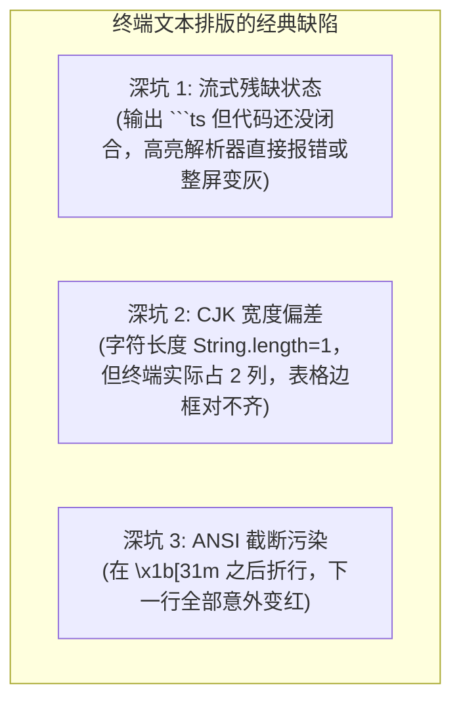

**TL;DR：** 编写一个能在网页中展示 Markdown 的富文本组件很简单，但在字符网格的黑白终端（Terminal）中，要实现**流式实时的 Markdown 语法高亮与绝对对齐**，会踩遍计算机排版系统中最隐蔽的几大“深水坑”：**未闭合的代码块（Unclosed Fences）在流式输出中会使整个屏幕着色错乱；中文、日文、Emoji 等全角字符（Full-width CJK）在终端中占据 2 个字符宽度，导致原本对齐的表格与边框瞬间支离破碎；在 ANSI 彩色文本中随意截断字符串会导致终端整屏变色**。本文作为《Pi Agent 全景通才教程》第二十二课，带你深入 `pi-tui` 的底层算法，手写一个支持**流式状态机高亮**与 **CJK 宽度校准**的终端文本引擎。

## 一、终端排版的三大“地狱级”深坑



### 1. 流式残缺状态机（Streaming Lexer Invariant）
传统 Markdown 解析器（如 `marked`、`markdown-it`）假设输入是一个完整的字符串。然而在流式输出中，模型每隔 20 毫秒发送 3 个字符：
```text
Chunk 1: "```typ"
Chunk 2: "escript\nconst a = "
Chunk 3: "10;\n"
```
如果每次收到 Chunk 都重新调用全量解析，不仅 CPU 占用 100%，而且在代码块闭合标签 ```` ``` ```` 到来之前，解析器无法识别后续内容到底是普通段落还是代码。

### 2. 中文字符与 Emoji 宽度（The wcwidth Problem）
在 JavaScript 中：
- `'A'.length === 1`，在终端占 **1 列**（Half-width）；
- `'中'.length === 1`，在终端占 **2 列**（Full-width）；
- `'🚀'.length === 2`（UTF-16 代理对），在终端占 **2 列**。

如果仅使用 `str.slice(0, 80)` 来做终端 80 列宽度折行，遇到中文时终端实际输出宽度会变成 120 列，导致终端自动换行并破坏垂直布局！

## 二、CJK 字符宽度算法：手写轻量 `wcwidth`

根据 Unicode 标准（UAX #11），我们需要判断每个 Unicode 字符的East Asian Width（东亚宽度属性）：

```ts
// wcwidth.ts
export class CharWidth {
  /**
   * 计算单个字符在终端中的列数宽度 (0, 1, 或 2)
   */
  public static charWidth(codePoint: number): number {
    // 1. 控制字符与零宽字符
    if (codePoint === 0 || codePoint < 32 || (codePoint >= 0x7f && codePoint < 0xa0)) {
      return 0;
    }

    // 2. 结合字符 (Combining Characters) 宽度为 0
    if (codePoint >= 0x0300 && codePoint <= 0x036f) {
      return 0;
    }

    // 3. CJK 全角字符范围（汉字、全角标点、日文假名、韩文音节）
    if (
      (codePoint >= 0x1100 && codePoint <= 0x115f) || // 韩文声母
      (codePoint >= 0x2e80 && codePoint <= 0xa4cf && codePoint !== 0x303f) || // CJK 偏旁、汉字、日文
      (codePoint >= 0xac00 && codePoint <= 0xd7a3) || // 韩文音节
      (codePoint >= 0xf900 && codePoint <= 0xfaff) || // CJK 兼容汉字
      (codePoint >= 0xfe10 && codePoint <= 0xfe19) || // 竖排标点
      (codePoint >= 0xfe30 && codePoint <= 0xfe6f) || // CJK 兼容标点
      (codePoint >= 0xff00 && codePoint <= 0xff60) || // 全角 ASCII 变体
      (codePoint >= 0xffe0 && codePoint <= 0xffe6) || // 全角符号
      (codePoint >= 0x1f300 && codePoint <= 0x1f64f) || // Emoji 杂项与表情
      (codePoint >= 0x20000 && codePoint <= 0x3fffd) // 超大汉字扩展集
    ) {
      return 2;
    }

    return 1;
  }

  /**
   * 计算整行字符串在终端中的真实视觉列宽（自动忽略 ANSI 转义字符）
   */
  public static stringVisualWidth(str: string): number {
    // 先剥离 ANSI 颜色代码
    const stripped = str.replace(/\x1b\[[0-9;]*[a-zA-Z]/g, "");
    let width = 0;
    for (const char of stripped) {
      width += this.charWidth(char.codePointAt(0)!);
    }
    return width;
  }
}
```

## 三、动手实战：流式 Markdown 高亮状态机

下面我们手写一个工业级的流式 Markdown 着色器，支持实时行内高亮、代码块边界识别与 ANSI 重置保护：

```ts
// streaming-highlight.ts
import { CharWidth } from "./wcwidth";

export type MarkdownState = "NORMAL" | "IN_CODE_BLOCK" | "IN_INLINE_CODE";

export class StreamingMarkdownHighlighter {
  private state: MarkdownState = "NORMAL";
  private currentLanguage = "";

  // 简易关键字着色表 (TypeScript / JavaScript)
  private static readonly KEYWORDS = new Set([
    "const", "let", "var", "function", "class", "import", "export",
    "return", "if", "else", "for", "while", "async", "await", "interface", "type"
  ]);

  /**
   * 处理单行文本并输出带 ANSI 颜色的终端行
   */
  public highlightLine(line: string): string {
    const trimmed = line.trim();

    // 1. 代码块起始 / 结束标记判断 (``` 或 ~~~)
    if (trimmed.startsWith("```") || trimmed.startsWith("~~~")) {
      if (this.state === "IN_CODE_BLOCK") {
        this.state = "NORMAL";
        this.currentLanguage = "";
        return `\x1b[90m${line}\x1b[0m`; // 闭合标记灰色输出
      } else {
        this.state = "IN_CODE_BLOCK";
        this.currentLanguage = trimmed.slice(3).trim();
        return `\x1b[90m${line}\x1b[0m`; // 开头标记灰色输出
      }
    }

    // 2. 处于代码块内部：执行代码高亮
    if (this.state === "IN_CODE_BLOCK") {
      return this.highlightCode(line);
    }

    // 3. 处于普通段落：执行 Markdown 标题与行内样式高亮
    return this.highlightMarkdownText(line);
  }

  private highlightCode(line: string): string {
    // 简单的 Tokenizer 进行关键字、字符串与数字着色
    return line.replace(
      /("[^"]*"|'[^']*'|`[^`]*`|\b\d+\b|\b[a-zA-Z_]\w*\b|\/\/.*$)/g,
      (match) => {
        // 注释
        if (match.startsWith("//")) return `\x1b[90m${match}\x1b[0m`;
        // 字符串
        if (match.startsWith('"') || match.startsWith("'") || match.startsWith("`")) {
          return `\x1b[32m${match}\x1b[0m`; // 绿色
        }
        // 数字
        if (/^\d+$/.test(match)) {
          return `\x1b[33m${match}\x1b[0m`; // 黄色
        }
        // 关键字
        if (StreamingMarkdownHighlighter.KEYWORDS.has(match)) {
          return `\x1b[35m\x1b[1m${match}\x1b[0m`; // 紫色粗体
        }
        return match;
      }
    );
  }

  private highlightMarkdownText(line: string): string {
    // 标题 (# Header)
    if (line.startsWith("#")) {
      return `\x1b[36m\x1b[1m${line}\x1b[0m`; // 青色粗体
    }

    // 列表项 (- item / * item)
    if (/^\s*[-*+]\s+/.test(line)) {
      return line.replace(/^(\s*[-*+]\s+)(.*)$/, `\x1b[33m$1\x1b[0m$2`);
    }

    // 行内代码 (`code`)
    return line.replace(/`([^`]+)`/g, `\x1b[36m\x1b[40m \x1b[1m$1\x1b[0m\x1b[40m \x1b[0m`);
  }
}
```

## 四、小结与课后自检

在第二十二课中，我们彻底攻克了终端 UI 开发中最隐蔽的技术难题：
1. **Unicode 宽度校准**：基于 `wcwidth` 精确度量 CJK 汉字与 Emoji 的 2 字符视觉宽度，确保终端表格与布局绝对对齐；
2. **流式状态机高亮**：跨分块维护代码块状态，避免残缺流导致全屏着色污染；
3. **ANSI 边界重置**：行尾强制追加 `\x1b[0m` 避免颜色泄露到终端后续输出。

在下一课 **《23 把每一分钱省到极致：KV Cache 字节级对齐与 Prompt Caching 实战》** 中，我们将深入模型推理底层的物理机制——如何在字节级别排布 System Prompt 与消息历史，将 API 账单削减 90%。

---

## 参考资料

- `packages/tui/src/`：Pi 的终端语法高亮与差分渲染实现
- Unicode Standard Annex #11: East Asian Width (unicode.org/reports/tr11)
- ANSI Escape Sequences Standards (ECMA-48)
