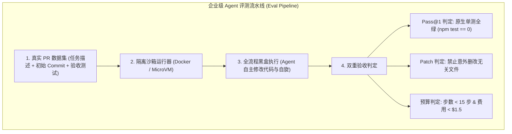

**TL;DR：** 许多团队在优化 Agent 时全凭“感觉”——修改了一句 System Prompt，测试了 2 个简单 Demo 觉得效果不错就直接发布；结果上线后发现原本能写出正确 SQL 的场景全都崩溃了。**没有自动化评测流水线（Eval Pipeline），任何对 Agent 提示词、工具或模型的改动都是盲目且危险的**。本文作为《Pi Agent 全景通才教程》第二十四课，带你跳出公开 Benchmark 的假象，手把手教你如何从**企业真实 Git 仓库历史中自动提取黄金测试集（Gold Dataset）**，并在 **Docker 隔离沙箱中搭建全自动的 Pass@1 评测与成本打分流水线**。

## 一、真实工程评测的四大黄金支柱

一个能用于生产 CI 拦截的 Agent 评测体系必须包含四大支柱：



1. **确定性基线（Deterministic Baseline）**：每次运行前，代码仓库通过 `git checkout -f <commit>` 彻底回滚到任务发起时的干净状态；
2. **黑盒验收（Blackbox Verification）**：不靠另一个 LLM 去“打分”（避免 LLM-as-Judge 带来的主观幻觉），**直接执行仓库原生的单元测试与集成测试**；
3. **副作用隔离（Side-effect Isolation）**：每个 Eval Case 在独立的临时容器中运行，避免任务之间互相污染磁盘或端口；
4. **多维度成本画像（Multi-dimensional Profiling）**：综合衡量通过率（Pass@1）、平均耗时（Duration）、平均消耗 Token 与金钱成本。

## 二、如何从 Git 历史自动提取 Eval 任务？

无需人工出题，企业历史仓库就是最好的题库：

```text
[一次合格 PR 的提取标准]
1. Base Commit (A): 修复前的代码状态（此时运行测试必定失败 Red）；
2. Problem Statement: PR 的 Title 与 Issue 描述（作为 Agent 的输入任务）；
3. Gold Test Commit: 开发者随 PR 提交的回归测试文件（如 tests/bugfix.test.ts）；
4. 评测流程: 
   - Checkout 到 Commit A；
   - 仅将 Gold Test 文件拷贝进工作区；
   - 启动 Agent 解决问题；
   - 执行 npm test 校验是否变绿（Green）。
```

## 三、动手实战：手写 EvalRunner 评测引擎

下面是工业级 Agent 自动化评测引擎的完整 TypeScript 实现：

```ts
// eval-runner.ts
import { execSync, spawnSync } from "node:child_process";
import * as fs from "node:fs";
import * as path from "node:path";

export interface EvalTask {
  id: string;
  name: string;
  repoUrl: string;
  baseCommit: string;
  prompt: string;
  testCommand: string;
  maxTurns: number;
  costBudgetUsd: number;
}

export interface EvalResult {
  taskId: string;
  passed: boolean;
  durationMs: number;
  exitCode: number;
  outputSummary: string;
  error?: string;
}

export class EnterpriseEvalRunner {
  constructor(private workspaceBaseDir = "/tmp/agent-evals") {
    if (!fs.existsSync(this.workspaceBaseDir)) {
      fs.mkdirSync(this.workspaceBaseDir, { recursive: true });
    }
  }

  /**
   * 运行单个评测任务
   */
  public async runTask(task: EvalTask): Promise<EvalResult> {
    const taskDir = path.join(this.workspaceBaseDir, task.id);
    const startTime = Date.now();

    console.log(`[Eval] Starting task: ${task.name} (${task.id})...`);

    try {
      // 1. 准备沙箱工作区与 Git 环境
      if (fs.existsSync(taskDir)) {
        fs.rmSync(taskDir, { recursive: true, force: true });
      }
      fs.mkdirSync(taskDir, { recursive: true });

      // 初始化 Git 仓库并检出目标 Commit
      execSync(`git clone --depth 50 ${task.repoUrl} ${taskDir}`, { stdio: "ignore" });
      execSync(`git checkout -f ${task.baseCommit}`, { cwd: taskDir, stdio: "ignore" });

      // 2. 启动 Agent 无头模式执行任务
      const agentRun = spawnSync("pi", ["--mode", "json", "-p", task.prompt], {
        cwd: taskDir,
        env: { ...process.env, CI: "1", NO_COLOR: "1" },
        timeout: 180000, // 3 分钟超时
      });

      // 3. 执行验证测试命令
      const testRun = spawnSync("bash", ["-c", task.testCommand], {
        cwd: taskDir,
        env: process.env,
        timeout: 60000,
      });

      const passed = testRun.status === 0;
      const durationMs = Date.now() - startTime;

      return {
        taskId: task.id,
        passed,
        durationMs,
        exitCode: testRun.status ?? -1,
        outputSummary: testRun.stdout?.toString().slice(-500) ?? "",
        error: passed ? undefined : testRun.stderr?.toString().slice(-500),
      };
    } catch (err: any) {
      return {
        taskId: task.id,
        passed: false,
        durationMs: Date.now() - startTime,
        exitCode: -1,
        outputSummary: "",
        error: err.message,
      };
    } finally {
      // 清理临时沙箱目录
      fs.rmSync(taskDir, { recursive: true, force: true });
    }
  }

  /**
   * 批量并发运行整个测试集并输出 Pass@1 报告
   */
  public async runSuite(tasks: EvalTask[]): Promise<void> {
    console.log(`\n========================================`);
    console.log(` Running Agent Evaluation Suite (${tasks.length} tasks) `);
    console.log(`========================================\n`);

    const results: EvalResult[] = [];
    for (const task of tasks) {
      const res = await this.runTask(task);
      results.push(res);
      const icon = res.passed ? "✅ PASS" : "❌ FAIL";
      console.log(`  ${icon} [${task.id}] ${task.name} (${(res.durationMs / 1000).toFixed(1)}s)`);
    }

    const passedCount = results.filter((r) => r.passed).length;
    const passRate = ((passedCount / tasks.length) * 100).toFixed(1);
    const avgDuration = (results.reduce((acc, r) => acc + r.durationMs, 0) / tasks.length / 1000).toFixed(1);

    console.log(`\n----------------------------------------`);
    console.log(` Final Evaluation Results:`);
    console.log(` Total Tasks:     ${tasks.length}`);
    console.log(` Pass@1 Rate:     ${passRate}% (${passedCount}/${tasks.length})`);
    console.log(` Avg Duration:    ${avgDuration}s`);
    console.log(`----------------------------------------\n`);

    if (passedCount < tasks.length) {
      throw new Error(`Eval Suite Failed: Pass@1 rate is ${passRate}%, below quality threshold.`);
    }
  }
}
```

## 四、接入 CI/CD 质量闸门（Quality Gate）

在 GitHub Actions 中，将评测流水线设置为 PR 必过项：

```yaml
# .github/workflows/agent-evals.yml
name: Agent Architecture Evals

on:
  pull_request:
    paths:
      - 'packages/agent/**'
      - 'packages/ai/**'
      - 'packages/coding-agent/**'

jobs:
  run-evals:
    runs-on: ubuntu-latest
    steps:
      - uses: actions/checkout@v4
      - uses: actions/setup-node@v4
        with:
          node-version: 20
      - run: npm ci
      - run: npm run build
      - name: Run Gold PR Benchmark
        run: npx ts-node scripts/run-eval-suite.ts
        env:
          ANTHROPIC_API_KEY: ${{ secrets.ANTHROPIC_API_KEY }}
```

任何对 System Prompt 的修改、对 Tool 执行逻辑的重构，必须通过 20 个黄金任务的真实测试验收，才能允许合入主干！

## 五、小结与课后自检

在第二十四课中，我们掌握了 Agent 质量工程的核心方法论：
1. **拒绝主观评估**：以真实单测全绿作为唯一的 Pass@1 验收标准；
2. **从 Git 提取黄金集**：利用历史已修复的真实 PR 构建高保真评测用例；
3. **接入 CI 质量闸门**：用数据驱动提示词与 Harness 架构的持续演进。

在下一课 **《25 从零构建 Mini-Pi：一个自包含、可运行的轻量级 Agent 引擎》**（全系列终篇实战）中，我们将把 24 课的所有技术熔铸为一体，亲手组装并跑通一个可独立运行的完整开源工程！

---

## 参考资料

- SWE-Bench Technical Paper (ICLR 2024)
- Databricks Engineering: *Automated Agent Benchmarking on Monorepos*
- GitHub Actions CI/CD Pipeline Best Practices
