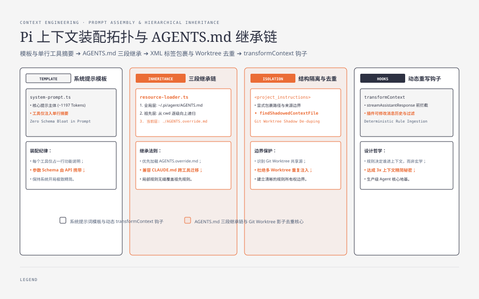
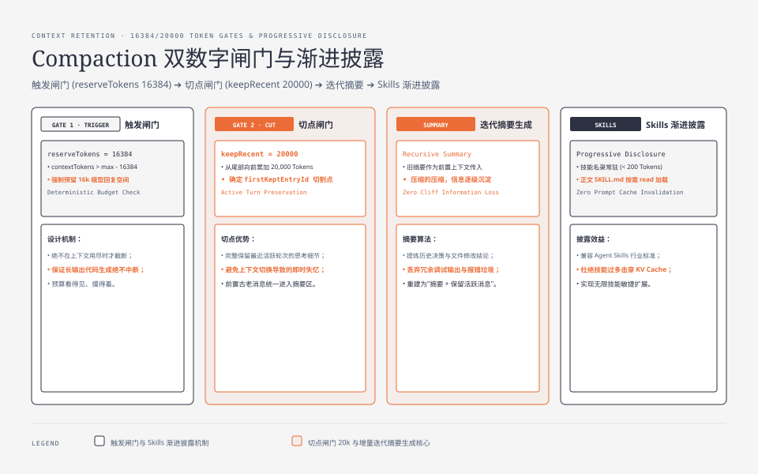
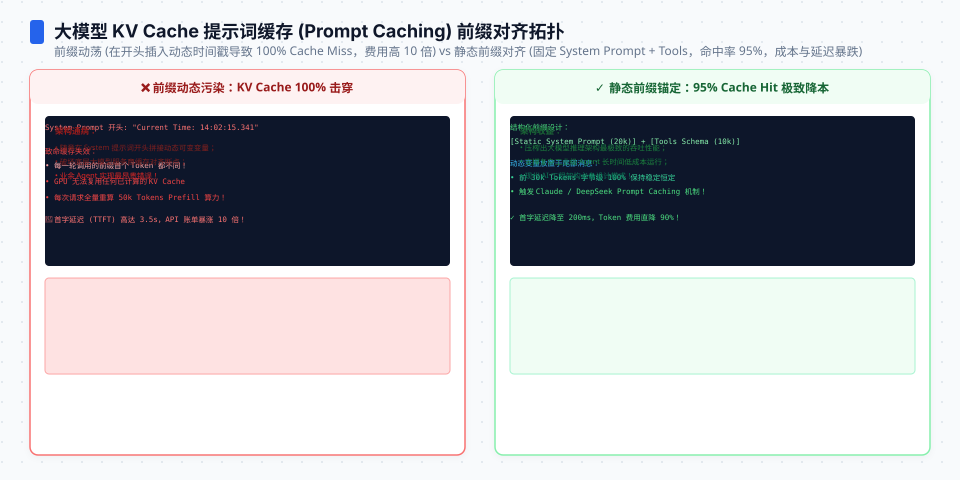

**TL;DR：** Databricks 基准里 Pi 每轮少喂约 3 倍上下文的秘密不在"压缩技术"，而在装配纪律：首篇基线（@5cd93f6）测得模板主体 1288 个字符、约 322 tokens；但 2026-08-23 在新 commit（@b23741269）复测，整文件已是 5877 字符 / 1415 tokens，去注释主体 4823 字符 / **1197 tokens**——「小于 1000 token」的承诺已被上游演进打破，AGENTS.md 按「全局 → 逐级父目录 → 当前目录」的确定性顺序装载，会话超限时按 `16384 reserve / 20000 keep` 两个数字闸门自动压缩，skills 只在被需要时按名加载（渐进披露）。本文把这四个机制在源码里的落点逐一定位——上下文工程的本质是"谁有资格进上下文"这件事不能由模型和直觉决定，只能由文件与规则决定。


---



## 一、每轮少 3 倍上下文，靠的不是魔法

01 篇引用的 Databricks 官方基准（2026-07-08）有一个数字值得反复咀嚼：同一模型同一思考档位，Pi 每轮平均约 3x 少上下文，单任务成本差 2 倍以上。这个差异直接来自上下文组装策略——但组装策略不是某个聪明的压缩函数，而是一套**装配规则**：什么进、按什么顺序进、什么时候扔、扔多少。

Pi 的装配规则全部写死在少量确定性的源码和文档里，本系列把它拆成四块：系统提示词模板（本节）、项目上下文文件（第三节）、会话压缩（第四节）、skills 渐进披露（第五节）。




## 二、系统提示词：从 322 到 1197 tokens，纪律还在吗

`packages/coding-agent/src/core/system-prompt.ts`（162 行）是默认系统提示词的唯一来源。两次实测对比（口径：tiktoken cl100k_base）：

| 时点 | commit | 整文件 | 去注释主体 |
| --- | --- | --- | --- |
| 2026-08-20 | 5cd93f6 | 1288 字符 ≈ 322 tokens（粗估） | — |
| 2026-08-23 | b23741269 | 5877 字符 / 1415 tokens | 4823 字符 / **1197 tokens** |

结论要诚实地改写：模板在三天内涨了约四倍 token，已经越过千线。「装配纪律」是否还成立，要看涨的部分是什么——这正是把承诺数字写进文章的理由：没有基线，你根本无法察觉上游悄悄打破了它。

模板本身不长，但它的装配逻辑包含两条值得抄的纪律：

**纪律一：工具清单是"一行摘要"而非完整定义。** 模板里每个工具只占一行（`- read: 读取文件内容`），完整参数 schema 由工具定义在 API 层携带，不进提示词：

```ts
// system-prompt.ts（节选）
const tools = selectedTools || ["read", "bash", "edit", "write"];
const toolsList = visibleTools.map((name) => `- ${name}: ${toolSnippets![name]}`).join("\n");
let prompt = `You are an expert coding assistant operating inside pi, a coding agent harness...`;
```

模型知道"有什么工具、大概能干嘛"，需要精确用法时再通过 docs 路径去读（模板里让模型必要时翻 `docs/*.md` 而不是把文档灌进上下文）。

**纪律二：project context 有显式的 XML 标签包裹。** 项目指令（AGENTS.md 内容）以 `<project_instructions path="...">` 包裹插入（project_instructions 的包裹逻辑现见于 system-prompt.ts 两处模板分支），skills 段单独成节。位置、边界、来源路径全部显式——模型能区分"这行是我该听的全局指令"和"这是某个文件里的局部指令"。可追溯性是上下文工程的地基。

（02 篇提到 streamAssistantResponse 在每次调模型时应用 `transformContext` 钩子——扩展可以在此时改写整个消息历史，这就是"动态上下文"的扩展点，07 篇展开。）

## 三、AGENTS.md：一个文件，三段继承，一个替代规则

项目指令的装载有专属实现 `packages/coding-agent/src/core/resource-loader.ts`。`loadProjectContextFiles`（行 118 起）的顺序是：

1. **全局层**：`~/.pi/agent/` 下的上下文文件（agentDir）；
2. **祖先层**：从当前目录向根目录逐级向上（`while (true) { ...; parentDir = dirname(currentDir); }`），每级取第一个命中的文件；
3. **当前目录层**：cwd 自己的文件最后叠加上来。

每级目录内的候选文件名有先后次序（candidates 数组）：

```ts
const candidates = ["AGENTS.override.md", "AGENTS.md", "AGENTS.MD", "CLAUDE.md", "CLAUDE.MD"];
```

即 `AGENTS.override.md` 可以顶替同目录的 `AGENTS.md`（0.84.0 新增的 per-directory override，官方发布说明原文："replace AGENTS.md or CLAUDE.md in the same directory while preserving context from other directories"），且 Pi 顺带兼容 CLAUDE.md——跨 harness 迁移时项目不用改名。

这段代码还处理了一个少见的坑：`findShadowedContextFile` 专门识别 git worktree 场景——主仓库与 linked worktree 的上下文文件指向同一个逻辑仓库，两个都加载会重复注入，所以被遮蔽的那个会被跳过。**上下文装配的边界问题已经细到"同仓库跨 worktree 不重复"**，这提醒我们：指令文件的继承链是状态，必须显式建模。




## 四、compaction：两个数字闸门加一道 LLM 摘要

会话总有超窗的一天。`packages/coding-agent/docs/compaction.md`（418 行，08-23 复测）把自动压缩定义成三个步骤，全部是确定性计算 + 一次模型调用：

**触发**：`contextTokens > contextWindow - reserveTokens`，默认 `reserveTokens = 16384`（给模型回复留的余量，可在 settings.json 改）。contextWindow 由模型元数据决定——不同模型同一会话的压缩时机不同。

**切点**：从最新消息往回走过消息，累计 token 直到 `keepRecentTokens`（默认 20000）被填满，得到 `firstKeptEntryId`——前面的全部进摘要区。数字可配：`~/.pi/agent/settings.json` 或项目 `.pi/settings.json`。

**摘要**：把切点前的消息交给 LLM 生成结构化摘要，**上一次的摘要作为迭代上下文传入**（压缩的压缩，历史信息逐层递减而非一次性丢失），随后上下文重建为"摘要 + 从 firstKeptEntryId 起的完整消息"。手动触发用 `/compact [instructions]`，用户能指定摘要聚焦点——比如"把调试过程的重复尝试合并成结论"。

两个数字（16384 / 20000）就是这个系统的"预算合同"：多少留给模型答、多少留给最近工作。改变它们就是改变系统的行为曲线——想要更长的连续上下文，调大 keepRecentTokens；想要更稳的回复质量，调大 reserveTokens。

（compaction 还有一个兄弟机制：branch summarization，切树分支时保留原分支的语义摘要。04 篇讲会话树时展开。）

## 五、skills：渐进披露，而不是全部常驻

技能是"按需加载的能力包"（`packages/coding-agent/docs/skills.md`，232 行）：一个目录加 `SKILL.md`。关键设计是**惰性**——技能的定义（名称+一句话描述列表）进提示词，技能正文只在模型判断"这个任务需要该技能"时才被 read 工具读取（`formatSkillsForPrompt` 生成技能清单；读取正文是工具的职责，不是模板的职责）。

这就是官方文档说的 "progressive disclosure without busting the prompt cache"：清单常驻（小），正文按需（大）。Pi 兼容 [Agent Skills 标准](https://agentskills.io/specification)，并且能直接复用 Claude Code / Codex 的技能目录（把 `~/.claude/skills` 配进 settings 即可）——技能和 AGENTS.md 一样，是跨 harness 的可移植资产。

## 六、结论：预算、顺序、边界，三者缺一不可

回看四个机制，它们分别回答上下文工程的三个问题：**预算多少**（16384/20000 两个闸门）、**以什么顺序**（模板 → 全局 → 祖先 → 当前目录 → skills 清单）、**边界在哪**（XML 标签、worktree 去重、技能正文与清单分离）。这三个问题的答案全部是确定性的源码/配置，没有任何一处依赖模型自己判断"我需要什么"。

这就是"每轮少 3 倍上下文"的机制层面解释。下一步可验证：在 clone 里把 `system-prompt.ts` 的模板改成 5000 字符，跑 `pi -p` 对比首轮 input token（`--mode json` 的 usage 字段会显示）；再把 `reserveTokens` 从 16384 调到 4096，观察触发压缩的时机差。预算看得见、摸得着，上下文工程就从一个玄学变成一个可调参的系统。

## 参考资料

- `packages/coding-agent/src/core/system-prompt.ts`（162 行；token 实测见上文对照表，evidence 存档 `evidence/agent-engine-series/2026-08-23-local/`）
- `packages/coding-agent/src/core/resource-loader.ts`（AGENTS.md 继承链与 worktree 去重）
- `packages/coding-agent/docs/compaction.md`（16384/20000 数字）与 `docs/skills.md`
- pi.dev 官网 Context engineering 一节与 0.84.0 发布说明（AGENTS.override.md）
- Databricks 官方基准（2026-07-08）：Pi 每轮约 3x 少上下文