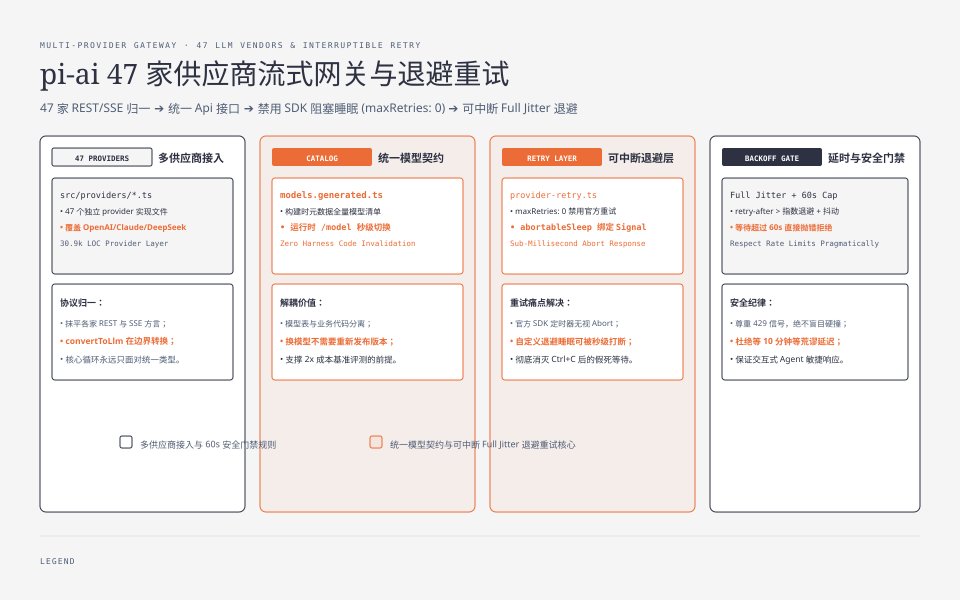
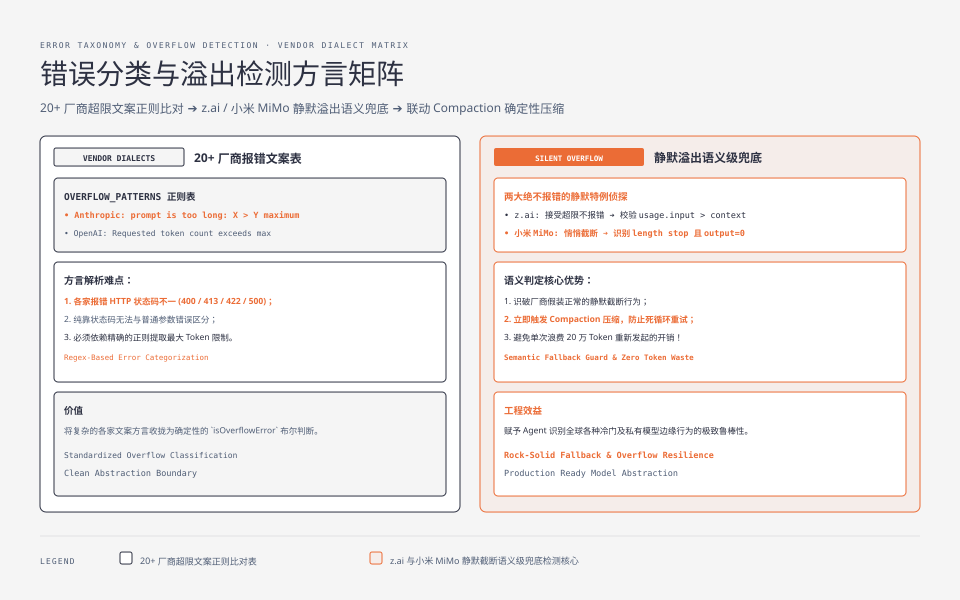

**TL;DR：** 01 篇讲过 pi-ai 的定位：唯一认识供应商的层。这篇把"认识"拆成三个具体工程问题：**一个兼容模型**（47 个 provider 文件 + 流式统一）、**一次可信调用**（重试/退避/限流，但重试睡觉得能被取消）、**一个准确的失败分类**（20+ 家供应商的"上下文超限"文案长得完全不同，还有两家干脆静默）。agent 直连各家 SDK 的幻觉在于：每家 SDK 都帮你重试，但重试定时器不听你的 AbortSignal；每家都说自己错了，但错法各有各的方言。pi-ai 把这些全部抹平在 [`packages/ai`](https://github.com/earendil-works/pi/tree/main/packages/ai) 这一层（30.9k 行 LOC，2026-08-23 复测 @ b23741269；08-20 首测 23.5k @ 5cd93f6）。


---



## 一、一个兼容模型：47 个 provider 文件背后的统一流式协议

`packages/ai/src/providers/` 下现有 47 个 provider 实现文件（不含 `.models.ts` 目录），覆盖 OpenAI、Anthropic、Google、Bedrock、Azure、Groq、xAI、MoonshotAI、ZAI、小米 Token Plan 三区、Qwen Token Plan、llama.cpp 本地路由等。每个 provider 把自家 REST/SSE 协议翻译成 pi-ai 的 `Api` 接口（流式消息事件、停止原因、用量结构）。

界面层看到的是两个统一体：

**模型目录（catalog）**：`models.generated.ts` 是构建时从厂商模型元数据生成的全量模型表（工具用 `npm run build` 刷新，离线用 `--offline-model-data` 重建——模型表与代码分离，catalog 是可以热更新的数据而不是代码）。`/model` 中途切换模型，改的是 catalog 里的选择，不是任何业务代码。

**统一消息结构**：`AgentMessage`/`Message` 双形态（02 篇的文件头注释："循环内部用 AgentMessage，只在 LLM 调用边界转换"）——转换函数 `convertToLlm` 是唯一认识 "OpenAI 的 assistant 消息长什么样 vs Anthropic 的 user message 含 blocks" 的地方。transform 只在边界发生，循环里永远只见自己的类型。

---

## 二、一次可信调用：retry 像 SDK，但睡眠能被取消

`packages/ai/src/utils/provider-retry.ts`（125 行）解决的是"我调 OpenAI SDK，SDK 自己会重试，但我取消不了它的重试等待"这个实际痛点。文件注释直接把策略说透：

> Reproduce the retry behavior used by the OpenAI and Anthropic SDKs while making their backoff sleep interruptible. Their built-in retry timers ignore the request AbortSignal, so callers must invoke the SDK with `maxRetries: 0` and wrap the request with this helper.

也就是：**不信任 SDK 内置重试**（它会在我们 abort 后仍然 sleep 整整一个退避周期），而是 `maxRetries: 0` 关掉官方重试、自己包一层 `retryProviderRequest`，让每次退避睡眠都可被 `abortableSleep` 打断（`signal.addEventListener("abort", ...)` 立即 reject）。

哪些错误可重试（`isRetryableProviderError`，行 31-43）：

1. `x-should-retry` 响应头一票否决（`"true"` → 重试，`"false"` → 不重试）；
2. 无状态码（网络层失败）→ 重试；
3. 408 / 409 / 429 / 5xx → 重试（429 和 409 是限流与冲突，5xx 是供应商故障）。

退避延时优先级：`retry-after-ms` 头 > `retry-after` 头 > 指数退避 `min(0.5 * 2^n, 8)` 秒且加 0-25% 抖动。超过 `maxRetryDelayMs`（默认 60 秒）的服务器指定延时**直接抛错而不是照做**——"服务器说等十分钟"虽然合法，但对一个等不起的交互式 agent 是毒药，开箱即用的上限是 60s，`maxRetryDelayMs: 0` 可完全关闭。重试上限默认 `maxRetries: 0`（不重试，让调用者显式选择），Pi 的会话层按需求传入。

## 三、限流不是绕过，是尊重

说"限流"容易让人联想到暴力重试，pi-ai 的纪律恰恰相反——它**尊重**限流信号。`retry-after` 系头按原值等待（超 60s 才拒绝）、`x-should-retry: false` 立即放弃，绝不在供应商明确说"别打了"之后继续撞。这不是心慈手软，是经济学：429 常常伴随配额扣费或排队惩罚，乱撞的代价远高于等一等。真正的"重试策略"是**有信号的等待 + 有据可依的放弃**。




## 四、一个准确的失败分类：溢出检测的方言问题

被最多人低估的是"同一个错误，十家不同的说法"。`packages/ai/src/utils/overflow.ts`（180 行）维护一个 `OVERFLOW_PATTERNS` 正则表，逐条注释了每家供应商的原文案：

- Anthropic：`prompt is too long: 213462 tokens > 200000 maximum`
- OpenAI/LiteLLM：`Requested token count exceeds the model's maximum context length of 131072 tokens`
- OpenRouter：`This endpoint's maximum context length is X tokens...`
- llama.cpp：`the request exceeds the available context size`
- Mistral：`Prompt contains X tokens ... too large for model with Y maximum context length`……

更狠的两条注释是"没有报错"的供应商：

```ts
// z.ai: Does NOT error, accepts overflow silently - handled via usage.input > contextWindow
// Xiaomi MiMo: Truncates input to fill contextWindow exactly, then returns
//   finish_reason "length" with output=0（没空间生出任何 token）
```

**z.ai 静默接受溢出、小米 MiMo 悄悄截断到窗口满，然后假装"输出撞长度限制"。** 这两家的"错误"没有文案，只能在调用侧事后侦探：对比 usage.input 与 contextWindow（z.ai），或识别"length stop 且 output=0 且输入填满窗口"（MiMo）。这就是为什么溢出处理不能只匹配文案，还要一个兜底的语义判断。agent 的 compaction（03 篇）什么时候触发，依赖的是这里精确的"溢出判定"，判错了要么浪费 20 万 token 重发、要么把没满的上下文冤枉压掉。

## 五、结论：供应商抽象的价值在于把「不同」变成可测试的「同」

回看三个问题：一个兼容模型（统一 `Api` 协议 + 可热更 catalog）、一次可信调用（镜像 SDK 但可中断 + 60s 上限 + 信号优先）、一个准确失败分类（文案表 + 两款静默特例）。**pi-ai 的 30.9k 行大多不是算法，而是各家方言的翻译与登记。** 这正是"换模型不是换代码"的机制：模型是 catalog 里的一行，供应商是其 provider 实现，agent 的业务代码从不需要知道"今天的模型是谁"。

验证三步：在 clone 里给 `isRetryableProviderError` 加一行 `status === 409 → false`，跑测试看哪些用例被破坏（注意 409 不是"重试无用"）；在 `OVERFLOW_PATTERNS` 里加一条假模式，验证溢出判定从哪一行被消费；读 `abortableSleep`，确认 abort 发生后 sleep 立刻 reject 而不是等满退避时间——这决定了"用户按 Ctrl+C 后 agent 多久能真正停下来"。

## 参考资料

- `packages/ai/`（30.9k LOC 实测 @ b23741269；providers 目录 47 个实现文件、provider-retry.ts 125 行、overflow.ts 180 行均复测未变）：`src/providers/`（47 个 provider 实现）、`src/models.generated.ts`（模型目录）、`src/utils/provider-retry.ts`（125 行）、`src/utils/overflow.ts`（180 行）
- `packages/agent/src/agent-loop.ts` 的 `convertToLlm` 边界（02 篇）
- Databricks 官方基准（2026-07-08）中"token 单价≠任务成本"结论与 09 篇经济性关联
- earendil-works/pi @ commit 5cd93f6（2026-08-20 浅克隆实测）